# Jälleenmyyntianalyysimalli Power BI:lle: aloita esittely

Tämä alan malliraporttinäkymä ja siihen liittyvä raportti analysoivat useiden myymälöiden ja alueiden myytyjen tuotteiden tietoja. Mittarien avulla vertaillaan tätä ja viime vuotta seuraavien arvojen osalta: myynti, tuotemäärät, myyntikate ja varianssi, sekä analysoidaan uusia myymälöitä. Nämä ovat oikeita tietoja obviEnceltä ([www.obvience.com](http://www.obvience.com)) nimettömään muotoon muunnettuna.

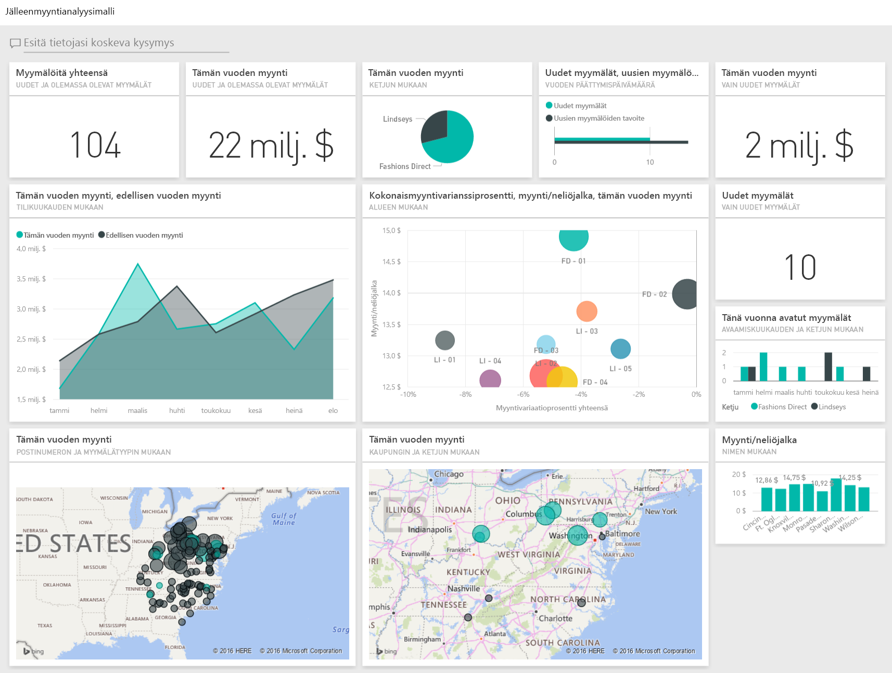

## Edellytykset

 Ennen kuin voit käyttää mallia, se on ensin ladattava [sisältöpakettina](https://docs.microsoft.com/power-bi/sample-datasets#get-and-open-a-sample-content-pack-in-power-bi-service), [.pbix-tiedostona](http://download.microsoft.com/download/9/6/D/96DDC2FF-2568-491D-AAFA-AFDD6F763AE3/Retail%20Analysis%20Sample%20PBIX.pbix) tai [Excel-työkirjana](http://go.microsoft.com/fwlink/?LinkId=529778).

### Mallin sisältöpaketin noutaminen

1. Avaa Power BI -palvelu (app.powerbi.com) ja kirjaudu sisään.
2. Valitse vasemmasta alakulmasta **Nouda tiedot**.
   
    
3. Valitse ilmestyvältä Nouda tiedot -sivulta **Mallit**-kuvake.
   
   
4. Valitse **Jälleenmyyntianalyysimalli** ja **Yhdistä**.  
  
   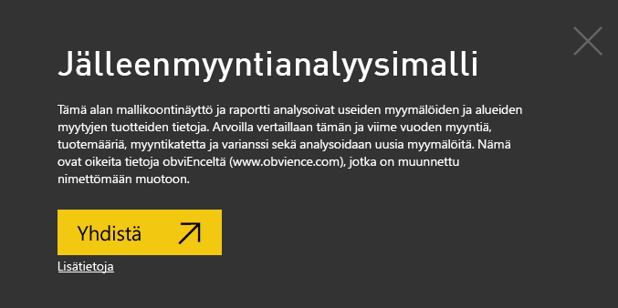
   
5. Power BI tuo sisältöpaketin ja lisää uuden koontinäytön, raportin ja tietojoukon senhetkiseen työtilaasi. Uusi sisältö merkitään keltaisella tähdellä. 
   
   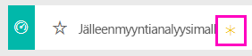
  
### Hae tämän mallin .pbix-tiedosto

Vaihtoehtoisesti voit ladata mallin .pbix-tiedostona, joka on suunniteltu käytettäväksi Power BI Desktopilla. 

 * [Jälleenmyyntianalyysimalli](http://download.microsoft.com/download/9/6/D/96DDC2FF-2568-491D-AAFA-AFDD6F763AE3/Retail%20Analysis%20Sample%20PBIX.pbix)

### Hae tämän mallin Excel-työkirja
Voit myös [ladata vain tietojoukon (Excel-työkirjan)](http://go.microsoft.com/fwlink/?LinkId=529778) tälle mallille. Työkirja sisältää Power View -taulukoita, joita voit tarkastella ja muokata. Raakatiedot saa näkyviin valitsemalla **Power Pivot > Hallinta**.

## Käynnistä raporttinäkymässä ja avaa raportti
1. Valitse raporttinäkymässä Total Stores (myymälöitä yhteensä) -ruutu:

   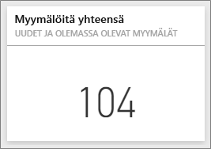  

   Tämä vie sinut myymälöiden myynnin yleiskatsaus -sivulle raportissa. Kuten näet, meillä on yhteensä 104 myymälää, joista 10 on uusia. Meillä on kaksi ketjua: Fashions Direct ja Lindseys. Fashions Direct -myymälät ovat keskimäärin suurempia.
2. Valitse ympyräkaaviossa **Fashions Direct**.

   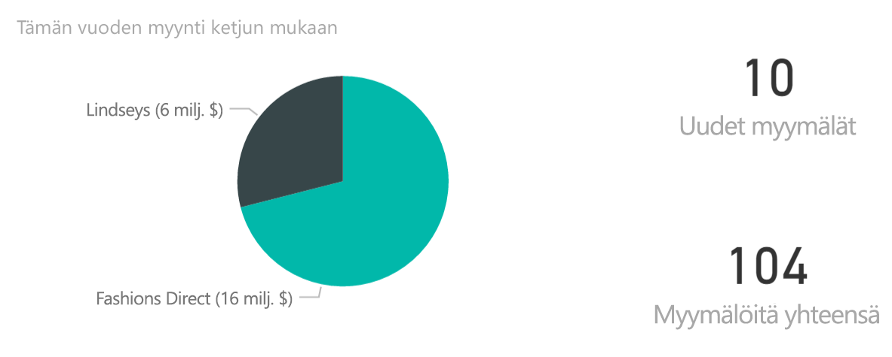  

   Huomaa tulos kuplakaaviossa:

   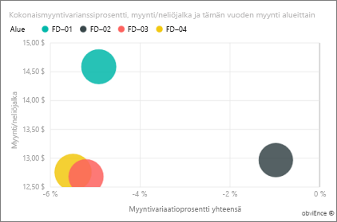  

   FD-01-alueella on suurin keskimääräinen myynti neliöjalkaa kohden, FD-02-alueella on pienin myynnin vaihtelu viime vuoteen verrattuna ja FD-03- ja FD-04-alueiden yleisin suorituskyky on heikoin.
3. Valitse yksittäiset kuplat tai muut kaaviot nähdäksesi ristiinkorostuksen, joka osoittaa valintojesi vaikutuksen.
4. Voit palata raporttinäkymään valitsemalla sen nimen yläsiirtymispalkissa (navigointipolku).

   
5. Valitse raporttinäkymässä ruutu, jossa on tämän vuoden myynti.

   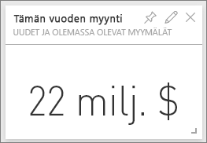

   Tämä vastaa ”tämän vuoden myynti” -lauseen kirjoittamista kysymysruutuun.

   Näyttöön avautuu seuraava näkymä:

   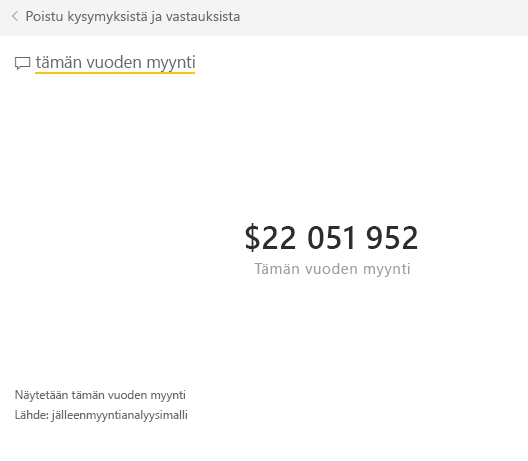

## Tarkista Power BI:n Q&A-toiminnolla luotu ruutu
Perehdytään asiaan tarkemmin.

1. Lisää kysymykseen ”tämän vuoden myynti **alueen mukaan**”. Huomaa tulos: järjestelmä sijoittaa vastauksen automaattisesti palkkikaavioon ja ehdottaa muita lauseita:

   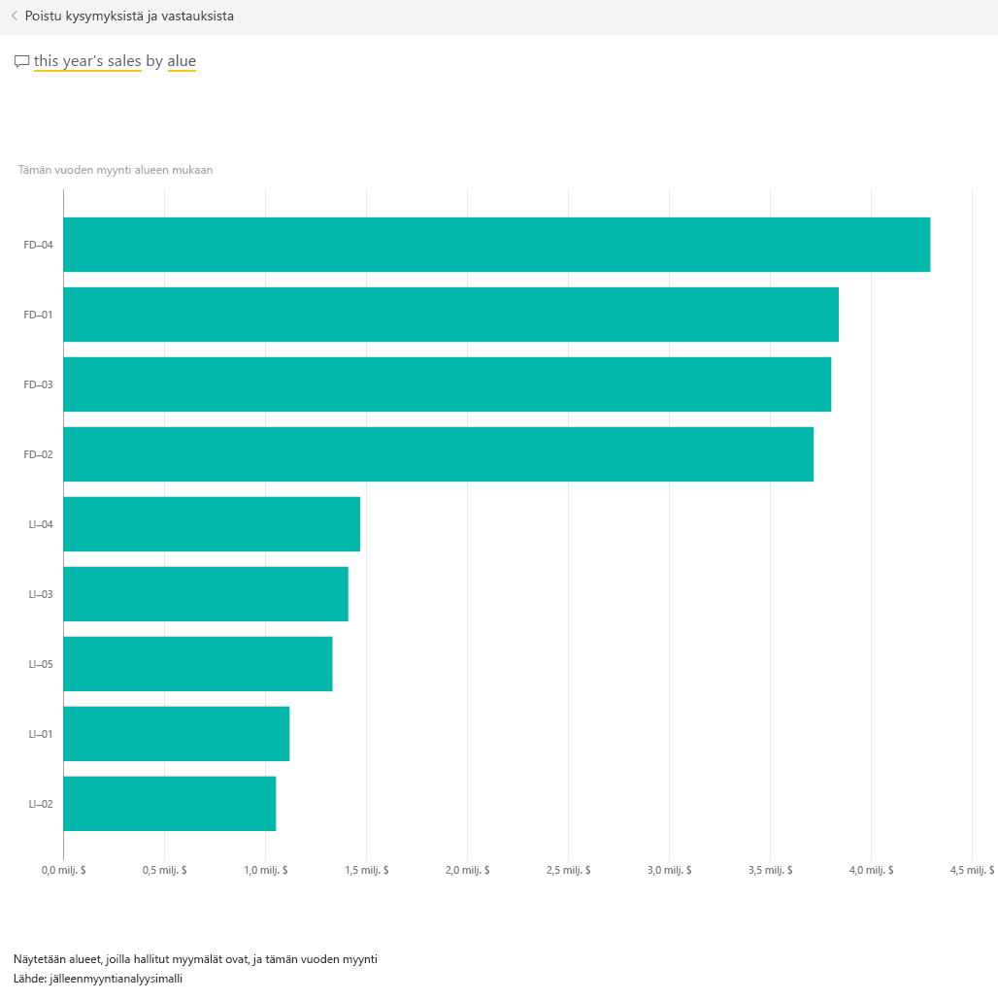
2. Muuta nyt kysymyksesi ”tämän vuoden myynti **postinumeron ja ketjun mukaan**”.

   Huomaa, miten järjestelmä vastaa kysymykseen asianmukaisten kaavioiden kanssa samalla, kun kirjoitat.
3. Harjoittele esittämällä lisää kysymyksiä ja katsomalla, millaisia tuloksia saat.
4. Kun olet valmis, palaa raporttinäkymään.

## Tutki tietoja tarkemmin
Seuraavaksi tutkimme tietoja tarkemmin ja perehdymme alueiden suorituskykyyn.

1. Valitse raporttinäkymässä ruutu, jossa vertaillaan tämän vuoden myyntiä viime vuoden myyntiin.

   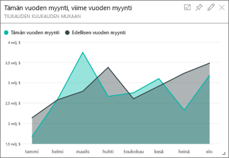

   Huomaa varianssiprosentin suuri vaihtelu viime vuoteen verrattuna. Tammikuu, huhtikuu ja heinäkuu olivat erityisen heikkoja.

   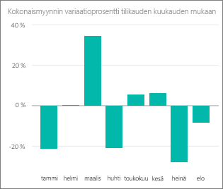

   Katsotaan, pystymmekö rajaamaan tuloksia ongelman löytämiseksi.
2. Valitse kuplakaavio ja sitten **020-Miehet**.

     

   Huomaa, että huhtikuun tulos ei vaikuttanut miesten luokkaan yhtä vakavasti kuin yrityksen kokonaistulokseen, mutta tammikuu ja heinäkuu olivat silti ongelmallisia.
3. Valitse nyt **010-Naiset-kupla**.

   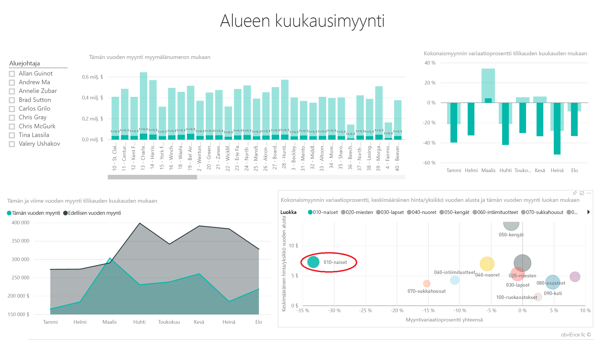

   Huomaa, naisten luokan suorituskyky on paljon heikompi kuin yrityksen kokonaistulos kaikkina kuukausina sekä huomattavasti viime vuotta heikompi lähes kaikkina kuukausina.
4. Valitse kupla uudelleen poistaaksesi suodattimen.

## Kokeile osittajaa
Katsotaan, miten tietyt alueet suoriutuvat.

1. Valitse Allan Guinot vasemmassa yläkulmassa olevassa osittajassa.

   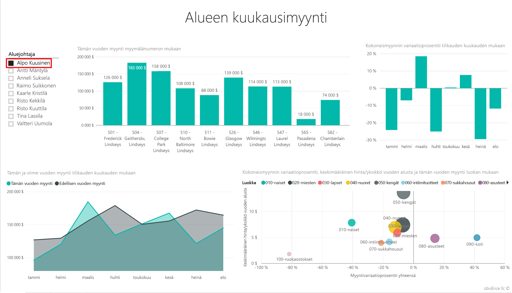

   Huomaa, että Allanin alue suoriutui viime vuotta paremmin maaliskuussa ja kesäkuussa.
2. Pidä Allan edelleen valittuna ja valitse naisten kupla.

   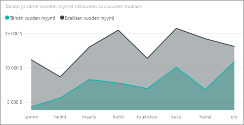

   Huomaa, naisten luokassa Allanin alue ei saavuttanut missään vaiheessa viime vuoden myyntimäärää.
3. Tutki alueen muita johtajia ja luokkia – mitä muita tietoja huomaat?
4. Kun olet valmis, palaa raporttinäkymään.

## Mitä tiedot kertovat meille myynnin kasvusta tänä vuonna?
Lopuksi haluamme tutkia vielä kasvua, eli tänä vuonna avattuja uusia myymälöitä.

1. Valitse Tänä vuonna avatut uudet myymälät -ruutu.

   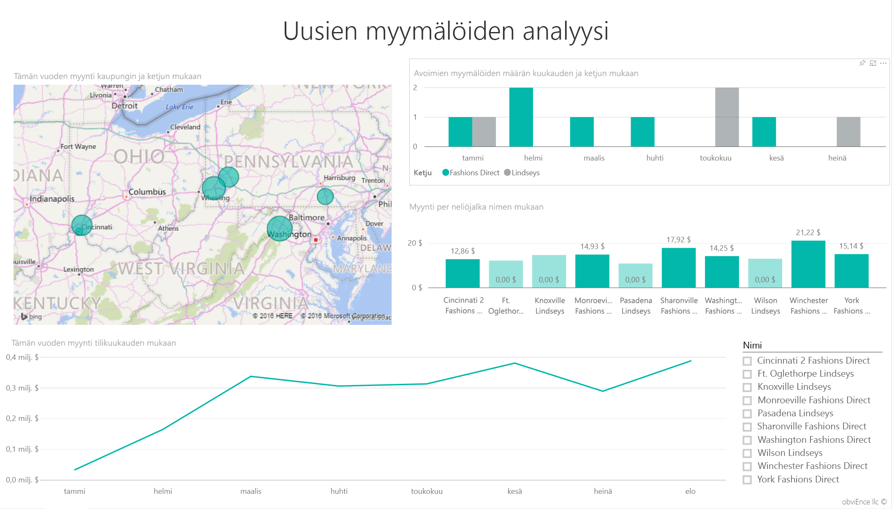

   Kuten ruudusta käy ilmi, tänä vuonna avattiin enemmän Fashions Direct -myymälöitä kuin Lindseys-myymälöitä.
2. Huomaa Myynti per neliöjalka nimen mukaan -kaavio:

   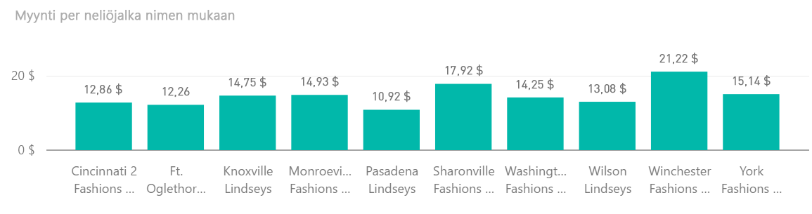

    Myynnissä per neliöjalka on huomattavia eroja uusien myymälöiden välillä.
3. Napsauta Fashions Direct -selitettä kaavion oikeassa yläreunassa. Huomaa, että jopa saman ketjun sisällä paras myymälä (Winchester Fashions Direct) suoriutui huomattavasti paremmin kuin huonoin myymälä (Cincinnati 2 Fashions Direct), niiden arvojen ollessa $21.22 ja $12.86.

   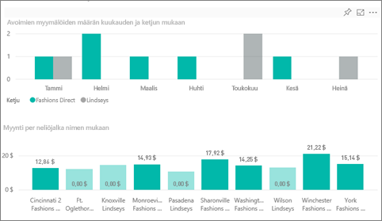
4. Napsauta Winchester Fashions Directiä osittajassa ja huomaa viivakaavio. Ensimmäiset myyntiluvut raportoitiin helmikuussa.
5. Napsauta osittajassa Cincinnati 2 Fashions Directiä, niin näkyviin tulee viivakaavio, joka osoittaa, että myymälä avattiin kesäkuussa ja se vaikuttaa olevan huonoiten suoriutuva myymälä.
6. Selaa napsauttamalla muita palkkeja, viivoja ja kuplia koko kaaviossa ja katso, mitä tietoja voit löytää.

Tämä on turvallinen ympäristö kaikenlaisille kokeiluille. Voit aina jättää tekemäsi muutokset tallentamatta. Jos kuitenkin tallennat ne, voit aina siirtyä Nouda tiedot -kohtaan, jolloin saat mallista uuden kopion.

## Yhdistä tietoihisi
Toivomme, että tämä esittely on osoittanut, miten Power BI -raporttinäkymät, Q&A ja raportit voivat tarjota uusia näkökulmia asiakastietoihin. Nyt on sinun vuorosi – muodosta yhteys omiin tietoihisi. Power BI:n avulla voit muodostaa yhteyden useisiin eri tietolähteisiin. Lisätietoja [Power BI:n käytön aloittamisesta](service-get-started.md).

## Seuraavat vaiheet
* [Lataa jälleenmyyntianalyysimallin sisältöpaketti](sample-tutorial-connect-to-the-samples.md)
* [Lataa zip-tiedosto, joka sisältää kaikki esimerkkitiedostot](http://go.microsoft.com/fwlink/?LinkId=535020)    
* [Lataa tämän Power BI -mallin Excel-työkirja](http://go.microsoft.com/fwlink/?LinkId=529778)    
* [Tietojen noutaminen (Power BI:hin)](service-get-data.md)    
* [Power BI -palvelun peruskäsitteitä suunnittelijoille](service-basic-concepts.md)    
* Onko sinulla kysyttävää? [Kokeile Power BI -yhteisöä](http://community.powerbi.com/)
