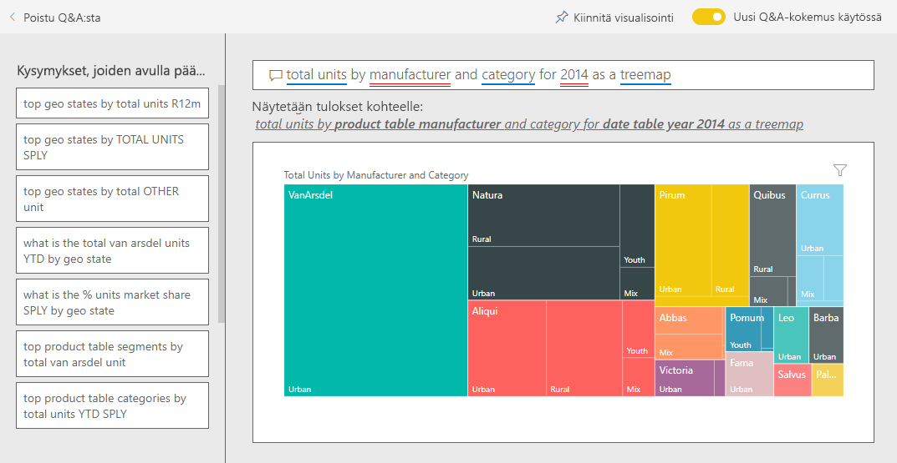

# Myynti- ja markkinointimalli Power BI:lle: aloita esittely

Myynti- ja markkinointimalli sisältää koontinäytön ja raportin kuvitteelliselle tuotantoyritykselle nimeltä VanArsdel Ltd. VanArsdelin markkinointipäällikkö (CMO) loi tämän koontinäytön pitääkseen silmällä alan ja yrityksen markkinaosuutta, tuotteiden määrää, myyntiä ja asenteita.

VanArsdelilla on monta kilpailijaa, mutta se itse on alansa markkinajohtaja. CMO haluaa kasvattaa markkinaosuuttaan ja löytää uusia kasvumahdollisuuksia. Jostain syystä VanArsdelin markkinaosuus on kuitenkin alkanut pienentyä, ja kesäkuussa ilmeni merkittäviä pudotuksia.

Tämä malli kuuluu sarjaan, jossa esitellään, miten Power BI:tä voidaan käyttää liiketoimintaan suuntautuneiden tietojen, raporttien ja koontinäyttöjen kanssa. [ObviEnce](http://www.obvience.com/) on luonut sen käyttämällä oikeita tietoja, jotka on muunnettu nimettömään muotoon. Tiedot ovat käytettävissä useissa muodoissa: sisältöpaketti, Power BI Desktopin .pbix-tiedosto tai Excel-työkirja. Tutustu [Power BI:n malleihin](sample-datasets.md). 

Tässä opetusohjelmassa tutustutaan Power BI -palvelun myynti- ja markkinointimallin sisältöpakettiin. Koska raportin käyttökokemus on hyvin samankaltainen Power BI Desktopissa ja palvelussa, voit seurata ohjelmaa myös käyttämällä Power BI Desktopin mallin .pbix-tiedostoa. 

Et tarvitse Power BI -käyttöoikeutta Power BI Desktopin malleihin tutustumiseen. Jos sinulla ei ole Power BI Pro -käyttöoikeutta, voit tallentaa mallin omaan työtilaasi Power BI -palvelussa. 

## Hanki malli

Ennen kuin voit käyttää mallia, se on ensin ladattava [sisältöpakettina](#get-the-content-pack-for-this-sample), [.pbix-tiedostona](#get-the-pbix-file-for-this-sample) tai [Excel-työkirjana](#get-the-excel-workbook-for-this-sample).

### Mallin sisältöpaketin noutaminen

1. Avaa Power BI -palvelu (app.powerbi.com), kirjaudu sisään ja avaa työtila, johon haluat tallentaa mallin.

   Jos sinulla ei ole Power BI Pro -käyttöoikeutta, voit tallentaa mallin omaan työtilaasi.

2. Valitse vasemmasta alakulmasta **Nouda tiedot**.
   
   
3. Valitse avautuvalta **Nouda tiedot** -sivulta **Mallit**.
   
4. Valitse **Myynti- ja markkinointimalli** ja valitse sitten **Yhdistä**.   
  
   
   
5. Power BI tuo sisältöpaketin ja lisää sitten uuden koontinäytön, raportin ja tietojoukon senhetkiseen työtilaasi.
   
   
  
### Hae tämän mallin .pbix-tiedosto

Vaihtoehtoisesti voit ladata myynti- ja markkinointimallin näytteen [.pbix-tiedostona](https://download.microsoft.com/download/9/7/6/9767913A-29DB-40CF-8944-9AC2BC940C53/Sales%20and%20Marketing%20Sample%20PBIX.pbix), joka on suunniteltu käytettäväksi Power BI Desktopilla.

### Hae tämän näytteen Excel-työkirja

Jos haluat perehtyä tämän mallin tietolähteeseen, se on saatavana myös [Excel-työkirjana](https://go.microsoft.com/fwlink/?LinkId=529785). Työkirja sisältää Power View -taulukoita, joita voit tarkastella ja muokata. Saat raakatiedot näkyviin ottamalla käyttöön Tietojen analysointi -apuohjelmat ja valitsemalla sitten **Power Pivot > Hallinta**. Voit ottaa Power View- ja Power Pivot -apuohjelmat käyttöön [tutustumalla Excelin sisältämien Excel-mallien](sample-datasets.md#optional-take-a-look-at-the-excel-samples-from-inside-excel-itself) lisätietoihin.

## Mitä koontinäyttö kertoo?
Aloitetaan esittelykierros koontinäytöstä ja vilkaistaan ruutuja, jotka CMO on kiinnittänyt sinne. Siellä on tietoja markkinointiosuudestamme, myynnistä ja asenteista. Tiedot on eritelty alueiden, ajan ja kilpailijoiden mukaan.

* Vasemman sarakkeen numeroruuduissa näkyvät alan myyntivolyymit kuluvan vuoden aikana (50 000), markkinointiosuus (32,86 %), myyntivolyymi (16 000), asennetulos (68), asenne-ero (4) ja myytyjen yksikköjen yhteismäärä (1 milj.).
* Yläreunassa olevassa viivakaaviosta nähdään ( **yksiköiden markkinaosuus-% vs. yksiköiden markkinaosuus-% liukuva 12 kuukautta**), miten markkinaosuus vaihtelee ajan mittaan. Huomaa suuri pudotus kesäkuussa. Liukuva 12 kuukautta (R12M) -osuutemme, joka oli jo hetken kasvussa, alkaa nyt hidastua.
* Suurin kilpailijamme on Aliqui, mikä näkyy keskimmäisen sarakkeen kaavioruudussa (**yksiköiden kokonaismäärän varianssiprosentti vuoden alusta**).
* Suurin osa liiketoiminnastamme tapahtuu itärannikolla ja keskiosassa maata.
* Alareunassa olevassa viivakaaviosta (**Yksiköitä yhteensä vuonna 2014**) nähdään, että pudotuksemme kesäkuussa ei ole kausiluonteista – kellään kilpailijoistamme ei näy samaa trendiä.
* **Yksiköiden kokonaismäärä yleisesti** ja **Yksiköitä yhteensä vuoden alusta** -ruudut oikealla sisältävät myydyt yksiköt segmenteittäin ja alueittain/valmistajakohtaisesti. Alamme suurimmat markkinasegmentit ovat **tuottavuus** ja **kätevyys**.

## Kysymysosion käyttö tarkempien tietojen saamiseksi

Kysymysosion avulla voit syventyä tietoihin tarkemmin.

### Mitkä segmentit tehostavat myyntiämme? Vastaavatko ne alan trendejä?
1. Valitse **Yksiköiden kokonaismäärä yleisesti segmentin mukaan** -ruutu, joka avaa kysymysosion ja täyttää sen kyselyllä *Yksiköiden kokonaismäärä segmentin mukaan*.
2. Kirjoita *Vanarsdelin* käytetyn kyselyn loppuun. Kysymysosio tulkitsee kysymyksen ja näyttää päivitetyn kaavion vastauksen kera. Huomaa, että tuotevolyymimme tulee pääasiassa **Kätevyys**- ja **Kohtuus**-segmenteistä.

   
3. Osuutemme luokissa **Kohtuus** ja **Kätevyys** on suuri; nämä ovat ne segmentit, joissa olemme kilpailukykyisiä.
4. Palaa koontinäyttöön valitsemalla **Myynti- ja markkinointimalli** yläreunan siirtymisruudussa.

### Miltä yksiköiden kokonaismäärän markkinaosuus näyttää luokan perusteella (vrt. alueen)?
1. Huomaa ruutu **Yksiköiden kokonaismäärä vuoden alusta valmistajan ja alueen mukaan**. Mikä on yksiköiden kokonaismäärän markkinaosuus luokan mukaan?

   
2. Valitse koontinäytön yläreunassa oleva kysymysruutu ja kirjoita kysymys: *yksiköt yhteensä valmistajan ja luokan mukaan vuonna 2014 puukaaviona*. Huomaa, miten visualisointi päivittyy, kun kirjoitat kysymyksen.

   
3. Jos haluat verrata löydöksiä, kiinnitä kaavio koontinäyttöösi. Huomaa seuraava kiinnostava seikka: Vuonna 2014 VanArsdel myi vain **Urban**-luokan tuotteita.
4. Palaa koontinäyttöön.

## Myynti- ja markkinointimallin raportti

Koontinäytöt ovat aloituskohta raportteihin. Jos ruutu on luotu sen pohjana olevasta raportista, kyseisen ruudun valitseminen avaa raportin.

Koontinäytön **Yksiköiden markkinaosuus-% R12M** -rivi **Yksiköiden markkinaosuus-% vs. yksiköiden markkinaosuus-% liukuva 12 kuukautta** -kaaviosta nähdään, että markkinaosuus ei enää kasva ajan mittaan. Se on jopa hieman laskussa. Ja miksi markkinaosuutemme kokee suuren pudotuksen kesäkuussa? 

Myynti- ja markkinointimallin raportissa on neljä sivua.
 
### VanArsdel – markkinaosuus-sivu
Raportin sivulla 1 keskitytään Vanarsdelin markkinaosuuteen.

1. Valitse koontinäytössä **Yksiköiden markkinaosuus-% vs. yksiköiden markkinaosuus-% liukuva 12 kuukautta** -kaavio avataksesi myynti- ja markkinointimallin raportin **VanArsdel – markkinaosuus** -sivu.

   

2. Katso **Yksiköitä yhteensä kuukauden mukaan ja onVanArsdel** -pylväskaaviota raportin alareunassa. Musta sarake edustaa VanArsdelia (tuotteitamme) ja vihreä sarake on kilpailijamme. VanArsdelin kilpailijat eivät kokeneet sen kohtaamaa pudotusta kesäkuussa 2014.

3. **Luokan volyymi yhteensä segmentin mukaan** -palkkikaavio oikealla on suodatettu näyttämään VanArsdelin kaksi tärkeintä segmenttiä. Katso, miten tämä suodatin on luotu:  

   a. Valitse **Luokan volyymi yhteensä segmentin mukaan** -kaavio.

   b. Laajenna se valitsemalla oikealla oleva **Suodattimet**-ruutu.  

   c. Huomaa **Visuaalisen tason suodattimet** -kohdassa, että **Segmentti** on suodatettu sisältämään vain **Kätevyys**- ja **Kohtuus**-segmentit.  

   d. Muokkaa suodatinta valitsemalla **Segmentti** sen laajentamiseksi ja valitsemalla sitten **Tuottavuus** myös tämän segmentin lisäämiseksi.  

4. Valitse kohdassa **Yksiköitä yhteensä kuukauden mukaan ja onVanArsdel** **Kyllä** selitteestä, jotta voit ristiinsuodattaa sivun VanArsdelin mukaan. Huomaa, että **Luokan volyymi yhteensä segmentin mukaan** -kaaviossa emme kilpaile **Tuottavuus**-segmentissä.

5. Valitse selitteessä uudelleen **Kyllä**, jos haluat poistaa suodattimen.

6. Katso **Yksiköiden markkinaosuus-% ja Yksiköiden markkinaosuus-% R12M kuukauden mukaan** -viivakaaviota. Siinä näkyy kuukausittainen markkinaosuutemme ja liukuvan 12 kuukauden markkinaosuudet. Liukuvien kuukausien tiedot auttavat tasoittamaan kuukausittain ilmenevää vaihtelua ja näyttävät pitkän aikavälin trendit. Valitse **Luokan volyymi yhteensä segmentin mukaan** -palkkikaaviossa **Kätevyys** ja sitten **Kohtuus** tarkastellaksesi markkinaosuuden segmenttikohtaista vaihtelua. Huomaa, että **Kohtuus**-segmentissä näkyy paljon enemmän vaihtelua markkinaosuudessa.

Yritämme edelleen selvittää, miksi markkinaosuutemme putosi niin alas kesäkuussa. Seuraavaksi tarkastellaan raportin **Asenneanalyysi**-sivua.

### Asenneanalyysi-sivu
Raportin sivulla kolme keskitytään kuluttajien asenteeseen.

Twiitit, Facebook, blogit ja artikkelit vaikuttavat kuluttajien asenteeseen, joka näkyy sivun vasemmassa reunassa olevissa kahdessa viivakaaviossa. Vasemmassa yläkulmassa olevassa **VanArsdel – asenne kuukauden mukaan** -kaaviossa näkyy, että asenne tuotteitamme kohtaan oli melko neutraali helmikuuhun saakka. Sitten suuri putoaminen alkoi helmikuussa ja oli pahimmillaan kesäkuussa. Mikä aiheutti tämän pudotuksen asenteessa? 

Katsotaanpa ulkoisia lähteitä. Helmikuussa useissa artikkeleissa ja blogikirjoituksissa VanArsdelin asiakaspalvelu oli arvioitu alan huonoimmaksi. Tällaisella huonolla julkisuudella on suora korrelaatio asiakkaiden asenteisiin ja myyntilukuihin. VanArsdel ponnisteli kovasti asiakaspalvelun parantamiseksi, ja lopulta asiakkaat ja ala huomasivat sen. Heinäkuussa myönteinen asenne alkoi lisääntyä ja saavutti sitten kaikkien aikojen huippunsa 60:ssa. Tämä asenteen paraneminen heijastuu **Yksiköitä yhteensä kuukauden mukaan** -kaavioissa raportin sivuilla 1 ja 2. Ehkäpä tämä selittää osittain markkinaosuutemme pudotuksen kesäkuussa.

Asenne-ero voisi olla toinen tutkittava osa-alue. Millä alueilla on suurin asenne-ero, miten johto voi hyödyntää sitä ja miten se voidaan toistaa muilla alueilla?

### Luokkien trendianalyysi vuoden alusta -sivu
Raportin toinen sivu keskittyy luokkien trendeihin vuoden alusta.

Huomioi seuraavat tiedot:
* VanArsdel on tässä luokassa suurin yritys, ja sen suurimmat kilpailijat ovat Natura, Aliqui ja Pirium. Pidämme niitä silmällä.
* Aliqui on kasvussa, mutta sen tuotevolyymi meihin verrattuna on edelleen vähäinen.
* Puukartassa VanArsdel näkyy vihreänä. Idässä asiakkaat pitävät kilpailijoistamme enemmän ja keskiosassa maata meillä menee OK. Osuutemme idässä on osuuksistamme vähäisin.
* Maantieteellisellä sijainnilla on vaikutus myytyjen yksikköjen määrään. Idän alue on useimpien valmistajien vahvinta hallinta-aluetta, mutta VanArsdelilla on vahva asema myös maan keskiosassa.
* Huomaa **Yksiköiden kokonaismäärän varianssiprosentti vuoden alusta kuukauden ja valmistajan mukaan** -kaaviossa alaoikealla, että meillä on positiivinen varianssi, mikä on hyvä merkki. Meillä menee paremmin kuin viime vuonna, mutta sama pätee myös kilpailijaamme, Aliqui’hin.

### Kasvumahdollisuudet-sivu
Raportin sivulla 4 keskitytään kilpailukykyisen tuotteen analyysiin.

Huomioi seuraavat tiedot:
* Alavasemmalla olevassa **Yksiköiden kokonaismäärä segmentin mukaan** -kaaviossa näkyvät kaikki luokan segmentit VanArsdelin kahta vahvinta segmenttiä lukuun ottamatta. Valitse kukin segmenteistä vuorotellen, jotta voit tunnistaa VanArsdelin mahdolliset laajennuskohteet. 
* Huomaa, että **Äärimmäinen**- ja **Tuottavuus**-segmentit kasvavat nopeammin kuin muut. Me emme kuitenkaan kilpaile näillä segmenteillä. Jos haluamme siirtyä näihin segmentteihin, voimme käyttää näitä tietoja hyväksi nähdäksemme, mitkä segmentit ovat suosittuja kullakin alueella. Voimme perehtyä tarkemmin kysymyksiin, kuten mikä alue kasvaa nopeimmin ja kuka olisi suurin kilpailijamme kyseisellä segmentillä.
* Muistatko markkinaosuutemme pudotuksen kesäkuussa? Kesäkuu on merkittävä kuukausi **Tuottavuus**-segmentille. Segmentille, jolla emme kilpaile lainkaan. Tämä saattaisi selittää markkinaosuutemme pudotuksen kesäkuussa.

Suodattamalla visualisoinnit VanArsdelin, segmentin, kuukauden ja alueen mukaan voimme löytää kasvumahdollisuuksia VanArsdelille.

## Seuraavat vaiheet: Yhdistä tietoihisi
Tässä ympäristössä on turvallista tehdä kokeiluja, koska voit jättää tekemäsi muutokset tallentamatta. Jos kuitenkin tallennat ne, voit aina siirtyä **Nouda tiedot** -kohtaan, jolloin saat tästä mallista uuden kopion.

Toivomme, että tämä esittely on osoittanut, miten Power BI -koontinäytöt, Q&A ja raportit voivat tarjota uusia näkökulmia henkilöstötietoihin. Nyt on sinun vuorosi – muodosta yhteys omiin tietoihisi. Power BI:n avulla voit yhdistää useisiin eri tietolähteisiin. Lisätietoja on artikkelissa [Power BI -palvelun käytön aloittaminen](service-get-started.md).
