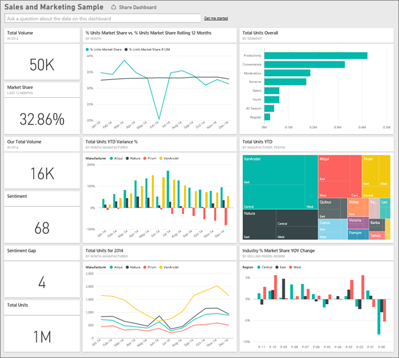
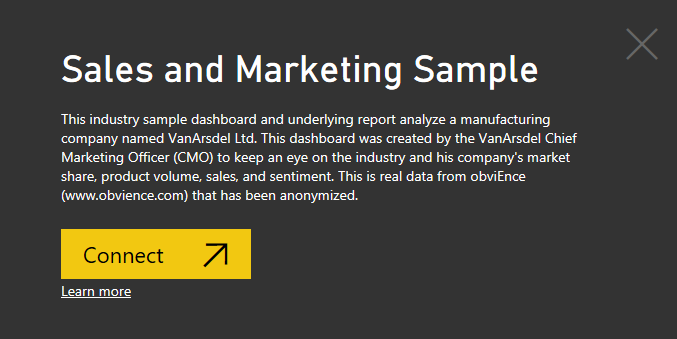
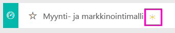
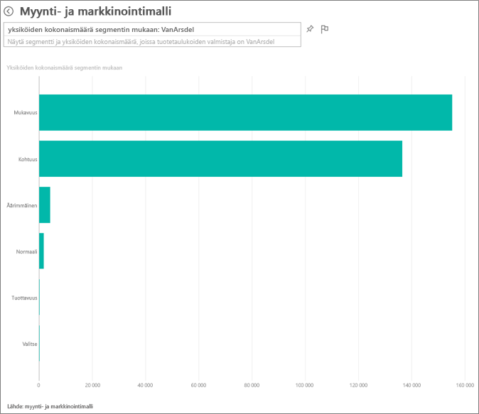
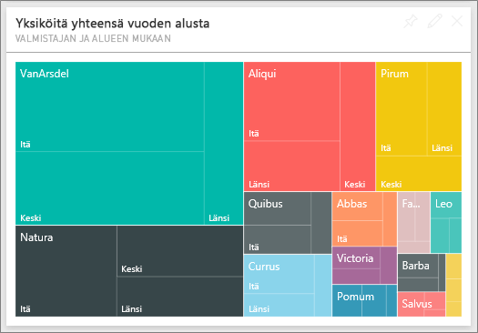
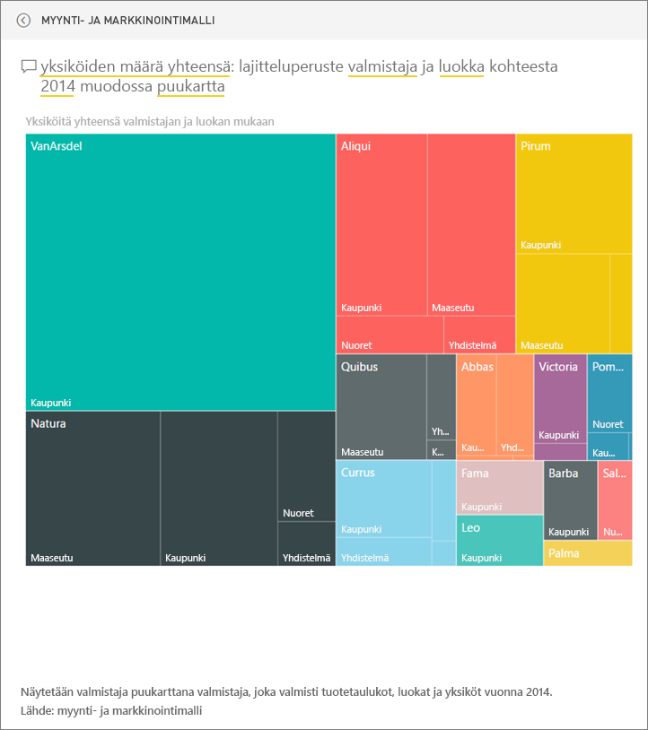
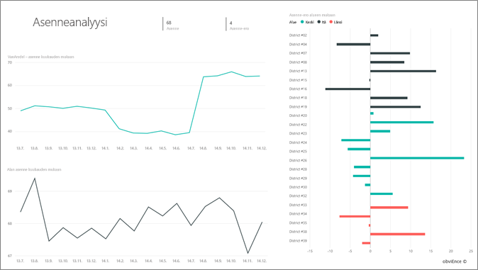
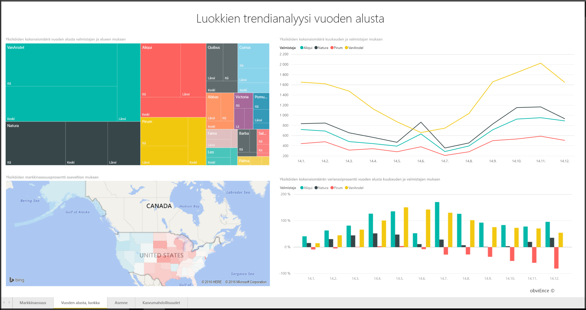
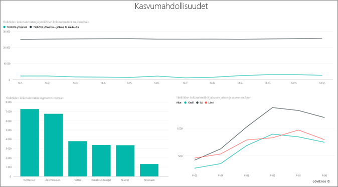

# Myynti- ja markkinointimalli Power BI:lle: esittely

## Myynti- ja markkinointimallin yleiskatsaus
**Myynti- ja markkinointimalli** sisältää koontinäytön ja raportin kuvitteelliselle tuotantoyritykselle nimeltä VanArsdel Ltd. Vanarsdelin markkinointipäällikkö (CMO) loi tämän koontinäytön pitääkseen silmällä alan ja yrityksensä markkinaosuutta, tuotteiden määrää, myyntiä ja asenteita.

Vanarsdelilla on monta kilpailijaa, mutta se itse on alansa markkinajohtaja. CMO haluaa kasvattaa markkinaosuuttaan ja löytää uusia kasvumahdollisuuksia. Jostain syystä Vanarsdelin markkinaosuus on kuitenkin alkanut pienentyä, ja kesäkuussa ilmeni merkittäviä pudotuksia.

Tämä malli kuuluu sarjaan, jossa esitellään, miten Power BI:tä voidaan käyttää liiketoimintaan suuntautuneiden tietojen, raporttien ja koontinäyttöjen kanssa. Nämä ovat oikeita tietoja obviEnceltä (www.obvience.com), jotka on muunnettu nimettömään muotoon.

## Edellytykset

 Ennen kuin voit käyttää mallia, se on ensin ladattava [sisältöpakettina](https://docs.microsoft.com/en-us/power-bi/sample-sales-and-marketing#get-the-content-pack-for-this-sample), [.pbix](http://download.microsoft.com/download/9/7/6/9767913A-29DB-40CF-8944-9AC2BC940C53/Sales and Marketing Sample PBIX.pbix)-tiedostona tai [Excel-työkirjana](http://go.microsoft.com/fwlink/?LinkId=529785).

### Mallin sisältöpaketin noutaminen

1. Avaa Power BI -palvelu (app.powerbi.com) ja kirjaudu sisään.
2. Valitse vasemmasta alakulmasta **Nouda tiedot**.
   
    
3. Valitse ilmestyvältä Nouda tiedot -sivulta **Mallit**-kuvake.
   
   
4. Valitse **Myynti- ja markkinointimalli** ja valitse sitten **Yhdistä**.  
  
   
   
5. Power BI tuo sisältöpaketin ja lisää uuden koontinäytön, raportin ja tietojoukon senhetkiseen työtilaasi. Uusi sisältö merkitään keltaisella tähdellä. 
   
   
  
### Hae tämän mallin .pbix-tiedosto

Vaihtoehtoisesti voit ladata näytteen .pbix-tiedostona, joka on suunniteltu käytettäväksi Power BI Desktopilla. 

 * [Myynti- ja markkinointimalli](http://download.microsoft.com/download/9/7/6/9767913A-29DB-40CF-8944-9AC2BC940C53/Sales%20and%20Marketing%20Sample%20PBIX.pbix)

### Hae tämän näytteen Excel-työkirja
Voit myös [ladata vain tietojoukon (Excel-työkirjan)](http://go.microsoft.com/fwlink/?LinkId=529785) tälle mallille. Työkirja sisältää Power View -taulukoita, joita voit tarkastella ja muokata. Raakatiedot saa näkyviin valitsemalla **Power Pivot > Hallinta**.

## Mitä koontinäyttö kertoo?
Aloitetaan esittelykierros koontinäytöstä ja vilkaistaan ruutuja, jotka CMO on kiinnittänyt sinne. Siellä on tietoja markkinointiosuudestamme, myynnistä ja asenteista. Ja tiedot on eritelty alueiden, ajan ja kilpailijoiden mukaan.

* Vasemman sarakkeen numeroruuduissa näkyvät alan myyntivolyymit kuluvan vuoden aikana (50 tuhatta), markkinointiosuus (32,86 %), myyntivolyymi (16 tuhatta), asennetulos (68), asenne-ero (4) ja myytyjen yksikköjen yhteismäärä (1 milj.).
* Ylemmässä viivakaaviossa näkyy, miten markkinaosuutemme vaihtelee ajan mittaan. Markkinaosuutemme tekee tosiaan jyrkän pudotuksen kesäkuussa. Myös R12M (liukuva 12 kuukautta) -osuutemme, joka oli jo hetken kasvussa, alkoi myös hidastua.
* Suurin kilpailijamme on Aliqui (mikä näkyy keskimmäisen sarakkeen kaavioruudussa).
* Suurin osa liiketoiminnastamme tapahtuu itärannikolla ja keskiosassa maata.
* Alareunassa olevassa viivakaaviosta nähdään, että pudotuksemme kesäkuussa ei ole kausiluonteista – kellään kilpailijoistamme ei näy samaa trendiä.
* Kahdessa ”Yksiköitä yhteensä”-ruudussa näkyy myytyjen yksiköiden määrä segmenteittäin sekä alueittain/valmistajan mukaan. Alamme suurimmat markkinasegmentit ovat **tuottavuus** ja **kätevyys**.

### Kysymysosion käyttö tarkempien tietojen saamiseksi
#### Mitkä segmentit tehostavat myyntiämme? Vastaako sen alan trendejä?
1. Valitse ”Yksiköt yhteensä kaikkiaan segmentin mukaan”-ruutu, joka avaa kysymysosion.
2. Kirjoita **Vanarsdelin** käytetyn haun loppuun. Kysymysosio tulkitsee kysymyksen ja näyttää päivitetyn kaavion vastauksen kera. Tuotevolyymimme tulee Kätevyydestä ja Kohtuudesta.

   
3. Osuutemme luokissa **Kohtuus** ja **Kätevyys** on erittäin suuri; nämä ovat ne segmentit, joissa olemme kilpailukykyisiä.
4. Voit siirtyä takaisin koontinäyttöön valitsemalla koontinäytön nimen yläsiirtymispalkista (navigointipolku).

#### Miltä yksiköiden kokonaismäärän markkinaosuus näyttää luokan perusteella (vrt. alueen)?
1. Huomaa ruutu ”Yksiköiden kokonaismäärä vuoden alusta valmistajan ja alueen mukaan”. Miltäköhän yksiköiden kokonaismäärän markkinaosuus näyttää luokan mukaan?

   
2. Kirjoita koontinäytön yläreunassa olevaan kysymysruutuun kysymys: **yksiköt yhteensä valmistajan ja luokan mukaan vuonna 2014 puukaaviona**. Huomaa, miten visualisointi päivittyy, kun kirjoitat kysymyksen.
   
3. Jos haluat verrata löydöksiä, kiinnitä kaavio koontinäyttöösi. Erittäin mielenkiintoista: 2014 Vanarsdel myi ainoastaan tuotteita, jotka kuuluvat **Kaupunki**-luokkaan.
4. Siirry takaisin koontinäyttöön.

Koontinäytöt ovat myös aloituskohta raportteihin.  Jos ruutu on luotu sen pohjana olevasta raportista, kyseisen ruudun napsauttaminen avaa raportin.

Koontinäytössämme R12M (liukuva 12 kuukautta) -viiva osoittaa, että markkinaosuutemme ei enää kasva ajan mittaan, vaan se jopa vähän pienenee. Ja miksi markkinaosuutemme kokee suuren pudotuksen kesäkuussa? Voit tutkia asiaa tarkemmin napsauttamalla visualisointia, jolloin sen pohjana oleva raportti aukeaa.

### Tässä raportissa on 4 sivua
#### Raporttimme sivulla 1 keskitytään Vanarsdelin markkinaosuuteen.

1. Katso ”Yksiköitä yhteensä kuukauden mukaan ja onVanArsdel” -pylväskaaviota alareunassa. Musta sarake edustaa VanArsdelia (tuotteitamme) ja vihreä on kilpailijamme. VanArsdelin kilpailijat eivät kokeneet sen kohtaamaa pudotusta kesäkuussa 2014.
2. ”Luokan volyymi yhteensä segmentin mukaan” -palkkikaavio keskellä oikealla on suodatettu näyttämään VanArsdelin kaksi tärkeintä segmenttiä. Katso, miten tämä suodatin on luotu:  

   a.  Laajenna oikealla olevaa Suodattimet-ruutua.  
   b.  Valitse visualisointi.  
   c.  Huomaa Visuaalisen tason suodattimet -kohdassa, että **Segmentti** on suodatettu sisältämään vain tiedot **Kätevyys** ja **Kohtuus**.  
   d.  Muokkaa suodatinta valitsemalla Segmentti kyseisen osan laajentamiseksi ja valitsemalla sitten **Tuottavuus** myös tämän segmentin lisäämiseksi.  
3. Valitse kohdassa ”Yksiköitä yhteensä kuukauden mukaan ja onVanArsdel” musta ”Kyllä” selitteestä, jotta voit ristiinsuodattaa sivun VanArsdelin mukaan. Huomaa, että emme kilpaile Tuottavuus-segmentissä.
4. Valitse musta ”Kyllä” uudelleen, jos haluat poistaa suodattimen.
5. Tarkastele viivakaaviota. Siinä näkyy kuukausittainen markkinaosuutemme ja liukuvan 12 kuukauden markkinaosuudet. Liukuvan 12 kuukauden tiedot auttavat tasoittamaan kuukausittain ilmenevää vaihtelua ja näyttävät pitkän aikavälin trendit. Valitse Kätevyys ja sitten Kohtuus palkkikaaviosta, jolloin saat näkyviin, paljonko markkinaosuudessa ilmenee vaihtelua kussakin segmentissä. Kohtuus-segmentissä näkyy paljon enemmän vaihtelua markkinaosuudessa Kätevyys-segmenttiin verrattuna.

Yritämme edelleen selvittää, miksi markkinaosuutemme putosi niin alas kesäkuussa. Tarkistetaanpa seuraavaksi Asenne.

#### Raporttimme sivulla 3 keskitytään Asenteeseen.

Twiitit, Facebook, blogit, artikkelit jne. vaikuttavat asenteeseen, joka näkyy kahdessa viivakaaviossa. Ylävasemmalla olevassa Asenne-kaaviossa näkyy, että asenne tuotteitamme kohtaan oli melko neutraali helmikuuhun saakka. Sitten suuri putoaminen alkoi helmikuussa ja oli pahimmillaan kesäkuussa. Mikä aiheutti tämän pudotuksen asenteessa? Meidän pitää tutkia ulkoisia lähteitä. Helmikuussa useissa artikkeleissa ja blogikirjoituksissa VanArsdelin asiakaspalvelu oli arvioitu alan huonoimmaksi. Tällaisella huonolla julkisuudella on suora korrelaatio asiakkaiden asenteisiin ja myyntilukuihin. VanArsdel ponnisteli kovasti asiakaspalvelun parantamiseksi, ja lopulta asiakkaat ja ala huomasivat sen. Heinäkuussa myönteinen asenne alkoi lisääntyä ja saavutti sitten kaikkien aikojen huippunsa 60:ssa. Tämä asenteen paraneminen heijastuu ”Yksiköitä yhteensä kuukauden mukaan” -kohdassa sivuilla 1 ja 3. Ehkäpä tämä selittää osittain markkinaosuutemme pudotuksen kesäkuussa.

Asenne-ero saattaisi olla toinen aihe, johon kannattaisi perehtyä: millä alueilla esiintyy suurin asenne-ero, miten yrityksen johto voisi hyödyntää tätä ja löytää keinoja saman toistamiseen muilla alueilla.

#### Raporttimme sivulla 2 keskitytään Vuoden alusta -luokan trendiin

* Tässä luokassa VanArsdel on kaikista yrityksistä suurin, ja suurimmat kilpailijamme ovat Natura, Aliqui ja Pirium. Pidämme niitä silmällä.
* Aliqui on kasvussa, mutta sen tuotevolyymi meihin verrattuna on edelleen vähäinen.
* Puukartassa VanArsdel näkyy vihreänä. Idässä asiakkaat pitävät kilpailijoistamme enemmän, keskiosassa maata meillä menee OK ja osuutemme idässä on osuuksistamme vähäisin.
* Maantieteellisellä sijainnilla on vaikutus myytyjen yksikköjen määrään. Itä on useimpien valmistajien vahvinta hallinta-aluetta, mutta VanArsdelilla on vahva asema myös maan keskiosassa.
* Alaoikealla olevassa kaaviossa ”Yksiköiden kokonaismäärän varianssi% vuoden alusta kuukauden ja valmistajan mukaan” meillä on positiivinen varianssi, mikä on hyvä merkki, sillä meillä menee paremmin kuin viime vuonna, mutta sama pätee myös kilpailijaamme, Aliqui’hin.

#### Raporttimme sivulla 4 keskitytään kilpailukykyisen tuotteen analyysiin.

* Alavasemmalla olevassa kaaviossa näkyvät kaikki luokan segmentit VanArsdelin kahta vahvinta segmenttiä lukuun ottamatta. Suodattaminen luokan mukaan napsauttamalla palkkeja auttaa tunnistamaan VanArsdelin mahdolliset laajentumiskohteet. **Äärimmäinen**- ja **Tuottavuus**-segmentit kasvavat nopeammin kuin muut.
* Me emme kuitenkaan kilpaile näillä segmenteillä. Jos haluamme siirtyä näille alueille, voimme käyttää näitä tietoja hyväksi nähdäksemme, mitkä segmentit ovat suosittuja kullakin alueella. Voimme perehtyä tarkemmin kysymyksiin, kuten mikä alue kasvaa nopeimmin ja kuka olisi suurin kilpailijamme kyseisellä segmentillä.
* Muistatko markkinaosuutemme pudotuksen kesäkuussa? Kesäkuu on merkittävä kuukausi Tuottavuus-segmentille. Segmentille, jolla emme kilpaile lainkaan. Tämä saattaisi selittää markkinaosuutemme pudotuksen kesäkuussa.

Suodattamalla visualisoinnit VanArsdelin, segmentin, kuukauden ja alueen mukaan voimme löytää kasvumahdollisuuksia VanArsdelille.

Tämä on turvallinen ympäristö kaikenlaisille kokeiluille. Voit aina jättää tekemäsi muutokset tallentamatta. Jos kuitenkin tallennat ne, voit aina siirtyä **Nouda tiedot** -kohtaan, jolloin saat mallista uuden kopion.

## Seuraavat vaiheet: muodostaa yhteys tietoihisi
Toivomme, että tämä esittely on osoittanut, miten Power BI -koontinäytöt, kysymysosio ja raportit voivat tarjota uusia näkökulmia myynti- ja markkinointitietoihin. Nyt sinun vuorosi – muodosta yhteys omiin tietoihisi. Power BI:n avulla voit yhdistää useita eri tietolähteitä. Lisätietoja [Power BI:n käytön aloittamisesta](service-get-started.md).  
