# Toimittajan laatuanalyysimalli Power BI:lle: esittely

## Toimittajan laatuanalyysimallin lyhyt yleiskatsaus
Tämä alan mallikoontinäyttö ja raportti keskittyvät yhteen tyypilliseen toimitusketjun ongelmaan eli toimittajalaatuanalyysiin.
Tässä analyysissa on kaksi tärkeää arvoa: vikojen kokonaismäärä ja niiden aiheuttamisen käyttökatkojen kokonaisaika. Tällä esimerkillä on kaksi päätavoitetta:

* parhaiden ja huonoimpien toimittajien selvittäminen laadun suhteen
* vikoja parhaiten löytävien ja hylkäävien toimipisteiden selvittäminen käyttökatkoajan pienentämiseksi.

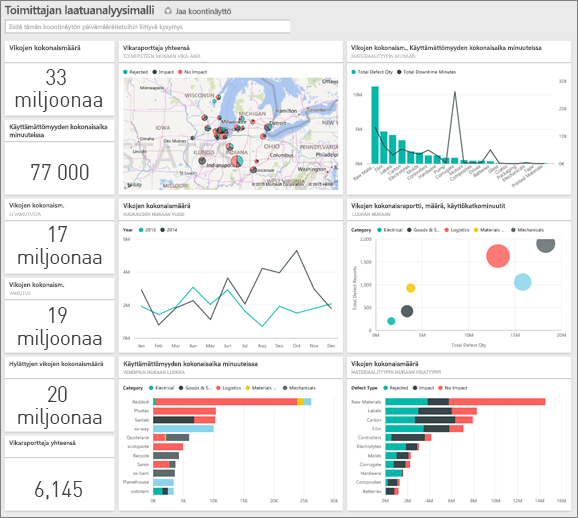

Tämä malli kuuluu sarjaan, jossa esitellään, miten Power BI:tä voidaan käyttää liiketoimintaan suuntautuneiden tietojen, raporttien ja koontinäyttöjen kanssa.
Nämä ovat obviEnceltä ([www.obvience.com](http://www.obvience.com/)) saatuja oikeita tietoja, jotka on tehty nimettömiksi.

## Edellytykset

 Ennen kuin voit käyttää mallia, se on ensin ladattava [sisältöpakettina](https://docs.microsoft.com/power-bi/sample-supplier-quality#get-the-content-pack-for-this-sample), [.pbix-tiedostona](http://download.microsoft.com/download/8/C/6/8C661638-C102-4C04-992E-9EA56A5D319B/Supplier-Quality-Analysis-Sample-PBIX.pbix) tai [Excel-työkirjana](http://go.microsoft.com/fwlink/?LinkId=529779).

### Mallin sisältöpaketin noutaminen

1. Avaa Power BI -palvelu (app.powerbi.com) ja kirjaudu sisään.
2. Valitse vasemmasta alakulmasta **Nouda tiedot**.
   
    
3. Valitse ilmestyvältä Nouda tiedot -sivulta **Mallit**-kuvake.
   
   
4. Valitse **Toimittajan laatuanalyysimalli** ja valitse sitten **Yhdistä**.  
  
   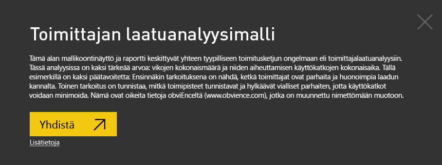
   
5. Power BI tuo sisältöpaketin ja lisää uuden koontinäytön, raportin ja tietojoukon senhetkiseen työtilaasi. Uusi sisältö merkitään keltaisella tähdellä. 
   
   
  
### Hae tämän mallin .pbix-tiedosto

Vaihtoehtoisesti voit ladata näytteen .pbix-tiedostona, joka on suunniteltu käytettäväksi Power BI Desktopilla. 

 * [Toimittajan laatuanalyysimalli](http://download.microsoft.com/download/8/C/6/8C661638-C102-4C04-992E-9EA56A5D319B/Supplier-Quality-Analysis-Sample-PBIX.pbix)

### Hae tämän näytteen Excel-työkirja
Voit myös [ladata vain tietojoukon (Excel-työkirjan)](http://go.microsoft.com/fwlink/?LinkId=529779) tälle mallille. Työkirja sisältää Power View -taulukoita, joita voit tarkastella ja muokata. Raakatiedot saa näkyviin valitsemalla **Power Pivot > Hallinta**.

## Viallisten materiaalien aiheuttamat käyttökatkot
Analysoidaan viallisten materiaalien aiheuttamia käyttökatkoja ja katsotaan, mitkä toimittajat ovat vastuussa niistä.  

1. Valitse koontinäytössä **Vikojen kokonaismäärä** -lukuruutu tai **Käyttämättömyyden kokonaisaika minuuteissa** -lukuruutu.  

   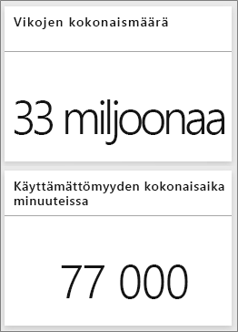  

   Toimittajan laatuanalyysimalli -raportti avautuu Käyttökatkoaika-analyysi-sivulta. Huomaa, viallisia kappaleita on yhteensä 33 miljoonaa ja näiden viallisten kappaleiden aiheuttama käyttökatkoaika on 77 000 minuuttia. Osassa materiaaleja on vähemmän viallisia kappaleita, mutta ne voivat aiheuttaa valtavan viiveen ja pidemmän käyttökatkon. Tutustutaan niihin tarkemmin raporttisivulla.  
2. Tarkastellessamme **Käyttämättömyyden kokonaisaika minuuteissa** -riviä **Viat ja käyttämättömyys (minuutteina) materiaalityypin mukaan** yhdistelmäkaaviota näemme, että poimutetut materiaalit aiheuttavat eniten käyttökatkoja.  
3. Valitse samasta yhdistelmäkaaviosta **Poimutettu**-sarake, jotta näet, mihin toimipisteisiin tämä vika vaikuttaa eniten ja mikä toimittaja on vastuussa.  

     
4. Valitse kartalta yksittäisiä toimipisteitä, jotta näet, mikä toimittaja tai materiaali on syynä käyttökatkoihin kyseisessä toimipisteessä.

### Mitkä ovat huonoimmat toimittajat?
 Haluamme löytää kahdeksan huonointa toimittajaa ja määrittää, mikä prosenttiosuus käyttökatkoista johtuu kyseisistä toimittajista. Se onnistuu muuttamalla **Käyttökatkoaika minuutteina toimittajan mukaan** -aluekaavio puukartaksi.  

1. Valitse raportin, Käyttökatkoaika-analyysi, sivulla 3 **Muokkaa raporttia** vasemmassa yläkulmassa.  
2. Valitse **Käyttökatkoaika minuutteina toimittajan mukaan** -aluekaavio ja valitse Visualisoinnit-ruudusta Puukartta.  

   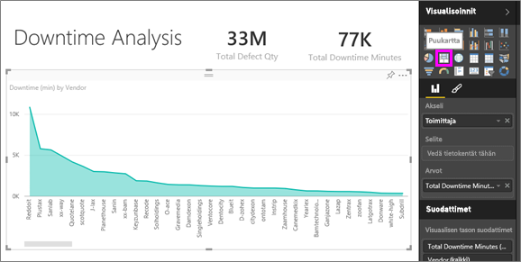  

    Puukartta sijoittaa automaattisesti **Toimittaja**-kentän **ryhmäksi**.  

    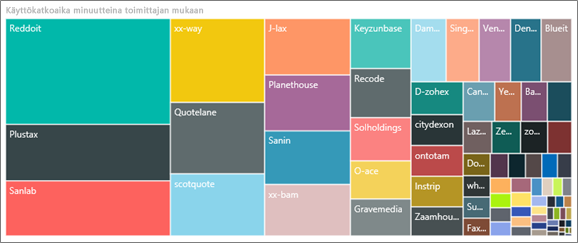  

   Näemme tässä puukartassa, että kahdeksan parasta toimittajaa ovat kahdeksan lohkoa puukartan vasemmassa reunassa. Näemme myös, että ne aiheuttavat noin 50 % kaikesta käyttökatkoajasta.  
3. Valitse **Toimittajan laatuanalyysimalli** yläreunan siirtymispalkista ja palaa koontinäyttöön.

### Toimipisteiden vertaileminen
Seuraavaksi tutustumme siihen, mitkä toimipisteet hallitsevat paremmin viallista materiaalia, jolloin tuloksena on vähemmän käyttökatkoja.  

1. Valitse **Vikojen kokonaisraportit toimipisteen ja vikatyypin perusteella** -karttaruutu.  

    Toimittajan laatu -sivu avautuu raportista.  

   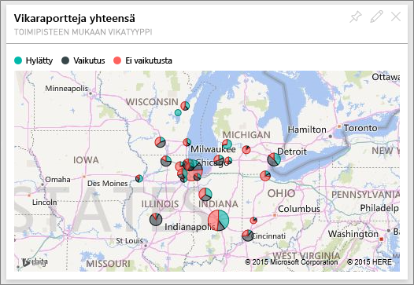  
2. Valitse kartan selitteestä **Vaikutus**-ympyrä.  

    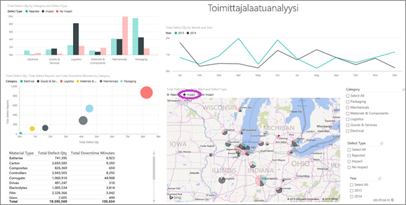  

    Huomaa kuplakaaviosta, että **Logistiikka** on ongelmallisin luokka – se on suurin vikojen kokonaismäärällä, vikaraporttien kokonaismäärällä ja käyttämättömyyden kokonaisajalla mitattuna. Perehdytään tähän luokkaan tarkemmin.  
3. Valitse kuplakaaviosta Logistiikka-kupla ja tutustu toimipisteisiin Illinoisin Springfieldissä ja Napervillessä. Naperville näyttää hallitsevan viallisia toimituksia paljon paremmin, koska siellä hylkäysten määrä on suurempi ja vaikutukset vähäisempiä verrattuna Springfieldin paljon suurempaan vaikutuslukuun.  

   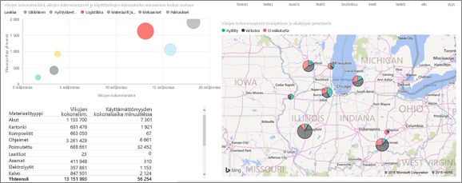  
4. Valitse **Toimittajan laatuanalyysimalli** yläreunan siirtymispalkista ja palaa aktiiviseen työtilaan.

## Mitä materiaalityyppiä hallitaan parhaiten?
Parhaiten hallittu materiaali on materiaali, jossa on vähäisin käyttökatkoaika tai ei vaikutusta vikamäärästä riippumatta.

* Katso koontinäytössä **Vikojen kokonaismäärä materiaalityypin ja vikatyypin mukaan** -ruutua.

  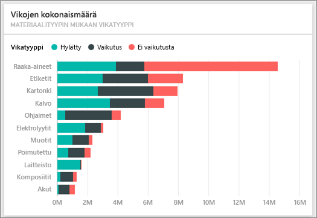

Huomaa, että **raaka-aineissa** on paljon vikoja kokonaismäärällä mitattuna, mutta valtaosa vioista joko hylätään tai niillä ei ole vaikutusta.

Vahvistetaan siis, että raaka-aineet eivät aiheuta paljoa käyttökatkoja suuresta vikamäärästä huolimatta.

* Katso koontinäytössä **Vikojen kokonaism., Käyttämättömyyden kokonaisaika minuuteissa materiaalityypin mukaan** -ruutua.

  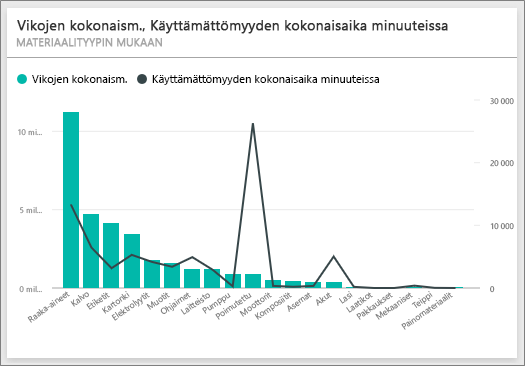

Ilmeisesti raaka-aineita hallitaan hyvin: niissä on enemmän vikoja, mutta käyttämättömyyden kokonaisaika minuuteissa on pienempi.

### Vikojen vertaaminen käyttökatkoihin vuoden mukaan
1. Valitse **Vikojen kokonaismäärä tehtaan ja vikatyypin mukaan** -karttaruutu, jotta raportti avautuu ensimmäiseltä raporttisivulta, Toimittajan laatu.
2. Huomaa, että **Vikamäärä** on suurempi vuonna 2014 kuin vuonna 2013.  

    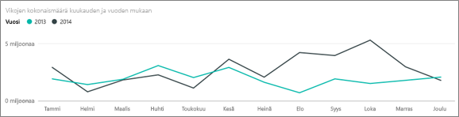  
3. Aiheuttaako suurempi vikamäärä enemmän käyttökatkoja? Voimme esittää kysymyksiä Q&A-ruudussa asian selvittämiseksi.  
4. Valitse **Toimittajan laatuanalyysimalli** yläreunan siirtymispalkista ja palaa koontinäyttöön.  
5. Koska tiedämme, että raaka-aineissa on eniten vikoja, kirjoita kysymysruutuun ”näytä materiaalityypit, vuosi ja vikojen kokonaismäärä”.  

    Raaka-ainevikoja ilmeni paljon enemmän vuonna 2014 kuin vuonna 2013.  

    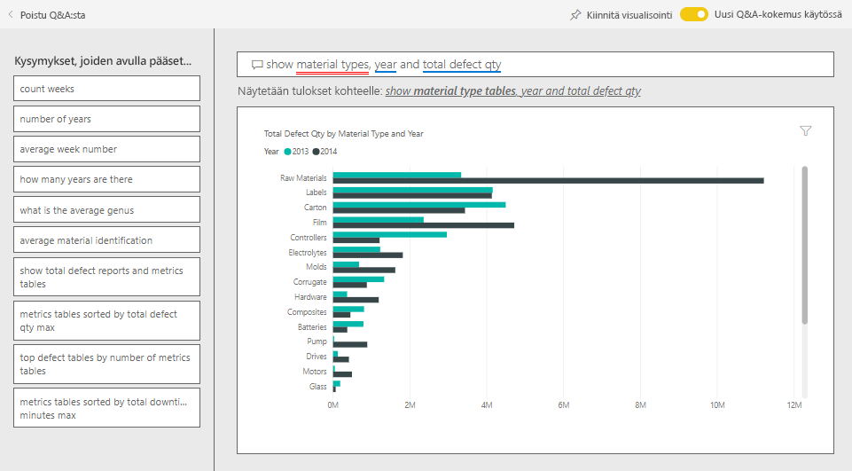  
6. Vaihda nyt kysymykseksi ”näytä materiaalityypit, vuosi ja käyttökatkojen kokonaisaika minuutteina”.  

   

Raaka-aineiden käyttökatkoja oli suurin piirtein saman verran vuosina 2013 ja 2014, vaikka raaka-vikoja oli paljon enemmän vuonna 2014.

Raportista käy ilmi, että raaka-ainevikojen lisääntyminen vuonna 2014 ei aiheuttanut raaka-aineesta johtuvien käyttökatkojen lisääntymistä vuonna 2014.

### Vikojen vertaaminen käyttökatkoihin kuukausittain
Katsotaan toista koontinäytön ruutua, joka liittyy vikojen kokonaismäärään.  

1. Valitse taaksepäin osoittava nuoli  vasemmassa yläkulmassa kysymysruudun yläpuolella, jotta pääset takaisin koontinäyttöön.  

    Kun **Vikojen kokonaismäärä kuukauden ja vuoden mukaan** -ruutua tarkastellaan tarkemmin, vuoden 2014 alkuvuonna vikojen määrä vastasi vuotta 2013, mutta vuoden 2014 toisella puoliskolla vikojen kokonaismäärä nousi merkittävästi.  

    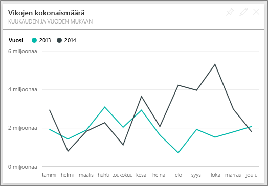  

    Katsotaan, aiheuttiko tämä vikamäärän kasvu vastaavan kasvun käyttökatkoajassa.  
2. Kirjoita kysymysruutuun ”käyttökatkoaika minuutteina kuukauden ja vuoden mukaan viivakaaviona”.  

   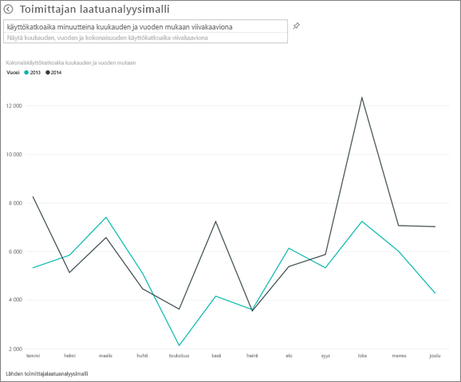

   Näemme hypyn käyttökatkoajassa kesäkuun ja lokakuun aikana, mutta muilta osin vikojen määrän kasvu ei aiheuttanut merkittävää lisäystä käyttökatkoissa. Se osoittaa, että vikoja hallitaan hyvin.  
3. Jos haluat kiinnittää tämän kaavion koontinäyttöösi, valitse Kiinnitä-kuvake  kysymysruudun oikealta puolelta.  
4. Jos haluat tutkia poikkeavia kuukausia, tarkista käyttökatkoajat minuutteina lokakuussa materiaalityypin, toimipisteen sijainnin, luokan jne. mukaan esittämällä kysymyksiä, kuten ”käyttämättömyyden kokonaisaika minuuteissa lokakuussa toimipisteen mukaan”.    
5. Valitse taaksepäin osoittava nuoli  vasemmassa yläkulmassa kysymysruudun yläpuolella, jotta pääset takaisin koontinäyttöön.

Tämä on turvallinen ympäristö kaikenlaisille kokeiluille. Voit aina jättää tekemäsi muutokset tallentamatta. Jos kuitenkin tallennat ne, voit aina siirtyä **Nouda tiedot** -kohtaan, jolloin saat mallista uuden kopion.

## Seuraavat vaiheet: muodostaa yhteys tietoihisi
Toivomme, että tämä esittely on osoittanut, miten Power BI -koontinäytöt, kysymysosio ja raportit voivat tarjota uusia näkökulmia toimittajan laatutietoihin. Nyt sinun vuorosi – muodosta yhteys omiin tietoihisi. Power BI:n avulla voit muodostaa yhteyden useisiin eri tietolähteisiin. Lisätietoja [Power BI:n käytön aloittamisesta](service-get-started.md).
