#  Yhteyden muodostaminen malleihin Power BI -palvelussa

Tässä opetusohjelmassa opit 
- tuomaan mallisisältöpaketin, lisäämään sen Power BI -palveluun ja avaamaan sen sisällön. *Sisältöpaketti* on mallityyppi, jossa tietojoukko on niputettu yhteen koontinäytön ja raportin kanssa. 
- avaamaan .pbix-mallitiedoston Power BI Desktop -versiossa.

Jos haluat tätä ennen hieman lisää taustatietoja, suosittelemme aloittamaan [Power BI:n mallitietojoukkoja](sample-datasets.md) käsittelevästä artikkelista. Artikkelin avulla opit kaiken malleista, niiden hakemisesta, tallentamisesta ja käyttämisestä ja voit tutustua joihinkin mallien kertomiin tarinoihin. Kun olet omaksunut perusasiat, palaa tähän opetusohjelmaan.   

## Edellytykset
Mallit ovat käytettävissä Power BI -palvelun ja Power BI Desktop -version kautta. Käytämme esimerkkinä Jälleenmyyntianalyysimallia.

Tässä opetusohjelmassa käytettävän *Jälleenmyyntianalyysin* mallisisältöpaketti koostuu koontinäytöstä, raportista ja tietojoukosta.
Ennen aloittamista voit tutustua tähän kyseiseen sisältöpakettiin ja sen skenaarioon katsomalla [Jälleenmyyntianalyysimallin esittelyn](sample-retail-analysis.md).

## Mallit ja Power BI -palvelu

1. Avaa Power BI -palvelu ja kirjaudu sisään (app.powerbi.com).
2. Valitse vasemman siirtymisruudun alareunassa **Nouda tiedot**. Jos et näe **Hae tiedot** -kohtaa, laajenna siirtymisruutua valitsemalla 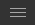.
   
   
5. Valitse **Mallit**.  
   
   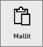
6. Valitse *Jälleenmyyntianalyysimalli* ja **Yhdistä**.   
   
   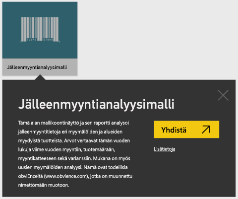

## Mitä tarkalleen ottaen tuotiin?
Kun valitset sisältöpaketeissa **Yhdistä**, Power BI hakee kopion sisältöpaketista ja tallentaa sen sinulle pilvipalveluun. Sisältöpaketin luonut henkilö sisällytti tietojoukon, raportin ja koontinäytön, joten saat ne, kun valitset **Yhdistä**. 

1. Power BI luo uuden koontinäytön ja lisää sen **Koontinäytöt**-välilehteesi. Keltainen tähti kertoo, että se on uusi.
   
   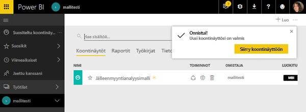
2. Avaa **Raportit**-välilehti.  Tässä näet uuden raportin nimeltä *Jälleenmyyntianalyysimalli*.
   
   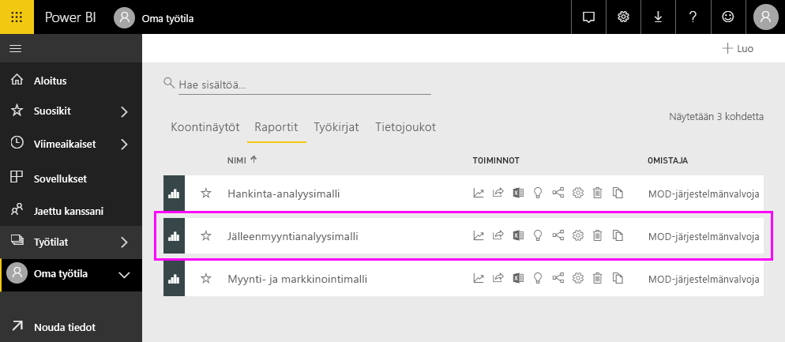
   
   Katso **Tietojoukko**-välilehti.  Myös siellä on uusi tietojoukko.
   
   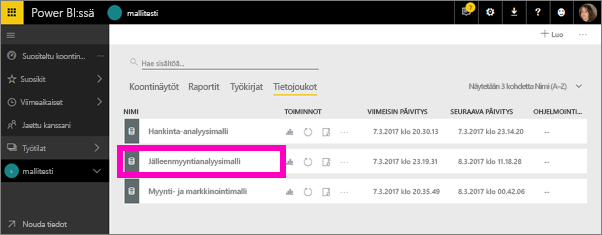

## Tutustu uuteen sisältöösi
Tutustu nyt itsenäisesti koontinäyttöön, tietojoukkoon ja raporttiin. Omiin koontinäyttöihin, raportteihin ja tietojoukkoihin on monta tapaa siirtyä, ja vain yksi näistä tavoista on kuvattu jäljempänä.  

> [!TIP]
> Haluatko alkuun hieman apua?  Tutustu malliin vaiheittain katsomalla [Jälleenmyyntianalyysimallin esittely](sample-retail-analysis.md).
> 
> 

1. Siirry takaisin **Koontinäytöt**-välilehteen ja valitse ja avaa *Jälleenmyyntianalyysimalli*-koontinäyttö.    
   
   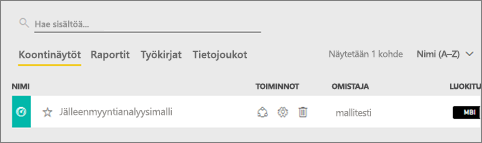
2. Koontinäyttö avautuu.  Se sisältää erilaisia visualisointiruutuja.
   
   
3. Avaa ruudun taustalla oleva raportti valitsemalla jokin ruuduista.  Tässä esimerkissä valitsemme aluekaavion (rajattu vaaleanpunaisella edellisessä kuvassa). Raportti avautuu sivulle, joka sisältää kyseisen aluekaavion.
   
    
   
   > [!NOTE]
   > Jos ruutu olisi luotu [Power BI Q&A](consumer/end-user-q-and-a.md) -työkalulla, Q&A-sivu olisi avautunut. Jos ruutu olisi [kiinnitetty Excelistä](service-dashboard-pin-tile-from-excel.md), Excel Online olisi avautunut Power BI:n sisällä.
   > 
   > 
1. **Tietojoukot**-välilehdessä on useita vaihtoehtoja tietojoukkoon tutustumiseen.  Et voi avata sitä ja tarkastella kaikkia rivejä ja sarakkeita (toisin kuin Power BI Desktop -versiossa tai Excelissä).  Jaettaessa sisältöpaketti työkaverin kanssa halutaan yleensä jakaa merkitykselliset tiedot eikä antaa suoraa pääsyä tietoihin. Tämä ei kuitenkaan tarkoita sitä, etteikö tietojoukkoon voisi tutustua.  
   
   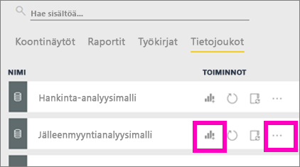
   
   * Yksi tapa tutustua tietojoukkoon on luoda omat visualisoinnit ja raportit alusta alkaen.  Valitse kaaviokuvake  tietojoukon avaamiseksi raportin muokkaustilassa.
     
       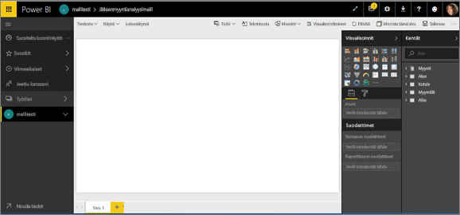
   * Toinen tapa tutustua tietojoukkoon on suorittaa [Nopeat merkitykselliset tiedot](consumer/end-user-insights.md) -toiminto. Valitse kolme pistettä (...) ja **Hae merkitykselliset tiedot**. Kun merkitykselliset tiedot ovat valmiit, valitse **Näytä merkitykselliset tiedot**.
     
       

## Mallit ja Power BI Desktop 
Kun avaat PBIX-mallitiedoston, se avautuu Raportti-näkymään, jossa voit tutustua visualisointeja sisältäviin raporttisivuihin ja luoda tai muokata niitä. Raportti-näkymä on rakenteeltaan pääpiirteittäin sama kuin raportin muokkausnäkymä Power BI -palvelussa. Voit esimerkiksi siirtää, kopioida ja liittää sekä yhdistää visualisointeja.

Ero näkymien välillä on, että käyttäessäsi Power BI Desktop -versiota voit työstää kyselyitäsi ja mallintaa tietosi, jotta ne varmasti tukevat raporttiesi parhaita merkityksellisiä tietoja. Voit sen jälkeen tallentaa Power BI Desktop -tiedoston minne tahansa, esimerkiksi paikalliselle asemalle tai pilvipalveluun.

1. Avaa [Jälleenmyyntianalyysin .pbix-mallitiedosto](http://download.microsoft.com/download/9/6/D/96DDC2FF-2568-491D-AAFA-AFDD6F763AE3/Retail%20Analysis%20Sample%20PBIX.pbix) Power BI Desktop -versiossa. 

    

1. Tiedosto avautuu Raportti-näkymään. Huomaatko raporttieditorin alareunassa olevat neljä välilehteä? Tämä tarkoittaa, että tässä raportissa on neljä sivua, ja Uudet myymälät -sivu on parhaillaan valittuna. 

    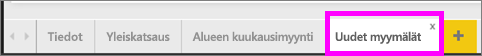.

3. Tutustu raporttieditoriin tarkemmin katsomalla [raporttieditorin esittely](service-the-report-editor-take-a-tour.md)

## Mitä tarkalleen ottaen tuotiin?
Kun avaat PBIX-mallitiedoston Desktop-versiossa, Power BI hakee kopion kyseisistä tiedoista ja tallentaa ne sinulle pilvipalveluun. Desktop-versiosta pääset käsiksi raporttiin ***ja sen pohjana olevaan tietojoukkoon***. Kun tiedot ladataan, Power BI Desktop yrittää löytää ja luoda suhteita puolestasi.  

1. Vaihda [Tiedot-näkymään](desktop-data-view.md) valitsemalla taulukkokuvake  .
 
    

    Tiedot-näkymän avulla voit tarkastaa Power BI Desktop -mallin tiedot, tutustua niihin ja oppia ymmärtämään niitä. Se poikkeaa taulukoiden, sarakkeiden ja tietojen tarkastelusta kyselyeditorissa. Tiedot-näkymässä tarkastelet tietojasi sen jälkeen, kun ne on ladattu tietomalliin.

    Kun mallinnat tietojasi, haluat ehkä nähdä, mitä taulukossa tai sarakkeessa todella on ilman visualisoinnin luomista raporttipohjaan, usein ihan rivitasolle asti. Tämä pitää paikkansa erityisesti silloin, kun luot mittareita ja laskettuja sarakkeita tai kun sinun on tunnistettava tietotyyppi tai tietoluokka.

1. Vaihda [Suhteet-näkymään](desktop-relationship-view.md) valitsemalla kuvake  .
 
    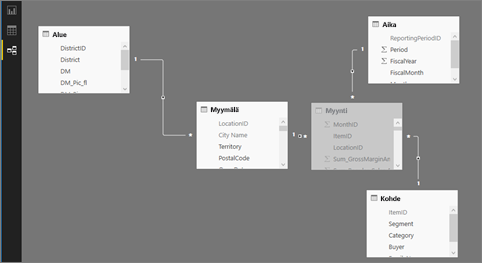

    Suhteet-näkymässä näytetään mallisi kaikki taulukot, sarakkeet ja suhteet. Täällä voit tarkastella, muuttaa ja luoda suhteita.

## Tutustu uuteen sisältöösi
Tutustu nyt itsenäisesti tietojoukkoon, suhteisiin ja raporttiin. Jos tarvitset apua käytön aloittamisessa, tutustu [Desktop-version aloitusoppaaseen](desktop-getting-started.md).    

## Seuraavat vaiheet
[Power BI:n peruskäsitteet](consumer/end-user-basic-concepts.md)

[Power BI -palvelun mallit](sample-datasets.md)

[Power BI:n tietolähteet](service-get-data.md)

Onko sinulla muuta kysyttävää? [Kokeile Power BI -yhteisöä](http://community.powerbi.com/)

