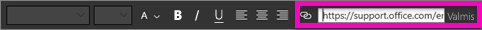
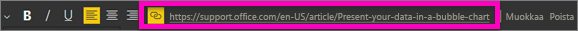
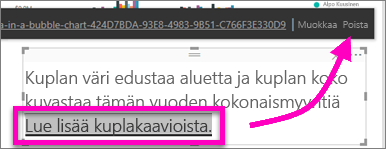

# Hyperlinkin lisääminen tekstiruutuun raportissa
Voit lisätä tekstiruutuja raportteihin, kiinnittää niitä raporteista koontinäyttöihin ja lisätä niitä suoraan koontinäyttöihin. Voit aina lisätä hyperlinkin tekstiruutuun riippumatta siitä, missä tekstiruutu on.  

> **HUOMAUTUS**: Lisätietoja hyperlinkkien käytöstä Power BI -taulukoissa ja matriiseissa on kohdassa [Taulukoiden hyperlinkit](power-bi-hyperlinks-in-tables.md). Saat lisätietoja tekstiruutujen lisäämisestä **koontinäyttöön** kohdasta [ruudun lisääminen suoraan koontinäyttöön ](service-dashboard-add-widget.md). 
> 
> 

<iframe width="560" height="315" src="https://www.youtube.com/embed/_3q6VEBhGew#t=0m55s" frameborder="0" allowfullscreen></iframe>

## Hyperlinkin lisääminen tekstiruutuun raportissa
1. [Luo tekstiruutu ja lisää tekstiä](power-bi-reports-add-text-and-shapes.md). 
2. Olemassa olevan tekstin valitseminen tai uuden tekstin lisääminen, jos haluat käyttää sitä hyperlinkkinä.
   
   
3. Valitse hyperlinkkikuvake .
4. Kirjoita tai liitä URL-osoite hyperlinkki-kenttään ja valitse **Valmis**.
   
   
5. Kokeile linkkiä.  
   
   
   
   * Aseta kohdistin mihin tahansa korostettuun tekstiin URL-osoitteen näyttämiseksi.  
     
      
   * Valitse URL-osoite sivun avaamiseksi uudessa selainikkunassa.

## Voit poistaa hyperlinkin, mutta jätä teksti
1. Valitse tekstiruudussa hyperlinkki sen korostamiseksi
   
     
2. Valitse **Poista**. 

## Seuraavat vaiheet
[Tekstiruudut Power BI -raporteissa](power-bi-reports-add-text-and-shapes.md)

Onko sinulla kysyttävää? [Kokeile Power BI -yhteisöä](http://community.powerbi.com/)

