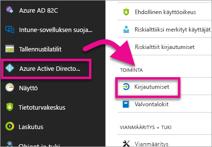
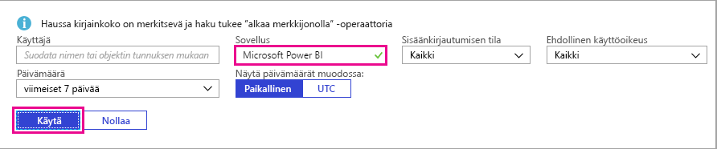
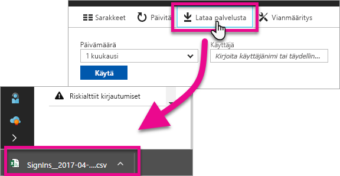

# Kirjautuneena olevien Power BI -käyttäjien etsiminen

Jos olet vuokraajan järjestelmänvalvoja ja haluat nähdä, kuka on kirjautuneena sisään Power BI:hin, katso se [Azure Active Directory -käyttöoikeudella käyttöraporteista](/azure/active-directory/reports-monitoring/concept-sign-ins).

<iframe width="640" height="360" src="https://www.youtube.com/embed/1AVgh9w9VM8?showinfo=0" frameborder="0" allowfullscreen></iframe>

> [!NOTE]
> Tämä toimintaraportti sisältää hyödyllisiä tietoja, mutta se ei määritä kullakin käyttäjällä olevaa käyttöoikeustyyppiä. Katso käyttöoikeudet Office 365 -hallintakeskuksessa.

## Vaatimukset

Kaikki käyttäjät (myös muut kuin järjestelmänvalvojat) voivat nähdä raportin omista kirjautumisistaan, mutta sinun on täytettävä seuraavat vaatimukset, jotta voit nähdä raportin kaikista käyttäjistä.

* Vuokraajalla on oltava vuokraajaan liitetty Azure AD Premium -käyttöoikeus.

* Sinulla on oltava jokin seuraavista rooleista: Yleinen järjestelmänvalvoja, Suojauksen järjestelmänvalvoja tai rooli, jolla on suojaustietojen lukuoikeudet.

## Kirjautumisten tarkastelu Azure-portaalin kautta

Jos haluat tarkastella kirjautumistoimintaa, toimi seuraavien ohjeiden mukaisesti.

1. Valitse **Azure-portaalissa** **Azure Active Directory**.

1. Valitse **Valvonta**-kohdassa **Kirjautumiset**.
   
    

1. Valitse Sovellus-kenttään suodattimeksi joko **Microsoft Power BI** tai **Power BI Gateway** ja valitse **Käytä**.

    **Microsoft Power BI** suodattaa palvelun kirjautumistoiminnan, kun taas **Power BI Gateway** suodattaa paikallisen tietoyhdyskäytävän tietyt kirjautumiset.
   
    

## Tietojen vieminen

Voit viedä kirjautumistiedot kahdella tapaa: lataamalla csv-tiedoston tai käyttämällä PowerShelliä. Valitse kirjautumisraportin yläreunasta toinen seuraavista vaihtoehdoista:

* **Lataa** suodattimien mukaisten tietojen lataamiseksi csv-tiedostona.

* **Komentosarja** PowerShell-komentosarjan lataamiseksi suodattimien mukaisille tiedoille. Voit päivittää komentosarjan suodattimen tarvittaessa.

## Tietojen säilytys

Kirjautumiseen liittyvät tiedot ovat käytettävissä enintään 30 päivän ajan. Lisätietoja on artikkelissa [Azure Active Directoryn raporttien säilytyskäytännöt](/azure/active-directory/reports-monitoring/reference-reports-data-retention).

## Seuraavat vaiheet

[Valvonnan käyttö organisaatiossa](service-admin-auditing.md)

Onko sinulla kysyttävää? [Voit esittää kysymyksiä Power BI -yhteisössä](https://community.powerbi.com/)

