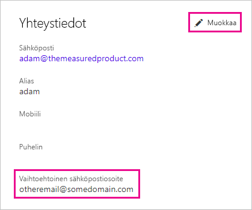

# <a name="using-an-alternate-email-address"></a>Vaihtoehtoisen sähköpostiosoitteen käyttö
Oletusarvoisesti sinulle lähetetään Power BI:n toimintaa koskevat päivitykset sähköpostiosoitteeseen, jota käytit rekisteröityessäsi Power BI:hin.  Jos joku esimerkiksi lähettää sinulle jakamiskutsun, se lähetetään sinulle kyseiseen osoitteeseen.

Saatat kuitenkin haluta, että tällaiset sähköpostiviestit lähetettäisiin johonkin toiseen sähköpostiosoitteeseen kuin siihen, jota käytit rekisteröityessäsi Power BI:hin.

## <a name="updating-through-office-365-personal-info-page"></a>Osoitteen päivittäminen Office 365:n Henkilökohtaiset tiedot ‑sivun kautta
1. Siirry [Office 365:n Henkilökohtaiset tiedot ‑sivulle](https://portal.office.com/account/#personalinfo).  Jos saat kirjautumiskehotteen, kirjaudu sisään käyttämällä sähköpostiosoitetta ja salasanaa, joilla kirjaudut Power BI:hin.
2. Napsauta Yhteystiedot-osion Muokkaa-linkkiä.  
   
   > [!NOTE]
   > Jos et näe Muokkaa-linkkiä, sähköpostiosoitteita hallitsee oma Office 365 ‑järjestelmänvalvojasi, ja sinun pitää pyytää häntä vaihtamaan sähköpostiosoitteesi.
   > 
   > 
   
   
3. Kirjoita Vaihtoehtoinen sähköposti ‑kenttään sähköpostiosoite, johon haluat saada Power BI ‑päivitykset.

> [!NOTE]
> Tämän asetuksen muuttaminen ei vaikuta siihen, mihin sähköpostiosoitteeseen lähetetään palvelupäivitykset, uutiskirjeet ja muut markkinointiviestit.  Ne lähetetään aina siihen sähköpostiosoitteeseen, jota käytit rekisteröityessäsi Power BI:hin.
> 
> 

## <a name="updating-through-azure-active-directory"></a>Osoitteen päivittäminen Azure Active Directoryn kautta
Kun sieppaat Azure Active Directoryn (AAD) upotettavan tunnuksen Power BI:tä varten, voit käyttää kolmea erityyppistä sähköpostiosoitetta. Kolme osoitetyyppiä ovat:

* ensisijainen sähköpostiosoite, joka on liitetty käyttäjän AAD-tiliin
* UserPrincipalName (UPN) ‑sähköpostiosoite
* ”Muu” sähköpostiosoite ‑matriisimäärite

Power BI valitsee, mitä niistä käytetään seuraavien ehtojen perusteella:
1.  Jos AAD-vuokraajan käyttäjäobjektissa on olemassa postimäärite, Power BI käyttää kyseistä postimääritettä sähköpostiosoitteena.
2.  Jos UPN-sähköpostiosoite *ei* ole **\*.onmicrosoft.com**-toimialueen sähköpostiosoite (tiedot @-merkin jälkeen), Power BI käyttää kyseistä postimääritettä sähköpostiosoitteena.
3.  Jos AAD-käyttäjäobjektissa on matriisimäärite muu sähköpostiosoite, käytetään luettelon ensimmäistä sähköpostiosoitetta (sillä tässä määritteessä voi olla sähköpostiosoitteista luettelo).
4. Jos mikään edellä mainituista ehdoista ei täyty, käytetään UPN-osoitetta.

## <a name="updating-with-powershell"></a>Osoitteen päivittäminen PowerShellin kautta
Voit myös antaa vaihtoehtoisen sähköpostiosoitteen PowerShellin kautta Azure Active Directoryyn. Se tehdään komennolla [Set AzureADUser](https://docs.microsoft.com/powershell/module/azuread/set-azureaduser).

```
Set-AzureADUser -ObjectId john@contoso.com -OtherMails "otheremail@somedomain.com"
```

Lisätietoja on artikkelissa [Azure Active Directoryn PowerShell-versio 2](https://docs.microsoft.com/powershell/azure/active-directory/install-adv2).

Onko sinulla kysyttävää? [Kokeile Power BI -yhteisöä](http://community.powerbi.com/)

