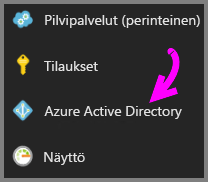
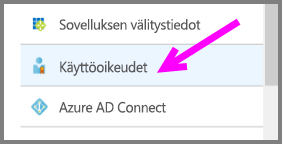
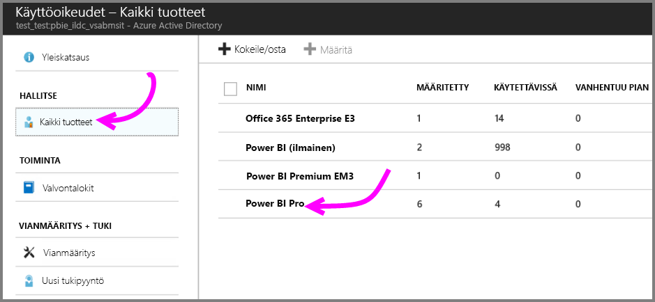
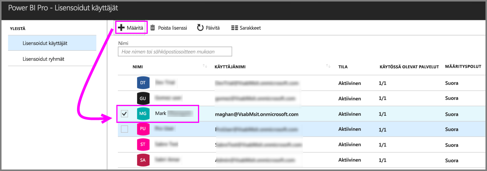

# Pikaopas: Power BI Pro -käyttöoikeuksien määrittäminen Azuressa

Power BI Pro on yksittäinen käyttöoikeus, joka sallii kaiken sisällön ja kaikkien ominaisuuksien käytön Power BI -palvelussa, eli myös sisällön jakamisen ja yhteistyön muiden Pro-käyttäjien kanssa. Vain Pro-käyttäjät voivat julkaista ja käyttää sisältöä sovelluksen työtiloista, jakaa koontinäyttöjä sekä tilata koontinäyttöjä ja raportteja. Tässä artikkelissa kerrotaan, miten voit määrittää Power BI Pro -käyttöoikeudet Azuressa. Lisäksi voit [määrittää käyttöoikeuksia Office 365:ssä](service-admin-assigning-power-bi-pro-licenses.md).

## Edellytykset

Sinulla on oltava Azure-tilaus, jota Power BI käyttää Active Directory -hauissa.

Sinun on [ostettava ainakin yksi käyttöoikeus](service-admin-purchasing-power-bi-pro.md) ennen aloittamista.

## Käyttöoikeuksien määrittäminen yksittäisille käyttäjätileille

Voit määrittää Power BI Pro -käyttöoikeuksia yksittäisille käyttäjätileille seuraavien ohjeiden mukaisesti:

1. Avaa [Azure-portaali](https://ms.portal.azure.com/#@microsoft.onmicrosoft.com/dashboard/private/39bc3cf7-31a4-43f6-954c-f2d69ca2f0). 

2. Valitse vasemmassa siirtymispalkissa **Azure Active Directory**.

    

3. Valitse **Azure Active Directory** -kohdassa **Käyttöoikeudet**.

    

4. Valitse **Käyttöoikeudet**-kohdassa **Kaikki tuotteet** ja valitse sitten **Power BI Pro**. Näin näet luettelon kaikista käyttäjistä, joilla on käyttöoikeus.

    

5. Jos haluat lisätä Power BI Pro -käyttöoikeuden uudelle käyttäjätilille, valitse **Määritä**.

    

## Seuraavat vaiheet

Nyt kun olet määrittänyt käyttöoikeudet, lue lisää Power BI Prosta.

[Power BI Pro organisaatiossasi](service-admin-power-bi-pro-in-your-organization.md)

[Kirjautuneiden Power BI -käyttäjien etsiminen](service-admin-access-usage.md)

Ilmenikö muuta kysyttävää? [Voit esittää kysymyksiä Power BI -yhteisössä](https://community.powerbi.com/)