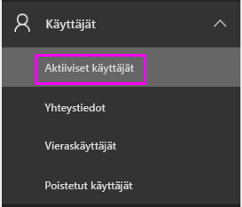
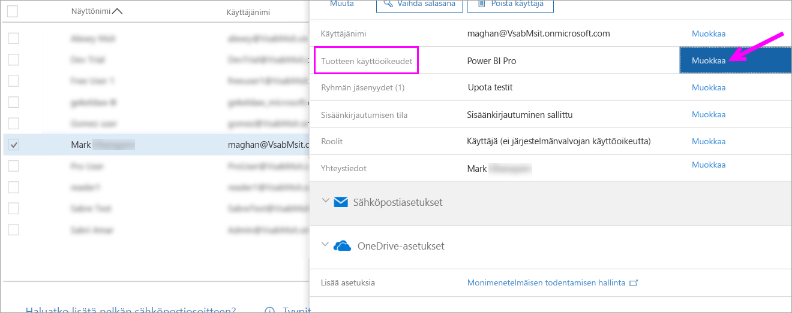
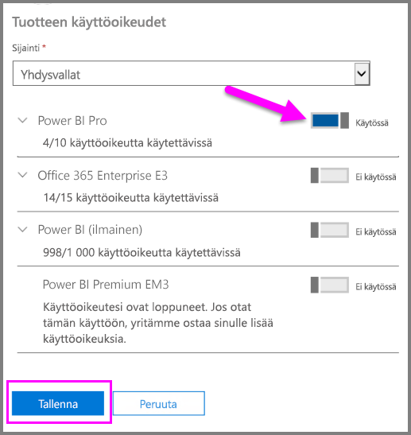
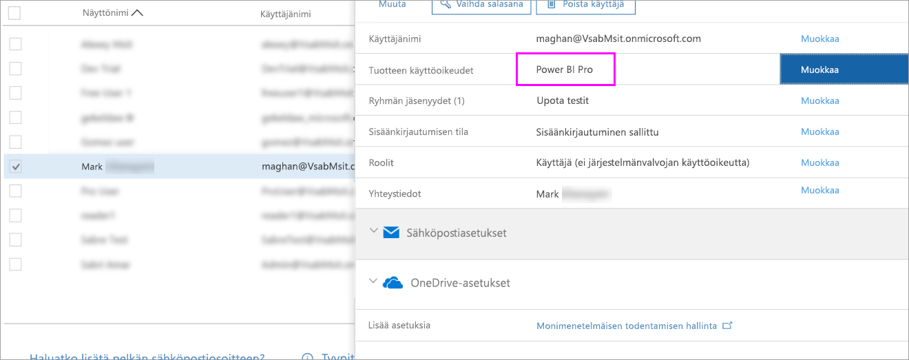

# Pikaopas: Power BI Pro -käyttöoikeuksien määrittäminen Office 365:ssä

Power BI Pro on yksittäinen käyttöoikeus, joka sallii kaiken sisällön ja kaikkien ominaisuuksien käytön Power BI -palvelussa, eli myös sisällön jakamisen ja yhteistyön muiden Pro-käyttäjien kanssa. Vain Pro-käyttäjät voivat julkaista ja käyttää sisältöä sovelluksen työtiloista, jakaa koontinäyttöjä sekä tilata koontinäyttöjä ja raportteja. Tässä artikkelissa kerrotaan, miten voit määrittää Power BI Pro -käyttöoikeudet Office 365:ssä. Lisäksi voit [määrittää käyttöoikeuksia Azuressa](service-admin-assigning-power-bi-pro-licenses-azure.md).

## Edellytykset

Sinulla on oltava [ **Yleinen järjestelmänvalvoja-** tai **käyttäjätilien järjestelmänvalvoja** ](https://support.office.com/article/about-office-365-admin-roles-da585eea-f576-4f55-a1e0-87090b6aaa9d?ui=en-US&rs=en-US&ad=US) -rooli Office 365:ssä.

Sinun on [ostettava ainakin yksi käyttöoikeus](service-admin-purchasing-power-bi-pro.md) ennen aloittamista.

## Käyttöoikeuksien määrittäminen yksittäisille käyttäjätileille

Voit määrittää Power BI Pro -käyttöoikeuksia yksittäisille käyttäjätileille seuraavien ohjeiden mukaisesti:

1. Avaa [Office 365:n hallintakeskus](https://portal.office.com/adminportal/home#/homepage).

2. Laajenna vasemman siirtymisruudun **Käyttäjät**-kohta ja napsauta **Aktiiviset käyttäjät** -kohtaa.

    

3. Valitse käyttäjä ja sitten kohdassa **tuotteiden käyttöoikeudet** valitse **Muokkaa**.

    

4. Vaihda kohdassa **Power BI Pro** asetukseksi **Käytössä** ja valitse sitten **Tallenna**.

    

5. Vahvista valittujen tilien **Tila**-kohdasta, että Power BI Pro -käyttöoikeuden määritys onnistui.

    

## Seuraavat vaiheet

Nyt kun olet määrittänyt käyttöoikeudet, lue lisää Power BI Prosta.

[Power BI Pro organisaatiossasi](service-admin-power-bi-pro-in-your-organization.md)

[Kirjautuneiden Power BI -käyttäjien etsiminen](service-admin-access-usage.md)

Ilmenikö muuta kysyttävää? [Voit esittää kysymyksiä Power BI -yhteisössä](https://community.powerbi.com/)