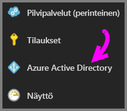
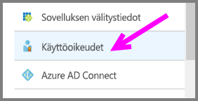
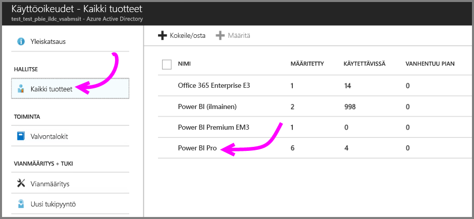
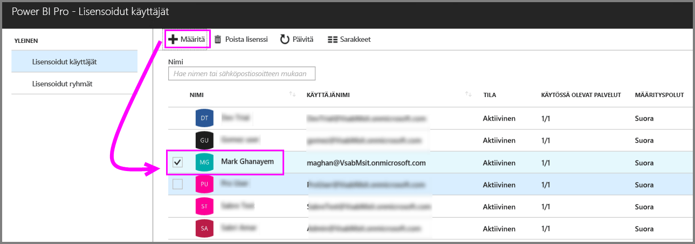
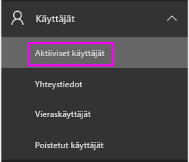
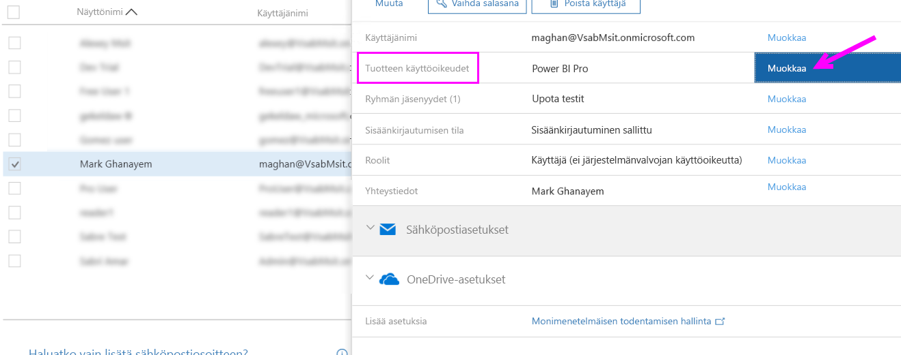
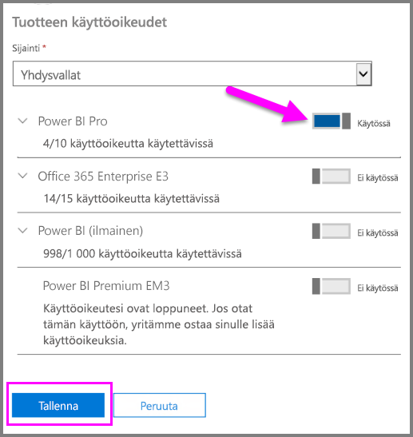
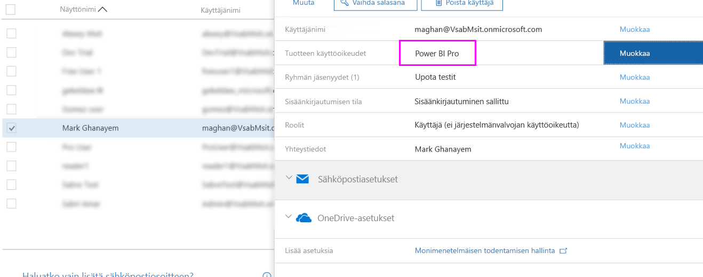

# Power BI Pro -käyttöoikeuksien määrittäminen

Järjestelmänvalvojat voivat määrittää Power BI Pro -käyttöoikeuksia käyttäjille useissa hallintaportaaleissa ja useilla PowerShellin cmdlet-komennoilla. Power BI -käyttöoikeuksien hallintaa tukee Azure Active Directory (Azure AD).

* Azure-tilauksen omistajat voivat käyttää Azure Active Directorya [Azure-portaalissa](https://ms.portal.azure.com/#@microsoft.onmicrosoft.com/dashboard/private/39bc3cf7-31a4-43f6-954c-f2d69ca2f0). 

* Yleiset järjestelmänvalvojat ja käyttäjätilien järjestelmänvalvojat voivat käyttää [Office 365 -hallintakeskusta](https://portal.office.com/AdminPortal/Home#/homepage).

## Power BI Pro -käyttöoikeuksien hallinta Azure-portaalissa

Power BI käyttää Azure AD:ta perustapalveluna. Azure AD tallentaa käyttäjätilit ja ryhmät sekä muut asetukset, esimerkiksi tiedot ostetuista tuotteista.

### Käyttöoikeuksien määrittäminen yksittäisille käyttäjätileille

Jos olet Azure-tilauksen omistaja, voit määrittää Pro-käyttöoikeuksia yksittäisille käyttäjätileille seuraavien ohjeiden mukaisesti:

1. Siirry [Azure-portaaliin](https://ms.portal.azure.com/#@microsoft.onmicrosoft.com/dashboard/private/39bc3cf7-31a4-43f6-954c-f2d69ca2f0). 

2. Valitse vasemmasta siirtymispalkista Azure Active Directory.

    

3. Valitse Azure Active Directoryn kohdasta Käyttöoikeudet.

    

4. Valitse Käyttöoikeudet-kohdassa Kaikki tuotteet > Power BI Pro. Näin näet luettelon kaikista käyttäjistä, joilla on käyttöoikeus.

    

5. Jos haluat määrittää Power BI Pro -käyttöoikeuden uudelle käyttäjätilille, valitse Määritä.

    

> [!NOTE]
> Vaikka voitkin hallita useimpia käyttöoikeusasioita Azure-portaalissa, siellä et kuitenkaan voi ostaa Power BI Pro -käyttöoikeuksia. Voit ostaa Power BI Pro -tilauksia Office 365:n hallintakeskuksessa. Saat lisätietoja ohjeartikkelista [Power BI Pron ostaminen](https://docs.microsoft.com/en-us/power-bi/service-admin-purchasing-power-bi-pro).
>

## Power BI Pro -käyttöoikeuksien hallinta Office 365:n hallintakeskuksessa

Jos olet yleinen järjestelmänvalvoja, Office 365:n hallintakeskuksessa voit ostaa Power BI Pro -tilauksen ja hallita organisaation liittyviä käyttöoikeuksia.

Jos olet Office 365 -järjestelmänvalvoja, voit määrittää Pro-käyttöoikeuksia yksittäisille käyttäjätileille seuraavien ohjeiden mukaisesti:

1. Siirry Office 365:n hallintakeskukseen.

2. Laajenna vasemman siirtymisruudun Käyttäjät-kohta ja napsauta Aktiiviset käyttäjät -kohtaa.

    

3. Valitse haluamasi käyttäjät ja napsauta sitten Muokkaa tuotteiden käyttöoikeuksia.

    

4. Vaihda Power BI Pro -kohdan asetukseksi Käytössä ja valitse sitten Tallenna.

    

5. Vahvista valittujen tilien Tila-kohdasta, että Power BI Pro -käyttöoikeuden määritys onnistui.

    

> [!NOTE]
> Jos tilauksesi käyttöoikeudet ovat loppuneet, voit lisätä niitä laajentamalla vasemman siirtymisruudun Laskutus-kohdan ja valitsemalla siitä Tilaukset. Valitse Tilaukset-sivulla Power BI Pro -tilaus ja napsauta sitten Lisää tai poista käyttöoikeuksia.
>

## Seuraavat vaiheet
[Power BI Pro organisaatiossasi](service-admin-power-bi-pro-in-your-organization.md)
 
[Laajennetun Pro-kokeiluversion aktivointi](service-extended-pro-trial.md)
 
[Yksittäisten käyttäjien Power BI -palvelusopimus](https://powerbi.microsoft.com/terms-of-service/)
 
[Power BI Premium -ilmoitus](https://aka.ms/pbipremium-announcement)
 
[Kirjautuneiden Power BI -käyttäjien etsiminen](service-admin-access-usage.md)

Onko sinulla muuta kysyttävää? [Voit esittää kysymyksiä Power BI -yhteisössä](https://community.powerbi.com/)