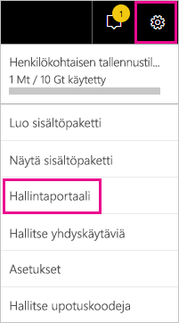
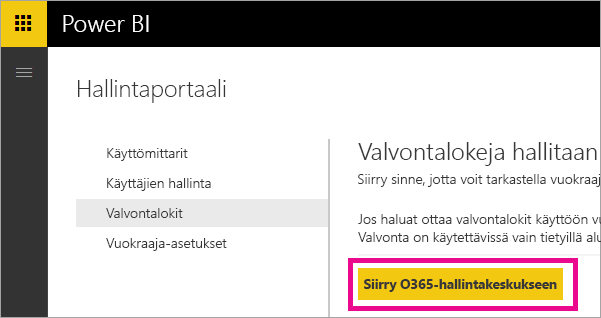
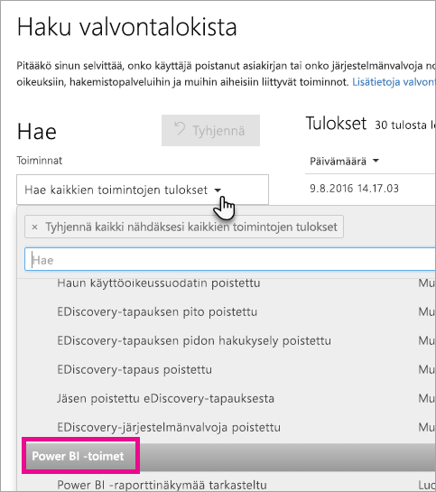
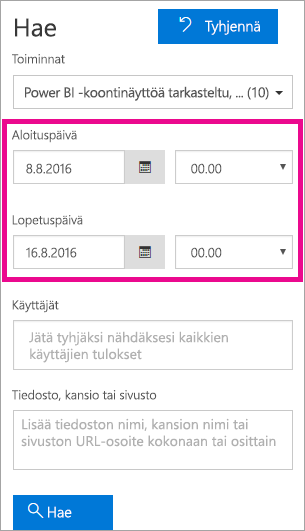
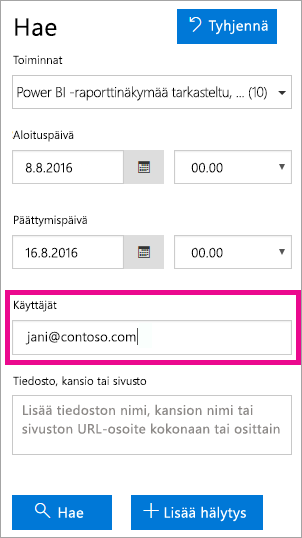
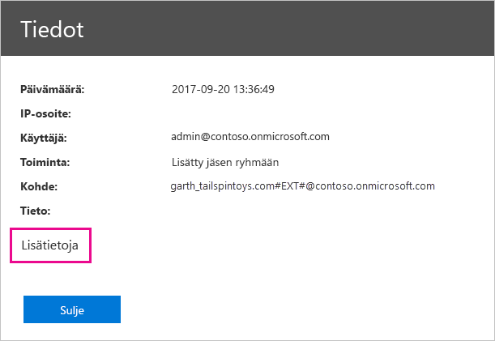
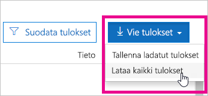

# <a name="using-auditing-within-your-organization"></a>Valvonnan käyttö organisaatiossa

Sen tietäminen, kuka tekee mitä toimia missäkin Power BI -vuokraajasi kohteissa, voi olla ratkaisevaa, kun autetaan organisaatiotasi toteuttamaan sille asetetut vaatimukset, kuten säädösten noudattaminen ja tietueiden hallinta. Voit Power BI -valvonnan avulla valvoa käyttäjien suorittamia toimia, kuten ”Näytä raportti” ja ”Näytä koontinäyttö”. Valvonnan avulla ei voi valvoa käyttöoikeuksia.

Voit käyttää valvonnassa Office 365:n tietoturva-ja yhteensopivuuskeskusta tai PowerShelliä. Valvonta käyttää Exchange Onlinen toimintoja, jotka valmistellaan automaattisesti tukemaan Power BI:tä.

Voit suodattaa valvontatiedot päivämääräalueen, käyttäjän, koontinäytön, raportin, tietojoukon ja toimintatyypin mukaan. Voit myös ladata toimet CSV-tiedostoon (tiedosto, jonka arvot on erotettu luetteloerottimella) offline-tilassa analysointia varten.

## <a name="requirements"></a>Vaatimukset

Seuraavat vaatimukset on täytettävä valvontalokien käyttämistä varten:

* Sinun on oltava yleinen järjestelmänvalvoja tai sinulla on oltava Exchange Onlinessa rooli, joka sallii valvontalokien käytön tai tarkastelun, jotta pääset näkemään valvontalokin. Oletusarvoisesti kyseiset roolit määritetään Yhteensopivuuden hallinta- ja Organisaation hallinta -rooliryhmille Exchangen hallintakeskuksen **Käyttöoikeudet**-sivulla.

    Jos haluat antaa valvontalokin käyttöoikeuden muulle kuin järjestelmänvalvojatilille, sinun on lisättävä kyseinen käyttäjä jompaankumpaan edellä mainituista rooliryhmistä. Vaihtoehtoisesti voit luoda Exchangen hallintakeskuksessa mukautetun rooliryhmän, jolle määrität valvontalokien käytön tai tarkastelun sallivan roolin ja johon sitten lisäät kyseisen tilin. Lisätietoja saat [Manage role groups in Exchange Online](/Exchange/permissions-exo/role-groups) (Rooliryhmien hallinta Exchange Onlinessa) -ohjeartikkelista.

    Jos et pääse Exchangen hallintakeskukseen Office 365 -hallintakeskuksesta, siirry osoitteeseen https://outlook.office365.com/ecp ja kirjaudu sisään tunnistetiedoillasi.

* Jos pääset valvontalokiin, mutta et ole yleinen järjestelmänvalvoja tai Power BI -palvelun järjestelmänvalvoja, et voi käyttää Power BI -hallintaportaalia. Tässä tapauksessa sinun on käytettävä suoraa linkkiä [Office 365:n tietoturva- ja yhteensopivuuskeskukseen](https://sip.protection.office.com/#/unifiedauditlog).

## <a name="accessing-your-audit-logs"></a>Valvontalokien käyttö

Jos haluat käyttää lokeja, varmista ensin, että sisäänkirjaus on käytössä Power BI:ssä. Jos haluat lisätietoja, katso artikkelia [Valvontalokit](service-admin-portal.md#audit-logs) hallintaportaalin dokumentaatiossa. Valvonnan käyttöönoton ja valvontatietojen tarkastelumahdollisuuden välillä voi olla jopa 48 tunnin viive. Jos et näe tietoja välittömästi, tarkista valvontalokit myöhemmin. Jos haet oikeuksia hallintalokien tarkasteluun, samanlainen viive voi esiintyä, ennen kuin oikeudet on myönnetty.

Power BI:n valvontalokit ovat saatavilla suoraan [Office 365:n tietoturva- ja yhteensopivuuskeskuksessa](https://sip.protection.office.com/#/unifiedauditlog). Täällä on myös linkki Power BI:n hallintaportaalista:

1. Valitse Power BI:ssä oikeasta yläkulmasta **hammasrataskuvake** ja valitse sitten **Hallintaportaali**.

   

1. Valitse **Valvontalokit**.

1. Valitse **Siirry O365-hallintakeskukseen**.

   

## <a name="search-only-power-bi-activities"></a>Vain Power BI -toimien haku

Voit rajata tulokset vain Power BI -toimiin seuraavasti. Katso toimien luettelo jäljempänä tässä artikkelissa olevasta kohdasta, jossa on [Power BI:n valvomien toimien luettelo](#list-of-activities-audited-by-power-bi).

1. Valitse **Haku valvontalokista** -sivun **Haku**-kohdasta avattava **Toimet**-luettelo.

2. Valitse **Power BI -toimet**.

   

3. Napsauta mistä tahansa valintaruudun ulkopuolelta sulkeaksesi sen.

Hakusi suodatetaan nyt vain Power BI -toimiin.

## <a name="search-the-audit-logs-by-date"></a>Haku valvontalokeista päivämäärän mukaan

Voit hakea lokeista päivämääräalueen mukaan käyttämällä **Aloituspäivämäärä**- ja **Lopetuspäivämäärä**-kenttiä. Oletusarvoisesti valittuna on seitsemän viime päivää. Päivämäärä ja aika näytetään muodossa koordinoitu yleisaika (UTC). Suurin päivämääräalue, jonka voit määrittää, on 90 päivää. 

Näkyviin tulee virhe, jos valittu päivämääräalue on yli 90 päivää. Jos käytät 90 päivän suurinta mahdollista päivämääräaluetta, valitse **aloituspäivämääräksi** tämänhetkinen aika. Muutoin näkyviin tulee virhe, jossa ilmoitetaan alkamispäivämäärän olevan päättymispäivämäärää aiemmin. Jos olet ottanut valvonnan käyttöön viimeisen 90 päivän aikana, suurin mahdollinen päivämääräalue ei voi alkaa ennen päivämäärää, jolloin valvonta otettiin käyttöön.



## <a name="search-the-audit-logs-by-users"></a>Haku valvontalokeista käyttäjien mukaan

Voit hakea valvontalokimerkinnöistä tiettyjen käyttäjien suorittamia toimia. Voit tehdä tämän syöttämällä yhden tai useamman käyttäjänimen **Käyttäjät**-kenttään. Käyttäjänimi näyttää sähköpostiosoitteelta; se on tili, jolla käyttäjät kirjautuvat sisään Power BI:hin. Jätä tämä ruutu tyhjäksi, jos haluat tulokseksi merkintöjä organisaatiosi kaikkien käyttäjien (ja palvelutilien) osalta.



## <a name="view-search-results"></a>Näytä hakutulokset

Kun olet valinnut **Hae**, hakutulokset ladataan, ja hetken kuluttua ne näytetään **Tulokset**-kohdassa. Kun haku on valmis, löytyneiden tulosten määrä tulee näkyviin. Näyttöön tulee enintään 1 000 tapahtumaa; jos hakuehtojen mukaisia tapahtumia on yli 1 000, näytetään uusimmat 1 000 tapahtumaa.

### <a name="view-the-main-results"></a>Näytä tärkeimmät tulokset

**Tulokset**-alue sisältää seuraavat tiedot kullekin haun palauttamalle tapahtumalle. Voit lajitella tulokset valitsemalla sarakkeen otsikon **Tulokset**-kohdasta.

| **Sarake** | **Määritelmä** |
| --- | --- |
| Päivämäärä |Päivämäärä ja aika (UTC-muodossa), jolloin tapahtuma ilmeni. |
| IP-osoite |Sen laitteen IP-osoite, jota käytettiin toimen kirjaamisen aikana. IP-osoite näkyy joko IPv4- tai IPv6-osoitemuodossa. |
| Käyttäjä |Käyttäjä (tai palvelutili), joka suoritti tapahtuman aiheuttaneen toimen. |
| Toimi |Käyttäjän suorittama toimi. Tämä arvo vastaa toimia, jotka olet valinnut avattavassa **Toimet**-luettelossa. Exchange-järjestelmänvalvojan valvontalokin tapahtuman osalta tämän sarakkeen arvo on Exchange cmdlet-komento. |
| Kohde |Objekti, joka luotiin tai jota muokattiin vastaavan toimen seurauksena. Esimerkiksi tiedosto, jota tarkasteltiin tai muokattiin, tai käyttäjätili, jota päivitettiin. Kaikilla toimilla ei ole arvoa tässä sarakkeessa. |
| Tieto |Lisätieto toimesta. Tässäkään kaikilla toimilla ei ole arvoa. |

### <a name="view-the-details-for-an-event"></a>Tapahtuman tietojen tarkasteleminen

Voit nähdä tapahtumasta lisätietoja napsauttamalla tapahtuman tietuetta hakutulosluettelosta. Näkyviin tulee **Tiedot**-sivu, johon sisältyvät yksityiskohtaiset ominaisuudet tapahtuman tietueesta. Näytettävät ominaisuudet riippuvat siitä, missä Office 365 -palvelussa tapahtuma ilmenee. 

Saat näkyviin nämä tiedot valitsemalla **Lisätiedot**. Kaikkien Power BI -syötteiden RecordType-ominaisuuden arvo on 20. Katso lisätietoja muista ominaisuuksista artikkelista [Yksityiskohtaiset ominaisuudet valvontalokissa](/office365/securitycompliance/detailed-properties-in-the-office-365-audit-log/).

   

## <a name="export-search-results"></a>Hakutulosten vieminen

Voit viedä Power BI -valvontalokin CSV-tiedostoon seuraavasti.

1. Valitse **Vie tulokset**.

1. Valitse joko **Tallenna ladatut tulokset** tai **Lataa kaikki tulokset**.

    

## <a name="use-powershell-to-search-audit-logs"></a>Valvontalokien hakeminen PowerShellin avulla

Voit myös käyttää valvontalokeja PowerShellin avulla sisäänkirjautumisesi perusteella. Seuraavassa esimerkissä näytetään, miten voit muodostaa yhteyden Exchange Online PowerShelliin ja hakea sitten Power BI -valvontalokisyötteet [Search-UnifiedAuditLog](/powershell/module/exchange/policy-and-compliance-audit/search-unifiedauditlog?view=exchange-ps/)-komennolla. Jotta voit suorittaa komentosarjan, sinulla on oltava [Vaatimukset](#requirements)-osiossa kuvatut oikeudet.

```powershell
Set-ExecutionPolicy RemoteSigned

$UserCredential = Get-Credential

$Session = New-PSSession -ConfigurationName Microsoft.Exchange -ConnectionUri https://outlook.office365.com/powershell-liveid/ -Credential $UserCredential -Authentication Basic -AllowRedirection

Import-PSSession $Session
Search-UnifiedAuditLog -StartDate 9/11/2018 -EndDate 9/15/2018 -RecordType PowerBI -ResultSize 1000 | Format-Table | More
```

Lisätietoja Exchange Onlineen yhdistämisestä on kohdassa [Yhdistäminen kohteeseen Exchange Online PowerShell](/powershell/exchange/exchange-online/connect-to-exchange-online-powershell/connect-to-exchange-online-powershell/). Katso toinen esimerkki PowerShellin käyttämisestä valvontalokien avulla artikkelista [Power BI -valvontalokin ja PowerShellin käyttäminen Power BI Pro -käyttöoikeuksien määrittämiseksi](https://powerbi.microsoft.com/blog/using-power-bi-audit-log-and-powershell-to-assign-power-bi-pro-licenses/).

## <a name="activities-audited-by-power-bi"></a>Power BI:n valvomat toimet

Power BI valvoo seuraavia toimia.

| Kutsumanimi                                     | Toiminnon nimi                              | Huomautukset                                  |
|---------------------------------------------------|---------------------------------------------|------------------------------------------|
| Lisätty tietolähde Power BI -yhdyskäytävään             | AddDatasourceToGateway                      |                                          |
| Lisätty Power BI -kansion käyttöoikeus                      | AddFolderAccess                             | Ei tällä hetkellä käytössä                       |
| Lisätty Power BI -ryhmän jäsenet                      | AddGroupMembers                             |                                          |
| Järjestelmänvalvoja liitti tietovuon tallennustilin vuokraajaan | AdminAttachedDataflowStorageAccountToTenant | Ei tällä hetkellä käytössä                       |
| Analysoitu Power BI -tietojoukko                         | AnalyzedByExternalApplication               |                                          |
| Analysoitu Power BI -raportti                          | AnalyzeInExcel                              |                                          |
| Sidottu Power BI -tietojoukko yhdyskäytävään                | BindToGateway                               |                                          |
| Muutettu kapasiteetin tila                            | ChangeCapacityState                         |                                          |
| Muutettu kapasiteetin käyttäjän määritys                  | UpdateCapacityUsersAssignment               |                                          |
| Muutetut Power BI -tietojoukon yhteydet              | SetAllConnections                           |                                          |
| Muutettu Power BI -yhdyskäytävän järjestelmänvalvojia                   | ChangeGatewayAdministrators                 |                                          |
| Muutettu Power BI -yhdyskäytävän tietolähteen käyttäjiä        | ChangeGatewayDatasourceUsers                |                                          |
| Luotu organisaation Power BI -sisältöpaketti      | CreateOrgApp                                |                                          |
| Luotu Power BI -sovellus                              | CreateApp                                   |                                          |
| Luotu Power BI -koontinäyttö                        | CreateDashboard                             |                                          |
| Luotu Power BI -tietovuo                         | CreateDataflow                              |                                          |
| Luotu Power BI -tietojoukko                          | CreateDataset                               |                                          |
| Luotu Power BI -sähköpostiviestien tilaus               | CreateEmailSubscription                     |                                          |
| Luotu Power BI -kansio                           | CreateFolder                                |                                          |
| Luotu Power BI -yhdyskäytävä                          | CreateGateway                               |                                          |
| Luotu Power BI -ryhmä                            | CreateGroup                                 |                                          |
| Luotu Power BI -raportti                           | CreateReport                                |                                          |
| Tietovuo siirretty ulkoiselle tallennustilille     | DataflowMigratedToExternalStorageAccount    | Ei tällä hetkellä käytössä                       |
| Lisätty tietovuon käyttöoikeudet                        | DataflowPermissionsAdded                    | Ei tällä hetkellä käytössä                       |
| Poistettu tietovuon käyttöoikeudet                      | DataflowPermissionsRemoved                  | Ei tällä hetkellä käytössä                       |
| Poistettu organisaation Power BI -sisältöpaketti      | DeleteOrgApp                                |                                          |
| Poistettu Power BI -kommentti                          | DeleteComment                               |                                          |
| Poistettu Power BI -koontinäyttö                        | DeleteDashboard                             | Ei tällä hetkellä käytössä                       |
| Poistettu Power BI -tietovuo                         | DeleteDataflow                              | Ei tällä hetkellä käytössä                       |
| Poistettu Power BI -tietojoukko                          | DeleteDataset                               |                                          |
| Poistettu Power BI -sähköpostiviestien tilaus               | DeleteEmailSubscription                     |                                          |
| Poistettu Power BI -kansio                           | DeleteFolder                                |                                          |
| Poistettu Power BI -kansion käyttöoikeus                    | DeleteFolderAccess                          | Ei tällä hetkellä käytössä                       |
| Poistettu Power BI -yhdyskäytävä                          | DeleteGateway                               |                                          |
| Poistettu Power BI -ryhmä                            | DeleteGroup                                 |                                          |
| Poistettu Power BI -raportti                           | DeleteReport                                |                                          |
| Löydetty Power BI -tietojoukon tietolähteet          | GetDatasources                              |                                          |
| Ladattu Power BI -raportti                        | DownloadReport                              |                                          |
| Muokattu Power BI -varmenteiden käyttöoikeutta          | EditCertificationPermission                 | Ei tällä hetkellä käytössä                       |
| Muokattu Power BI -koontinäyttöä                         | EditDashboard                               | Ei tällä hetkellä käytössä                       |
| Muokattu Power BI -tietojoukkoa                           | EditDataset                                 |                                          |
| Muokattu Power BI -tietojoukon ominaisuuksia                | EditDatasetProperties                       | Ei tällä hetkellä käytössä                       |
| Muokattu Power BI -raporttia                            | EditReport                                  |                                          |
| Viety Power BI -tietovuo                        | ExportDataflow                              |                                          |
| Viety Power BI -raportin visualisointitiedot              | ExportReport                                |                                          |
| Viety Power BI -ruudun tiedot                       | ExportTile                                  |                                          |
| Tietovuon käyttöoikeuksien lisääminen epäonnistui                | FailedToAddDataflowPermissions              | Ei tällä hetkellä käytössä                       |
| Tietovuon käyttöoikeuksien poistaminen epäonnistui             | FailedToRemoveDataflowPermissions           | Ei tällä hetkellä käytössä                       |
| Luotu Power BI -tietovuon SAS-tunnus             | GenerateDataflowSasToken                    |                                          |
| Luotu Power BI -upotustunnus                    | GenerateEmbedToken                          |                                          |
| Tuotu tiedosto Power BI:hin                         | Tuo                                      |                                          |
| Asennettu Power BI -sovellus                            | InstallApp                                  |                                          |
| Siirretty työtila kapasiteettiin                  | MigrateWorkspaceIntoCapacity                |                                          |
| Kirjoitettu Power BI -kommentti                           | PostComment                                 |                                          |
| Tulostettu Power BI -koontinäyttö                        | PrintDashboard                              |                                          |
| Tulostettu Power BI -raporttisivu                      | PrintReport                                 |                                          |
| Julkaistu Power BI -raportti verkkoon                  | PublishToWebReport                          |                                          |
| Vastaanotettu salainen Power BI -tietovuo Key Vaultista  | ReceiveDataflowSecretFromKeyVault           | Ei tällä hetkellä käytössä                       |
| Poistettu tietolähde Power BI -yhdyskäytävästä         | RemoveDatasourceFromGateway                 |                                          |
| Poistettu Power BI -ryhmän jäsenet                    | DeleteGroupMembers                          |                                          |
| Poistettu työtila kapasiteetista                 | RemoveWorkspacesFromCapacity                |                                          |
| Nimetty uudelleen Power BI -koontinäyttö                        | RenameDashboard                             |                                          |
| Pyydetty Power BI -tietovuon päivitystä               | RequestDataflowRefresh                      | Ei tällä hetkellä käytössä                       |
| Pyydetty Power BI -tietojoukon päivitystä                | RefreshDataset                              |                                          |
| Noudettu Power BI -työtilat                     | GetWorkspaces                               |                                          |
| Määritetty ajoitettu päivitys Power BI -tietovuolle        | SetScheduledRefreshOnDataflow               |                                          |
| Määritetty ajoitettu päivitys Power BI -tietojoukolle         | SetScheduledRefresh                         |                                          |
| Jaettu Power BI -koontinäyttö                         | ShareDashboard                              |                                          |
| Jaettu Power BI -raportti                            | ShareReport                                 |                                          |
| Power BI:n pidennetty kokeilujakso aloitettu                   | OptInForExtendedProTrial                    | Ei tällä hetkellä käytössä                       |
| Aloitettu Power BI -kokeilujakso                            | OptInForProTrial                            |                                          |
| Ota haltuun Power BI -tietolähde                   | TakeOverDatasource                          |                                          |
| Ota haltuun Power BI -tietojoukko                        | TakeOverDataset                             |                                          |
| Julkaisematon Power BI -sovellus                          | UnpublishApp                                |                                          |
| Päivitä kapasiteetin resurssin hallinnan asetukset      | UpdateCapacityResourceGovernanceSettings    | Ei tällä hetkellä käytössä Office 365 -hallintaportaalissa |
| Päivitetty kapasiteetin järjestelmänvalvoja                            | UpdateCapacityAdmins                        |                                          |
| Päivitetty kapasiteetin näyttönimi                     | UpdateCapacityDisplayName                   |                                          |
| Päivitetyt organisaation Power BI -asetukset          | UpdatedAdminFeatureSwitch                   |                                          |
| Päivitetty Power BI -sovellus                              | UpdateApp                                   |                                          |
| Päivitetty Power BI -tietovuo                         | UpdateDataflow                              |                                          |
| Päivitetyt Power BI -tietojoukon tietolähteet             | UpdateDatasources                           |                                          |
| Päivitetyt Power BI -tietojoukon parametrit               | UpdateDatasetParameters                     |                                          |
| Päivitetty Power BI -sähköpostiviestien tilaus               | UpdateEmailSubscription                     |                                          |
| Päivitetty Power BI -kansio                           | UpdateFolder                                |                                          |
| Päivitetty Power BI -kansion käyttöoikeus                    | UpdateFolderAccess                          |                                          |
| Päivitetyt Power BI -yhdyskäytävän tietolähteen tunnukset  | UpdateDatasourceCredentials                 |                                          |
| Tarkasteltu Power BI -koontinäyttö                         | ViewDashboard                               |                                          |
| Tarkasteltu Power BI -tietovuo                          | ViewDataflow                                |                                          |
| Tarkasteltu Power BI -raportti                            | ViewReport                                  |                                          |
| Tarkasteltu Power BI -ruutu                              | ViewTile                                    |                                          |
| Tarkastellut Power BI -käyttötiedot                     | ViewUsageMetrics                            |                                          |
|                                                   |                                             |                                          |

## <a name="next-steps"></a>Seuraavat vaiheet

[Mitä on Power BI:n hallinta?](service-admin-administering-power-bi-in-your-organization.md)  

[Power BI -hallintaportaali](service-admin-portal.md)  

Onko sinulla kysyttävää? [Voit esittää kysymyksiä Power BI -yhteisössä](http://community.powerbi.com/)
