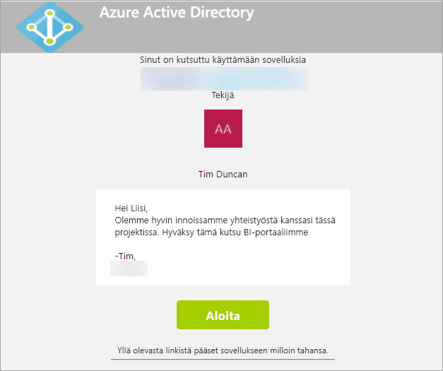
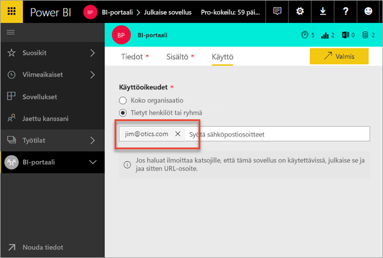
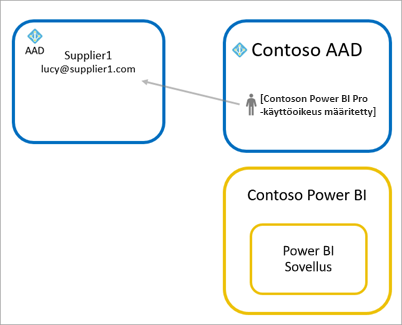
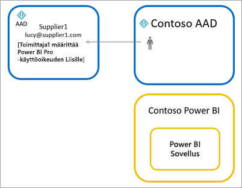
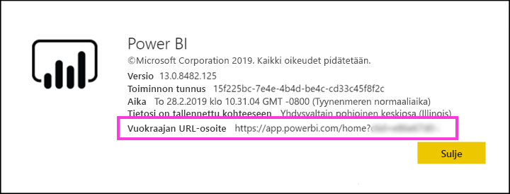

# Power BI -sisällön jakaminen ulkoisille vieraskäyttäjille Azure AD B2B:n avulla

Power BI on integroitu Azure Active Directory Business-to-Businessiin (Azure AD B2B), jotta Power BI -sisältöä voidaan jakaa turvallisesti organisaation ulkopuolisille vieraskäyttäjille säilyttäen samalla sisäisten tietojen hallinta.  

Lisäksi voit myös sallia organisaation ulkopuolisten vieraskäyttäjien muokata ja hallita organisaatiosi sisäistä sisältöä.

## Käytön salliminen

Varmista, että [Jaa sisältöä ulkoisten käyttäjien kanssa](service-admin-portal.md#export-and-sharing-settings) -ominaisuus on käytössä Power BI -hallintaportaalissa, ennen kuin kutsut vieraskäyttäjiä.

Voit käyttää myös [Salli ulkoisten vieraskäyttäjien muokata ja hallita sisältöä organisaatiossa](service-admin-portal.md#allow-external-guest-users-to-edit-and-manage-content-in-the-organization) -toimintoa. Sen avulla voit valita vieraskäyttäjän, joka voi tarkastella ja luoda sisältöä työtiloissa, esimerkiksi selata organisaatiosi Power BI:tä.

## Kenet voi kutsua?

Voit kutsua vieraskäyttäjiä millä tahansa sähköpostiosoitteella, myös henkilökohtaisilla tileillä, kuten gmail.com, outlook.com tai hotmail.com. Azure AD B2B:ssä näitä osoitteita kutsutaan *sosiaalisiksi käyttäjätiedoiksi*.

## Vieraskäyttäjien kutsuminen

Vieraskäyttäjät tarvitsevat kutsun vain, kun kutsut heidät organisaatioosi ensimmäisen kerran. Voit kutsua käyttäjiä kahdella tavalla: suunnitelluilla kutsuilla ja ad hoc -kutsuilla.

### Suunnitellut kutsut

Käytä suunniteltua kutsua, jos tiedät, keitä haluat kutsua. Voit lähettää kutsun Azure-portaalin tai PowerShellin avulla. Sinun on oltava vuokraajan järjestelmänvalvoja, jotta voit kutsua ihmisiä.

Näitä ohjeita noudattamalla voit lähettää kutsuja Azure-portaalissa.

1. Valitse [Azure-portaalissa](https://portal.azure.com) **Azure Active Directory**.

1. Valitse **Hallinta**-kohdassa **Käyttäjät** > **Kaikki käyttäjät** > **Uusi vieraskäyttäjä**.

    

1. Kirjoita **sähköpostiosoite** ja **henkilökohtainen viesti**.

    

1. Valitse **Kutsu**.

Kutsuaksesi enemmän kuin yhden vieraskäyttäjän, käytä PowerShelliä. Lisätietoja on artikkelissa [Azure Active Directory B2B yhteistyökoodi and PowerShell-mallit](/azure/active-directory/b2b/code-samples/).

Vieraskäyttäjien tulee valita saapuneesta sähköpostikutsusta kohta **Aloita**. Vieraskäyttäjä lisätään tämän jälkeen vuokraajaan.

### Ad hoc -kutsut

Lähettääksesi ulkoiselle käyttäjälle kutsun milloin tahansa, lisää hänet koontinäyttöösi tai raporttiisi jaetun käyttöliittymän kautta tai sovelluksen käyttöoikeussivulta. Seuraavassa esimerkki siitä, miten vieraskäyttäjän kutsuminen toimii sovelluksen kautta.

Vieraskäyttäjä saa sähköpostin, josta ilmenee että olet jakanut sovelluksen hänen kanssaan.

Vieraskäyttäjän tulee kirjautua sisään organisaatiossaan käyttämällä sähköpostiosoitteella. Sisäänkirjautumisen jälkeen he saavat kehotuksen hyväksyä kutsu. Sisäänkirjautumisen jälkeen sovellus aukeaa vieraskäyttäjälle. Jotta käyttäjä voi palata sovellukseen, hän voi lisätä linkin kirjanmerkkeihin tai tallentaa sähköpostin.

## Käyttöoikeudet

Vieraskäyttäjällä on oltava tarvittavat käyttöoikeudet, jotta hän voi tarkastella jakamaasi sisältöä. On kolme tapaa varmistaa, että käyttäjällä on tarvittava käyttöoikeus: Power BI Premiumin käyttäminen, Power BI Pro -käyttöoikeuden määrittäminen tai vieraan Power BI Pro -käyttöoikeuden käyttäminen.

Kun käytät [Salli ulkoisten vieraskäyttäjien muokata ja hallita sisältöä organisaatiossa](service-admin-portal.md#allow-external-guest-users-to-edit-and-manage-content-in-the-organization) -ominaisuutta, vieraskäyttäjät tarvitsevat Power BI Pro -käyttöoikeudet lisätäkseen sisältöä työtiloihin tai jakaakseen sisältöä toisille käyttäjille.

### Power BI Premiumia käyttämällä

Sovelluksen työtilan määrittäminen [Power BI Premium -kapasiteettiin](service-premium-what-is.md) sallii vieraskäyttäjän käyttää sovellusta ilman Power BI Pro -käyttöoikeutta. Power BI Premium sallii sovellusten myös hyödyntää muita toimintoja, kuten parannettua päivitystaajuutta, varattua kapasiteettia sekä suuria malleja.

### Määritä Power BI Pro -käyttöoikeus vieraskäyttäjälle

Power BI Pro -käyttöoikeuden määrittäminen vuokraajan vieraskäyttäjälle sallii kyseisen vieraskäyttäjän tarkastella sisältöä.

### Vieraskäyttäjä tuo oman Power BI Pro-käyttöoikeutensa

Vieraskäyttäjällä on jo vuokraajan Power BI Pro -käyttöoikeus.

## Vieraskäyttäjät, jotka voivat muokata ja hallita sisältöä 

Kun käytät [Salli ulkoisten vieraskäyttäjien muokata ja hallita sisältöä organisaatiossa](service-admin-portal.md#allow-external-guest-users-to-edit-and-manage-content-in-the-organization) -ominaisuutta, erikseen määritetyt vieraskäyttäjät saavat käyttää organisaatiosi Power BI:tä. He voivat nähdä kaiken heille sallitun sisällön. He voivat käyttää aloitussivua, selata työtiloja, asentaa sovelluksia, nähdä nimensä käyttöoikeusluettelossa, ja lisätä sisältöä työtiloihin. He voivat luoda ja hallinnoida järjestelmänvalvojina uutta käyttökokemusta käyttäviä työtiloja. Käyttöön liittyy joitakin rajoituksia. Rajoitukset mainitaan Huomioitavat asiat ja rajoitukset -luettelossa.
 
Auta näitä käyttäjiä kirjautumaan Power BI:hin antamalla heille vuokraajan URL-osoite. Etsi vuokraajan URL-osoite seuraavien vaiheiden mukaisesti.

1. Valitse Power BI -palvelun yläreunan valikosta ohje (**?**) ja sitten **Tietoja Power BI:stä**.

2. Katso arvo kohdan **Vuokraajan URL-osoite** vierestä. Arvo on vuokraajan URL-osoite, jonka voit jakaa vieraskäyttäjille.

    

## Huomioitavat asiat ja rajoitukset

* Ulkoisten Azure AD B2B -vieraiden pääsy on lähtökohtaisesti rajattu pelkkään kuluttajasisältöön. Ulkoiset Azure AD B2B -vieraat voivat tarkastella sovelluksia, koontinäyttöjä ja raportteja, viedä tietoja ja luoda sähköpostitilauksia koontinäytöille ja raporteille. He eivät pääse käsiksi työtilaan tai pysty julkaisemaan omaa sisältöään. Nämä rajoitukset eivät kuitenkaan koske niitä vieraskäyttäjiä, joiden käyttöoikeus perustuu ominaisuuteen [Salli ulkoisten vieraskäyttäjien muokata ja hallita sisältöä organisaatiossa](service-admin-portal.md#allow-external-guest-users-to-edit-and-manage-content-in-the-organization).

* Eräät käyttökokemukset eivät ole niiden käyttäjien saatavilla, joiden käyttöoikeus perustuu ominaisuuteen [Salli ulkoisten vieraskäyttäjien muokata ja hallita sisältöä organisaatiossa](service-admin-portal.md#allow-external-guest-users-to-edit-and-manage-content-in-the-organization). Jos he haluavat päivittää tai julkaista raportteja, heidän tulee käyttää Power BI -palvelun verkkokäyttöliittymää, mm. Nouda tiedot, Power Bi Desktop -tiedostojen lataamiseksi verkkoon.  Seuraavia käyttökokemuksia ei tueta:
    * Suorajulkaisu Power BI Desktopista Power BI -palveluun
    * Vieraskäyttäjät eivät voi käyttää Power BI Desktopia yhteyden muodostamiseksi Power BI -palvelussa sijaitseviin palvelutietojoukkoihin
    * Office 365 -ryhmiin sidotut perinteiset työtilat:
        * Vieraskäyttäjät eivät voi luoda tällaisia työtiloja eivätkä hallita niitä järjestelmänvalvojina.
        * Vieraskäyttäjät voivat olla jäseniä.
    * Ad hoc -kutsujen lähettämistä ei tueta työtilojen käyttöoikeusluetteloilla.
    * Power BI Publisher for Exceliä ei tueta vieraskäyttäjillä.
    * Vieraskäyttäjät eivät voi asentaa Power BI Gatewaytä ja yhdistää sitä organisaatioosi.
    * Vieraskäyttäjät eivät voi asentaa sovelluksia julkaistaviksi koko organisaatiolle.
    * Vieraskäyttäjät eivät voi käyttää, luoda, päivittää eivätkä asentaa organisaation sisältöpaketteja.
    * Vieraskäyttäjät eivät voi käyttää Analysoi Excelissä -toimintoa.
    * Vieraskäyttäjiä ei voi mainita (@mentioned) kommentoitaessa.
    * Vieraskäyttäjät eivät voi käyttää paketteja.
    * Vieraskäyttäjillä, jotka käyttävät tätä ominaisuutta, on oltava työpaikan tai oppilaitoksen tili. Vieraskäyttäjät, jotka käyttävät henkilökohtaista tiliä, kokevat enemmän rajoituksia kirjautumisrajoitusten vuoksi.

* Tämä ominaisuus ei ole tällä hetkellä käytettävissä Power BI:n SharePoint Online -raportin verkko-osiossa.

* Eräät Active Directory -asetukset voivat rajoittaa ulkoisten vieraskäyttäjien toimintamahdollisuuksia yleisen organisaatiosi sisällä. Tämä koskee myös Power BI -ympäristösi. Seuraava dokumentaatio käsittelee asetuksia:
    * [Ulkoisen yhteistyön asetusten hallinta](/azure/active-directory/b2b/delegate-invitations#configure-b2b-external-collaboration-settings)
    * [Salli tai estä tiettyjen organisaatioiden kutsut B2B-käyttäjille](https://docs.microsoft.com/azure/active-directory/b2b/allow-deny-list)  

## Seuraavat vaiheet

Tarkempia tietoja muun muassa siitä, miten rivitason suojaus toimii, löytyy teknisestä raportista: [Power BI -sisällön jakaminen ulkoisille vieraskäyttäjille Azure AD B2B:n avulla](https://aka.ms/powerbi-b2b-whitepaper).

Lisätietoja Azure AD B2B:stä on artikkelissa [Mitä tarkoittaa Azure AD B2B -yhteistyö?](/azure/active-directory/active-directory-b2b-what-is-azure-ad-b2b/).
