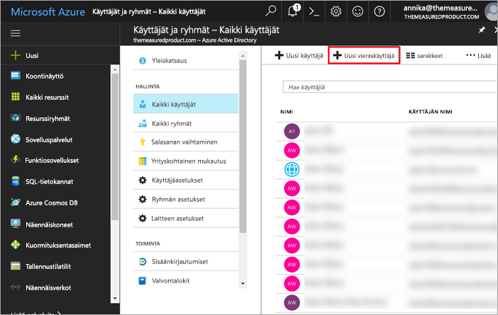
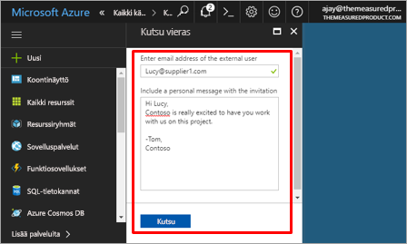
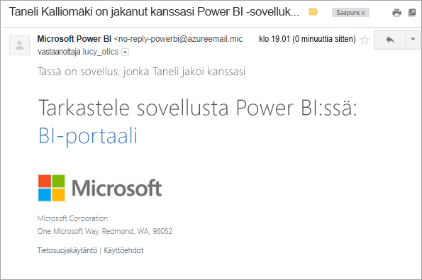
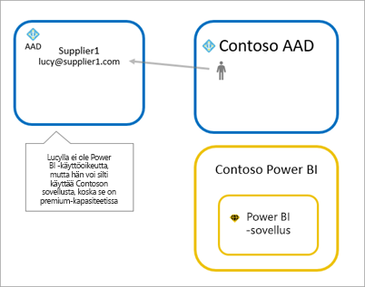
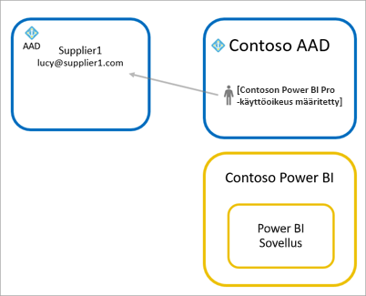

# Power BI -sisällön jakaminen ulkoisille vieraskäyttäjille Azure AD B2B:n avulla

Power BI on integroitu Azure Active Directory Business-to-Businessiin (Azure AD B2B), jotta Power BI -sisältöä voidaan jakaa turvallisesti organisaation ulkopuolisille vieraskäyttäjille säilyttäen samalla sisäisten tietojen hallinta.

## Käytön salliminen

Varmista, että [Vienti- ja jakamisasetukset](service-admin-portal.md#export-and-sharing-settings) -ominaisuus on käytössä Power BI -hallintaportaalissa ennen vieraskäyttäjien kutsumista.

## Kenet voi kutsua?

Voit kutsua vieraskäyttäjiä millä tahansa sähköpostiosoitteella, myös henkilökohtaisilla tileillä, kuten gmail.com, outlook.com tai hotmail.com. Azure AD B2B:ssä näitä osoitteita kutsutaan *sosiaalisiksi käyttäjätiedoiksi*.

## Vieraskäyttäjien kutsuminen

Kutsuja edellytetään vain kun ulkoinen vieraskäyttäjä kutsutaan organisaatioon ensimmäisen kerran. Voit kutsua käyttäjiä kahdella tavalla: suunnitelluilla kutsuilla ja ad-hoc-kutsuilla.

### Suunnitellut kutsut

Käytä suunniteltua kutsua, jos tiedät, keitä haluat kutsua. Voit lähettää kutsun Azure-portaalin tai PowerShellin avulla. Sinun on oltava vuokraajan järjestelmänvalvoja, jotta voit kutsua ihmisiä.

Näitä ohjeita noudattamalla voit lähettää kutsuja Azure-portaalissa.

1. Valitse [Azure-portaalissa](https://portal.azure.com) **Azure Active Directory**.

1. Valitse **Hallinta**, siirry kohtaan **Käyttäjät** > **Kaikki käyttäjät** > **Uusi vieraskäyttäjä**.

    

1. Kirjoita **sähköpostiosoite** ja **henkilökohtainen viesti**.

    

1. Valitse **Kutsu**.

Kutsuaksesi enemmän kuin yhden vieraskäyttäjän, käytä PowerShelliä. Lisätietoja on artikkelissa [Azure Active Directory B2B yhteistyökoodi and PowerShell-mallit](/azure/active-directory/b2b/code-samples/).

Vieraskäyttäjien tulee valita saapuneesta sähköpostikutsusta kohta **Aloita**. Vieraskäyttäjä lisätään tämän jälkeen vuokraajaan.

### Ad-hoc -kutsu

Lähettääksesi kutsun milloin tahansa, lisää ulkoinen käyttäjä koontinäyttöösi tai raporttiisi jaetun käyttöliittymän kautta, tai sovelluksen käyttöoikeussivulta. Seuraavassa esimerkki siitä, miten vieraskäyttäjän kutsuminen toimii sovelluksen kautta.

Vieraskäyttäjä saa sähköpostin, jossa ilmoitetaan, että sovellus on jaettu hänen kanssaan.

Vieraskäyttäjän tulee kirjautua sisään organisaatiossaan käyttämällä sähköpostiosoitteella. Sisäänkirjautumisen jälkeen heitä pyydetään hyväksymään kutsu. Sisäänkirjautumisen jälkeen vieraskäyttäjä ohjataan sovelluksen sisällön luo. Jotta käyttäjä voi palata sovellukseen, hän voi lisätä linkin kirjanmerkkeihin tai tallentaa sähköpostin.

## Käyttöoikeudet

Vieraskäyttäjällä on oltava tarvittavat käyttöoikeudet, jotta hän voi tarkastella jaettua sovellusta. Tähän on olemassa kolme vaihtoehtoa: Power BI Premiumin käyttäminen, Power BI Pro -käyttöoikeuden määrittäminen tai vieraan Power BI Pro -käyttöoikeuden käyttäminen.

### Power BI Premiumia käyttämällä

Sovelluksen työtilan määrittäminen [Power BI Premium -kapasiteettiin](service-premium.md) sallii vieraskäyttäjän käyttää sovellusta ilman Power BI Pro -käyttöoikeutta. Power BI Premium sallii sovellusten myös hyödyntää muita toimintoja, kuten parannettua päivitystaajuutta, varattua kapasiteettia sekä suuria malleja.

### Määritä Power BI Pro -käyttöoikeus vieraskäyttäjälle

Power BI Pro -käyttöoikeuden määrittäminen vuokraajan vieraskäyttäjälle sallii kyseisen vieraskäyttäjän tarkastella sisältöä.

### Vieraskäyttäjä tuo oman Power BI Pro-käyttöoikeutensa

Vieraskäyttäjällä on jo vuokraajan Power BI Pro -käyttöoikeus.

## Huomioitavat asiat ja rajoitukset

* Ulkoisten B2B-vieraiden pääsy on rajattu pelkkään kuluttajasisältöön. Ulkoiset B2B-vieraat voivat tarkastella sovelluksia, koontinäyttöjä ja raportteja, viedä tietoja ja luoda sähköpostitilauksia koontinäytöille ja raporteille. He eivät pääse käsiksi työtilaan tai pysty julkaisemaan omaa sisältöään.

* Tämä ominaisuus ei ole tällä hetkellä käytettävissä Power BI -mobiilisovelluksissa. Jaettua Power BI -sisältöä voi tarkastella mobiililaitteella käyttämällä Azure AD B2B:ta selaimessa.

* Tämä ominaisuus ei ole tällä hetkellä käytettävissä Power BI:n SharePoint Online -raportin verkko-osiossa.

## Seuraavat vaiheet

Tarkempia tietoja, myös rivitason suojauksen toiminnasta, on teknisessä raportissa [Power BI -sisällön jakaminen ulkoisille vieraskäyttäjille Azure AD B2B:n avulla](https://aka.ms/powerbi-b2b-whitepaper).

Lisätietoja Azure AD B2B:stä on artikkelissa [Mitä tarkoittaa Azure AD B2B -yhteistyö?](/azure/active-directory/active-directory-b2b-what-is-azure-ad-b2b/).
