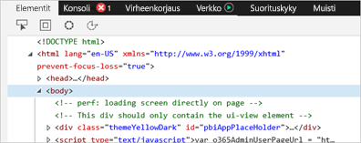
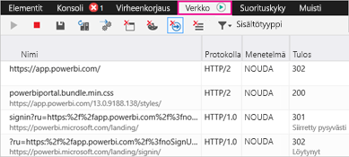
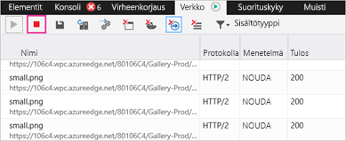
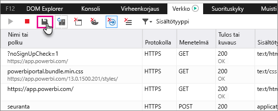

# Power BI:n vianmäärityksen lisätietojen kirjaaminen

Tässä artikkelissa on ohjeita lisädiagnostiikkatietojen keräämisen manuaalisesti Power BI-verkkoasiakkaasta.

1. Selaa [Power BI:ta](https://app.powerbi.com) Microsoft Edgellä tai Internet Explorerilla.

1. Avaa Microsoft Edgen kehittäjien työkalut painamalla **F12**-näppäintä.

   

1. Valitse **Verkko**-välilehti. Se sisältää luettelon liikenteestä, joka on jo siepattu.

   

    Vaihtoehdot ovat:

    * Voit selata ikkunassa ja jäljentää mahdollisia eteen tulevia ongelmia.

    * Voit piilottaa ja näyttää Kehittäjän työkalut -ikkunan milloin tahansa istunnon aikana painamalla F12-näppäintä.

1. Voit lopettaa istunnon profiloinnin valitsemalla punaisen neliön Kehittäjien työkalut -alueella **Verkko**-välilehdessä.

   

1. Valitse levykekuvake, jos haluat viedä tiedot HTTP Archive (HAR) -tiedostona.

   

1. Anna tiedostonimi ja tallenna HAR-tiedosto.

    HAR-tiedosto sisältää kaikki tiedot verkkopyynnöistä selainikkunan ja Power BI:n välillä, mukaan lukien seuraavat tiedot:

    * kunkin pyynnön aktiviteettitunnukset

    * kunkin pyynnön tarkka aikaleima

    * asiakkaalle palautetut virhetiedot.

    Tämä jäljitys sisältää myös tiedot,  joita käytetään täyttämään näytössä näkyviä visualisointeja.

1. Voit hankkia HAR-tiedoston tukemaan tarkastelua.

Onko sinulla muuta kysyttävää? [Voit esittää kysymyksiä Power BI -yhteisössä](https://community.powerbi.com/)
