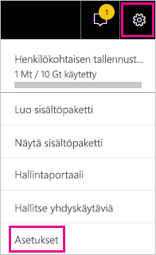
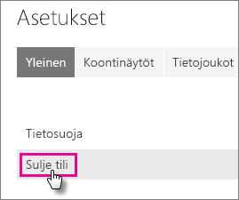
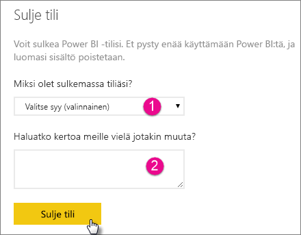
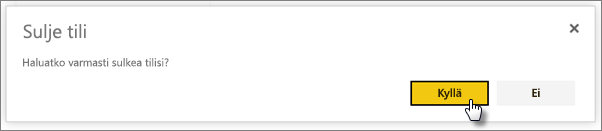
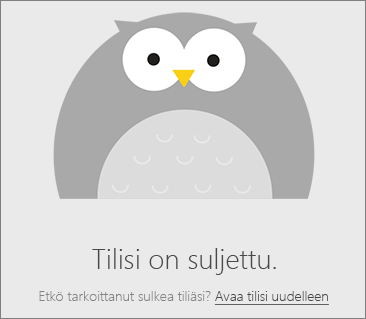

# Power BI -tilin sulkeminen
Jos et halua enää käyttää Power BI:tä, voit pyytää meitä sulkemaan Power BI-tilisi.  Kun tilisi on suljettu, et voi enää kirjautua sisään Power BI:hin.  Lisäksi kaikki Power BI:hin lataamasi tai siellä luomasi asiakastiedot poistetaan Power BI:n käyttöehdoissa kuvatun tietojen säilytyskäytännön mukaisesti.

## Yksittäiset Power BI ‑käyttäjät
Voit sulkea tilisi asetusnäkymästä.

1. Valitse oikeasta yläkulmasta hammasrataskuvake .
2. Valitse **Asetukset**.
   
    
3. **Yleiset** > **Sulje tili**
   
    
4. Valitse syy avattavasta **Miksi olet sulkemassa tiliäsi?** (1) ‑valikosta.  Voit halutessasi antaa myös lisätietoja (2). Valitse **Sulje tili**.
   
    
5. Vahvista, että haluat sulkea tilisi.
   
    
6. Näkyviin tulee vahvistus siitä, että tilisi on suljettu. Viestissä on myös linkki, jonka kautta voit halutessasi avata tilisi uudelleen.
   
    

## Hallitun vuokraajan käyttäjät
Sinun on otettava yhteyttä vuokraajan järjestelmänvalvojaan ja pyydettävä häntä poistamaan lisenssin, joka on liitetty tiliisi.

Onko sinulla muuta kysyttävää? [Voit esittää kysymyksiä Power BI -yhteisössä](http://community.powerbi.com/)

