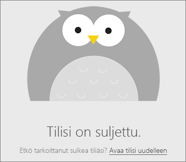
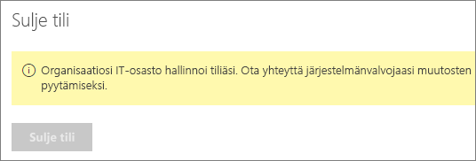

# Power BI-tilin sulkeminen

Jos et halua enää käyttää Power BI:tä, voit pyytää Power BI -tilisi sulkemista.  Kun suljet tilisi, et voi kirjautua sisään Power BI. Kun se-tietojen säilytyskäytännön-osavaltioihin Power BI käyttöehdot, Power BI poistaa myös, asiakkaan tietoja palvelimeen tai luoda. Se ei tallenneta.

## Yksittäiset Power BI ‑käyttäjät

Jos olet rekisteröitynyt Power BI:hin yksityishenkilönä, voit sulkea tilisi **Asetukset**-näytössä.

1. Valitse Power BI:ssä oikeasta yläkulmasta hammasrataskuvake ja valitse sitten **Asetukset**.

    

1. Valitse **Yleiset**-välilehdellä **Sulje tili**.

    

1. Valitse tilin sulkemisen syy (1). Voit myös antaa lisätietoja (2). Valitse **Sulje tili**.

    

1. Vahvista, että haluat sulkea tilisi.

    

    Sinun pitäisi nähdä vahvistus siitä, että Power BI suljettu tili. Voit avata tilisi uudelleen täällä tarvittaessa.

    

## Hallitun vuokraajan käyttäjät

Jos organisaatiosi on rekisteröinyt sinut Power BI:hin, ota yhteyttä vuokraajasi järjestelmänvalvojaan. Pyydä poistamaan käyttöoikeus tililtäsi.

Onko sinulla kysyttävää? [Voit esittää kysymyksiä Power BI -yhteisössä](http://community.powerbi.com/)