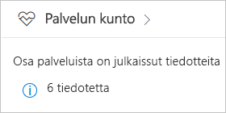
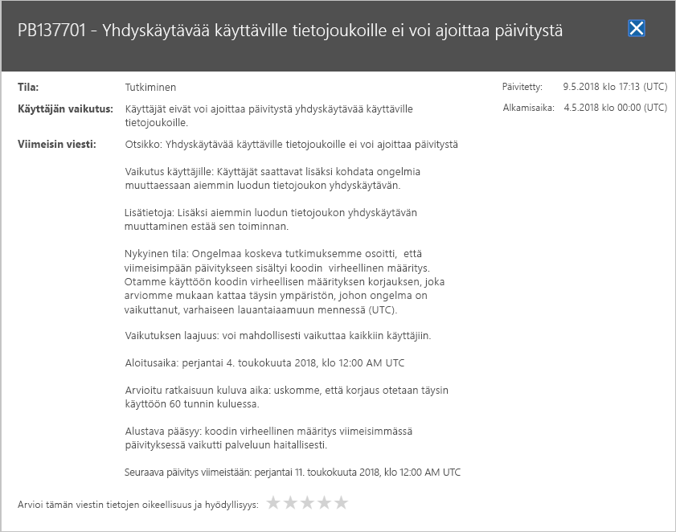

# Power BI -palvelun kunnon seuraaminen Office 365:ssä

Microsoft 365-hallintakeskus sisältää Power BI-järjestelmänvalvojille tärkeitä työkaluja. Työkalut sisältävät tiedon palvelun kunnosta kyseisellä hetkellä ja aiemmin. Käyttää palvelun kunnon tietoja, sinun on oltava jossakin seuraavista rooleista:

* Power BI -palvelun järjestelmänvalvoja

* Office 365:n yleinen järjestelmänvalvoja

Katso lisätietoja roolit [Power BI liittyvät järjestelmänvalvojaroolit](service-admin-administering-power-bi-in-your-organization.md#administrator-roles-related-to-power-bi).

1. Kirjaudu [Microsoft 365 -hallintakeskukseen](https://portal.office.com/adminportal).

1. Valitse vasemmassa siirtymispalkissa **Näytä kaikki** > **kunnon** > **palvelun kunto**. Palvelun kunto-sivulla näkyy:

    

1. Valitse **kaikki palvelut** luettelosta **neuvot** tai **tapaukset** ja Tarkista tulokset. Seuraavassa näyttökuvassa näet yhden kolmesta aktiivisesta neuvosta.

    

1. Saat lisätietoja valitsemalla **Näytä tiedot** kohteen kohdalta. Seuraavassa näyttökuvassa näet lisätietoja, kuten viimeaikaiset tilapäivitykset.

    

    Vieritä alas nähdäksesi lisätietoja ja sulje ruutu, kun olet valmis.

1. Näet historiatiedot kaikkien palveluiden oikeassa yläkulmassa **palvelun kunto** sivulla **Näytä historia**. Valitse **Viimeiset 7 päivää** tai **Viimeiset 30 päivää**. 

1. Voit palata palvelun senhetkisen kunnon näkymään valitsemalla **Näytä nykyinen tila**.