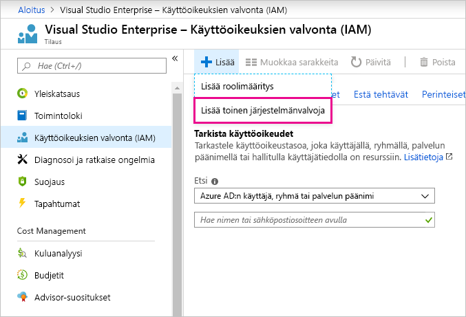

# Saman tilin käyttö Power BI:een ja Azureen

Jos olet Power BI- ja Azure-käyttäjä, haluat ehkä käyttää samaa kirjautumistunnusta molempiin palveluihin niin, että sinun ei tarvitse kirjoittaa salasanaasi kahdesti.

Power BI kirjaa sinut sisään käyttämällä organisaation käyttäjätiliä, joka on liitetty työpaikan tai oppilaitoksen sähköpostiosoitteeseen.  Azure kirjaa sinut sisään joko Microsoft-tilillä tai organisaation tilillä.

Jos haluat käyttää samaa kirjautumista Azuren ja Power BI:n kohdalla, muista kirjautua Azureen organisaation tilillä.

**Entä jos olen jo kirjautuneena Azureen Microsoft-tilini kautta?**

Voit lisätä organisaatiotilisi rinnakkaisjärjestelmänvalvojaksi Azureen seuraavasti:

1. Kirjaudu sisään [Azure-portaaliin](https://portal.azure.com/). Jos käytössäsi on useita Azure-hakemistoja, valitse **Tilaukset** ja suodata niin, että näet vain hakemiston ja tilaukset, joita haluat muokata.

1. Valitse siirtymisruudussa **Käyttöoikeuksien valvonta (IAM)** ja valitse sitten **Lisää**\>**Lisää rinnakkaisjärjestelmänvalvoja**.

    

1. Anna organisaatiotiliisi liittyvä sähköpostiosoite ja valitse **Lisää**.

1. Kun seuraavan kerran kirjaudut sisään Azure-portaaliin, käytä organisaatiolta saamaasi sähköpostiosoitetta.

Onko sinulla kysyttävää? [Kokeile Power BI -yhteisöä](https://community.powerbi.com/)
