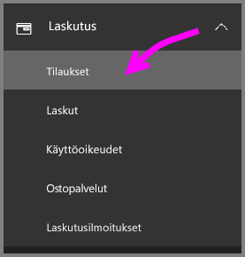
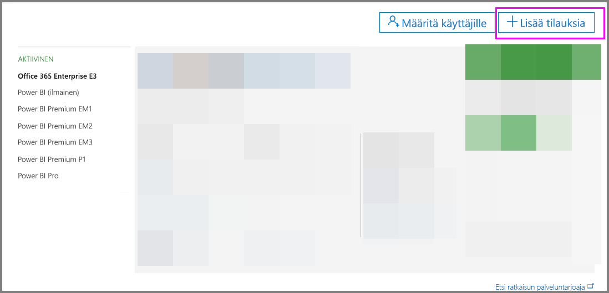
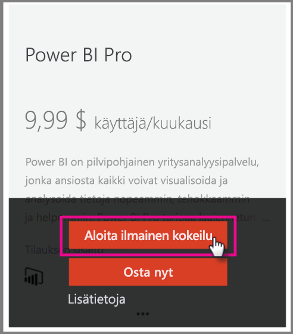
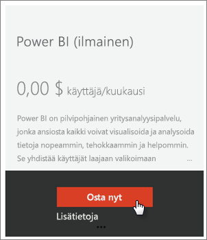
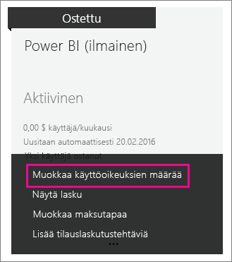
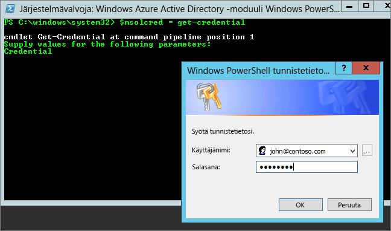

# <a name="power-bi-licensing-in-your-organization"></a>Power BI -käyttöoikeudet organisaatiossasi

Power BI -palvelussa käyttäjillä on määritettyjä ominaisuuksia kahdenlaisen käyttöoikeustyypin perusteella:

* **käyttäjäkohtainen** - *maksuton käyttöoikeus ja Power BI Pro -käyttöoikeus*. Maksuton käyttöoikeus mahdollistaa joidenkin Power BI -palvelun ominaisuuksien käytön. Pro-käyttöoikeus mahdollistaa kaiken sisällön ja kaikkien ominaisuuksien käytön Power BI -palvelussa, eli myös sisällön jakamisen ja yhteistyön muiden Pro-käyttäjien kanssa. Vain Pro-käyttäjät voivat julkaista ja käyttää sisältöä sovelluksen työtiloista, jakaa koontinäyttöjä sekä tilata koontinäyttöjä ja raportteja. Jos haluat lisätietoja, katso kohta [Power BI- palvelun ominaisuudet käyttöoikeustyypin mukaan](service-features-license-type.md).

* **Kapasiteettipohjainen** - *Power BI Premium -käyttöoikeus*. Premium tarjoaa varatun kapasiteetin, joka takaa tasaisemman suorituskyvyn ja tukee suurempia tietomääriä Power BI:ssä. Yksittäisten käyttäjien kohdalla Premium mahdollistaa myös Pro-version käyttäjien luoman sisällön laaja-alaisen jakamisen ilman, että sisältöä katselevilla vastaanottajilla on oltava Pro-käyttöoikeus. Lisätietoja on ohjeartikkelissa [Mikä Power BI Premium on ?](service-premium.md).

Tässä artikkelissa keskitytään käyttäjäkohtaiseen käyttöoikeuteen järjestelmänvalvojan näkökulmasta.

## <a name="manage-power-bi-pro-licenses"></a>Power BI Pro- käyttöoikeuksien hallinta

Järjestelmänvalvojana voit ostaa ja määrittää Power BI Pro -käyttöoikeuksia, ja voit myös rekisteröidä Power BI Pro -kokeiluversion organisaatiollesi. Yksittäiset käyttäjät voivat myös rekisteröityä Power BI Pro -kokeiluversion käyttäjäksi.

### <a name="purchasing-power-bi-pro"></a>Power BI Pron ostaminen

Voit ostaa Power BI Pro -käyttöoikeudet Microsoft Office 365:n tai sertifioidun Microsoft-kumppanin kautta. Kun olet ostanut käyttöoikeudet, voit määrittää ne yksittäisille käyttäjille. Jos haluat lisätietoja, katso kohta [Power BI Pro -käyttöoikeuksien hankinta ja määritys](service-admin-purchasing-power-bi-pro.md).

### <a name="power-bi-pro-trial-for-individuals"></a>Power BI Pron kokeiluversio yksittäisille käyttäjille

Yksittäiset käyttäjät organisaatiossasi voivat rekisteröityä Power BI Pro -kokeiluversion käyttäjäksi. Jos haluat lisätietoja, katso kohta [Rekisteröityminen Power BI:hin yksityishenkilönä](service-self-service-signup-for-power-bi.md).

Käyttäjät, jotka hyödyntävät tätä tuotekohtaista Power BI Pro -kokeiluversiota, eivät näy Office 365:n järjestelmävalvojien portaalissa Power BI Pro Trial -käyttäjinä (he näkyvät Power BI:n ilmaiskäyttäjinä). He näkyvät kuitenkin Power BI Pro -kokeiluversion käyttäjinä Power BI:n tallennussivun hallinnassa.

### <a name="power-bi-pro-trial-for-organizations"></a>Power BI Pron kokeiluversio organisaatioille

Jos haluat hankkia ja ottaa käyttöön Power BI -kokeilujakson käyttöoikeudet useille organisaation käyttäjille siten, ettei yksittäisiltä käyttäjiltä edellytetä käyttöehtojen hyväksymistä, voit rekisteröidä Power BI Pro -kokeiluversion organisaatiollesi.

Pidä mielessä seuraavat asiat ennen rekisteröitymistä:

* Jotta voit rekisteröityä, sinulla on oltava [ **Yleinen järjestelmänvalvoja**- tai **Laskutuksen järjestelmänvalvoja** ](https://support.office.com/article/about-office-365-admin-roles-da585eea-f576-4f55-a1e0-87090b6aaa9d?ui=en-US&rs=en-US&ad=US) -rooli Office 365:ssä.

* Jokaista vuokraajaa kohti on rajattu vain yksi organisaatiokohtainen kokeiluversio. Tämä tarkoittaa sitä, että jos vuokraajallasi on jo käytössä Power BI Pro -kokeiluversio, et voi enää hankkia sitä uudelleen. Jos tarvitset apua, ota yhteyttä [Office 365:n laskutustukeen](https://support.office.microsoft.com/article/contact-support-for-business-products-admin-help-32a17ca7-6fa0-4870-8a8d-e25ba4ccfd4b?CorrelationId=552bbf37-214f-4202-80cb-b94240dcd671&ui=en-US&rs=en-US&ad=US).

1. Siirry [Office 365:n hallintakeskukseen](https://portal.office.com/adminportal/home#/homepage).

1. Valitse vasemmalla olevassa siirtymisruudussa **Laskutus** ja sitten **Tilaukset**.

   

1. Valitse oikealta puolelta **Lisää tilauksia**.

   

1. **Muut palvelupaketit** -kohdan alla siirrä hiiren osoitin Power BI Pron kolmen pisteen (**. . .**) päälle ja valitse **Aloita ilmaisen kokeiluversion käyttö**.

    

1. Valitse tilauksen vahvistusnäytöllä **Kokeile nyt**.

1. Valitse tilausvahvistuksessa **Jatka**.

Voit nyt [määrittää käyttöoikeuksia Office 365:ssä](https://support.office.com/article/assign-licenses-to-users-in-office-365-for-business-997596b5-4173-4627-b915-36abac6786dc).

## <a name="manage-power-bi-free-licenses"></a>Maksuttomien Power BI- käyttöoikeuksien hallinta

Organisaatiosi käyttäjät voivat saada pääsyn maksuttomiin Power BI -käyttöoikeuksiin kahdella eri tavalla. He voivat rekisteröityä Power BI:hin yksittäisinä käyttäjinä tai heille voidaan määrätä Power BI -käyttöoikeus Office 365 -hallintaportaalissa.

Sallimalla yksittäiset rekisteröinnit, organisaation järjestelmänvalvojien taakka vähenee, kun Power BI:stä kiinnostuneet käyttäjät voivat rekisteröityä ilmaiseksi.

Yksittäisten käyttäjien rekisteröinnin avulla hallinta on kuitenkin parempaa, ja se on hyvä vaihtoehto, jos haluat valvoa palvelun käyttö.

### <a name="power-bi-free-for-individuals"></a>Maksuton Power BI yksityishenkilöille

Yksittäiset käyttäjät organisaatiossasi voivat oletusarvoisesti rekisteröityä maksuttoman Power BI -kokeiluversion käyttäjäksi. Jos haluat lisätietoja, katso kohta [Rekisteröityminen Power BI:hin yksityishenkilönä](service-self-service-signup-for-power-bi.md).

Jos haluat estää yksityishenkilöiden rekisteröitymisen, lisätietoa on myöhemmin tässä artikkelissa olevassa kohdassa [Ota yksittäisten käyttäjien rekisteröityminen käyttöön tai poista se käytöstä Azure Active Directorysta](service-admin-licensing-organization.md#enable-or-disable-individual-user-sign-up-in-azure-active-directory).

### <a name="requesting-and-assigning-free-licenses"></a>Maksuttomien käyttöoikeuksien pyytäminen ja määrittäminen

Jos aiot hallita käyttöoikeuspyyntöjä ja määrityksiä keskitetysti, tarkista ensin, onko sinulla jo rajoittamaton Power BI (ilmainen) -käyttöoikeuslohko.

Tämä käyttöoikeuslohko tulee näkyviin sen jälkeen, kun joku rekisteröityy ensimmäistä kertaa Power BI:hin yksittäisenä käyttäjänä. Prosessin aikana tämä käyttöoikeuslohko kiinnittyy organisaatioosi ja käyttöoikeus määritetään rekisteröityvälle käyttäjälle.

1. Office 365 -hallintakeskuksessa kohdassa **Laskutus** > **Käyttöoikeudet** valitse **rajoittamaton**.

    

1. Jos lohko on käytettävissä, voit nyt [määrittää käyttöoikeuksia Office 365:ssä](https://support.office.com/article/assign-licenses-to-users-in-office-365-for-business-997596b5-4173-4627-b915-36abac6786dc). Jos lohko ei ole käytettävissä, jos sinulla on kaksi vaihtoehtoa:

    * Organisaatiosi jäsen voi rekisteröityä erikseen, jolloin rajoittamattoman lohkon luominen käynnistyy.

    * Voit siirtyä seuraavaan vaiheeseen, jossa voit rekisteröidä kiinteän määrän käyttöoikeuksia.

Jos rajoittamaton Power BI (ilmainen) -käyttöoikeuslohko ei ole käytettävissä etkä halua tehdä yksittäisiä rekisteröintejä, noudata näitä ohjeita.

1. Siirry [Office 365:n hallintakeskukseen](https://portal.office.com/admin/default.aspx).

1. Valitse vasemmasta siirtymisruudusta **Laskutus** > **Tilaukset**.

1. Valitse oikealta puolelta **Lisää tilauksia +**.

1. **Muut palvelupaketit** -kohdan alla siirrä hiiren osoitin Power BI (ilmainen) -version kolmen pisteen (**. . .**) päälle ja valitse **Osta nyt**.

    

1. Syötä lisättävien käyttöoikeuksien määrä ja valitse sitten **Siirry maksamaan** tai **Lisää ostoskoriin**.

1. Anna tarvittavat tiedot uloskuittaus-työnkulkuun.

    Tämä menetelmä ei vaadi maksua, vaikka luottokorttitiedot tuleekin syöttää pyydettäessä tai valita maksutavaksi lasku.

1. Voit nyt [määrittää käyttöoikeuksia Office 365:ssä](https://support.office.com/article/assign-licenses-to-users-in-office-365-for-business-997596b5-4173-4627-b915-36abac6786dc).

1. Jos haluat lisätä uusia käyttöoikeuksia myöhemmin, palaa takaisin **Lisää tilauksia** -kohtaan ja valitse sitten (ilmainen) Power BI **Muuta käyttöoikeuksien määrää**.

    

### <a name="enable-or-disable-individual-user-sign-up-in-azure-active-directory"></a>Ota yksittäisten käyttäjien rekisteröityminen käyttöön tai poista se käytöstä Azure Active Directorysta

Voit järjestelmänvalvojana joko ottaa käyttöön yksittäisten käyttäjien rekisteröitymisen tai poistaa sen käytöstä Azure Active Directoryn (AAD) kautta. Tässä artikkelin osassa kerrotaan, miten voit hallita rekisteröitymisiä PowerShell-komennoilla. Katso lisätietoja Azure PowerShellistä kohdasta [Azure PowerShellin yleiskatsaus](/powershell/azure/overview).

Rekisteröitymistä ohjaava AAD-asetus on **AllowAdHocSubscriptions**. Useimmissa vuokraajissa tämä asetus on *true* (tosi), mikä tarkoittaa, että se on käytössä. Jos hankit Power BI:n kumppanin kautta, asetuksena saattaa olla *false* (epätosi), mikä tarkoittaa, että se on poistettu käytöstä. Jos muutat asetusta arvosta *true* arvoon *false*, organisaatiosi uusien käyttäjien rekisteröityminen erikseen on estetty. Käyttäjät, jotka rekisteröityivät Power BI:hin ennen asetuksen muutosta, säilyttävät käyttöoikeutensa.

1. Kirjaudu Azure Active Directoryyn käyttämällä Office 365 -tunnistetietojasi. PowerShell-komentosarjan ensimmäinen rivi kehottaa antamaan tunnistetiedot. Toinen rivi muodostaa yhteyden Azure Active Directoryyn.

    ```powershell
     $msolcred = get-credential
     connect-msolservice -credential $msolcred
    ```

   

1. Kun olet kirjautunut sisään, suorita seuraava komento, jotta näet, mikä asetus vuokraajalla on tällä hetkellä määritettynä.

    ```powershell
     Get-MsolCompanyInformation | fl AllowAdHocSubscriptions
    ```
1. Suorittamalla seuraavan komennon voit ottaa käyttöön ($true) tai poistaa käytöstä ($false) **AllowAdHocSubscriptions**-asetuksen.

    ```powershell
     Set-MsolCompanySettings -AllowAdHocSubscriptions $true
    ```

> [!NOTE]
> AllowAdHocSubscriptions-lippua käytetään useiden käyttäjäominaisuuksien ohjaamiseen organisaatiossa. Sillä ohjataan muun muassa käyttäjien mahdollisuutta rekisteröityä Azure Rights Management -palveluun. Tämän lipun muuttaminen vaikuttaa kaikkiin näihin ominaisuuksiin.

## <a name="next-steps"></a>Seuraavat vaiheet

[Omatoiminen kirjautuminen Power BI:hin](service-self-service-signup-for-power-bi.md)  

[Power BI Pro -käyttöoikeuksien hankinta ja määritys](service-admin-purchasing-power-bi-pro.md)

Onko sinulla kysyttävää? [Voit esittää kysymyksiä Power BI -yhteisössä](http://community.powerbi.com/)