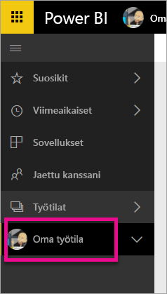
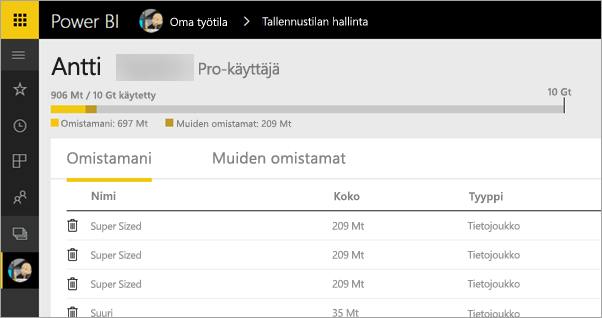
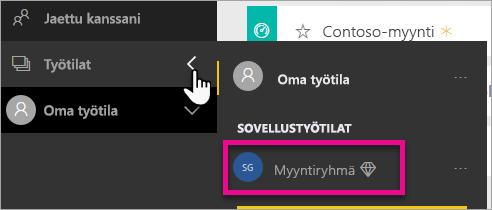
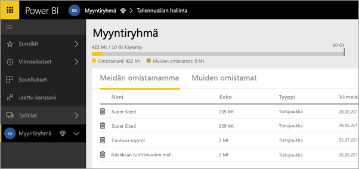
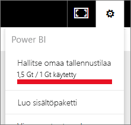
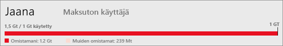
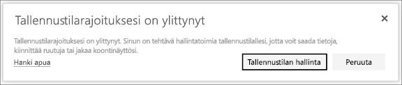

# Tallennustilan hallinta Power BI -työtiloissa

Lue, miten voit hallita yksittäisten tai työtilan tallennustilaa ja varmistaa, että voit edelleen julkaista raportteja ja tietojoukkoja.

Käyttäjillä ja työtiloilla on omat tietokapasiteettinsa:

* Kaikilla käyttäjillä on enintään 10 gigatavua tietojen tallennustilaa.
* Käyttäjät, joilla on Power BI Pro -käyttöoikeus, voivat luoda työtiloja, joissa kussakin on enintään 10 gigatavua tietojen tallennustilaa.
* Työtilan Premium-kapasiteettia ei lasketa mukaan Power BI Pro -käyttäjän tallennustilaan.

Vuokraajan tasolla kokonaiskäyttö voi olla enintään 10 gigatavua Pro-käyttäjää kohden kaikkien Pro-käyttäjien osalta ja vuokraajan työtiloissa.

Lue lisätietoja muista ominaisuuksista [Power BI -hinnoittelumallista](https://powerbi.microsoft.com/pricing).

Tietojen tallennustila sisältää omat tietojoukkosi ja Excel-raportit sekä tiedot, jotka joku toinen on jakanut kanssasi. Tietojoukot ovat mitä tahansa tietolähteitä, jotka olet ladannut tai joihin olet muodostanut yhteyden. Nämä tietolähteet sisältävät Power BI Desktop -tiedostot ja Excel-työkirjat, joita käytät. Seuraavat sisältyvät myös datakapasiteettiin.

* Excel-alueet, jotka on kiinnitetty raporttinäkymään.
* Reporting Servicesin paikalliset visualisoinnit, jotka on kiinnitetty Power BI -raporttinäkymään.
* Ladatut kuvat.

Jakamasi koontinäytön koko vaihtelee sen mukaan, mitä siihen on kiinnitetty. Jos esimerkiksi kiinnität kohteita kahdesta raportista, jotka ovat osa kahta eri tietojoukkoa, kokoon sisältyvät molemmat tietojoukot.

<a name="manage"/>

## Omistamiesi kohteiden hallinta

Katso, miten paljon tallennustilaa käytät Power BI -tililläsi ja hallitse tiliäsi.

1. Siirry oman tallennustilan hallintaa varten kohtaan **My Workspace** vasemmassa siirtymisruudussa.
   
    
2. Valitse rataskuvake  oikeasta yläkulmasta \> **Henkilökohtaisen tallennustilan hallinta**.
   
    Yläpalkki näyttää kuinka paljon tallennustilaa olet käyttänyt.
   
    
   
    Tietojoukot ja raportit erotetaan kahdeksi välilehdeksi:
   
    **Omistamani:** Nämä ovat raportteja ja tietojoukkoja, jotka olet ladannut Power BI -tilillesi, mukaan lukien palvelun tietojoukot, kuten Salesforce ja Dynamics CRM.  
    **Muiden omistamat:** Muiden sinulle jakamat raportit ja tietojoukot.
1. Jos haluat poistaa tietojoukon tai raportin, valitse roskakorikuvake .

Pidä mielessä, että sinulla tai jollain muulla voi olla raportteja ja raporttinäkymiä tietojoukon perusteella. Jos poistat tietojoukon, kyseiset raportit ja raporttinäkymät eivät enää toimi.

## Työtilan hallinta
1. Valitse **Työtilojen** \> vieressä olevalla nuolella työtilan nimi.
   
    
2. Valitse rataskuvake  oikeasta yläkulmasta \> **Ryhmän tallennustilan hallinta**.
   
    Yläpalkki näyttää kuinka paljon tallennustilaa ryhmän tallennustilasta on käytetty.
   
    
   
    Tietojoukot ja raportit erotetaan kahdeksi välilehdeksi:
   
    **Meidän omistamamme:** Nämä ovat raportteja ja tietojoukkoja, jotka sinä olet ladannut tai joku muu on ladannut ryhmän Power BI -tilille, mukaan lukien palvelun tietojoukot, kuten Salesforce ja Dynamics CRM.
    **Muiden omistamat:** Muiden ryhmälle jakamat raportit ja tietojoukot.
3. Jos haluat poistaa tietojoukon tai raportin, valitse roskakorikuvake .
   
   > [!NOTE]
   > Kenellä tahansa työtilan jäsenellä, jolla on muokkausoikeudet, on oikeus poistaa tietojoukkoja ja raportteja työtilasta.
   > 
   > 

Pidä mielessä, että sinulla tai jollain muulla ryhmässä voi olla raportteja ja raporttinäkymiä tietojoukon perusteella. Jos poistat tietojoukon, kyseiset raportit ja raporttinäkymät eivät enää toimi.

## Tietojoukon rajoitukset
Rajoitus on 1 gigatavu tietojoukkoa kohden, joka on tuotu Power BI:lle. Jos olet valinnut Excel-kokemuksen säilyttämisen tietojen tuomisen sijaan, tietojoukkokohtainen raja on 250 Mt.

## Mitä tapahtuu, kun raja saavutetaan?
Kun saavutat tietojen kapasiteetin rajan, näkyviin tulee ohjeita palvelun sisällä. 

Kun valitset rataskuvakkeen , näkyviin tulee punainen palkki, joka ilmaisee, että tietojen kapasiteettiraja on ylittynyt.

Tämä raja on myös ilmoitettu kohdassa **Henkilökohtaisen tallennustilan hallinta**.

 

 Kun yrität suorittaa toimintoa, joka saavuttaa yhden rajoista, näet viestin, jonka mukaan raja on ylitetty. Voit [hallita](#manage) tallennustilaasi tallennusmäärän pienentämiseksi ja rajan ohittamiseksi.

 

 Onko sinulla kysyttävää? [Voit esittää kysymyksiä Power BI -yhteisössä](http://community.powerbi.com/)

