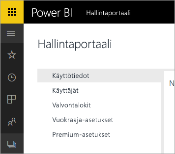

# Power BI Office 365:lle on poistettu käytöstä
Power BI Office 365:lle, joka on Power BI:n aiempi versio, on siirretty nykyiseen versioon [Power BI:hin](https://powerbi.microsoft.com). Käyttäjät, jotka ovat käyttäneet aiemmin versiota **Power BI Office 365:lle** voivat käyttää Power BI:n uusinta versiota. Lue [lisätietoja Power BI:stä](service-get-started.md).

## Hallintaportaali
Pääsy version **Power BI Office 365:lle** hallintaportaaliin ei ole enää käytettävissä. Järjestelmänvalvojat voivat käyttää uutta [hallintaportaalia](https://app.powerbi.com/admin-portal) organisaationsa Power BI -tilauksen hallintaan.

Jos haluat lisätietoja, katso [Power BI:n hallintaportaali](service-admin-portal.md).

## Seuraavat vaiheet
[Power BI:n käytön aloittaminen](service-get-started.md)

[Power BI Desktopin käytön aloittaminen](desktop-getting-started.md)

[Power BI:n hallinta organisaatiossa](service-admin-administering-power-bi-in-your-organization.md)
