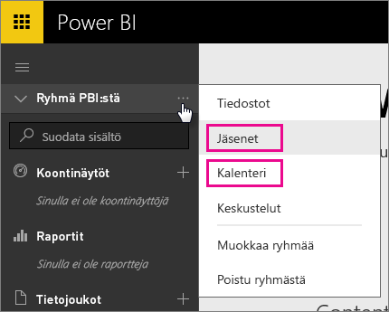
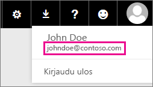

# Omistautuneet Office 365 -käyttäjät – tunnetut ongelmat
Power BI:tä tuetaan nyt omistautuneille Office 365 -käyttäjille.  Jos olet omistautunut O365-käyttäjä, voit kirjautua sisään sen vuokraajan tilillä ja käyttää Power BI:tä. Tällä hetkellä on kaksi tunnettua ongelmaa.

## Ryhmät
Kun valitset Ryhmä-pikavalikosta **Jäsenet** tai **Kalenteri**, sinut uudelleenohjataan sen sijaan sähköpostisovellukseen.  **Tiedostot** ja **Keskustelut** toimivat odotetulla tavalla.

## iPhone-sovellus – kirjautuminen henkilökohtaisella toimialueella johtaa virheeseen
Kun kirjaudut sisään iPhone-sovelluksessa käyttämällä kirjautumistunnusta henkilökohtaisella toimialueella, voi ilmetä virhe.

*Kirjautumisvirhe*  
*Ilmeni odottamaton sisäinen virhe. Yritä uudelleen.*

Voit kiertää tämän ongelman kirjautumalla henkilökohtaisen toimialueen sijaan sähköpostiosoitteella, joka näkyy luettelossa napsauttaessasi Power BI -palvelussa olevaa käyttäjäkuvaketta.

Onko sinulla kysyttävää? [Kokeile Power BI -yhteisöä](https://community.powerbi.com/)

