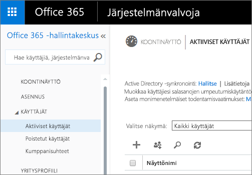

# Power BI -hallintaportaali

Hallintaportaalissa voit hallita organisaatiosi Power BI -vuokraajia. Hallintaportaali sisältää esimerkiksi käyttömittareita ja asetuksia. Sen kautta voit käyttää myös Office 365 -hallintakeskusta.

Voit hallita yrityksesi Power BI -vuokraajia Power BI -hallintaportaalissa. Hallintaportaalia voivat käyttää kaikki Office 365:n yleiset järjestelmänvalvojat ja käyttäjät, joille on määritetty Power BI -palvelun järjestelmänvalvojan rooli. Jos haluat lisätietoja Power BI -palvelun järjestelmänvalvojan roolista, lue ohjeartikkeli [Power BI -järjestelmänvalvojaroolin kuvaus](service-admin-role.md).

Kaikki käyttäjät näkevät **hallintaportaalin** hammasrataskuvakkeen alla. Jos käyttäjä ei ole järjestelmänvalvoja, hän näkee vain **Premium-asetusten** kohdan ja vain ne kapasiteetit, joiden hallintaan hänellä on oikeudet.

## Hallintaportaaliin siirtyminen

Tililläsi täytyy olla **yleisen järjestelmänvalvojan** oikeudet Office 365:ssä tai Azure Active Directoryssa tai Power BI -palvelun järjestelmänvalvojan oikeudet, jotta voit käyttää Power BI -hallintaportaalia. Jos haluat lisätietoja Power BI -palvelun järjestelmänvalvojan roolista, lue ohjeartikkeli [Power BI -järjestelmänvalvojaroolin kuvaus](service-admin-role.md). Voit siirtyä Power BI -hallintaportaaliin alla annettujen ohjeiden mukaisesti.

1. Napsauta asetusten hammasrataskuvaketta Power BI -palvelun oikeassa yläkulmassa.
2. Valitse **Hallintaportaali**.

Portaalissa on kuusi välilehteä. Ne on lueteltu alla:

* [Käyttömittarit](#usage-metrics)
* [Käyttäjät](#users)
* [Valvontalokit](#audit-logs)
* [Vuokraaja-asetukset](#tenant-settings)
* [Premium-asetukset](#premium-settings)
* [Upotuskoodit](#embed-codes)
* [Organisaation visualisoinnit.](#Organization-visuals)

## Käyttömittarit
Hallintaportaalin ensimmäinen välilehti on nimeltään **Käyttömittarit**. Käyttömittariraporttien avulla voit seurata organisaatiosi Power BI -käyttöä. Niistä näet myös, mitkä käyttäjät ja ryhmät käyttävät eniten Power BI:tä organisaatiossasi.

> [!NOTE]
> Kun siirryt koontinäyttöön ensimmäistä kertaa tai käyt siellä ensimmäistä kertaa pitkään aikaan, näet luultavasti latausnäytön, kun koontinäyttöä ladataan.

Kun koontinäyttö on ladattu, näet kaksi ruutuosiota. Ensimmäinen osio sisältää organisaatiosi yksittäisten käyttäjien käyttötiedot ja toinen organisaatiosi ryhmien käyttötiedot.

Näet ruuduissa seuraavat tiedot:

* Näet käyttäjän työtilan kaikkien koontinäyttöjen, raporttien ja tietojoukkojen määrän.
  
    

* Näet käytetyimmän koontinäytön ja sen käyttäjien määrän. Jos sinulla on esimerkiksi kolmelle käyttäjälle jakamasi koontinäyttö, jonka olet lisännyt myös sisältöpakettiin, johon on yhdistetty kaksi eri käyttäjää, koontinäytön käyttäjämäärä on 6 (1+3+2).
  
    

* Näet suosituimmat sisällöt, joihin käyttäjät ovat muodostaneet yhteyksiä. Tämä sisältö voi olla mitä tahansa sisältöä, johon käyttäjät muodostavat yhteyden Nouda tiedot -toiminnolla (esimerkiksi SaaS-sisältöpaketteja, organisaation sisältöpaketteja, tiedostoja tai tietokantoja).
  
    

* Näet käyttäjät, joilla on eniten koontinäyttöjä (sekä heidän itse luomansa koontinäytöt että heille jaetut koontinäytöt).
  
    

* Näet käyttäjät, joilla on eniten raportteja.
  
    

Toinen osio sisältää samat tiedot ryhmille. Näiden tietojen avulla näet, mitkä organisaatiosi ryhmät ovat aktiivisimpia ja mitä tietoja he käyttävät.

Näin saat tarkan kuvan siitä, kuinka organisaatiosi käyttäjät käyttävät Power BI:tä, ja näet organisaatiosi aktiivisimmat käyttäjät sekä ryhmät.

## Käyttäjät

Hallintaportaalin toinen välilehti on nimeltään **Käyttäjien hallinta**. Power BI:n käyttäjiä hallitaan Office 365:n hallintakeskuksessa, joten tässä osiossa pääset nopeasti paikkaan, jossa voit hallita käyttäjiä, järjestelmänvalvojia ja ryhmiä Office 365:ssä.

Kun napsautat **Siirry O365-hallintakeskukseen**, sinut siirretään Office 365 -hallintakeskuksen aloitussivulle, jossa voit hallita vuokraajatilisi käyttäjiä.

## Valvontalokit

Hallintaportaalin kolmas välilehti on nimeltään **Valvontalokit**. Lokit sijaitsevat Office 365:n tietoturva- ja yhteensopivuuskeskuksessa. Tämän osion kautta pääset nopeasti tietoturva- ja yhteensopivuuskeskukseen Office 365:ssä.

Saat lisätietoja valvontalokeista ohjeartikkeleista [Organisaation Power BI:n valvonta](service-admin-auditing.md).

## Vuokraaja-asetukset

Hallintaportaalin neljäs välilehti on nimeltään **Vuokraaja-asetukset**. Vuokraaja-asetusten avulla voit hallita tarkemmin organisaatiossasi käyttöön tarjottavia toimintoja. Jos olet huolissasi luottamuksellisista tiedoista, jotkin toiminnoista eivät ehkä sovellu organisaatiollesi. Tai kenties ehkä haluat tarjota tietyn toiminnon vain tietylle ryhmälle. Tällaisissa tapauksissa voit poistaa toimintoja käytöstä vuokraajatililläsi.

> [!NOTE]
> Asetuksen käyttöönotto kaikille vuokraajatilisi käyttäjille voi kestää jopa 10 minuuttia.

Voit määrittää asetuksia kolmeen eri tilaan.

### Poistettu käytöstä koko organisaatiossa

Voit poistaa toiminnon käytöstä, jolloin käyttäjät eivät voi käyttää sitä.

### Otettu käyttöön koko organisaatiolle

Voit ottaa toiminnon käyttöön koko organisaatiolle, jolloin kaikki käyttäjät voivat käyttää sitä.

### Otettu käyttöön organisaation alijoukolle

Voit ottaa toiminnon käyttöön tietyille organisaatiosi käyttäjille. Voit tehdä tämän muutamin eri tavoin. Voit ottaa toiminnon käyttöön koko organisaatiolle tiettyä käyttäjäryhmää lukuun ottamatta.

Voit myös ottaa toiminnon käyttöön vain tietylle käyttäjäryhmälle tai poistaa sen käytöstä tietyltä käyttäjäryhmältä. Näin voit varmistaa, että tietyt käyttäjät eivät voi käyttää toimintoa, vaikka he olisivat sallitussa ryhmässä.

## Vienti- ja jakoasetukset

### Sisällön jakaminen ulkoisille käyttäjille

Organisaation käyttäjät voivat jakaa koontinäkymiä organisaation ulkopuolisten käyttäjien kanssa.

Näet seuraavan ilmoituksen, kun jaat ulkoiselle käyttäjälle.

### Verkkoon julkaiseminen

Organisaation käyttäjät voivat julkaista raportteja verkossa. [Lue lisätietoja.](service-publish-to-web.md)

Käyttäjät näkevät käyttöliittymässä eri asetuksia sen mukaan, mikä heidän verkkoon julkaisemisen asetuksensa on.

|Toiminto |Otettu käyttöön koko organisaatiolle |Otettu käyttöön koko organisaatiolle |Tietyt käyttöoikeusryhmät   |
|---------|---------|---------|---------|
|Raportin **Tiedosto**-valikon **Julkaise verkkoon** -toiminto|Käytössä kaikille|Ei näkyvissä kaikille|Näkyvissä vain valtuutetuille käyttäjille tai ryhmille.|
|**Asetukset**-valikon **Upotuskoodien hallinta**|Käytössä kaikille|Käytössä kaikille|Käytössä kaikille  * **Poista**-vaihtoehto vain valtuutetuille käyttäjille tai ryhmille. * **Hae koodit** käytössä kaikille.|
|**Upotuskoodit** hallintaportaalissa|Tila ilmaisee jotain seuraavista: * Aktiivinen * Ei tuettu * Estetty|Tilana näytetään **Ei käytössä**|Tila ilmaisee jotain seuraavista: * Aktiivinen * Ei tuettu * Estetty  Jos käyttäjälle ei ole annettu oikeuksia vuokraaja-asetuksissa, tilana näytetään **Loukannut**.|
|Aiemmin luodut julkaistut raportit|Kaikki käytössä|Kaikki poissa käytöstä|Raportit näytetään jatkossakin kaikille.|

### Tietojen vieminen

Organisaation käyttäjät voivat viedä tietoja ruudusta tai visualisoinnista. [Lue lisätietoja.](power-bi-visualization-export-data.md)

> [!NOTE]
> Jos poistat **Vie tiedot** -toiminnon käytöstä, käyttäjät eivät voi käyttää myöskään **Analysoi Excelissä** -toimintoa tai Power BI -palvelun reaaliaikaista yhteyttä.

### Raporttien vieminen PowerPoint-esityksinä

Organisaation käyttäjät voivat viedä Power BI -raportteja PowerPoint-tiedostoina. [Lue lisätietoja.](service-publish-to-powerpoint.md)

### Koontinäyttöjen ja raporttien tulostaminen

Organisaation käyttäjät voivat tulostaa koontinäyttöjä ja raportteja. [Lue lisätietoja.](service-print.md)

## Sisältöpakettiasetukset

### Sisältöpakettien julkaiseminen koko organisaatiolle

Organisaation käyttäjät voivat julkaista sisältöpaketteja koko organisaatiolle.

### Organisaation mallisisältöpaketin luominen

Organisaation käyttäjät voivat luoda mallisisältöpaketteja, jotka käyttävät yhteen tietolähteeseen perustuvia tietojoukkoja Power BI Desktopissa.

### Sovellusten lähettäminen käyttäjille

Vuokraajatilisi järjestelmävalvoja voi lähettää sovelluksia **vuokraaja-asetuksissa**.

   

Voit vaihtaa asetuksen tilaksi **Käytössä** ja määrittää sitten, ketkä voivat käyttää tätä toimintoa (koko organisaatio tai tietyt käyttöoikeusryhmät).

> [!NOTE]
> Muista, että vuokraaja-asetusten käyttöönotossa voi kestää jonkin aikaa.

Täältä voit lukea lisätietoja [sovellusten lähettämisestä](service-create-distribute-apps.md#how-to-install-an-app-automatically-for-end-users).

## Integrointiasetukset

### Kysymysten esittäminen tiedoille Cortanan avulla
Organisaation käyttäjät voivat kysyä kysymyksiä tiedoistaan Cortanan avulla.

> [!NOTE]
> Tämä asetus koskee koko organisaatiota, joten sitä ei rajoittaa ryhmien avulla.

### Analysoi Excelissä -toiminnon käyttäminen paikallisten tietojoukkojen kanssa
Organisaation käyttäjät voivat käyttää paikallisia Power BI -tietojoukkoja Excelillä. [Lue lisätietoja.](service-analyze-in-excel.md)

> [!NOTE]
> Jos poistat **Vie tiedot** -toiminnon käytöstä, estät käyttäjiä käyttämästä myös **Analysoi Excelissä** -toimintoa.

### ArcGIS Maps for Power BI:n käyttäminen

Organisaation käyttäjät voivat käyttää Esrin tarjoamaa ArcGIS Maps for Power BI -visualisointia. [Lue lisää](power-bi-visualization-arcgis.md)

### Power BI:n yleisen haun käyttäminen (esikatselu)

Organisaation käyttäjät voivat käyttää Azure-hausta riippuvaisia ulkoisia hakutoimintoja. Käyttäjät voivat esimerkiksi käyttää Cortanaa avaintietojen noutamiseen suoraan Power BI -koontinäytöistä ja raporteista. [Lue lisää](service-cortana-intro.md)

## Mukautettujen visualisointien asetukset
### Mukautettujen visualisointien käyttöön ottaminen koko organisaatiossa
Organisaation käyttäjät voivat käyttää mukautettuja visualisointeja ja jakaa niitä. [Lue lisää](power-bi-custom-visuals.md)

> [!NOTE]
> Tämä asetus koskee koko organisaatiota, joten sitä ei rajoittaa ryhmien avulla.

## R-visualisointien asetukset

### R-visualisointien käyttäminen

Organisaation käyttäjät voivat käyttää R-komentosarjoilla luotuja visualisointeja ja jakaa niitä. [Lue lisää](service-r-visuals.md)

> [!NOTE]
> Tämä asetus koskee koko organisaatiota, joten sitä ei rajoittaa ryhmien avulla.

## Valvonta-asetukset

### Valvontalokien luominen sisäisen toiminnan valvonnan ja vaatimustenmukaisuuden tarpeisiin

Organisaation käyttäjät voivat valvoa muiden käyttäjien Power BI:ssä tekemiä toimia. [Lue lisätietoja.](service-admin-auditing.md)

Tämän asetuksen täytyy olla käytössä, jotta valvontalokiin kirjataan merkintöjä. Valvonnan käyttöönoton ja valvontatietojen tarkastelumahdollisuuden välillä voi olla jopa 48 tunnin viive. Jos et näe tietoja välittömästi, tarkista valvontalokit myöhemmin. Jos haet oikeuksia hallintalokien tarkasteluun, samanlainen viive voi esiintyä, ennen kuin oikeudet on myönnetty.

> [!NOTE]
> Tämä asetus koskee koko organisaatiota, joten sitä ei rajoittaa ryhmien avulla.

## Koontinäytön asetukset

### Koontinäyttöjen tietojen luokittelu

Organisaation käyttäjät voivat merkitä koontinäyttöjä luokituksilla, jotka ilmaisevat koontinäyttöjen suojaustasoja. [Lue lisää](service-data-classification.md)

> [!NOTE]
> Tämä asetus koskee koko organisaatiota, joten sitä ei rajoittaa ryhmien avulla.

## Kehittäjäasetukset

### Sisällön upottaminen sovelluksiin

Organisaation käyttäjät voivat upottaa Power BI -koontinäyttöjä ja -raportteja SaaS-sovelluksiin (palveluina tarjottaviin sovelluksiin). Jos poistat tämän asetuksen käytöstä, käyttäjät eivät näe REST-ohjelmointirajapintoja, joilla he voivat upottaa Power BI -sisältöä sovelluksiin.

## Premium-asetukset

Premium-asetusten välilehdessä voit hallita mitä tahansa organisaatiollesi ostettua Power BI Premium -kapasiteettia. Kaikki organisaation käyttäjät näkevät Premium-asetusten välilehden, mutta sen sisällön näkevät vain käyttäjät, joilla on **kapasiteetin järjestelmänvalvojan** oikeudet tai määrityskäyttöoikeudet. Jos käyttäjällä ei ole mitään oikeuksia, hän näkee seuraavan ilmoituksen.

Jos haluat lisätietoja Premium-asetusten hallinnasta, lue ohjeartikkeli [Power BI Premiumin hallinta](service-admin-premium-manage.md).

## Upotuskoodit

Järjestelmänvalvojana voit tarkastella vuokraajatilillesi luotuja upotuskoodeja. Voit tarkastella raporttia tai poistaa upotuskoodin kumotaksesi sen.

## Organisaation visualisoinnit

Organisaation visualisointien välilehdessä voit ottaa käyttöön ja hallita organisaatiosi mukautettuja visualisointeja. Näin voittaa ottaa helposti käyttöön organisaatiossa luotuja mukautettuja visualisointeja, joita raportteja tekevät käyttäjät voivat tuoda suoraan Power BI Desktopista raportteihinsa.
 
Tältä sivulta näet kaikki mukautetut visualisoinnit, jotka on tällä hetkellä otettu käyttöön organisaation säilössä.
 

### Uuden mukautetun visualisoinnin lisääminen

Jos haluat lisätä luetteloon uuden mukautetun visualisoinnin, valitse **Lisää mukautettu visualisointi**.

> [!WARNING]
> Mukautettu visualisointi voi sisältää koodia, jolla on tietoturva- tai tietosuojariskejä. Varmista siis, että luotat mukautetun visualisoinnin tekijään ja lähteeseen, ennen kuin otat sen käyttöön organisaation säilössä.
> 

Täytä kentät:
 
* Valitse .pbiviz-tiedosto (pakollinen): Valitse ladattava mukautetun visualisoinnin tiedosto. Vain versioituja ohjelmointirajapinnan mukautettuja visualisointeja tuetaan (lue täältä lisätietoja siitä, mitä tämä tarkoittaa).
Tarkista ennen visualisoinnin lataamista, että sen tietoturva ja tietosuoja täyttävät organisaatiosi vaatimukset. Lue lisätietoja mukautettujen visualisointien tietoturvasta.
 
* Nimeä mukautetut visualisoinnit (pakollinen): anna visualisoinnille lyhyt nimi, jotta Power BI Desktopin käyttäjät tietävät, mitä se tekee.
 
* Kuvake (pakollinen): tämä on Power BI Desktopin käyttöliittymässä näytettävä kuvake.
 
* Kuvaus: anna visualisoinnille lyhyt kuvaus, joka kertoo käyttäjille sen toiminnasta.
 
Aloita latauspyyntö valitsemalla Käytä. Jos lataus onnistuu, näet uuden kohteen luettelossa. Jos lataus epäonnistuu, saat virheilmoituksen.
 
### Mukautetun visualisoinnin poistaminen luettelosta

Jos haluat poistaa visualisoinnin säilöstä pysyvästi, valitse roskakorikuvake.
Ota huomioon, että poistamista ei voi kumota. Kun visualisointi poistetaan, sen näyttäminen olemassa olevissa raporteissa lopetetaan heti. Vaikka lataat saman visualisoinnin uudelleen, se ei korvaa aiempaa poistettua visualisointia. Käyttäjien täytyy tuoda uusi visualisointi uudelleen ja korvata raporteissaan käytetty esiintymä.
 
### Visualisoinnin lataaminen

Jos haluat ladata säilöön visualisoinnin, koska siitä on saatavilla uusi versio (esimerkiksi virheitä on korjattu, uusia toimintoja lisätty jne.), napsauta **latauskuvaketta** ja lataa uusi tiedosto. Varmista, että visualisoinnin tunnus pysyy samana. Uusi tiedosto korvaa aiemmin tiedoston kaikissa organisaation raporteissa. Jos visualisoinnin uusi versio rikkoo minkä tahansa sen aiemman version käyttö- tai tietorakenteen, älä korvaa aiempaa versiota. Lue sen sijaan visualisoinnista uusi versio, joka luetellaan erikseen. Voit esimerkiksi lisätä uuden luetteloidun visualisoinnin nimeen versionumeron (versio X.X). Näin käyttäjät tietävät, että kyseessä on saman visualisoinnin päivitetty versio, ja voivat välttää olemassa olevien raporttien toimintojen virheet sekä ongelmat. Varmista taas, että visualisoinnin tunnus pysyy samana. Kun käyttäjä sitten seuraavan kerran siirtyy organisaatioon säilöön Power BI Desktopista, hän voi tuoda uuden version. Tässä yhteydessä häneltä kysytään, haluaako hän korvata raportissa olevan nykyisen version.

## Seuraavat vaiheet

[Power BI -järjestelmänvalvojaroolin kuvaus](service-admin-role.md)  
[Organisaation Power BI:n valvonta](service-admin-auditing.md)  
[Power BI Premiumin hallinta](service-admin-premium-manage.md)  
[Power BI:n hallinta organisaatiossa](service-admin-administering-power-bi-in-your-organization.md)  

Onko sinulla muuta kysyttävää? [Voit esittää kysymyksiä Power BI -yhteisössä](http://community.powerbi.com/)
