# Power BI:n hallinta hallintaportaalissa

Hallintaportaalissa voit hallita organisaatiosi Power BI *-vuokraajaa*. Portaali sisältää esimerkiksi käyttömittareita ja asetuksia. Sen kautta voit käyttää myös Microsoft 365 -hallintakeskusta.

Hallintaportaalin kaikkia toimintoja voivat käyttää kaikki Office 365:n yleiset järjestelmänvalvojat ja käyttäjät, joille on määritetty Power BI -palvelun järjestelmänvalvojan rooli. Jos et ole tällainen käyttäjä, näet portaalissa vain **kapasiteettiasetukset**. Jos haluat lisätietoja Power BI -palvelun järjestelmänvalvojan roolista, lue ohjeartikkeli [Power BI -järjestelmänvalvojaroolin kuvaus](service-admin-role.md).

## Hallintaportaaliin siirtyminen

Tililläsi täytyy olla **yleisen järjestelmänvalvojan** oikeudet Office 365:ssä tai Azure Active Directoryssa tai Power BI -palvelun järjestelmänvalvojan oikeudet, jotta voit käyttää Power BI -hallintaportaalia. Jos haluat lisätietoja Power BI -palvelun järjestelmänvalvojan roolista, lue ohjeartikkeli [Power BI -järjestelmänvalvojaroolin kuvaus](service-admin-role.md). Voit siirtyä Power BI -hallintaportaaliin alla annettujen ohjeiden mukaisesti.

1. Napsauta asetusten hammasrataskuvaketta Power BI -palvelun oikeassa yläkulmassa.

1. Valitse **Hallintaportaali**.

    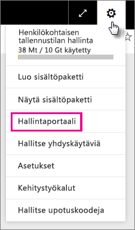

Portaalissa on yhdeksän välilehteä. Tässä artikkelissa kerrotaan lisätietoja näistä välilehdistä.

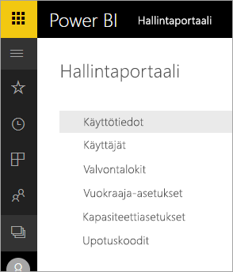

* [Käyttömittarit](#usage-metrics)
* [Käyttäjät](#users)
* [Valvontalokit](#audit-logs)
* [Vuokraaja-asetukset](#tenant-settings)
* [Kapasiteettiasetukset](#capacity-settings)
* [Upotuskoodit](#embed-codes)
* [Organisaation visualisoinnit.](#organizational-visuals)
* [Tietovuon tallennustila (esikatselu)](#dataflowStorage)
* [Työtilat](#workspaces)
* [Mukautus](#custom-branding)

## Käyttömittarit

**Käyttömittareiden** avulla voit seurata organisaatiosi Power BI -käyttöä. Niistä näet myös, mitkä käyttäjät ja ryhmät käyttävät eniten Power BI:tä organisaatiossasi. 

> [!NOTE]
> Kun siirryt koontinäyttöön ensimmäistä kertaa tai käyt siellä ensimmäistä kertaa pitkään aikaan, näet luultavasti latausnäytön, kun koontinäyttöä ladataan.

Kun koontinäyttö on ladattu, näet kaksi ruutuosiota. Ensimmäinen osio sisältää organisaatiosi yksittäisten käyttäjien käyttötiedot ja toinen organisaatiosi ryhmien käyttötiedot.

Näet ruuduissa seuraavat tiedot:

* Näet käyttäjän työtilassa kaikkien koontinäyttöjen, raporttien ja tietojoukkojen määrän.
  
    

* Näet käytetyimmän koontinäytön ja sen käyttäjien määrän. Jos sinulla on esimerkiksi kolmelle käyttäjälle jakamasi koontinäyttö, jonka olet lisännyt myös sisältöpakettiin, johon on yhdistetty kaksi eri käyttäjää, koontinäytön käyttäjämäärä on 6 (1 + 3 + 2).
  
    

* Näet suosituimmat sisällöt, joihin käyttäjät ovat muodostaneet yhteyksiä. Tämä sisältö voi olla mitä tahansa sisältöä, johon käyttäjät muodostavat yhteyden Nouda tiedot -toiminnolla (esimerkiksi SaaS-sisältöpaketteja, organisaation sisältöpaketteja, tiedostoja tai tietokantoja).
  
    

* Näet käyttäjät, joilla on eniten koontinäyttöjä (sekä heidän itse luomansa koontinäytöt että heille jaetut koontinäytöt).
  
    

* Näet käyttäjät, joilla on eniten raportteja.
  
    

Toinen osio sisältää samat tiedot ryhmille. Näiden tietojen avulla näet, mitkä organisaatiosi ryhmät ovat aktiivisimpia ja mitä sisältöä he käyttävät.

Näin saat tarkan kuvan siitä, kuinka organisaatiosi käyttäjät käyttävät Power BI:tä, ja näet organisaatiosi aktiivisimmat käyttäjät sekä ryhmät.

## Käyttötietojen hallinta

Käyttötietoraportit ovat ominaisuus, jonka Power BI:n tai Office 365:n järjestelmänvalvoja voi ottaa käyttöön tai poistaa käytöstä. Järjestelmänvalvojat hallitsevat tarkkaan sitä, kellä käyttäjillä on oikeus käyttötietoihin. Ne ovat oletusarvoisesti **käytössä** organisaation kaikilla käyttäjillä.

Järjestelmänvalvojat voivat myös määrittää, voivatko sisällön luojat nähdä käyttötietojen käyttäjäkohtaiset tiedot. 

Lue lisätietoja itse raporteista osiosta [Power BI:n koontinäyttöjen ja raporttien käyttötietojen valvonta](service-usage-metrics.md).

### Käyttötiedot sisällöntekijöille

1. Valitse hallintaportaalissa **Vuokraaja-asetukset** > **Käyttötiedot sisällöntekijöille**.

    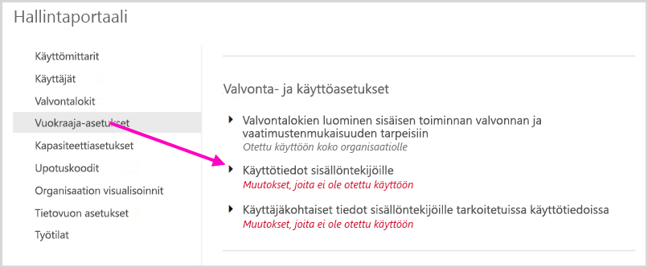

1. Ota käyttötiedot käyttöön (tai poista ne käytöstä) > **Käytä**.

    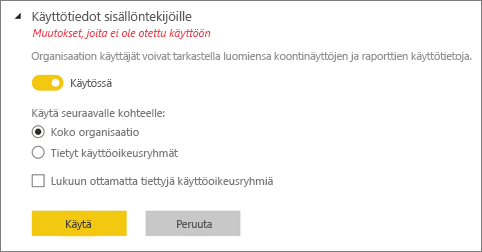

### Käyttäjäkohtaiset tiedot käyttömittareissa

Oletusarvoisesti käyttäjäkohtaiset tiedot on otettu käyttöön käyttötiedoille ja sisällön kuluttajan tilitiedot sisältyvät tietoraporttiin. Jos et halua sisällyttää näitä tietoja joillekin tai kaikille käyttäjille, poista ominaisuus käytöstä määritetyille käyttöoikeusryhmille tai koko organisaatiolle. Tilitiedot näkyvät sitten raportissa *nimettöminä*.

### Poista kaikki olemassa oleva käyttömittarien sisältö

Kun käyttötietoja poistetaan koko organisaation käytöstä, järjestelmänvalvojat voivat käyttää yhtä tai kumpaakin seuraavista asetuksista:

- **Poista kaikki olemassa oleva käyttömittarien sisältö**. Asetus poistaa kaikki aiemmin luodut raportit ja koontinäytön ruudut, jotka on luotu käyttämällä käyttötietoraportteja ja tietojoukkoja. Tämä vaihtoehto poistaa käyttöoikeuden käyttötietoihin kaikilta organisaation käyttäjiltä, jotka tietoja ehkä jo käyttävät. 
- **Poista kaikki olemassa olevat käyttäjäkohtaiset tiedot nykyisten käyttömittarien sisällössä** Tämä vaihtoehto poistaa käyttöoikeuden käyttäjäkohtaisiin tietoihin kaikilta organisaation käyttäjiltä, jotka tietoja ehkä jo käyttävät. 

Ole varovainen, sillä aiemmin luodun käyttötietosisällön ja käyttäjäkohtaisten tietojen sisällön poistamista ei voi peruuttaa.

## Käyttäjät

Voit hallita Power BI -käyttäjiä, -ryhmiä ja -järjestelmänvalvojia Microsoft 365 -hallintakeskuksessa. **Käyttäjät**-välilehdessä on linkki vuokraajasi hallintakeskukseen.

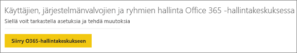

## Valvontalokit

Voit hallita Power BI -valvontalokeja Office 365:n tietoturva- ja yhteensopivuuskeskuksessa. **Valvontalokit**-välilehdessä on linkki vuokraajasi tietoturva- ja yhteensopivuuskeskukseen. [Lue lisää](service-admin-auditing.md)

Jotta voit käyttää valvontalokeja, varmista, että [**Valvontalokien luominen sisäisen toiminnan valvonnan ja vaatimustenmukaisuuden tarpeisiin**](#create-audit-logs-for-internal-activity-auditing-and-compliance) -asetus on käytössä.

## Vuokraaja-asetukset

**Vuokraaja-asetukset**-välilehdessä voit hallita yksityiskohtaisemmin organisaatiossasi käyttöön tarjottavia toimintoja. Jos olet huolissasi luottamuksellisista tiedoista, jotkin toiminnoista eivät ehkä sovellu organisaatiollesi. Tai kenties ehkä haluat tarjota tietyn toiminnon vain tietylle ryhmälle.

Seuraavassa kuvassa näytetään useita asetuksia **Vuokraaja-asetukset**-välilehdellä.

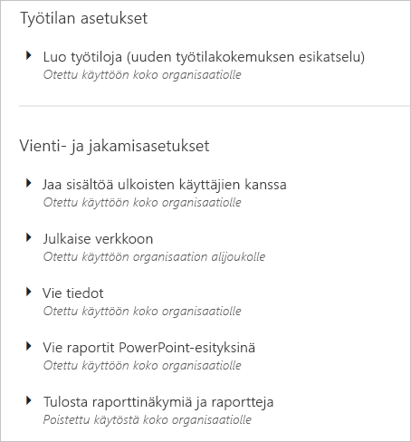

> [!NOTE]
> Asetuksen muutoksen voimaan tuleminen kaikille vuokraajatilisi käyttäjille voi kestää 10 minuuttia.

Asetuksilla voi olla kolme tilaa:

* **Poistettu käytöstä koko organisaatiolle**: Kukaan organisaatiossasi ei voi käyttää tätä ominaisuutta.

    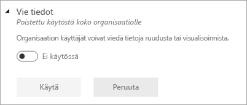

* **Otettu käyttöön koko organisaatiolle**: Kaikki organisaatiossasi voivat käyttää tätä ominaisuutta.

    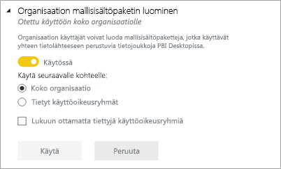

* **Otettu käyttöön organisaation alijoukolle**: Organisaatiosi erityinen käyttäjien tai ryhmien alijoukko voi käyttää tätä ominaisuutta.

    Voit ottaa toiminnon käyttöön koko organisaatiolle tiettyä käyttäjäryhmää lukuun ottamatta.

    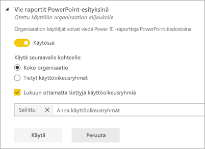

    Voit myös ottaa toiminnon käyttöön vain tietylle käyttäjäryhmälle tai poistaa sen käytöstä tietyltä käyttäjäryhmältä. Näin voit varmistaa, että tietyt käyttäjät eivät voi käyttää toimintoa, vaikka he olisivat sallitussa ryhmässä.

    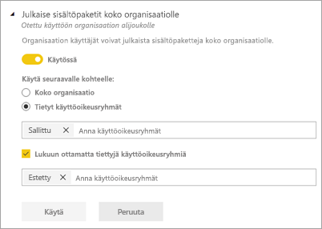

Seuraavissa osioissa luodaan yleiskatsaus vuokraaja-asetusten eri tyyppeihin.

## Ohjeiden ja tuen asetukset

### Julkaise ”Hanki apua” -tiedot

Organisaation käyttäjät voivat siirtyä sisäisiin ohje- ja tukiresursseihin Power BI:n ohjevalikosta. Tarkemmin sanottuna nämä parametrit muuttavat Lue-, Yhteisö- ja Hanki apua -valikkokohtien toimintaa.

Voit myös määrittää URL-osoitteen, joka ohjaa käyttäjät käyttöoikeuspyyntöjä koskevaan mukautettuun ratkaisuun. Tämä parametri mukauttaa Päivitä tili -painikkeen URL-kohdeosoitteen, jonka käyttäjä, jolla ei ole Power BI Pro -käyttöoikeutta, voit löytää Päivitä Power BI Pro -valintaikkunasta sekä Hallitse henkilökohtaista tallennustilaa -sivulta.

### Ota vastaan sähköposti-ilmoituksia palvelukatkoista tai -tapauksista

Sähköpostia käyttävät käyttöoikeusryhmät saavat sähköposti-ilmoituksia, jos palvelukatkos tai tapaus vaikuttaa tähän vuokraajaan. Lue lisätietoja [palvelun keskeytymisilmoituksista](service-interruption-notifications.md).

## Työtilan asetukset

### Työtilojen luominen

Järjestelmänvalvojat voivat **Luo työtiloja** -asetuksen avulla ilmoittaa, ketkä organisaation käyttäjät voivat luoda sovelluksen työtiloja tehdäkseen yhteistyötä koontinäyttöjen, raporttien ja muun sisällön parissa. Lue lisää [sovelluksen työtiloista](service-create-the-new-workspaces.md).

Hallintaportaalissa on toinen asetusosio työtiloista vuokraajassa. Voit tässä osiossa lajitella ja suodattaa työtilojen luetteloja ja näyttää kunkin työtilan tiedot. Katso lisätietoja [Työtilat](#workspaces)-kohdasta.

Voit hallintaportaalissa myös hallita sitä, keillä käyttäjillä on oikeus jakaa sovelluksia organisaatiossa. Katso lisätietoja tämän artikkelin kohdasta [Julkaise sisältöpaketteja ja sovelluksia koko organisaatiolle](#publish-content-packs-and-apps-to-the-entire-organization).

## Vienti- ja jakamisasetukset

### Jaa sisältöä ulkoisten käyttäjien kanssa

Organisaation käyttäjät voivat jakaa koontinäkymiä organisaation ulkopuolisten käyttäjien kanssa. Lue lisätietoja [jakamisesta ulkoisesti](service-share-dashboards.md#share-a-dashboard-or-report-outside-your-organization).

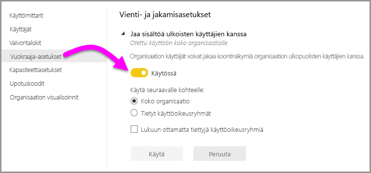

Seuraavassa kuvassa näet esiin tulevan ilmoituksen, kun jaat ulkoiselle käyttäjälle.

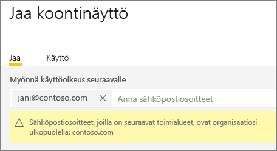  

### Julkaise verkkoon

Organisaation käyttäjät voivat julkaista raportteja verkossa. [Lue lisää](service-publish-to-web.md)

Seuraavassa kuvassa näkyy raportin **Tiedosto**-valikko, kun **Julkaise verkkoon** -asetus on käytössä.

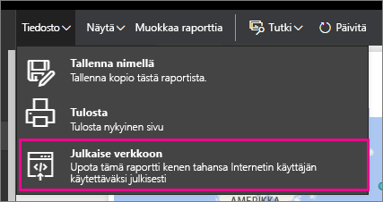

Käyttäjät näkevät käyttöliittymässä eri asetuksia sen mukaan, mikä heidän **Julkaise verkkoon** -asetuksensa on.

|Ominaisuus |Otettu käyttöön koko organisaatiolle |Otettu käyttöön koko organisaatiolle |Tietyt käyttöoikeusryhmät   |
|---------|---------|---------|---------|
|Raportin **Tiedosto**-valikon **Julkaise verkkoon** -toiminto|Käytössä kaikille|Ei näkyvissä kaikille|Näkyvissä vain valtuutetuille käyttäjille tai ryhmille.|
|**Asetukset**-valikon **Upotuskoodien hallinta**|Käytössä kaikille|Käytössä kaikille|Käytössä kaikille  * **Poista**-vaihtoehto vain valtuutetuille käyttäjille tai ryhmille. * **Hae koodit** käytössä kaikille.|
|**Upotuskoodit** hallintaportaalissa|Tila ilmaisee jotain seuraavista: * Aktiivinen * Ei tuettu * Estetty|Tilana näytetään **Ei käytössä**|Tila ilmaisee jotain seuraavista: * Aktiivinen * Ei tuettu * Estetty  Jos käyttäjälle ei ole annettu oikeuksia vuokraaja-asetuksissa, tilana näytetään **Loukannut**.|
|Aiemmin luodut julkaistut raportit|Kaikki käytössä|Kaikki poissa käytöstä|Raportit näytetään jatkossakin kaikille.|

### Tietojen vieminen

Organisaation käyttäjät voivat viedä tietoja ruudusta tai visualisoinnista. [Lue lisää](visuals/power-bi-visualization-export-data.md)

Seuraavassa kuvassa näkyy tietojen vieminen ruudusta.

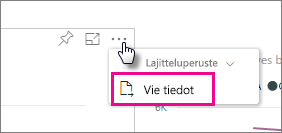

> [!NOTE]
> Jos poistat **Vie tiedot** -toiminnon käytöstä, käyttäjät eivät voi käyttää myöskään **Analysoi Excelissä** -toimintoa tai Power BI -palvelun reaaliaikaista yhteyttä.

### Vie raportit PowerPoint-esityksinä tai PDF-tiedostoina

Organisaation käyttäjät voivat viedä Power BI -raportteja PowerPoint-tiedostoina tai PDF-tiedostoina. [Lue lisää](consumer/end-user-powerpoint.md)

Seuraavassa kuvassa näkyy raportin **Tiedosto**-valikko, kun **Vie raportit PowerPoint-esityksinä tai PDF-tiedostoina** -asetus on käytössä.

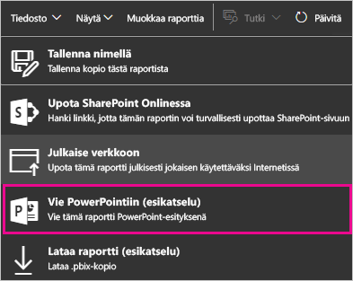

### Tulosta raporttinäkymiä ja raportteja

Organisaation käyttäjät voivat tulostaa koontinäyttöjä ja raportteja. [Lue lisää](consumer/end-user-print.md)

Seuraavassa kuvassa näkyy koontinäytön tulostaminen.

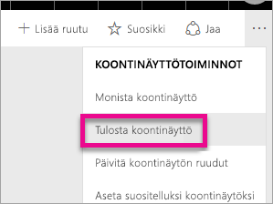

Seuraavassa kuvassa näkyy raportin **Tiedosto**-valikko, kun **Tulosta koontinäyttöjä ja raportteja** -asetus on käytössä.

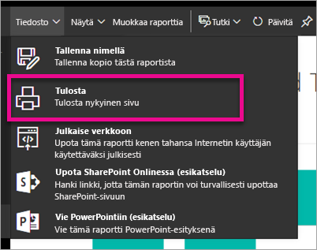

### Salli ulkoisten vieraskäyttäjien muokata ja hallita sisältöä organisaatiossa
Azuren B2B-vieraskäyttäjät voivat muokata ja hallita sisältöä organisaatiossa. [Lue lisää](service-admin-azure-ad-b2b.md)

Seuraava kuva näyttää asetuksen Salli ulkoisten vieraskäyttäjien muokata ja hallita sisältöä organisaatiossa.

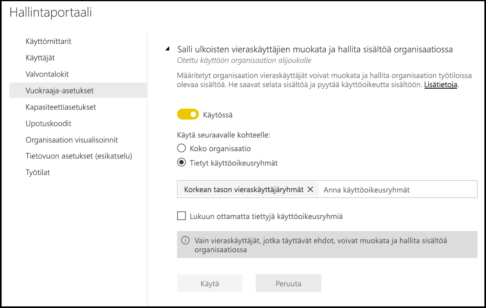

### Sähköpostitilaukset
Organisaatiosi käyttäjät voivat luoda sähköpostitilauksia. Lue lisää [tilauksista](service-report-subscribe.md).

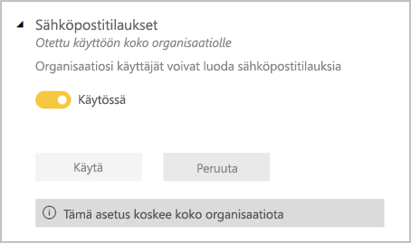

## Sisältöpaketin ja sovelluksen asetukset

### Julkaise sisältöpaketteja ja sovelluksia koko organisaatiolle

Järjestelmänvalvojat voivat tämän asetuksen avulla päättä, ketkä käyttäjät voivat julkaista sisältöpaketteja ja sovelluksia koko organisaatiolle vain tietyille ryhmille julkaisemisen sijasta. Lue lisää [sovellusten julkaisemisesta](service-create-distribute-apps.md).

Seuraavassa kuvassa näkyy **Koko organisaatio** -vaihtoehto sisältöpaketin luomisessa.

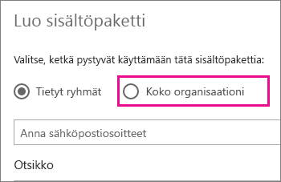

### Luo mallisovelluksia ja organisaation sisältöpaketteja

Organisaation käyttäjät voivat luoda mallisovelluksia ja organisaation sisältöpaketteja, jotka käyttävät yhteen tietolähteeseen perustuvia tietojoukkoja Power BI Desktopissa. Lue lisää [mallisovelluksista](template-content-pack-authoring.md).

### Lähetä sovellukset käyttäjille

Raporttien luojat voivat jakaa sovelluksia suoraan käyttäjien kanssa ilman asennusta [AppSourcesta](https://appsource.microsoft.com). Lue lisää [sovellusten automaattisesta asentamisesta loppukäyttäjille](service-create-distribute-apps.md#automatically-install-apps-for-end-users).

## Integrointiasetukset

### Kysymysten esittäminen tiedoille Cortanan avulla

Organisaation käyttäjät voivat kysyä kysymyksiä tiedoistaan Cortanan avulla. [Lue lisää](service-cortana-enable.md)

> [!NOTE]
> Tämä asetus koskee koko organisaatiota, joten sitä ei rajoittaa ryhmien avulla.

### Analysoi Excelissä -toiminnon käyttäminen paikallisten tietojoukkojen kanssa

Organisaation käyttäjät voivat käyttää paikallisia Power BI -tietojoukkoja Excelillä. [Lue lisää](service-analyze-in-excel.md)

> [!NOTE]
> Jos poistat **Vie tiedot** -toiminnon käytöstä, estät käyttäjiä käyttämästä myös **Analysoi Excelissä** -toimintoa.

### ArcGIS Maps for Power BI:n käyttäminen

Organisaation käyttäjät voivat käyttää Esrin tarjoamaa ArcGIS Maps for Power BI -visualisointia. [Lue lisää](visuals/power-bi-visualization-arcgis.md)

### Power BI:n yleisen haun käyttäminen (esikatselu)

Organisaation käyttäjät voivat käyttää Azure-hausta riippuvaisia ulkoisia hakutoimintoja. Käyttäjät voivat esimerkiksi käyttää Cortanaa avaintietojen noutamiseen suoraan Power BI -koontinäytöistä ja raporteista. [Lue lisää](service-cortana-intro.md)

## Mukautettujen visualisointien asetukset

### Lisää ja käytä mukautettuja visualisointeja

Organisaation käyttäjät voivat käyttää mukautettuja visualisointeja ja jakaa niitä. [Lue lisää](power-bi-custom-visuals.md)

> [!NOTE]
> Tämä asetus voidaan ulottaa koskemaan koko organisaatiota tai rajoittaa määrättyihin ryhmiin.

Power BI Desktop (alkaen maaliskuun 2019 julkaisusta) tukee **ryhmäkäytäntöä** mukautettujen visualisointien poistamiseksi käytöstä organisaation käyttöön otetuilla tietokoneilla.

<table>
<tr><th>Määrite</th><th>Arvo</th>
</tr>
<td>avain</td>
    <td>Software\Policies\Microsoft\Power BI Desktop\</td>
<tr>
<td>valueName</td>
<td>EnableCustomVisuals</td>
</tr>
</table>

Arvo 1 (desimaalimuotoinen) ottaa käyttöön mukautetut visualisoinnit Power BI:ssä (tämä on oletusarvo).

Arvo 0 (desimaalimuotoinen) poistaa käytöstä mukautetut visualisoinnit Power BI:ssä.

### Salli vain sertifioidut visualisoinnit

Organisaation käyttäjät, joille on annettu oikeudet lisätä ja käyttää mukautettuja visualisointeja ”Lisää ja käytä mukautettuja visualisointeja” -asetuksen mukaisesti, saavat käyttää ainoastaan [sertifioituja mukautettuja visualisointeja](https://go.microsoft.com/fwlink/?linkid=2002010) (sertifioimattomat visualisoinnit estetään ja käyttöyritys johtaa virheilmoitukseen). 

Power BI Desktop (alkaen maaliskuun 2019 julkaisusta) tukee **ryhmäkäytäntöä** sertifioimattomien mukautettujen visualisointien poistamiseksi käytöstä organisaation käyttöön otetuilla tietokoneilla.

<table>
<tr><th>Määrite</th><th>Arvo</th>
</tr>
<td>avain</td>
    <td>Software\Policies\Microsoft\Power BI Desktop\</td>
<tr>
<td>valueName</td>
<td>EnableUncertifiedVisuals</td>
</tr>
</table>

Arvo 1 (desimaalimuotoinen) ottaa käyttöön sertifioimattomat mukautetut visualisoinnit Power BI:ssä (tämä on oletusarvo).

Arvo 0 (desimaalimuotoinen) poistaa käytöstä sertifioimattomat mukautetut visualisoinnit Power BI:ssä (tämä asetus sallii vain [sertifioidut mukautetut visualisoinnit](https://go.microsoft.com/fwlink/?linkid=2002010)).

## R-visualisointien asetukset

### Tee toimia R-visualisointien kanssa ja jaa niitä

Organisaation käyttäjät voivat käyttää R-komentosarjoilla luotuja visualisointeja ja jakaa niitä. [Lue lisää](visuals/service-r-visuals.md)

> [!NOTE]
> Tämä asetus koskee koko organisaatiota, joten sitä ei rajoittaa ryhmien avulla.

## Valvonta- ja käyttöasetukset

### Valvontalokien luominen sisäisen toiminnan valvonnan ja vaatimustenmukaisuuden tarpeisiin

Organisaation käyttäjät voivat valvoa muiden käyttäjien Power BI:ssä tekemiä toimia. [Lue lisää](service-admin-auditing.md)

Tämän asetuksen täytyy olla käytössä, jotta valvontalokiin kirjataan merkintöjä. Valvonnan käyttöönoton ja valvontatietojen tarkastelumahdollisuuden välillä voi olla jopa 48 tunnin viive. Jos et näe tietoja välittömästi, tarkista valvontalokit myöhemmin. Jos haet oikeuksia hallintalokien tarkasteluun, samanlainen viive voi esiintyä, ennen kuin oikeudet on myönnetty.

> [!NOTE]
> Tämä asetus koskee koko organisaatiota, joten sitä ei rajoittaa ryhmien avulla.

### Käyttötiedot sisällöntekijöille

Organisaation käyttäjät voivat tarkastella luomiensa koontinäyttöjen ja raporttien käyttötietoja. [Lue lisää](service-usage-metrics.md)

### Käyttäjäkohtaiset tiedot sisällöntekijöille tarkoitetuissa käyttötiedoissa

Sisällöntekijöille tarkoitetut käyttötiedot paljastavat sisällön käyttäjien näyttönimet ja sähköpostiosoitteet. [Lue lisää](service-usage-metrics.md)

Oletusarvoisesti käyttäjäkohtaiset tiedot on otettu käyttöön käyttötiedoille ja sisällöntekijän tilitiedot sisältyvät tietoraporttiin. Jos et halua kerätä näitä tietoja kaikille käyttäjille, voit poistaa ominaisuuden käytöstä määritetyille käyttöoikeusryhmille tai koko organisaatiolle. Tilitiedot näkyvät sitten raportissa pois jätetyille käyttäjille *nimettöminä*.

## Koontinäytön asetukset

### Koontinäyttöjen tietojen luokittelu

Organisaation käyttäjät voivat merkitä koontinäyttöjä luokituksilla, jotka ilmaisevat koontinäyttöjen suojaustasoja. [Lue lisää](service-data-classification.md)

> [!NOTE]
> Tämä asetus koskee koko organisaatiota, joten sitä ei rajoittaa ryhmien avulla.

## Kehittäjäasetukset

### Sisällön upottaminen sovelluksiin

Organisaation käyttäjät voivat upottaa Power BI -koontinäyttöjä ja -raportteja SaaS-sovelluksiin (palveluina tarjottaviin sovelluksiin). Jos poistat tämän asetuksen käytöstä, käyttäjät eivät näe REST-ohjelmointirajapintoja, joilla he voivat upottaa Power BI -sisältöä sovelluksiin. [Lue lisää](developer/embedding.md)

### Salli palvelun päänimien käyttää Power BI -ohjelmointirajapintoja

Azure Active Directoryyn (Azure AD) rekisteröidyt verkkosovellukset käyttävät määritettyä palvelun päänimeä Power BI -ohjelmointirajapintojen käyttöön ilman sisäänkirjautunutta käyttäjää. Jotta sovellus voi käyttää todennustyyppinä palvelun päänimeä, sen palvelun päänimen on sisällyttävä sallittuun käyttöoikeusryhmään. [Lue lisää](developer/embed-service-principal.md)

> [!NOTE]
> Palvelun päänimet perivät käyttöoikeudet kaikkiin Power BI -vuokraaja-asetuksiin käyttöoikeusryhmästään. Jos haluat rajoittaa käyttöoikeuksia, luo erillinen käyttöoikeusryhmä palvelun päänimille ja lisää se asianmukaisten käyttöön otettujen Power BI -asetusten Lukuun ottamatta tiettyjä käyttöoikeusryhmiä -luetteloon.

## Tietovuon asetukset

### Tietovoiden luominen ja käyttäminen

Organisaatiosi käyttäjät voivat luoda ja käyttää tietovoita. Saat yleiskatsauksen tietovoista artikkelista [Omatoiminen tietojen valmistelu Power BI:ssä](service-dataflows-overview.md). Jos haluat ottaa tietovuot käyttöön Premium-kapasiteetissa, tutustu artikkeliin [Kuormitusten määrittäminen](service-admin-premium-workloads.md).

> [!NOTE]
> Tämä asetus koskee koko organisaatiota, joten sitä ei rajoittaa ryhmien avulla.

## Mallisovellusten asetukset

Kolme asetusten hallinnan mallisovelluksen kyky julkaista tai asentaa mallisovelluksia.

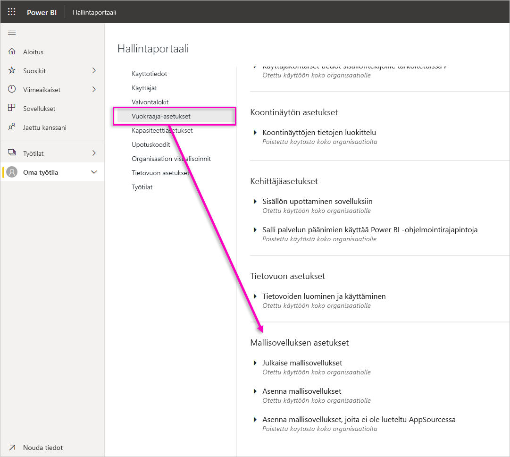

### Julkaise mallisovellukset

Organisaation käyttäjät voivat luoda mallisovellusten työtiloja. Ohjausobjekti, jonka avulla käyttäjät voivat julkaista mallisovelluksia tai jakaa niitä organisaatiosi ulkopuolisille asiakkaille [AppSourcen](https://appsource.microsoft.com) tai jonkin muun jakelumenetelmän kautta.

### Asenna AppSourcessa luetellut mallisovellukset

Organisaation käyttäjät voivat ladata ja asentaa mallisovelluksia mallin **vain** [AppSourcesta](https://appsource.microsoft.com). Ohjausobjekti, jonka avulla tietyt käyttäjät tai käyttöoikeusryhmät voivat asentaa mallisovelluksia AppSourcesta.

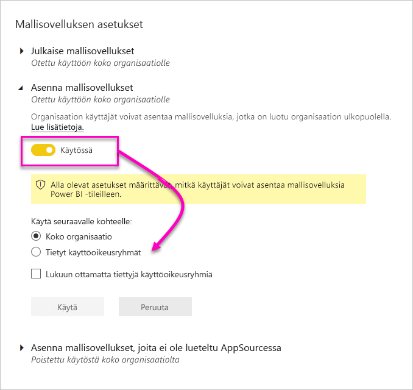

### Asenna mallisovellukset, joita ei ole lueteltu AppSourcessa

Ohjausobjekti, jonka avulla organisaation käyttäjät voivat ladata ja asentaa mallisovelluksia, **joita ei ole lueteltu [AppSourcessa](https://appsource.microsoft.com)** .

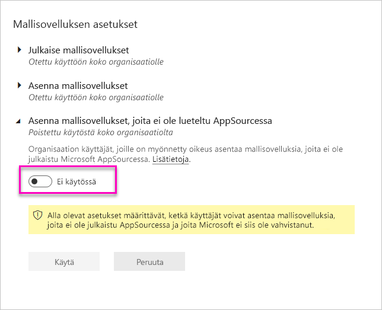

## Kapasiteettiasetukset

### Power BI Premium

**Power BI Premium** -välilehdessä voit hallita mitä tahansa organisaatiollesi ostettua Power BI Premium -kapasiteettia (EM- tai P-varastointiyksikkö). Kaikki organisaation käyttäjät näkevät **Power BI Premium** -asetusten välilehden, mutta sen sisällön näkevät vain käyttäjät, joilla on *kapasiteetin järjestelmänvalvojan* oikeudet tai määrityskäyttöoikeudet. Jos käyttäjällä ei ole mitään oikeuksia, näyttöön tulee seuraava ilmoitus.

### Power BI Embedded

**Power BI Embedded** -välilehden avulla voit tarkastella Power BI Embedded (A-varastointiyksikkö) -kapasiteetteja, jotka olet ostanut asiakkaalle. Koska voit ostaa A-varastointiyksikköjä vain Azuresta, voit [hallita Azuren upotettuja kapasiteetteja](developer/azure-pbie-create-capacity.md) **Azure-portaalista**.

Lisätietoja siitä, miten voit hallita Power BI Embedded (A-varastointiyksikkö) -asetuksia, on artikkelissa [Mikä on Power BI Embedded](developer/azure-pbie-what-is-power-bi-embedded.md).

## Upotuskoodit

Järjestelmänvalvojana voit tarkastella vuokraajatilillesi luotuja upotuskoodeja. Voit myös kumota tai poista koodeja. [Lue lisää](service-publish-to-web.md)

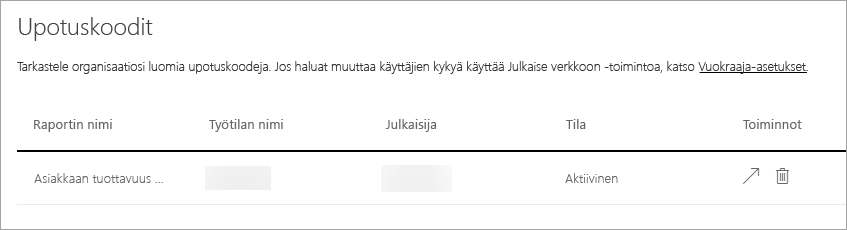

 ## <a name="organizational-visuals">Organisaation visualisoinnit.</a> 

**Organisaation visualisoinnit** -välilehden avulla voit ottaa käyttöön ja hallita organisaatiosi mukautettuja visualisointeja. Organisaation visualisointien avulla voit helposti käyttää omia visualisointeja organisaatiossa, ja raporttien tekijät voivat sitten hakea ja tuoda niitä raportteihinsa Power BI Desktopista. [Lue lisää](power-bi-custom-visuals-organization.md)

> [!WARNING]
> Mukautettu visualisointi voi sisältää koodia, jolla on tietoturva- tai tietosuojariskejä. Varmista siis, että luotat mukautetun visualisoinnin tekijään ja lähteeseen, ennen kuin otat sen käyttöön organisaation säilössä.

Seuravasta kuvasta näet kaikki mukautetut visualisoinnit, jotka on tällä hetkellä otettu käyttöön organisaation säilössä.

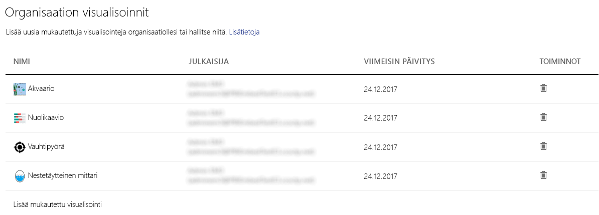

### Uuden mukautetun visualisoinnin lisääminen

Jos haluat lisätä luetteloon uuden mukautetun visualisoinnin, toimi seuraavasti. 

1. Valitse oikeanpuoleisessa ruudussa **Lisää mukautettu visualisointi**.

    

1. Täytä **Mukautetun visualisoinnin lisääminen** -lomake:

    * **Valitse .pbiviz-tiedosto** (pakollinen): valitse ladattava mukautetun visualisoinnin tiedosto. Vain versioituja ohjelmointirajapinnan mukautettuja visualisointeja tuetaan (lue täältä lisätietoja siitä, mitä tämä tarkoittaa).

    Tarkista ennen visualisoinnin lataamista, että sen tietoturva ja tietosuoja täyttävät organisaatiosi vaatimukset.

    * **Nimeä mukautetut visualisoinnit** (pakollinen): anna visualisoinnille lyhyt nimi, jotta Power BI Desktopin käyttäjät tietävät, mitä se tekee.

    * **Kuvake**: Power BI Desktopin käyttöliittymässä näytettävä kuvaketiedosto.

    * **Kuvaus**: anna visualisoinnille lyhyt kuvaus, joka kertoo käyttäjille sen toiminnasta.

1. Aloita latauspyyntö valitsemalla **Käytä**. Jos lataus onnistuu, näet uuden kohteen luettelossa. Jos lataus epäonnistuu, saat virheilmoituksen.

### Mukautetun visualisoinnin poistaminen luettelosta

Jos haluat poistaa visualisoinnin pysyvästi, valitse visualisoinnin roskakorikuvake säilössä.

> [!IMPORTANT]
> Poistamista ei voi kumota. Kun visualisointi poistetaan, sen näyttäminen olemassa olevissa raporteissa lopetetaan heti. Vaikka lataat saman visualisoinnin uudelleen, se ei korvaa aiemmin poistettua. Käyttäjät voivat kuitenkin tuoda uuden visualisoinnin uudelleen ja korvata sillä raporteissaan esiintyvän visualisoinnin.

### Mukautetun visualisoinnin poistaminen käytöstä luettelossa

Jos haluat poistaa visualisoinnin käytöstä organisaation säilöstä, valitse rataskuvake. Poista mukautettu visualisointi käytöstä **Käyttö**-osiossa.

Kun olet poistanut visualisoinnin käytöstä, visualisointia ei hahmonneta olemassa oleviin raportteihin, ja näet alla olevan virhesanoman.

*Tämä mukautettu visualisointi ei ole enää käytettävissä. Saat lisätietoja ottamalla yhteyttä järjestelmänvalvojaasi.*

Suosikkeihin lisätyt visualisoinnit toimivat kuitenkin edelleen.

Päivitysten tai järjestelmänvalvojan muutoksen jälkeen Power BI Desktop -käyttäjien on käynnistettävä sovellus uudelleen tai päivitettävä selain Power BI -palvelussa, jotta päivitykset näkyvät.

### Visualisoinnin päivittäminen

Jos haluat päivittää visualisoinnin organisaation säilöstä, valitse rataskuvake. Hae uuden version visualisointi selaamalla ja lataa se.

Varmista, että visualisoinnin tunnus pysyy samana. Uusi tiedosto korvaa aiemman tiedoston kaikissa organisaation raporteissa. Jos visualisoinnin uusi versio rikkoo minkä tahansa sen aiemman version käyttö- tai tietorakenteen, älä korvaa aiempaa versiota. Lue sen sijaan visualisoinnista uusi versio, joka luetellaan erikseen. Voit esimerkiksi lisätä uuden luetteloidun visualisoinnin nimeen versionumeron (versio X.X). Näin käyttäjät tietävät, että kyseessä on saman visualisoinnin päivitetty versio, ja voivat välttää olemassa olevien raporttien toimintojen virheet sekä ongelmat. Varmista taas, että visualisoinnin tunnus pysyy samana. Kun käyttäjä sitten seuraavan kerran siirtyy organisaatioon säilöön Power BI Desktopista, hän voi tuoda uuden version. Tässä yhteydessä häneltä kysytään, haluaako hän korvata raportissa olevan nykyisen version.

Saat lisätietoja [organisaation mukautettujen visualisointien usein kysytyistä kysymyksistä](https://docs.microsoft.com/power-bi/power-bi-custom-visuals-faq#organizational-custom-visuals).

## <a name="dataflowStorage">Tietovuon tallennustila (esikatselu)</a>

Oletusarvon mukaan Power BI:ssä käytetyt tiedot tallennetaan Power BI:n tarjoamaan sisäiseen tallennustilaan. Tietovoiden ja Azure Data Lake Storage Gen2 (ADLS Gen2) -järjestelmän integroinnin myötä voit tallentaa tietovuot organisaatiosi Azure Data Lake Storage Gen2 -tilille. Lisätietoja on kohdassa [Tietovuot ja Azure Data Lake -integrointi (esikatselu)](service-dataflows-azure-data-lake-integration.md).

## Työtilat

Järjestelmänvalvojana voit tarkastella vuokraajassa olevia työtiloja. Voit lajitella ja suodattaa työtilojen luetteloja ja näyttää kunkin työtilan tiedot. Taulukon sarakkeet vastaavat [Power BI -järjestelmänvalvojan REST-ohjelmointirajapinnan](/rest/api/power-bi/admin) palauttamia ominaisuuksia työtiloille. Henkilökohtaiset työtilat ovat tyyppiä **PersonalGroup**, perinteiset työtilat tyyppiä **Group** ja uuden työtilakokemuksen työtilat tyyppiä **Workspace**. Katso lisätietoja artikkelista [Uusien työtilojen luominen Power BI:ssä](service-create-the-new-workspaces.md).

**Työtilat**-välilehdessä näkyy jokaisen työtilan *tila*. Seuraavassa taulukossa on lisätietoja näiden tilojen merkityksestä.

|Osavaltio  |Kuvaus  |
|---------|---------|
| Aktiivinen | Normaali työtila. Tämä ei kerro mitään käytöstä tai sisällöstä, vaan vain sen, että työtila itsessään on ”normaali”. |
| Yhteydetön | Työtila, jolla ei ole järjestelmänvalvojakäyttäjää. |
| Poistettu | Poistettu työtila. Metatietoja säilytetään riittävästi, jotta työtila voidaan palauttaa tarvittaessa. |
| Poistetaan | Työtila, jota ollaan poistamassa, mutta jota ei vielä ole poistettu. Käyttäjät voivat poistaa omat työtilansa, jolloin ne siirtyvät Poistetaan- tai Poistettu-tilaan. |

## Mukautus

Järjestelmänvalvojana voit mukauttaa Power BI:n ulkoasua koko organisaatiolle. Tällä hetkellä on kolme päävaihtoehtoa:

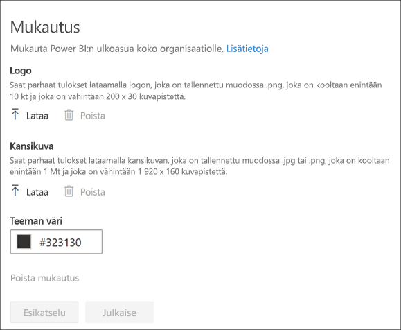

* **Lataa logo**: Saat parhaat tulokset lataamalla logon, joka on tallennettu muodossa .png, joka on kooltaan enintään 10 Kt ja joka on vähintään 200 x 30 kuvapistettä.

* **Lataa kansikuva**: Saat parhaat tulokset lataamalla kansikuvan, joka on tallennettu muodossa .jpg tai .png, joka on kooltaan enintään 1 Mt ja joka on vähintään 1 920 x 160 kuvapistettä.

* **Valitse teeman väri**: Voit valita teeman heksakoodin tai RGB-arvon perusteella, tai voit valita sen annetusta värivalikoimasta.

Katso lisätietoja artikkelista [Organisaation mukautus](http://aka.ms/orgBranding).

## Seuraavat vaiheet

[Power BI:n hallinta organisaatiossa](service-admin-administering-power-bi-in-your-organization.md)  
[Power BI -järjestelmänvalvojaroolin kuvaus](service-admin-role.md)  
[Organisaation Power BI:n valvonta](service-admin-auditing.md)  

Onko sinulla kysyttävää? [Voit esittää kysymyksiä Power BI -yhteisössä](https://community.powerbi.com/)
