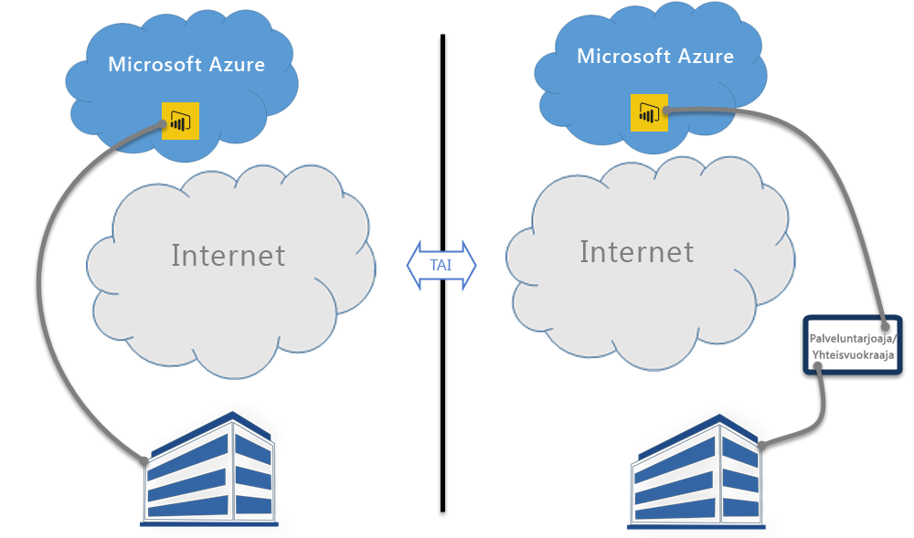

# Power BI ja ExpressRoute
**Power BI:n** ja **ExpressRouteb** avulla voit luoda yksityisen verkkoyhteyden omasta yrityksestä Power BI:lle (tai palveluntarjoajan ulkoistamisominaisuutta käyttämällä), ohittamalla Internetin suojataksesi entistä paremmin luottamuksellisia Power BI -tietoja ja yhteyksiä.

**ExpressRoute** on Azure-palvelu, jonka avulla voit luoda yksityisen yhteyden Azure tietokeskuksen (jossa Power BI sijaitsee) ja paikallisen infrastruktuurin väliset yhteydet, tai luoda yksityiset yhteydet Azure palvelinkeskusten ja yhdistävän sijoittamisen välillä.

Saat [lisätietoja ExpressRoutesta](https://azure.microsoft.com/services/expressroute/) tai saada tietää, [kuinka se tilataan](https://azure.microsoft.com/pricing/details/expressroute/).

> [!NOTE]
> Power BI tuetaan julkisen vertaisverkon tilassa, lue [nämä usein kysytyt kysymykset](https://docs.microsoft.com/azure/expressroute/expressroute-faqs).
> 
> 

## Power BI ExpressRouten poikkeukset
Power BI on yhteensopiva ExpressRouten kanssa muutamaa poikkeusta lukuun ottamatta, jossa Power BI noutaa tai lähettää tietoja julkisessa Internetissä. Nämä erityiset poikkeukset sisältävät usein staattisia tietoja, kuten selaimen määritystiedostoja, jotka on ladattu lähimmästä **sisällön toimitusverkostosta (CDN)**. Tästä on tiettyjä laajoja poikkeuksia, jotka koskevat kaikkia Power BI -palveluita ja joitakin palvelu- tai ominaisuuskohtaisia poikkeuksia, joista jokainen on kuvattu seuraavissa osissa.

### Yleistä poikkeuksia Power BI:ssa ja ExpressRoutessa
Poikkeus **Power BI:ssa** ja **ExpressRoutessa** tarkoittaa sitä, että Power BI:lle tai sieltä pois siirrettävät tiedot kulkevat julkisen Internetin kautta yksityisen ExpressRoute-linkin sijaan.

Kaksi yleistä poikkeusta Power BI:ssa ExpressRoutea käytettäessä ovat:

* Staattisia tiedostoja ladataan **sisällön toimitusverkostosta (CDN)** ja sivustoilta
* **Telemetria**-tiedot lähetetään julkisessa Internetissä

Power BI käyttää **Content Delivery Networkia** (CDN) tai verkkosivuja tarpeellisen staattisen sisällön ja tiedostojen jakamiseen käyttäjille aluekohtaisten asetusten perusteella julkisen Internetin kautta. Näitä staattisia tiedostoja ovat tuotteen lataukset (kuten **Power BI Desktop**, **paikallinen tietoyhdyskäytävä** tai **Power BI -sisältöpaketit** eri riippumattomilta palveluntarjoajilta), selaimen määritystiedostot, joita käytetään alustamaan ja muodostamaan myöhempiä yhteyksiä Power BI :lle samoin kuin alkuperäinen turvallinen Power BI -kirjautumissivu – todelliset tunnistetiedot lähetetään vain ExpressRouten kautta.   

Tiettyjen **telemetriatietojen** lähettäminen tapahtuu myös julkisen Internetin ja ExpressRouten kautta. Telemetriatiedot sisältävät käyttötilastoja ja vastaavaa tietoa, jotka toimitetaan palveluihin, joita käytetään valvomaan käyttöä ja aktiivisuutta.

### Power BI SaaS -sovellus ja ExpressRoute
Kun käyttäjä käynnistää yhteyden Power BI -palveluun (powerbi.comissa tai Cortanan kautta), Power BI:n aloitussivu, kirjautumissivu ja staattiset tiedostot, jotka valmistelevat selainta yhdistämään ja olemaan vuorovaikutuksessa Power BI:n kanssa noudetaan CDN:sta tai verkkosivuilta, jotka muodostavat yhteyden julkisen Internetin kautta.

Kun kirjautuminen on muodostettu, Power BI -tietojen vuorovaikutus tapahtuu ExpressRouten kautta, lukuun ottamatta tiettyjä ominaisuuksia ja palveluita, jotka riippuvat julkisen Internetin tiedoista:

* **Kartan visualisoinnit** edellyttävät yhteyttä ja tietojen siirtoa Bing Virtual Earth -palveluun tai Bing -sijaintitietojen lisäämispalveluun, joista kumpikin toimii julkisessa Internetissä.
* Power BI -integrointi **Cortanaan** edellyttää pääsyä Bingiin julkisessa Internetissä.
* Kun käyttäjä lisää **mukautettuja linkkejä** kuten kuva-pienoisohjelmia tai videon, Power BI edellyttää tietoja, jotka perustuvat käyttäjän antamaan linkkiin, joka saattaa käyttää tai olla käyttämättä ExpressRoutea.
* Käyttäjät voivat lähettää **palautetta Power BI:lle** tekstinä (ja halutessasi kuvina) User Voice -palautteena. Se on mekanismi, joka käyttää julkista Internetiä tietojen toimittamiseen.
* **Bing News -sisällöntuottaja** lataa sisältöä Bingistä käyttämällä julkista Internetiä.
* Muodostaessaan yhteyttä **sovelluksiin** (esimerkiksi sisältöpaketteihin), käyttäjiä vaaditaan usein antamaan tunnistetiedot ja asetukset SaaS-palveluntarjoajan esittämien sivujen kautta. Nämä sivut saattavat käyttää tai olla käyttämättä ExpressRoutea.

| Käyttäjien toiminta | Kohde |
| --- | --- |
| Aloitussivu (ennen kirjautumista) |`maxcdn.bootstrapcdn.com ; ajax.aspnetcdn.com ; netdna.bootstrapcdn.com ; cdn.optimizely.com; google-analytics.com ` |
| Kirjautuminen |`*.mktoresp.com ; *.aadcdn.microsoftonline-p.com ; *.msecnd.com ; *.localytics.com ; ajax.aspnetcdn.com` |
| Koontinäytön, raportin, tietojoukon hallinta (sisältää kartat ja sijaintitietojen lisäämisen) |`*.localytics.com ; *.virtualearth.net ; platform.bing.com; powerbi.microsoft.com; c.microsoft.com; app.powerbi.com; *.powerbi.com; dc.services.visualstudio.com ` |
| Tuki |`support.powerbi.com ; powerbi.uservoice.com ; go.microsoft.com ` |

### Power BI Desktop ja ExpressRoute
Power BI Desktop on myös ExpressRoute-yhteensopiva joitakin harvoja poikkeuksia lukuun ottamatta, jotka on kuvattu seuraavassa luettelossa:

* **Päivitysilmoitukset**, joiden avulla voit tunnistaa, onko käyttäjillä Power BI Desktopin uusin versio, käyttää julkisesta Internetiä.
* Tietyt **telemetria**tiedot lähetetään julkisessa Internetissä.
* **Kartan visualisoinnit** edellyttävät yhteyttä ja tietojen siirtoa **Bing Virtual Earth** -palveluun tai **Bing -sijaintitietojen lisäämispalveluun**, joista kumpikin toimii julkisessa Internetissä.
* **Hae tiedot** useista tietolähteistä, kuten **verkosta** tai kolmannen osapuolen SaaS-palveluntarjoajilta, käyttää julkista Internetiä.

### Power BI PaaS ja ExpressRoute
Power BI tarjoaa ohjelmointirajapintoja ja muita alustapohjaisia toimintoja, joiden avulla kehittäjät voivat luoda mukautettuja Power BI -ratkaisuja ja sovelluksia. Seuraavia palveluita, telemetrian ja CDN-tietojen lisäksi, joita käsiteltiin aiemmin tässä ohjeaiheessa, käytetään siirrettäessä Power BI PaaS -dataa julkisessa Internetissä:

| PaaS Activity | Lisäkohteita käytetään |
| --- | --- |
| Julkinen upotus (telemetria) |`c1.microsoft.com` |
| Mukautetut visualisoinnit (CDN) |`*.azureedge.net` |

Tietyt **mukautetut visualisoinnit** luodaan kolmansien osapuolten toimesta, osa niistä on Microsoftin luomia. Nämä sivut saattavat käyttää tai olla käyttämättä ExpressRoutea.

### Power BI Mobile ja ExpressRoute
Tämä asiakirja ei kata Power BI Mobile -sovellusten käyttöä.  

### Paikallinen tietoyhdyskäytävä ja ExpressRoute
Kun **paikallistan tietoyhdyskäytävää** käytetään Power BI:n kanssa, lähetykset ovat ExpressRoute-yhteensopivia lukuun ottamatta käyttäjän aktiivisuutta, joka on dokumentoitu aiemmassa tämän aiheen **Power BI SaaS -sovellus ja ExpressRoute** -osassa.  

