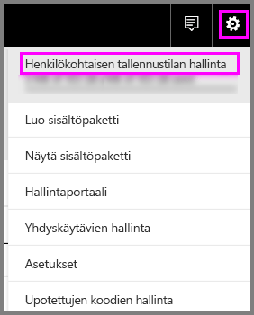
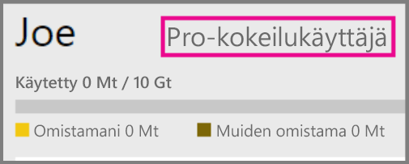
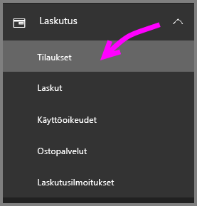
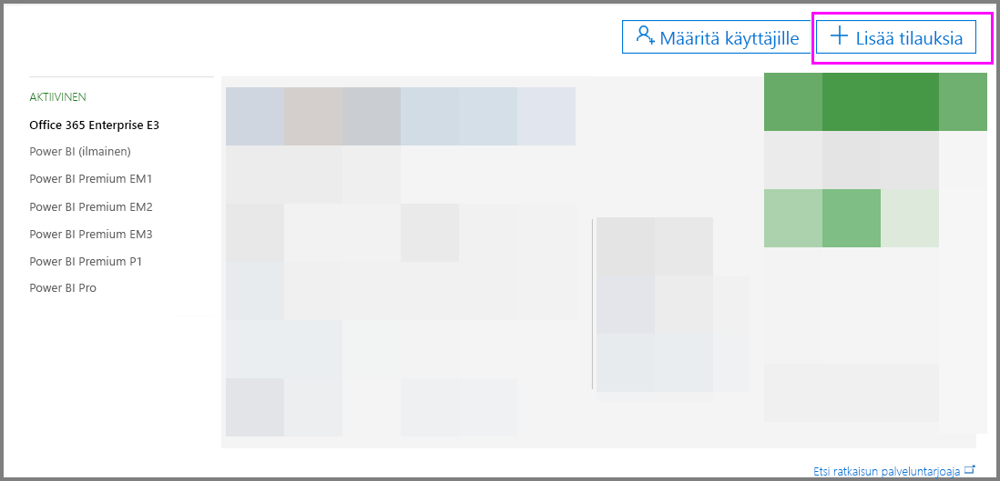
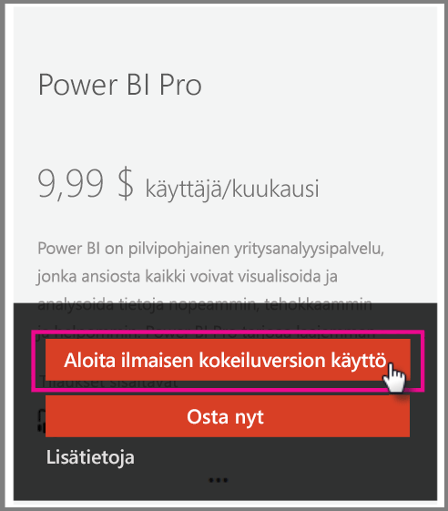

# Power BI Pro organisaatiossasi

Power BI Pro on maksullinen käyttöoikeus, joka mahdollistaa lisäominaisuuksien käyttöönoton. Power BI Pro -käyttöoikeudet ovat ryhmälle, joka haluaa jakaa ja tehdä yhteistyötä muiden kanssa tietopohjaisten päätösten tekemiseksi.  Mikäli sisältöä ei ole liitetty erityiseen kapasiteettiin Power BI Premium -ohjelman avulla, tarvitsee jokainen ryhmän jäsen Pro-lisenssin luodakseen tai tarkastellakseen jaettua Power BI -sisältöä.

Näiden ominaisuuksien käyttö edellyttää Power BI Pro -käyttöoikeutta:

* **Analysoi tietoja Excelissä tai Power BI Desktopissa** – Tarkastele ja käsittele Power BI:ssä julkaistuja tietojoukkoja Excelin tai Power BI Desktopin avulla. Jos haluat lisätietoja, katso [Analysoi Excelissä](service-analyze-in-excel.md).

* **Jaa koontinäyttöjä ja tee yhteistyötä työtilojen avulla** – Power BI -työtilat helpottavat yhteistyötä kollegoiden kanssa koontinäytöissä, raporteissa ja tietojoukoissa. Jos haluat lisätietoja, katso [Yhteistyön tekeminen Power BI -sovelluksen työtilassa](service-collaborate-power-bi-workspace.md).

* **Näytä jaettu sisältö** – Pro-käyttäjät voivat tarkastella, käyttää ja jakaa uudelleen heidän kanssaan jaettuja koontinäyttöjä ja raportteja (jos sallittu). Pro-käyttäjä ei kuitenkaan voi muokata näitä koontinäyttöjä tai raportteja. Jos haluat lisätietoja, katso [Jaa Power BI -koontinäyttösi ja raporttisi työtovereiden ja muiden kanssa](service-share-dashboards.md).

* **Integroi sisältöä Microsoft Teamsiin** – Voit lisätä Power BI -välilehden Microsoft (MS) Teams -kanavalle. MS Teams tunnistaa automaattisesti kaikki raportit työtilassa. Jos haluat lisätietoja, katso [Power BI yhdistyy Microsoft Teamsin kanssa](https://powerbi.microsoft.com/en-us/blog/power-bi-teams-up-with-microsoft-teams/). 

## Power BI Pron 60 päivän kokeiluversio yksityishenkilöille

Kun olet rekisteröinyt ilmaisen tilisi, voit halutessasi valita Pron kokeiltavaksi 60 päivän ajaksi maksuttomasti. Pystyt käyttämään kaikkia Pro-ominaisuuksia kokeiluversion ajan. Power BI Pro sisältää kaikki samat ominaisuudet kuin Power BI:n ilmainen versio sekä jakamiseen ja yhteiskäyttöön liittyviä lisäominaisuuksia. Jos haluat lisätietoja, katso [Power BI:n hinnoittelu](https://powerbi.microsoft.com/en-us/pricing/). Kokeile Power BI Pron 60 päivän maksutonta kokeilujaksoa kirjautumalla Power BI:hin. Saat käyttöösi muun muassa nämä Power BI Pro -ominaisuudet:

* [Luo työtila](service-create-distribute-apps.md)
* [Jaa koontinäyttö](service-share-dashboards.md)

Kun kokeilet mitä tahansa näistä ominaisuuksista, sinua pyydetään aloittamaan ilmainen kokeilujaksosi. Voit myös halutessasi käyttää sitä napsauttamalla rataskuvaketta ja valitsemalla Hallitse henkilökohtaista tallennustilaa. Valitse sitten oikealta Kokeile Prota ilmaiseksi.

   
    
   

Sitten voit valita Aloita kokeilu.

   

> [!NOTE]
> Käyttäjät, jotka hyödyntävät tätä tuotekohtaista Power BI Pro -kokeiluversiota, eivät näy Office 365:n järjestelmävalvojien portaalissa Power BI Pro Trial -käyttäjinä (he näkyvät Power BI:n ilmaiskäyttäjinä). He näkyvät kuitenkin Power BI Pro -kokeiluversion käyttäjinä Power BI:n tallennussivun hallinnassa.
>

> [!NOTE]
> Jos olet järjestelmänvalvoja ja haluat hankkia ja ottaa käyttöön Power BI -kokeilujakson käyttöoikeudet useille organisaation käyttäjille siten, ettei yksittäisiltä käyttäjiltä edellytetä käyttöehtojen hyväksymistä, voit rekisteröityä Power BI Pro -kokeiluversion käyttäjäksi. Järjestelmänvalvojan kokeiluversion rekisteröimistä varten sinun on oltava Office 365:n yleinen tai laskutuksen järjestelmänvalvoja tai luotava uusi vuokraaja. Saat lisätietoja ohjeartikkelista [Power BI Pron ostaminen](service-admin-purchasing-power-bi-pro.md).
>

Kun olet sisällä palvelussa, voit tarkistaa, että sinulla on Pro-kokeilutili napsauttamalla rataskuvaketta ja valitsemalla Hallinnoi henkilökohtaista tallennustilaa.

   

## Office 365:n kokeiluversion tilaus

Voit saada Power BI Pron kokeiluversiona organisaatiollesi. Kun sinulla on tilaus, voit määrittää Power BI Pron käyttöoikeudet käyttäjillesi. Lisätietoja käyttöoikeuksien määrittämisestä on artikkelissa [Määritä käyttöoikeuksia Office 365 -käyttäjille](https://support.office.com/en-us/article/assign-licenses-to-users-in-office-365-for-business-997596b5-4173-4627-b915-36abac6786dc?ui=en-US&rs=en-US&ad=US).

> [!NOTE]
> Jokaista vuokraajaa kohti on rajattu vain yksi organisaatiokohtainen kokeiluversio. Tämä tarkoittaa sitä, että jos vuokraajallasi on jo käytössä Power BI Pro -kokeiluversio, et voi enää hankkia sitä uudelleen. Jos tarvitset apua, voit ottaa yhteyttä [Office 365:n laskutustukeen](https://support.office.microsoft.com/en-us/article/contact-support-for-business-products-admin-help-32a17ca7-6fa0-4870-8a8d-e25ba4ccfd4b?CorrelationId=552bbf37-214f-4202-80cb-b94240dcd671&ui=en-US&rs=en-US&ad=US).
>

Saat Office 365:n kokeiluversion seuraavasti:

1. Siirry [Office 365:n hallintakeskukseen](https://portal.office.com/adminportal/home#/homepage).
2. Valitse vasemmalla olevassa siirtymisruudussa Laskutus ja napsauta sitten Tilaukset.

   

3. Valitse oikealta puolelta Lisää tilauksia.

   

4. Muiden palvelupakettien alla siirrä hiiren osoitin Power BI Pron kolmen pisteen päälle ja valitse Aloita ilmaisen kokeiluversion käyttö.

    

5. Valitse Kokeile nyt tilauksen vahvistusnäytöllä.
6. Valitse tilausvahvistuksessa Jatka.

## Power BI Pron ostaminen

Voit ostaa Power BI Pron Microsoft Office 365:n tai sertifioidun Microsoft-kumppanin kautta. Katso lisätietoja Power BI Pron ostamisesta artikkelista [Power BI Pron ostaminen](service-admin-purchasing-power-bi-pro.md).

## Seuraavat vaiheet
[Omatoiminen kirjautuminen Power BI:hin](service-admin-signing-up-for-power-bi-with-a-new-office-365-trial.md)
 
[Power BI (ilmainen) organisaatiossasi](service-admin-service-free-in-your-organization.md)
 
[Power BI Pron ostaminen](service-admin-purchasing-power-bi-pro.md)
 
[Laajennetun Pro-kokeiluversion aktivointi](service-extended-pro-trial.md)
 
[Power BI Pro -käyttöoikeuksien määrittäminen](service-admin-assigning-power-bi-pro-licenses.md)
 
[Power BI Premium – mikä se on?](service-admin-premium-manage.md)
 
[Ohjeet Power BI Premiumin ostamiseen](service-admin-premium-purchase.md)
 
[Power BI Premiumin tekninen raportti](https://aka.ms/pbipremiumwhitepaper)

Onko sinulla muuta kysyttävää? [Voit esittää kysymyksiä Power BI -yhteisössä](https://community.powerbi.com/)