# Kapasiteettien hallinta Power BI Premiumissa ja Power BI Embeddedissä
Opi, miten voit hallita Power BI Premiumin ja Power BI Embeddedin kapasiteetteja, jotka tarjoavat sisällöllesi erillisiä resursseja.

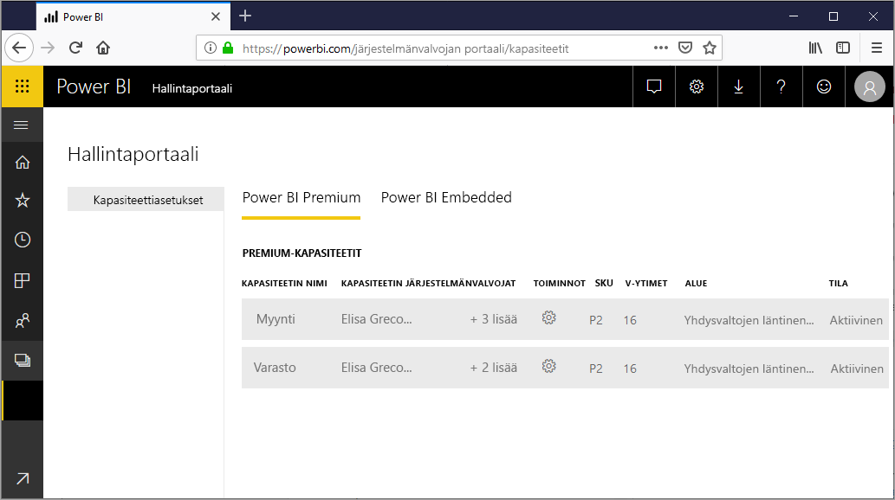

Kapasiteetti on Power BI Premium- ja Power BI Embedded -tuotteiden ydin

## Mitä kapasiteetti on?
Kapasiteetti on ainoastaan sinun käyttöösi varattujen resurssien joukko. Kapasiteetin avulla voit julkaista koontinäyttöjä, raportteja ja tietojoukkoja organisaatiosi käyttäjille ilman, että sinun tarvitsee ostaa heille käyttöoikeuksia. Se takaa myös kapasiteettiin tallennetun sisällön luotettavan, tasalaatuisen suorituskyvyn.

Käyttäjäsi eivät voi havaita kapasiteettia. He käyttävät Power BI:tä tai sovellustasi kuten ennenkin. Heidän ei tarvitse tietää, että osa (tai kaikki) sisällöstä isännöidään sinulle varatussa kapasiteetissa. Käyttäjille kaikki toimii kuten ennenkin.

[!INCLUDE [powerbi-premium-illustration](./includes/powerbi-premium-illustration.md)]

Lisätietoja on ohjeartikkelissa [Mikä Power BI Premium on ?](service-premium.md).

### Kapasiteetin järjestelmänvalvojat
> [!NOTE]
> Power BI Embeddedin kapasiteetin järjestelmänvalvojat määritetään Microsoft Azure -portaalissa.

Kapasiteetin järjestelmänvalvojilla on kapasiteetin ja sen hallintaominaisuuksien täydelliset hallintaoikeudet. Voit lisätä uusia kapasiteetin järjestelmänvalvojia (vain Power BI Premium) tai antaa käyttäjille kapasiteetin määrittämisoikeuksia Power BI -hallintaportaalissa. Voit joukkomäärittää työtiloja kapasiteetille ja tarkastella kapasiteetin käyttötilastoja.

Jokaisella kapasiteetilla on omat järjestelmänvalvojansa. Kapasiteetin järjestelmänvalvojan määrittäminen ei myönnä kyseiselle henkilölle käyttöoikeuksia organisaation muihin kapasiteetteihin. Oletusarvoisesti kapasiteetin järjestelmänvalvojilla ei ole käyttöoikeuksia Power BI -järjestelmänvalvojien kaikkiin alueisiin, kuten käyttötilastoihin, valvontalokeihin tai vuokraajan asetuksiin. Kapasiteettien järjestelmänvalvojilla ei myöskään ole oikeutta uusien kapasiteettien määrittämiseen tai olemassa olevien kapasiteettien SKU:n muuttamiseen. Vain Yleiset järjestelmänvalvojat tai Power BI -palvelun järjestelmänvalvojat voivat käyttää näitä kohteita.

Kaikki Office 365:n Yleiset järjestelmänvalvojat ja Power BI -järjestelmänvalvojat ovat automaattisesti Power BI Premium- ja Power BI Embedded -kapasiteetin järjestelmänvalvojia.

## Kapasiteetin ostaminen
Jotta voit hyödyntää sinulle varatun kapasiteetin, sinun on ostettava Power BI Premium -tilaus Office 365 -hallintakeskuksesta tai luoda Power BI Embedded -resurssi Microsoft Azure -portaalissa. Katso lisätietoa seuraavista linkeistä:

* **Power BI Premium:** [Ohjeet Power BI Premiumin ostamiseen](service-admin-premium-purchase.md)
* **Power BI Embedded:** [Power BI Embedded -kapasiteetin luominen Azure-portaalissa](https://docs.microsoft.com/en-us/azure/power-bi-embedded/create-capacity)

Kun ostat Power BI Premium -SKU:ita, vuokraaja saavat vastaavan määrän v-ytimiä kapasiteettien käsittelyyn. Esimerkiksi Power BI Premium P3 -SKU:n ostaminen antaa vuokraajan käyttöön 32 v-ydintä.

> [!NOTE]
> Tilauksen päättymisen jälkeen sinulla on täydelliset käyttöoikeudet 30 päivän ajan, minkä jälkeen sisältö palautetaan jaettuun kapasiteettiin. Yli 1 gigatavun kokoisia malleja ei tueta tavallisella jaetulla käyttöoikeudella.

## Hallitse kapasiteettia
Kun olet ostanut kapasiteettisolmuja Office 365:ssä, sinun on määritettävä ne uudelle kapasiteetille. Tämä tehdään [Power BI -hallintaportaalista](service-admin-portal.md). Näet hallintaportaalissa **Kapasiteettiasetukset**-osion. Sen kautta voit hallita organisaatiosi Power BI Premium -kapasiteetteja.

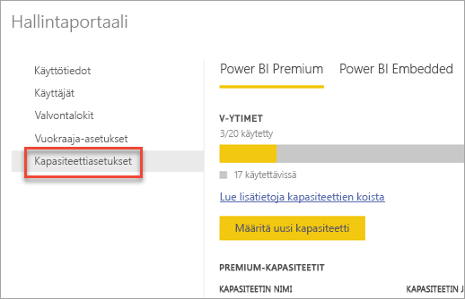

**Kapasiteettiasetusten** valitseminen siirtää sinut oletuksena Power BI Premium -kapasiteetin hallintanäyttöön.

### Uuden kapasiteetin määrittäminen (Power BI Premium)
V-ytimien määrä kuvastaa kapasiteettien luomiseen käytettyä ja käytettävissä olevaa määrää. Organisaatiosi käytettävissä olevien v-ytimien määrä perustuu ostamiisi Premium-SKU:ihin. Esimerkiksi ostamalla P3:n ja P2:n saat käyttöösi 48 ydintä – 32 P3:sta ja 16 P2:sta.

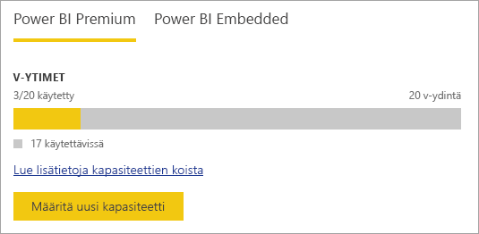

Jos sinulla on käytettävissäsi v-ytimiä, määritä uusi kapasiteetti seuraavasti.

1. Valitse **Määritä uusi kapasiteetti**.
2. Anna kapasiteetillesi **nimi**.
3. Määritä tämän kapasiteetin järjestelmänvalvoja.

    Kapasiteetin järjestelmänvalvojan ei tarvitse olla Power BI -järjestelmänvalvoja tai Office 365:n yleinen järjestelmänvalvoja. Lisätietoja on ohjeartikkelissa [Power BI Premium -kapasiteetin järjestelmänvalvojat](#capacity-admins)
4. Valitse kapasiteetin koko. Käytettävissä olevat vaihtoehdot riippuvat siitä, montako v-ydintä käytettävissäsi on. Et voi valita vaihtoehtoa, joka on suurempi kuin käytettävissäsi oleva määrä.

    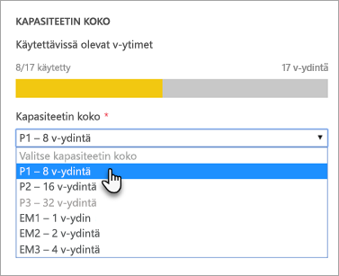
5. Valitse **Määrittäminen**.

    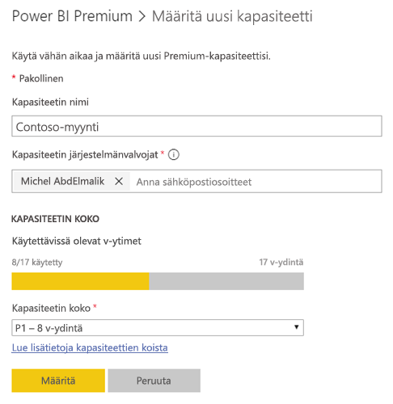

Tämän jälkeen kapasiteetin järjestelmänvalvojat sekä Power BI -järjestelmänvalvojat ja Office 365:n Yleiset järjestelmänvalvojat näkevät kapasiteetin hallintaportaalissa.

### Kapasiteettiasetukset
Voit valita Premium-kapasiteetin hallintaruudussa **hammaspyöräkuvakkeen (asetukset)** toiminnot-kohdassa. Tämän avulla voit nimetä kapasiteetin uudelleen tai poistaa sen. Se kuvastaa myös palvelun järjestelmänvalvojia, kapasiteetin SKU:ta/kokoa ja kapasiteetin sijaintia.

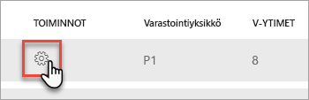

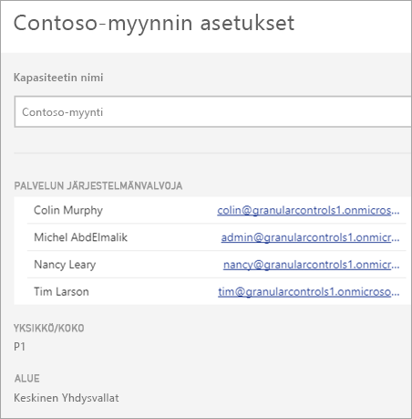

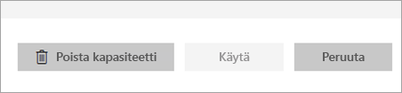

> [!NOTE]
> Power BI Embeddedin kapasiteettiasetuksia hallitaan Microsoft Azure -portaalista.

### Kapasiteetin koon muuttaminen (Power BI Premium)
Power BI -järjestelmänvalvojat ja Office 365:n yleiset järjestelmänvalvojat voivat muuttaa Power BI Premium -kapasiteetin kokoa valitsemalla **Muuta kapasiteetin kokoa**. Tämä vaihtoehto ei näy kapasiteetin järjestelmänvalvojille, jotka eivät ole Power BI -järjestelmänvalvojia tai Office 365:n Yleisiä järjestelmänvalvojia.

**Muuta kapasiteetin kokoa** -näytön avulla voit suurentaa tai pienentää kapasiteettia käytettävissäsi olevien resurssien mukaan. Järjestelmänvalvojat voivat myös luoda solmuja, muuttaa niiden kokoa ja poistaa niitä niin kauan, kuin käytettävissä on riittävästi v-ytimiä.

P-version SKU:ita ei voi päivittää EM-version SKU:iksi. Saat lisätietoja viemällä hiiren osoittimen käytöstä poistettujen asetusten päälle.

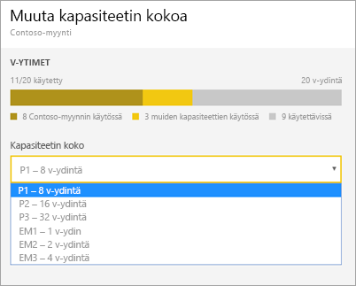

### Kapasiteetin määritys
Voit hallita kapasiteettia valitsemalla kapasiteetin nimen. Tämä siirtää sinut kapasiteetin hallintanäyttöön.

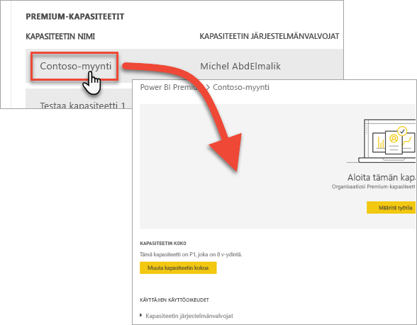

Jos kapasiteetille ei ole määritetty työtiloja, näyttöön tulee viesti, jonka avulla voit **määrittää työtiloja**.

#### Käyttäjien käyttöoikeudet
Voit määrittää lisää **kapasiteetin järjestelmänvalvojia** Power BI Premium -kapasiteeteille. Samoin voit määrittää käyttäjät, joilla on **kapasiteetin määrittämisen käyttöoikeudet**. Käyttäjä, jolla on määrittämisen käyttöoikeudet, voi määrittää kapasiteettiin sovelluksen työtilan, jonka järjestelmänvalvoja hän on. Hän voi myös määrittää *Oman työtilansa*  kapasiteettiin. Käyttäjä, jolla on määrittämisen käyttöoikeudet, ei voi käyttää hallintaportaalia.

> [!NOTE]
> Power BI Embedded -kapasiteetin järjestelmänvalvojat määritetään Microsoft Azure -portaalista.
>
>

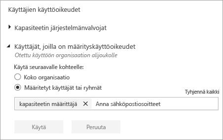

## Työtilan määrittäminen kapasiteettiin
Työtila voidaan määrittää kapasiteettiin muutamilla tavoilla.

### Kapasiteetin hallinta hallintaportaalissa
Kapasiteetin järjestelmänvalvojat sekä Power BI -järjestelmänvalvojat ja Office 365:n yleiset järjestelmänvalvojat voivat joukkomäärittää työtiloja hallintaportaalin Premium-kapasiteetin hallintaosiosta. Kun hallitset kapasiteettia, näkyviin tulee **Työtilat**-osa, jonka avulla voit määrittää työtiloja.

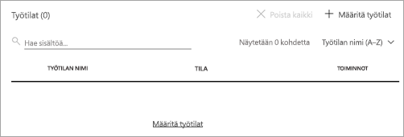

1. Valitse **Määritä työtilat**. Tämä on lueteltu useissa paikoissa. Se suorittaa aina saman tehtävän.
2. Valitse joko **Koko organisaation työtilat** tai **Määritetyt työtilat käyttäjän mukaan**.

   | Valinta | Kuvaus |
   | --- | --- |
   | **Koko organisaation työtilat** |Koko organisaation työtilojen määrittäminen Premium-kapasiteettiin määrittää organisaatiosi kaikki sovellustyötilat ja Omat työtilat tähän Premium-kapasiteettiin. Lisäksi kaikki nykyiset ja tulevat käyttäjät voivat määrittää yksittäisiä työtiloja uudelleen tähän kapasiteettiin. |
   | **Määritetyt työtilat käyttäjän mukaan** |Kun määrität työtiloja käyttäjän tai ryhmän mukaan, kaikki kyseisten käyttäjien omistamat työtilat määritetään Premium-kapasiteettiin, mukaan lukien käyttäjän oma työtila. Kyseiset käyttäjät saavat automaattisesti työtilan määrittämisen käyttöoikeudet. Tämä sisältää työtilat, jotka on jo määritetty eri kapasiteettiin. |
3. Valitse **Käytä**.

Tämän asetuksen avulla kapasiteettiin ei voida määrittää tiettyä työtilaa.

### Sovellustyötilan asetukset
Voit myös määrittää sovellustyötilan Premium-kapasiteettiin kyseisen työtilan asetuksista. Jos haluat määrittää sovellustyötilan Premium-kapasiteettiin, toimi seuraavasti.

Jos haluat siirtää työtilan kapasiteettiin, sinulla on oltava kyseisen työtilan järjestelmänvalvojan oikeudet ja kyseisen kapasiteetin määrittämisen käyttöoikeudet. Huomaa, että työtilan järjestelmänvalvojat voivat aina poistaa työtilan Premium-kapasiteetista.

1. Muokkaa sovellustyötilaa valitsemalla **kolme pistettä (...)**  ja valitsemalla **Muokkaa työtilaa**.

    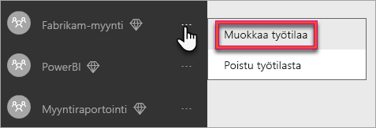
2. Laajenna **Lisäasetukset** **Muokkaa työtilaa** -osiosta.
3. Jos sinulle on annettu minkä tahansa kapasiteetin määrittämisen käyttöoikeudet, voit halutessasi ottaa **Premiumin** käyttöön kyseiselle työtilalle.
4. Valitse kapasiteetti, johon haluat määrittää tämän sovellustyötilan.

    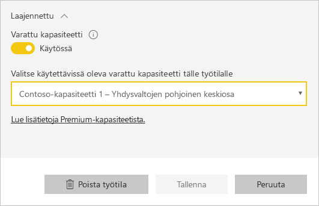
5. Valitse **Tallenna**.

Tallentamisen jälkeen työtila ja kaikki sen sisältö siirretään Premium-kapasiteettiin. Tämä ei häiritse niiden käyttöä.

## Seuraa kapasiteetin käyttöä
Voit nähdä kunkin kapasiteetin suorittimen, muistin käytön, muistin tietojen poistamisen ja Direct Queryn käyttömittaukset. Suosittelemme valvomaan näitä mittareita, jotta voit varmistaa korkean suorituskyvyn käyttäjiesi käyttäessä kapasiteettiasi:

> [!NOTE]
> Power BI Embeddedin kapasiteetin käyttöä valvotaan Azure-portaalista.

| Tieto | Kuvaus |
| --- | --- |
| Suoritin |Kuinka monta kertaa suoritin ylitti 80 prosentin käyttöasteen. |
| Muistin tietojen poistaminen |Kuvastaa taustatoimintojen ydinten muistin vähyyttä. Tarkemmin sanottuna tämä ilmaisee, kuinka monta kertaa tietojoukkoja poistetaan muistista useiden tietojoukkojen aiheuttaman muistin vähäisyyden vuoksi. |
| Muistin käyttö |Keskimääräinen muistin käyttö gigatavuina (Gt). |
| DQ-kyselyjä/s | Kuinka monta kertaa DirectQueryn ja reaaliaikaisten yhteyksien määrä ylitti 80 prosenttia rajoituksesta.     * DirectQuery- ja reaaliaikaisen yhteyden kyselyiden sekuntikohtainen kokonaismäärä on rajoitettu.  * Rajoitus on 30/s P1:llä, 60/s P2:lla ja 120/s P3:lla.   * DirectQuery- ja reaaliaikaisen yhteyden kyselyiden määrä lasketaan kiintiöön. Jos sinulla on käynnissä esimerkiksi 15 DirectQuery-kyselyä ja 15 reaaliaikaista yhteyttä samalla sekunnilla, nopeutta rajoitetaan.  * Tämä koskee niin paikallisia kuin pilviyhteyksiäkin. |

Mittarit kuvaavat käyttöä viime viikon aikana.  Jos haluat tarkastella mittareita tarkemmin, voit tehdä niin napsauttamalla jotakin yhteenvetoruutua.  Sen jälkeen näet yksityiskohtaiset kaaviot Premium-kapasiteetin mittareista.  Näissä kaavioissa on tuntikohtainen yhteenveto viime viikolta ja ne voivat auttaa selvittämään, jos Premium-kapasiteetissasi on ollut jokin suorituskykyyn liittyvä tapahtuma.  

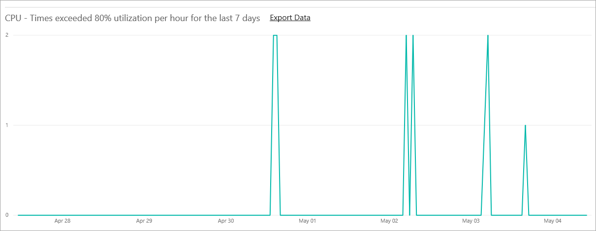

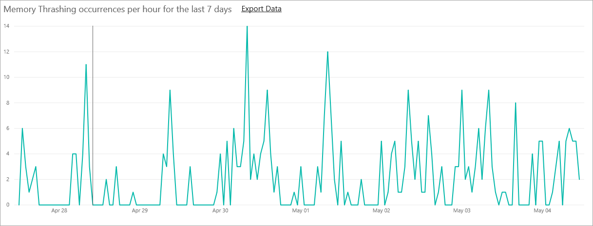

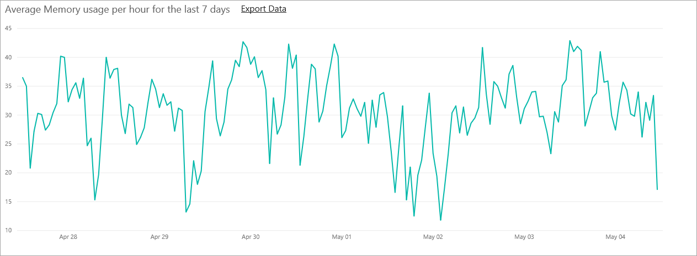

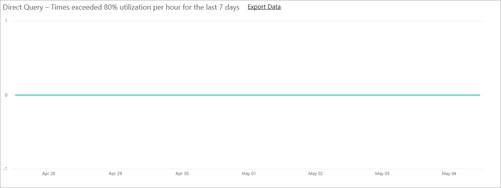

Voit myös viedä minkä tahansa mittarin pohjana olevat tiedot csv-tiedostoon.  Tämän viennin ansiosta saat yksityiskohtaista tietoa kolmen minuutin välein viime viikon kultakin päivältä.

## Miltä Premium näyttää käyttäjille
Käyttäjät ei pääsääntöisesti edes tarvitse tietää kuuluvansa Premium-kapasiteettiin. Koontinäytöt ja raportit yksinkertaisesti toimivat. Näet vinoneliökuvakkeen Premium-kapasiteettiin kuuluvien työtilojen vieressä.

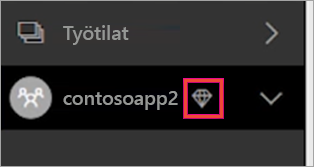

## Power BI -raporttipalvelimen tuoteavain
Power BI -raporttipalvelimen tuoteavain on saatavilla Power BI -hallintaportaalin **Kapasiteettiasetukset**-välilehdellä. Tämä on käytettävissä vain Yleisille järjestelmänvalvojille ja käyttäjille, joille on määritetty Power BI -palvelun järjestelmänvalvojan rooli, jos olet ostanut Power BI Premium -SKU:n.

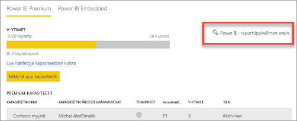

Voit avata tuoteavaimen sisältävän valintaikkunan valitsemalla **Power BI -raporttipalvelimen avain** -kohdan. Voit kopioida sen ja käyttää sitä asennuksessa.

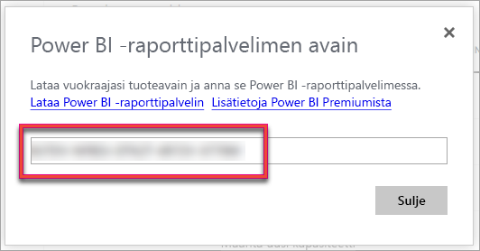

Katso lisätietoja artikkelista [Power BI -raporttipalvelimen asentaminen](report-server/install-report-server.md).

## Seuraavat vaiheet
Jaa julkaistut sovellukset käyttäjien kanssa. Lisätietoja on ohjeartikkelissa [Sovelluksen luominen ja jakaminen Power BI:ssä](service-create-distribute-apps.md).

Ilmenikö muuta kysyttävää? [Voit esittää kysymyksiä Power BI -yhteisössä](http://community.powerbi.com/)
