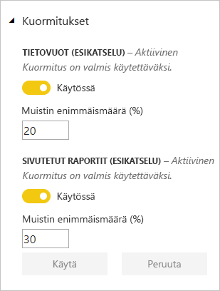
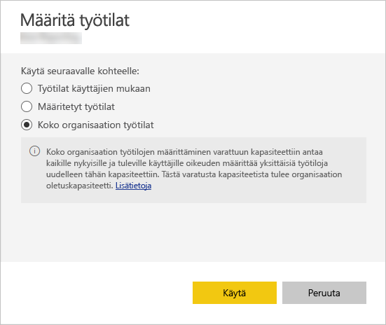

# Kapasiteettien hallinta Power BI Premiumissa ja Power BI Embeddedissä

Opi, miten voit hallita Power BI Premiumin ja Power BI Embeddedin kapasiteetteja, jotka tarjoavat sisällöllesi erillisiä resursseja.

## Mitä kapasiteetti on?

*Kapasiteetti* on Power BI Premium- ja Power BI Embedded -tuotteiden ytimessä. Se on ainoastaan sinun organisaatiosi käyttöön varattujen resurssien joukko. Varatun kapasiteetin avulla voit julkaista koontinäyttöjä, raportteja ja tietojoukkoja organisaatiosi käyttäjille ilman, että sinun tarvitsee ostaa käyttäjäkohtaisia käyttöoikeuksia heille. Se tarjoaa myös kapasiteettiin tallennetun sisällön luotettavan, tasalaatuisen suorituskyvyn. Lisätietoja on ohjeartikkelissa [Mikä Power BI Premium on ?](service-premium.md).

### Kapasiteetin järjestelmänvalvojat

*Kapasiteetin järjestelmänvalvojilla* on kapasiteetin ja sen hallintaominaisuuksien täydelliset hallintaoikeudet. Voit lisätä uusia kapasiteetin järjestelmänvalvojia tai antaa käyttäjille kapasiteetin määrittämisoikeuksia Power BI -hallintaportaalissa. Voit joukkomäärittää työtiloja kapasiteetille ja tarkastella kapasiteetin käyttötilastoja.

> [!NOTE]
> Power BI Embeddedin kapasiteetin järjestelmänvalvojat määritetään Microsoft Azure -portaalissa.

Jokaisella kapasiteetilla on omat järjestelmänvalvojansa. Kapasiteetin järjestelmänvalvojan määrittäminen ei myönnä kyseiselle henkilölle käyttöoikeuksia organisaation muihin kapasiteetteihin. Oletusarvoisesti kapasiteetin järjestelmänvalvojilla ei ole käyttöoikeuksia kaikkiin Power BI -järjestelmänvalvojien alueisiin, kuten käyttötilastoihin, valvontalokeihin tai vuokraajan asetuksiin. Kapasiteettien järjestelmänvalvojilla ei myöskään ole oikeutta uusien kapasiteettien määrittämiseen tai olemassa olevien kapasiteettien SKU:n muuttamiseen. Vain Office 365:n yleiset järjestelmänvalvojat tai Power BI -palvelun järjestelmänvalvojat voivat käyttää näitä kohteita.

Kaikki Office 365:n yleiset järjestelmänvalvojat ja Power BI -palvelun järjestelmänvalvojat ovat automaattisesti Power BI Premium- ja Power BI Embedded -kapasiteetin järjestelmänvalvojia.

## Kapasiteetin ostaminen

Jotta voit hyödyntää sinulle varattua kapasiteettia, sinun on ostettava Power BI Premium Office 365 -hallintakeskuksesta tai luoda Power BI Embedded -resurssi Microsoft Azure -portaalissa. Katso lisätietoja seuraavista artikkeleista:

* **Power BI Premium:** [Ohjeet Power BI Premiumin ostamiseen](service-admin-premium-purchase.md)

* **Power BI Embedded:** [Power BI Embedded -kapasiteetin luominen Azure-portaalissa](https://docs.microsoft.com/azure/power-bi-embedded/create-capacity)

Kun ostat Power BI Premium- tai Embedded-SKU:ita, vuokraaja saavat vastaavan määrän v-ytimiä kapasiteettien käsittelyyn. Esimerkiksi Power BI Premium P3 -SKU:n ostaminen antaa vuokraajan käyttöön 32 v-ydintä. Lisätietoja SKU:ista löytyy ohjeartikkelista [Premium-kapasiteetin solmut](service-premium.md#premium-capacity-nodes).

## Miltä Premium näyttää käyttäjille

Käyttäjien ei pääsääntöisesti tarvitse tietää kuuluvansa Premium-kapasiteettiin. Koontinäytöt ja raportit yksinkertaisesti toimivat. Näet vinoneliökuvakkeen Premium-kapasiteettiin kuuluvien työtilojen vieressä.

## Kuormitusten määrittäminen

Oletusarvoisesti Power BI Premiumin ja Power BI Embeddedin kapasiteetit tukevat vain kuormitusta, joka liittyy Power BI -kyselyjen suorittamiseen pilvipalvelussa. Esikatselun tuki tarjotaan nyt myös kahdelle muulle kuormitukselle: **sivutetut raportit** ja **tietovuot**. Katso lisätietoja artikkelista [Kuormitukset Premium-kapasiteetissa](service-premium.md#workloads-in-premium-capacity).

Voit ottaa kuormitukset käyttöön Power BI -hallintaportaalissa seuraavien ohjeiden mukaisesti.

1. Valitse kapasiteetti **Kapasiteettiasetuksista**.

1. Laajenna **Kuormitukset** **LISÄÄ VAIHTOEHTOJA** -kohdasta.

1. Ota käyttöön yksi tai useampi kuormitus ja anna **Muistin enimmäismäärälle** arvo.

    

1. Valitse **Käytä**.

## Seuraa kapasiteetin käyttöä

Power BI tarjoaa sovelluksen kapasiteetin käytön seurantaan. Lisätietoja on artikkelissa [Power BI Premium -kapasiteettien valvominen organisaatiossasi](service-admin-premium-monitor-capacity.md).

## Hallitse kapasiteettia

Kun olet ostanut kapasiteettisolmuja Office 365:ssä, sinun tulee määrittää kapasiteetti Power BI -hallintaportaalissa. Voit hallita Power BI Premium -kapasiteetteja portaalin **Kapasiteettiasetukset**-osiossa.

Voit hallita kapasiteettia valitsemalla kapasiteetin nimen. Tämä siirtää sinut kapasiteetin hallintanäyttöön.

Jos kapasiteetille ei ole määritetty työtiloja, näyttöön tulee viesti, jossa kerrotaan [työtilan määrittämisestä kapasiteetille](#assign-a-workspace-to-a-capacity).

### Uuden kapasiteetin määrittäminen (Power BI Premium)

Hallintaportaalissa näet, kuinka monta *näennäisydintä* (v-ydintä) olet käyttänyt ja montako ydintä sinulla on vielä jäljellä. V-ytimien kokonaismäärä määräytyy ostamasi Premium-SKU:iden perusteella. Esimerkiksi ostamalla P3:n ja P2:n saat käyttöösi 48 ydintä – 32 P3:sta ja 16 P2:sta.

Jos sinulla on käytettävissäsi v-ytimiä, määritä uusi kapasiteetti noudattamalla seuraavia ohjeita.

1. Valitse **Määritä uusi kapasiteetti**.

1. Anna kapasiteetillesi nimi.

1. Määritä tämän kapasiteetin järjestelmänvalvoja.

1. Valitse kapasiteetin koko. Käytettävissä olevat vaihtoehdot riippuvat siitä, montako v-ydintä käytettävissäsi on. Et voi valita vaihtoehtoa, joka on suurempi kuin käytettävissäsi oleva määrä.

    

1. Valitse **Määrittäminen**.

    

Tämän jälkeen kapasiteetin järjestelmänvalvojat sekä Power BI -järjestelmänvalvojat ja Office 365:n yleiset järjestelmänvalvojat näkevät kapasiteetin hallintaportaalissa.

### Kapasiteettiasetukset

1. Valitse Premium-kapasiteetin hallintaruudun **Toiminnot**-kohdassa oleva **hammaspyöräkuvake** tarkastellaksesi ja päivittääksesi asetuksia. 

    

1. Voit tarkastella palvelun järjestelmänvalvojia, kapasiteetin SKU:ta/kokoa ja kapasiteetin sijaintia.

    

1. Voit myös nimetä kapasiteetin uudelleen tai poistaa kapasiteetin.

    

> [!NOTE]
> Power BI Embeddedin kapasiteettiasetuksia hallitaan Microsoft Azure -portaalista.

### Muuta kapasiteetin kokoa

Power BI -järjestelmänvalvojat ja Office 365:n yleiset järjestelmänvalvojat voivat muuttaa Power BI Premium -kapasiteetteja. Tämä vaihtoehto ei näy kapasiteetin järjestelmänvalvojille, jotka eivät ole Power BI -järjestelmänvalvojia tai Office 365:n yleisiä järjestelmänvalvojia.

1. Valitse **Muuta kapasiteetin kokoa**.

    

1. **Muuta kapasiteetin kokoa** -näytön avulla voit suurentaa tai pienentää kapasiteettia.

    

    Järjestelmänvalvojat voivat myös luoda solmuja, muuttaa niiden kokoa ja poistaa niitä niin kauan, kuin käytettävissä on riittävästi v-ytimiä.

    P-version SKU:ita ei voi päivittää EM-version SKU:iksi. Saat lisätietoja viemällä hiiren osoittimen käytöstä poistettujen asetusten päälle.

### Käyttäjien käyttöoikeuksien hallinta

Voit määrittää lisää kapasiteetin järjestelmänvalvojia sekä määrittää käyttäjät, joilla on *kapasiteetin määrittämisen* käyttöoikeudet. Käyttäjä, jolla on määrittämisen käyttöoikeudet, voi määrittää kapasiteettiin sovelluksen työtilan, jonka järjestelmänvalvoja hän on. Hän voi myös määrittää *Oman työtilansa*  kapasiteettiin. Käyttäjä, jolla on määrittämisen käyttöoikeudet, ei voi käyttää hallintaportaalia.

> [!NOTE]
> Power BI Embeddedin kapasiteetin järjestelmänvalvojat määritetään Microsoft Azure -portaalissa.

Laajenna **Käyttäjien käyttöoikeudet** -kohdassa oleva **Käyttäjät, joilla on määrityskäyttöoikeudet** -vaihtoehto ja lisää sitten haluamasi käyttäjät tai ryhmät.

## Työtilan määrittäminen kapasiteettiin

Kapasiteettiin voi määrittää työtilan kahdella tavalla: joko hallintaportaalin tai sovellustyötilan kautta.

### Hallintaportaalin kautta määrittäminen

Kapasiteetin järjestelmänvalvojat sekä Power BI -järjestelmänvalvojat ja Office 365:n yleiset järjestelmänvalvojat voivat joukkomäärittää työtiloja hallintaportaalin Premium-kapasiteetin hallintaosiosta. Kun hallitset kapasiteettia, näkyviin tulee **Työtilat**-osa, jonka avulla voit määrittää työtiloja.

1. Valitse **Määritä työtilat**. Tämä vaihtoehto on käytettävissä useissa paikoissa.

1. Valitse haluamasi vaihtoehto **Käytä seuraavalle kohteelle** -asetukselle.

    

   | Valinta | Kuvaus |
   | --- | --- |
   | **Työtilat käyttäjien mukaan** | Kun määrität työtiloja käyttäjän tai ryhmän mukaan, kaikki kyseisten käyttäjien omistamat työtilat määritetään Premium-kapasiteettiin, mukaan lukien käyttäjän oma työtila. Kyseiset käyttäjät saavat automaattisesti työtilan määrittämisen käyttöoikeudet. Tämä sisältää työtilat, jotka on jo määritetty eri kapasiteettiin. |
   | **Määritetyt työtilat** | Syötä sen työtilan nimi, joka tullaan määrittämään valitulle kapasiteetille. |
   | **Koko organisaation työtilat** | Koko organisaation työtilojen määrittäminen Premium-kapasiteettiin määrittää organisaatiosi kaikki sovellustyötilat ja Omat työtilat tähän Premium-kapasiteettiin. Lisäksi kaikki nykyiset ja tulevat käyttäjät voivat määrittää yksittäisiä työtiloja uudelleen tähän kapasiteettiin. |
   | | |

1. Valitse **Käytä**.

### Määrittäminen sovellustyötilan asetuksien kautta

Voit myös määrittää sovellustyötilan Premium-kapasiteettiin kyseisen työtilan asetuksista. Jos haluat siirtää työtilan kapasiteettiin, sinulla on oltava kyseisen työtilan järjestelmänvalvojan oikeudet ja kyseisen kapasiteetin määrittämisen käyttöoikeudet. Huomaa, että työtilan järjestelmänvalvojat voivat aina poistaa työtilan Premium-kapasiteetista.

1. Muokkaa sovellustyötilaa valitsemalla kolme pistettä **(. . .)** ja valitsemalla sitten **Muokkaa työtilaa**.

    

1. Laajenna **Lisäasetukset** **Muokkaa työtilaa** -osiosta.

1. Valitse kapasiteetti, johon haluat määrittää tämän sovellustyötilan.

    

1. Valitse **Tallenna**.

Tallentamisen jälkeen työtila ja kaikki sen sisältö siirretään Premium-kapasiteettiin. Tämä ei häiritse niiden käyttöä.

## Power BI -raporttipalvelimen tuoteavain

Power BI -raporttipalvelimen tuoteavain on saatavilla Power BI -hallintaportaalin **Kapasiteettiasetukset**-välilehdellä. Tämä on käytettävissä vain Yleisille järjestelmänvalvojille ja käyttäjille, joille on määritetty Power BI -palvelun järjestelmänvalvojan rooli, jos olet ostanut Power BI Premium -SKU:n.

Voit avata tuoteavaimen sisältävän valintaikkunan valitsemalla **Power BI -raporttipalvelimen avain** -kohdan. Voit kopioida sen ja käyttää sitä asennuksessa.

Katso lisätietoja artikkelista [Power BI -raporttipalvelimen asentaminen](report-server/install-report-server.md).

## Seuraavat vaiheet

Jaa julkaistut sovellukset käyttäjien kanssa. Lisätietoja on ohjeartikkelissa [Sovelluksen luominen ja jakaminen Power BI:ssä](service-create-distribute-apps.md).

Ilmenikö muuta kysyttävää? [Voit esittää kysymyksiä Power BI -yhteisössä](http://community.powerbi.com/)
