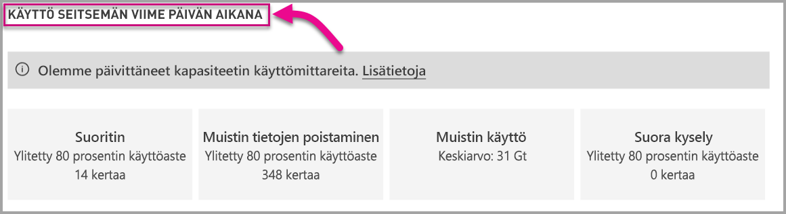

# Power BI Premiumin ja Power BI Embeddedin kapasiteettien valvonta

Tässä artikkelissa annetaan yleiskatsaus Power BI Premium -kapasiteettien mittausarvojen valvonnasta. Kapasiteetin käytön valvonnan avulla voit hallita kapasiteettejasi valistuneesti.

Voit valvoa kapasiteettia Power BI Premium -kapasiteetin mittausarvot -sovelluksen avulla tai hallintaportaalissa. Sovelluksen käyttäminen on suositeltavaa, koska se tarjoaa paljon enemmän tietoja, mutta tässä artikkelissa käsitellään molemmat vaihtoehdot.

## Premium-kapasiteetin mittausarvot -sovelluksen asentaminen

Voit siirtyä suoraan [Premium-kapasiteetin mittausarvot -sovellukseen](https://app.powerbi.com/groups/me/getapps/services/capacitymetrics) tai asentaa sen muiden Power BI -sovellusten tapaan.

1. Valitse Power BI:ssä **Sovellukset**.

    

2. Valitse oikealla puolella **Hanki sovelluksia**.

3. Hae **Sovellukset**-luokasta **Power BI Premium -kapasiteetin mittausarvot -sovellus**.

4. Tilaa sovelluksen asennus.

Nyt kun olet asentanut sovelluksen, voit nähdä kapasiteetteja koskevia mittausarvoja organisaatiossasi. Tutustutaan muutamaan tärkeimpään käytettävissä olevaan mittausarvoon.

## Mittausarvosovelluksen käyttäminen

Kun avaat sovelluksen, se näyttää ensin raporttinäkymältä, jossa on yhteenveto kaikista kapasiteeteista, joihin sinulla on järjestelmänvalvojan oikeudet.

### Suodatus

**Kaikkia sivuja koskevat suodattimet** -välilehden avulla voit valita kapasiteetin, tietojoukon ja/tai päivämääräalueen viimeisten seitsemän päivän aikana. Nämä suodattimet koskevat kaikkien olennaisten sivujen ja ruutujen valintaa tässä raportissa. Jos mitään ei ole valittuna, raportti näyttää oletuksena edellisen viikon mittausarvot jokaisesta omistamastasi kapasiteetista.

### Yhteenveto-välilehti

**Yhteenveto**-välilehdessä on näkymä kapasiteetista entiteettien, järjestelmän ja tietojoukkojen mukaan.

| **Alue** | **Mittausarvot** |
| --- | --- |
| **Entiteetit** | * Omistamiesi kapasiteettien määrä  * Tietojoukkojen erillinen määrä kapasiteetissasi  * Työtilojen erillinen määrä kapasiteetissasi |
| **Järjestelmä** | * Keskimääräinen muistin käyttö gigatavuina viimeisten seitsemän päivän aikana  * Suurin muistin kulutus gigatavuina viimeisten seitsemän päivän aikana ja paikallinen tapahtumisaika  * Kuinka monta kertaa suoritin ylitti 80 prosenttia raja-arvoista viimeisten seitsemän päivän aikana kolmen minuutin osiin jaettuna  * Ajankohdat, jolloin suoritin useimmin ylitti 80 prosenttia viimeisten seitsemän päivän aikana tunnin osiin jaettuna sekä paikallinen tapahtumisaika  * Kuinka monta kertaa Direct Query- / reaaliaikainen yhteys ylitti 80 prosenttia raja-arvoista viimeisten seitsemän päivän aikana kolmen minuutin osiin jaettuna  * Ajankohdat, jolloin Direct Query- / reaaliaikainen yhteys useimmin ylitti 80 prosenttia viimeisten seitsemän päivän aikana tunnin osiin jaettuna sekä paikallinen tapahtumisaika |
| **Tietojoukon kuormitukset** | * Päivitysten kokonaismäärä viimeisten seitsemän päivän aikana  * Onnistuneiden päivitysten kokonaismäärä viimeisten seitsemän päivän aikana  * Epäonnistuneiden päivitysten kokonaismäärä viimeisten seitsemän päivän aikana  * Muistin loppumisen vuoksi epäonnistuneiden päivitysten kokonaismäärä  * Päivityksen keskimääräinen kesto mitataan minuutteina, toiminnon suorittamiseen tarvittava aika  * Päivityksen keskimääräinen odotusaika mitataan minuutteina, keskimääräinen viive ajoitetun ajankohdan ja toiminnon alun välillä  * Suoritettujen kyselyjen kokonaismäärä viimeisten seitsemän päivän aikana  * Onnistuneiden kyselyjen kokonaismäärä viimeisten seitsemän päivän aikana  * Epäonnistuneiden kyselyjen kokonaismäärä viimeisten seitsemän päivän aikana  * Kyselyn keskimääräinen kesto mitataan minuutteina, toiminnon suorittamiseen tarvittava aika  * Muistipaineen vuoksi poistettujen mallien kokonaismäärä |
|  |  |

### Päivitykset-välilehti

**Päivitykset**-välilehti sisältää valmiit päivitykset, onnistuneet mittaukset, päivityksen odotusajan keski-/enimmäisarvo ja päivityksen keston keski-/enimmäisarvo tietojoukkojen mukaan ositettuna viimeisten seitsemän päivän aikana. Kahdessa alimmassa kaaviossa näkyvät päivitykset ja muistin käyttö gigatavuina ja keskimääräiset odotusajat tunnin osiin jaettuna paikallisessa ajassa ilmoitettuna. Yläreunan palkkikaaviot sisältävät viisi parasta tietojoukkoa tietojoukon päivittämiseen kuluneen (päivityksen keston) enimmäisajan kokonaismäärän mukaan sekä päivityksen enimmäisodotusajan. Useat korkeat päivityksen odotusaikapiikit ovat merkki kuumana käyvästä kapasiteetista.

### Tietojoukot-välilehti

**Tietojoukot**-välilehti näyttää muistipaineen vuoksi poistetut valmiit tietojoukot tunnin mukaan.

### Järjestelmä-välilehti

**Järjestelmä**-välilehti näyttää suorittimen korkean käyttöasteen (80 prosentin käyttöaste ylittymiskertojen määrä), Direct Query- / reaaliaikaisen yhteyden korkean käyttöasteen ja muistin käytön.

## Power BI Embedded -kapasiteetin valvonta

Voit käyttää myös Power BI Premium -kapasiteetin mittausarvot -sovellusta *A-varastointiyksikkö*-kapasiteettien valvontaan Power BI Embeddedissä. Kyseiset kapasiteetit näkyvät raportissa niin kauan kuin olet kapasiteetin järjestelmänvalvoja. Raportin päivitys kuitenkin epäonnistuu, ellet myönnä Power BI:lle tiettyjä käyttöoikeuksia A-varastointiyksiköissä:

1. Avaa kapasiteettisi Azure-portaalissa.
1. Valitse **Käyttöoikeuksien valvonta (IAM)** ja lisää Power BI Premium -sovellus lukijan rooliin. Jos et löydä sovellusta nimen mukaan, voit myös lisätä sen asiakastunnuksen mukaan: cb4dc29f 0bf4-402a-8b30-7511498ed654.

    

> [!NOTE]
> Voit valvoa Power BI Embedded -kapasiteetin käyttöä sovelluksessa tai Azure-portaalissa, mutta et Power BI -hallintaportaalissa.

## Perustason valvonta hallintaportaalissa

Hallintaportaalin **Kapasiteettiasetukset**-alueella on neljä mittaria, jotka ilmoittavat kapasiteetin asettamat kuormitukset ja käyttämät resurssit viimeisten seitsemän päivän ajalta. Nämä neljä ruutua toimivat tuntikohtaisessa aikaikkunassa, joka ilmaisee, kuinka monta tuntia vastaava mittausarvo oli yli 80 prosenttia viimeisten seitsemän päivän aikana. Tämä mittausarvo ilmaisee mahdollisen käyttäjäkokemuksen heikkenemisen.

| **Mittausarvo** | **Kuvaus** |
| --- | --- |
| Suoritin |Kuinka monta kertaa suoritin ylitti 80 prosentin käyttöasteen. |
| Muistin tietojen poistaminen |Kuvastaa taustatoimintojen ydinten muistin vähyyttä. Tarkemmin sanottuna tämä ilmaisee, kuinka monta kertaa tietojoukkoja poistetaan muistista useiden tietojoukkojen aiheuttaman muistin vähäisyyden vuoksi. |
| Muistin käyttö |Keskimääräinen muistin käyttö gigatavuina (Gt). |
| DQ-kyselyjä/s | Kuinka monta kertaa DirectQueryn ja reaaliaikaisten yhteyksien määrä ylitti 80 prosenttia rajoituksesta.   * DirectQuery- ja reaaliaikaisen yhteyden kyselyiden sekuntikohtainen kokonaismäärä on rajoitettu.* Rajoitus on 30/s P1:llä, 60/s P2:lla ja 120/s P3:lla. * DirectQuery- ja reaaliaikaisen yhteyden kyselyiden määrä lasketaan kiintiöön. Jos sinulla on käynnissä esimerkiksi 15 DirectQuery-kyselyä ja 15 reaaliaikaista yhteyttä samalla sekunnilla, nopeutta rajoitetaan. * Tämä koskee niin paikallisia kuin pilviyhteyksiäkin. |
|  |  |

Mittarit kuvaavat käyttöä viime viikon aikana.  Jos haluat tarkastella mittareita tarkemmin, voit tehdä niin napsauttamalla jotakin yhteenvetoruutua.  Sen jälkeen näet yksityiskohtaiset kaaviot Premium-kapasiteetin mittareista. Seuraavassa kaaviossa näkyvät suorittimen mittausarvon tiedot.

Näissä kaavioissa on tuntikohtainen yhteenveto viime viikolta ja ne voivat auttaa selvittämään, jos Premium-kapasiteetissasi on ollut jokin suorituskykyyn liittyvä tapahtuma.

Voit myös viedä minkä tahansa mittarin pohjana olevat tiedot csv-tiedostoon.  Tämän viennin ansiosta saat yksityiskohtaista tietoa kolmen minuutin välein viime viikon kultakin päivältä.

## Seuraavat vaiheet

Nyt kun tiedät, miten voit valvoa Power BI Premium -kapasiteetteja, lue lisätietoja kapasiteettien optimoinnista.

> [!div class="nextstepaction"]
> [Power BI Premium -kapasiteetin resurssien hallinta ja optimointi](service-premium-understand-how-it-works.md)
