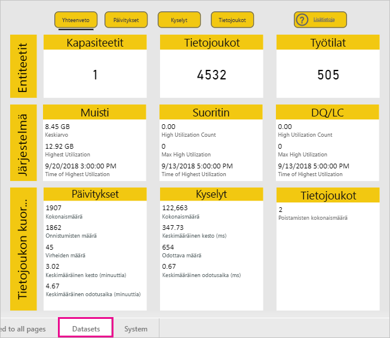
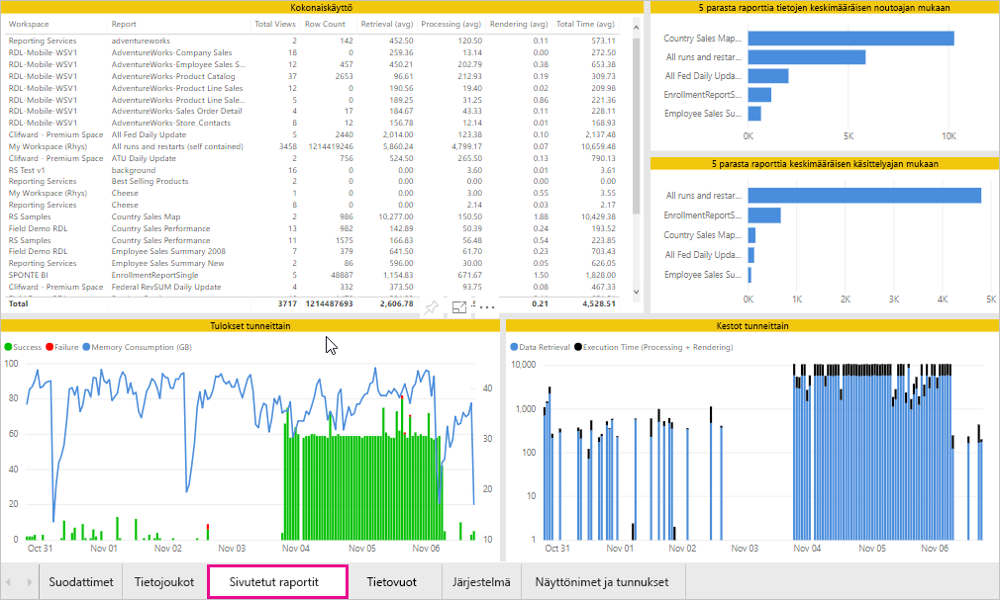
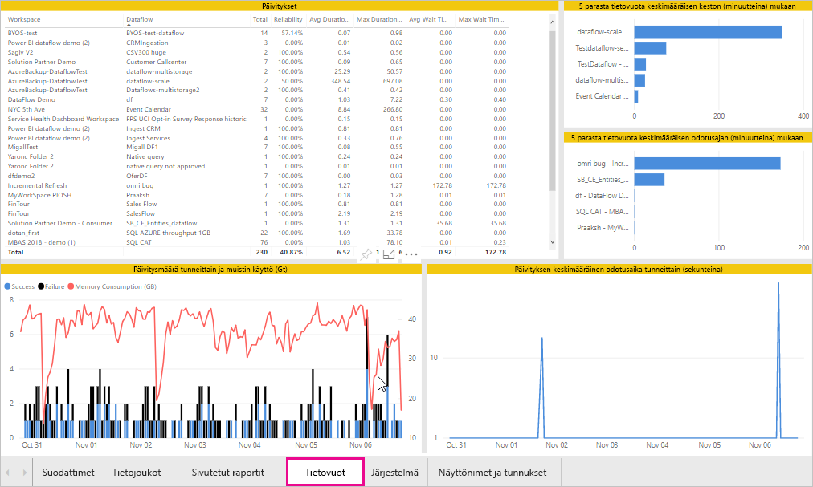

# Power BI Premiumin ja Power BI Embeddedin kapasiteettien valvonta

Tässä artikkelissa annetaan yleiskatsaus Power BI Premium -kapasiteettien mittausarvojen valvonnasta. Kapasiteetin käytön valvonnan avulla voit hallita kapasiteettejasi valistuneesti.

Voit valvoa kapasiteettia Power BI Premium -kapasiteetin mittausarvot -sovelluksen avulla tai hallintaportaalissa. Sovelluksen käyttäminen on suositeltavaa, koska se tarjoaa paljon enemmän tietoja, mutta tässä artikkelissa käsitellään molemmat vaihtoehdot.

**Sovelluksen nykyinen versio on 1.9 (julkaistu 14. marraskuuta 2018).**

.

<iframe width="560" height="315" src="https://www.youtube.com/embed/UgsjMbhi_Bk?rel=0&amp;showinfo=0" frameborder="0" allowfullscreen></iframe>

## Premium-kapasiteetin mittausarvot -sovelluksen asentaminen

Voit siirtyä suoraan [Premium-kapasiteetin mittausarvot -sovellukseen](https://app.powerbi.com/groups/me/getapps/services/capacitymetrics) tai asentaa sen muiden Power BI -sovellusten tapaan.

1. Valitse Power BI:ssä **Sovellukset**.

    

1. Valitse oikealla puolella **Hanki sovelluksia**.

1. Hae **Sovellukset**-luokasta **Power BI Premium -kapasiteetin mittausarvot -sovellus**.

1. Tilaa sovelluksen asennus.

Nyt kun olet asentanut sovelluksen, voit nähdä kapasiteetteja koskevia mittausarvoja organisaatiossasi. Tutustutaan muutamaan tärkeimpään käytettävissä olevaan mittausarvoon.

## Mittausarvosovelluksen käyttäminen

Kun avaat sovelluksen, se näyttää ensin raporttinäkymältä, jossa on yhteenveto kaikista kapasiteeteista, joihin sinulla on järjestelmänvalvojan oikeudet.

Napsauta koontinäyttöä siirtyäksesi sen pohjana olevaan raporttiin. Raportissa on kuusi välilehteä, jotka kuvataan tarkemmin seuraavissa osissa.

* **Suodattimet**: voit suodattaa raportin muut sivut tiettyyn kapasiteettiin.

* **Tietojoukot**: yksityiskohtaiset mittausarvot Power BI -tietojoukkojen kunnosta kapasiteeteissasi.

* **Sivutetut raportit**: yksityiskohtaiset mittausarvot sivutettujen raporttien kunnosta kapasiteeteissasi.

* **Tietovuot**: tietovoiden yksityiskohtaiset päivitysmittausarvot kapasiteeteissasi.

* **Järjestelmä**: yleiset kapasiteetin mittausarvot, mukaan lukien muisti ja suorittimen korkea käyttö.

* **Näyttönimet ja tunnukset**: kapasiteettien, työtilojen ja työmäärien nimet, tunnukset ja omistajat.

### Suodattimet-välilehti

**Suodattimet**-välilehdessä voit valita kapasiteetin, päivämääräalueen ja muita asetuksia. Suodattimia käytetään sitten kaikilla raportin asiaankuuluvilla sivuilla ja ruuduissa. Jos mitään suodattimia ei ole valittuna, raportti näyttää oletuksena edellisen viikon mittausarvot jokaisesta omistamastasi kapasiteetista.

* **(A)** Määritä kunkin työmäärän suodattimet valitsemalla **Tietojoukot**, **Sivutetut raportit** tai **Tietovuot**.

* **(B)** Nimi ja **(C)** tiedot päivitetään sen perusteella, mitä valitset kohdassa **(A)**, joten voit suodattaa työmäärän nimen mukaan. Esimerkiksi yllä olevassa kuvassa **Tietovuot** on valittuna, joten **Tietovoiden nimi** ja **Tietovoiden tiedot** näkyvät.

* **(D)** Kapasiteetin tiedot, jotka osoittavat, ovatko tietojoukot, sivutetut raportit tai tietovuot käytössä kapasiteetissa.

### Tietojoukot-välilehti

Voit siirtyä eri alueille **Tietojoukot**-välilehden yläreunassa olevien painikkeiden avulla: **Yhteenveto**, **Päivitykset**, **Kyselyjen kestot**, **Kysely odottaa** ja **Tietojoukot**.

#### Yhteenveto-alue

**Yhteenveto**-alue näyttää kapasiteettiesi näkymät entiteettien, järjestelmäresurssien ja tietojoukon kuormitusten perusteella. Siinä näkyvät seuraavat mittausarvot.

| **Raporttiosa** | **Mittausarvot** |
| --- | --- |
| **Entiteetit** | * Omistamiesi kapasiteettien määrä  * Tietojoukkojen erillinen määrä kapasiteetissasi  * Työtilojen erillinen määrä kapasiteetissasi |
| **Järjestelmä** | * Keskimääräinen muistin käyttö gigatavuina viimeisten seitsemän päivän aikana  * Suurin muistin kulutus gigatavuina viimeisten seitsemän päivän aikana ja paikallinen tapahtumisaika  * Kuinka monta kertaa suoritin ylitti 80 prosenttia raja-arvoista viimeisten seitsemän päivän aikana kolmen minuutin osiin jaettuna  * Ajankohdat, jolloin suoritin useimmin ylitti 80 prosenttia viimeisten seitsemän päivän aikana tunnin osiin jaettuna sekä paikallinen tapahtumisaika  * Kuinka monta kertaa Direct Query- / reaaliaikainen yhteys ylitti 80 prosenttia raja-arvoista viimeisten seitsemän päivän aikana kolmen minuutin osiin jaettuna  * Ajankohdat, jolloin Direct Query- / reaaliaikainen yhteys useimmin ylitti 80 prosenttia viimeisten seitsemän päivän aikana tunnin osiin jaettuna sekä paikallinen tapahtumisaika |
| **Tietojoukon kuormitukset** | * Päivitysten kokonaismäärä viimeisten seitsemän päivän aikana  * Onnistuneiden päivitysten kokonaismäärä viimeisten seitsemän päivän aikana  * Epäonnistuneiden päivitysten kokonaismäärä viimeisten seitsemän päivän aikana  * Muistin loppumisen vuoksi epäonnistuneiden päivitysten kokonaismäärä  * Päivityksen keskimääräinen kesto on toiminnon suorittamiseen tarvittava aika minuutteina  * Päivityksen keskimääräinen odotusaika on keskimääräinen viive ajoitetun ajankohdan ja toiminnon alun välillä minuutteina  * Suoritettujen kyselyjen kokonaismäärä viimeisten seitsemän päivän aikana  * Onnistuneiden kyselyjen kokonaismäärä viimeisten seitsemän päivän aikana  * Epäonnistuneiden kyselyjen kokonaismäärä viimeisten seitsemän päivän aikana  * Kyselyn keskimääräinen kesto on toiminnon suorittamiseen tarvittava aika minuutteina  * Muistipaineen vuoksi poistettujen mallien kokonaismäärä  * Tietojoukkojen keskikoko   * Muistiin ladattujen tietojoukkojen keskimäärä |
|  |  |

#### Päivitykset-alue

**Päivitykset**-alueella näkyvät seuraavat mittausarvot.

| **Raporttiosa** | **Mittausarvot** |
| --- | --- |
| **Päivityksen luotettavuus** | * Kokonaismäärä: kunkin tietojoukon päivitysten kokonaismäärä  * Luotettavuus: kullekin tietojoukolle suoritettujen päivitysten prosenttiosuus  * Keskimääräinen odotusaika: keskimääräinen viive ajoitetun ajankohdan ja tietojoukon päivityksen alkamisen välillä minuutteina  * Enimmäisodotusaika: tietojoukon enimmäisodotusaika minuutteina   * Keskimääräinen kesto: tietojoukon päivityksen keskimääräinen kesto minuutteina  * Enimmäiskesto: tietojoukon pitkäkestoisimman päivityksen kesto minuutteina |
| **Top 5 tietojoukkoa päivityksen keskimääräisen keston mukaan** | * Viisi tietojoukkoa, joilla on pisin päivityksen keskimääräinen kesto minuutteina |
| **Top 5 tietojoukkoa keskimääräisen odotusajan mukaan** | * Viisi tietojoukkoa, joilla on pisin päivityksen keskimääräinen odotusaika minuutteina |
| **Päivityksen keskimääräinen odotusaika tunneittain** | * Päivityksen keskimääräinen odotusaika tunnin osiin jaettuna paikallisessa ajassa ilmoitettuna. Useat korkeat päivityksen odotusaikapiikit ovat merkki kuumana käyvästä kapasiteetista. |
| **Päivitysmäärä tunneittain ja muistin käyttö** | * Onnistumiset, epäonnistumiset ja muistin käyttö tunnin osiin jaettuna paikallisessa ajassa ilmoitettuna |
|  |  |

#### Kyselyjen kestot -alue

**Kyselyjen kestot** -alueella näkyvät seuraavat mittausarvot.

| **Raporttiosa** | **Mittausarvot** |
| --- | --- |
| **Kyselyjen kestot** | * Tämän osion tiedot on ositettu tietojoukkojen, työtilan ja tunnittaisten säilöjen mukaan viimeisten seitsemän päivän ajalta  * Kokonaismäärä: tietojoukolle suoritettavien kyselyjen kokonaismäärä  * Keskiarvo: tietojoukon kyselyn keskimääräinen kesto millisekunteina  * Enintään: tietojoukon pitkäkestoisimman kyselyn kesto millisekunteina|
| **Kyselyn keston jakauma** | * Kyselyn keston histogrammi on jaoteltu kyselyjen kestojen mukaan (millisekunneissa) seuraaviin luokkiin: < 30 ms, 30–100 ms, 100–300 ms, 300 ms–1 s, 1–3 s, 3–10 s, 10–30 s ja > 30 s. Kyselyjen pitkät kestot ja odotusajat ovat osoitus siitä, että kapasiteetti on äärirajoilla. Se saattaa myös tarkoittaa sitä, että yksi tietojoukko aiheuttaa ongelmia ja tarkempaa tutkimusta tarvitaan. |
| **Top 5 tietojoukkoa keskimääräisen keston mukaan** | * Viisi tietojoukkoa, joilla on pisin kyselyn keskimääräinen kesto millisekunteina |
| **Suora kysely / Reaaliaikaiset yhteydet (> 80 prosentin käyttöaste)** | * Kerrat, jolloin suora kysely tai reaaliaikainen yhteys ylitti suorittimen 80 prosentin käyttöasteen tunnin osiin jaettuna paikallisessa ajassa ilmoitettuna |
| **Kyselyn keston jakauma tunneittain** | * Kyselyjen määrä ja keskimääräinen kesto (millisekunteina) vs. muistin käyttö gigatavuina tunnin osiin jaettuna paikallisessa ajassa ilmoitettuna |
|  |  |

#### Kysely odottaa -alue

**Kysely odottaa** -alueella näkyvät seuraavat mittausarvot.

| **Raporttiosa** | **Mittausarvot** |
| --- | --- |
| **Kyselyn odotusajat** | * Tämän osion tiedot on ositettu tietojoukkojen, työtilan ja tunnittaisten säilöjen mukaan viimeisten seitsemän päivän ajalta  * Kokonaismäärä: tietojoukolle suoritettavien kyselyjen kokonaismäärä  * Odotusmäärä: ennen suorittamisen aloittamista järjestelmäresursseissa odottaneiden kyselyjen määrä tietojoukossa   * Keskiarvo: tietojoukon kyselyn keskimääräinen odotusaika millisekunteina  * Enintään: tietojoukon pisimpään odottaneen kyselyn kesto millisekunteina|
| **Odotusajan jakauma** | * Kyselyn keston histogrammi on jaoteltu kyselyjen kestojen mukaan (millisekunneissa) seuraaviin luokkiin: < 50 ms, 50–100 ms, 100–200 ms, 200–400 ms, 400 ms–1 s, 1–5 s ja > 5 s |
| **Top 5 tietojoukkoa keskimääräisen odotusajan mukaan** | * Viisi tietojoukkoa, joilla on pisin keskimääräinen odotusaika kyselyn suorittamisen aloittamiseen millisekunteina |
| **Odottavien kyselyjen määrät ja ajat tunneittain** | * Odottavien kyselyjen määrä ja keskimääräinen odotusaika (millisekunteina) vs. muistin käyttö gigatavuina tunnin osiin jaettuna paikallisessa ajassa ilmoitettuna |
|  |  |

#### Tietojoukot-alue

**Tietojoukot**-alueella näkyvät seuraavat mittausarvot.

| **Raporttiosa** | **Mittausarvot** |
| --- | --- |
| **Tietojoukon poistolaskuri** | * Kokonaismäärä: kapasiteetista *häädettävien* tietojoukkojen kokonaismäärä. Kun kapasiteetti kohtaa muistipainetta, solmu häätää yhden tai useamman tietojoukon muistista. Passiiviset tietojoukot (joihin ei kyseisellä hetkellä kohdistu kysely- tai uudelleenlataustoimintoja) häädetään ensin. Seuraavaksi häätöjärjestyksessä sovelletaan ”viimeiseksi käytetyt ensin” -periaatetta.|
| **Tietojoukkojen häätö ja muistin käyttö tunneittain** | * Tietojoukkojen häädöt vs. muistin käyttö gigatavuina tunnin osiin jaettuna paikallisessa ajassa ilmoitettuna |
| **Tunnittain ladattujen tietojoukkojen määrä** | * Muistiin ladattujen tietojoukkojen määrä vs. muistin käyttö gigatavuina tunnin osiin jaettuna paikallisessa ajassa ilmoitettuna |
| **Tietojoukkojen koko**  | * Enimmäiskoko: tietojoukon enimmäiskoko megatavuina näytetyllä ajanjaksolla |
|  |  |

### Sivutetut raportit -välilehti

**Sivutetut raportit** -välilehdessä on yksityiskohtaiset mittausarvot sivutettujen raporttien kunnosta kapasiteeteissasi.

**Sivutetut raportit** -välilehdessä näkyvät seuraavat mittausarvot.

| **Raporttiosa** | **Mittausarvot** |
| --- | --- |
| **Kokonaiskäyttö** | * Katselukerrat yhteensä: kuinka monta kertaa käyttäjät ovat katselleet raporttia  * Rivimäärä: raportin tietorivien määrä  * Nouto (keskimääräinen): raportin tietojen noutamiseen keskimääräisesti kuluva aika millisekunteina. Pitkä kesto voi olla osoitus kyselyjen hitaasta suorittamisesta tai muista tietolähteeseen liittyvistä ongelmista.   * Käsittely (keskimääräinen): raportin tietojen käsittelemiseen keskimääräisesti kuluva aika millisekunteina * Hahmontaminen (keskimääräinen): raportin hahmontamiseen selaimessa keskimääräisesti kuluva aika millisekunteina  * Kokonaisaika: raportin kaikkiin vaiheisiin kuluva aika millisekunteina|
| **Top 5 raporttia tietojen keskimääräisen noutoajan mukaan** | * Viisi raporttia, joissa on pisin tietojen keskimääräinen noutoaika millisekunteina |
| **Top 5 raporttia keskimääräisen käsittelyajan mukaan** | * Viisi raporttia, joissa on pisin raportin keskimääräinen käsittelyaika millisekunteina |
| **Kestot tunneittain** | * Tietojen nouto vs. käsittely- ja hahmonnusaika tunnin osiin jaettuna paikallisessa ajassa ilmoitettuna |
| **Tulokset tunneittain** | * Onnistumiset, epäonnistumiset ja muistin käyttö tunnin osiin jaettuna paikallisessa ajassa ilmoitettuna |
|  |  |

### Tietovuot-välilehti

**Tietovuot**-välilehdessä on tietovoiden yksityiskohtaiset päivitysmittausarvot kapasiteeteissasi.

**Tietovuot**-välilehdessä näkyvät seuraavat mittausarvot.

| **Raporttiosa** | **Mittausarvot** |
| --- | --- |
| **Päivitys** | * Kokonaismäärä: kunkin tietovuon päivitysten kokonaismäärä  * Luotettavuus: kullekin tietovuolle suoritettujen päivitysten prosenttiosuus  * Keskimääräinen odotusaika: keskimääräinen viive ajoitetun ajankohdan ja tietovuon päivityksen alkamisen välillä minuutteina  * Enimmäisodotusaika: tietovuon enimmäisodotusaika minuutteina   * Keskimääräinen kesto: tietovuon päivityksen keskimääräinen kesto minuutteina  * Enimmäiskesto: tietovuon pitkäkestoisimman päivityksen kesto minuutteina |
| **Top 5 tietovuota päivityksen keskimääräisen keston mukaan** | * Viisi tietovuota, joilla on pisin päivityksen keskimääräinen kesto minuutteina |
| **Top 5 tietovuota keskimääräisen odotusajan mukaan** | * Viisi tietovuota, joilla on pisin päivityksen keskimääräinen odotusaika minuutteina |
| **Päivityksen keskimääräinen odotusaika tunneittain** | * Päivityksen keskimääräinen odotusaika tunnin osiin jaettuna paikallisessa ajassa ilmoitettuna. Useat korkeat päivityksen odotusaikapiikit ovat merkki kuumana käyvästä kapasiteetista. |
| **Päivitysmäärä tunneittain ja muistin käyttö** | * Onnistumiset, epäonnistumiset ja muistin käyttö tunnin osiin jaettuna paikallisessa ajassa ilmoitettuna |
|  |  |

### Järjestelmä-välilehti

**Järjestelmä**-välilehdessä näkyy suorittimen ja muistin käyttö kaikissa kapasiteeteissa ja työmäärissä.

**Järjestelmä**-välilehdessä näkyvät seuraavat mittausarvot.

| **Raporttiosa** | **Mittausarvot** |
| --- | --- |
| **Suorittimen mittausarvot (> 80 prosentin käyttöaste)** | * Kuinka monta kertaa suoritin ylitti 80 prosenttia raja-arvoista viimeisten seitsemän päivän aikana kolmen minuutin osiin jaettuna |
| **Muistin käyttö** | * Muistin käyttö viimeisten seitsemän päivän aikana kolmen minuutin osiin jaettuna |
|  |  |

### Näyttönimet ja tunnukset -välilehti

**Näyttönimet ja tunnukset** -välilehdessä näkyvät kapasiteettien, työtilojen ja työmäärien nimet, tunnukset ja omistajat.

## Power BI Embedded -kapasiteetin valvonta

Voit käyttää myös Power BI Premium -kapasiteetin mittausarvot -sovellusta *A-varastointiyksikkö*-kapasiteettien valvontaan Power BI Embeddedissä. Kyseiset kapasiteetit näkyvät raportissa niin kauan kuin olet kapasiteetin järjestelmänvalvoja. Raportin päivitys kuitenkin epäonnistuu, ellet myönnä Power BI:lle tiettyjä käyttöoikeuksia A-varastointiyksiköissä:

1. Avaa kapasiteettisi Azure-portaalissa.

1. Valitse **Käyttöoikeuksien valvonta (IAM)** ja lisää Power BI Premium -sovellus lukijan rooliin. Jos et löydä sovellusta nimen mukaan, voit myös lisätä sen asiakastunnuksen mukaan: cb4dc29f 0bf4-402a-8b30-7511498ed654.

    

> [!NOTE]
> Voit valvoa Power BI Embedded -kapasiteetin käyttöä sovelluksessa tai Azure-portaalissa, mutta et Power BI -hallintaportaalissa.

## Perustason valvonta hallintaportaalissa

Hallintaportaalin **Kapasiteettiasetukset**-alueella on neljä mittaria, jotka ilmoittavat kapasiteetin asettamat kuormitukset ja käyttämät resurssit viimeisten seitsemän päivän ajalta. Nämä neljä ruutua toimivat tuntikohtaisessa aikaikkunassa, joka ilmaisee, kuinka monta tuntia vastaava mittausarvo oli yli 80 prosenttia viimeisten seitsemän päivän aikana. Tämä mittausarvo ilmaisee mahdollisen käyttäjäkokemuksen heikkenemisen.

| **Mittausarvo** | **Kuvaus** |
| --- | --- |
| Suoritin |Kuinka monta kertaa suoritin ylitti 80 prosentin käyttöasteen. |
| Muistin tietojen poistaminen |Kuvastaa taustatoimintojen ydinten muistin vähyyttä. Tarkemmin sanottuna tämä ilmaisee, kuinka monta kertaa tietojoukkoja poistetaan muistista useiden tietojoukkojen aiheuttaman muistin vähäisyyden vuoksi. |
| Muistin käyttö |Keskimääräinen muistin käyttö gigatavuina (Gt). |
| DQ-kyselyjä/s | Kuinka monta kertaa DirectQueryn ja reaaliaikaisten yhteyksien määrä ylitti 80 prosenttia rajoituksesta.   * DirectQuery- ja reaaliaikaisen yhteyden kyselyiden sekuntikohtainen kokonaismäärä on rajoitettu.* Rajoitus on 30/s P1:llä, 60/s P2:lla ja 120/s P3:lla. * DirectQuery- ja reaaliaikaisen yhteyden kyselyiden määrä lasketaan kiintiöön. Jos sinulla on käynnissä esimerkiksi 15 DirectQuery-kyselyä ja 15 reaaliaikaista yhteyttä samalla sekunnilla, nopeutta rajoitetaan. * Tämä koskee niin paikallisia kuin pilviyhteyksiäkin. |
|  |  |

Mittarit kuvaavat käyttöä viime viikon aikana.  Jos haluat tarkastella mittareita tarkemmin, voit tehdä niin napsauttamalla jotakin yhteenvetoruutua.  Sen jälkeen näet yksityiskohtaiset kaaviot Premium-kapasiteetin mittareista. Seuraavassa kaaviossa näkyvät suorittimen mittausarvon tiedot.

Näissä kaavioissa on tuntikohtainen yhteenveto viime viikolta ja ne voivat auttaa selvittämään, jos Premium-kapasiteetissasi on ollut jokin suorituskykyyn liittyvä tapahtuma.

Voit myös viedä minkä tahansa mittarin pohjana olevat tiedot csv-tiedostoon.  Tämän viennin ansiosta saat yksityiskohtaista tietoa kolmen minuutin välein viime viikon kultakin päivältä.

## Seuraavat vaiheet

Nyt kun tiedät, miten voit valvoa Power BI Premium -kapasiteetteja, lue lisätietoja kapasiteettien optimoinnista.

> [!div class="nextstepaction"]
> [Power BI Premium -kapasiteetin resurssien hallinta ja optimointi](service-premium-understand-how-it-works.md)
