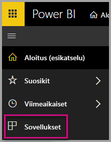
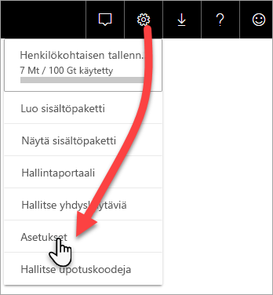
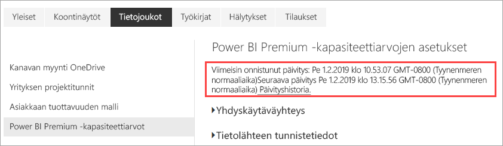
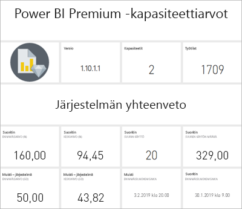

# Premium-kapasiteettien valvonta sovelluksen avulla

Kapasiteettien valvonta on tärkeää, jotta voit tehdä järkeviä päätöksiä Premium-kapasiteettien resurssien hyödyntämisen suhteen. Voit valvoa kapasiteetteja hallintaportaalissa tai **Power BI Premium -kapasiteetin mittausarvot** -sovelluksella. Tässä artikkelissa annetaan ohjeet Power BI Premium -kapasiteetin mittausarvot -sovelluksen käyttöön. Sovellus tarjoaa tarkimmat tiedot kapasiteettiesi toiminnasta ja suorituskyvystä. Jos haluat yleisempiä keskiarvotietoja seitsemän edellisen päivän ajalta, voit käyttää hallintaportaalia. Jos haluat lisätietoja valvonnasta portaalissa, lue ohjeartikkeli [Premium-kapasiteettien valvonta hallintaportaalissa](service-admin-premium-monitor-portal.md).

Sovellusta päivitetään säännöllisesti uusin toiminnoin. Varmista, että käytät uusinta versiota.   
**Uusin sovellusversio on 1.10.1.2 (22.2.2019)**.   
Jos sinulla on asennettuna sovelluksen vanhempi versio, sinun kannattaa poistaa se sovelluksista. Kun olet tehnyt tämän, tee päivitys painamalla CTRL+F5. 

## Sovelluksen asentaminen

Voit siirtyä suoraan [Power BI Premium -kapasiteetin mittausarvot -sovellukseen](https://app.powerbi.com/groups/me/getapps/services/capacitymetrics) tai asentaa sen muiden Power BI -sovellusten tapaan.

1. Valitse Power BI:ssä **Sovellukset**.   
    

2. Valitse oikealla puolella **Hanki sovelluksia**.
3. Hae **Sovellukset**-luokasta **Power BI Premium -kapasiteetin mittausarvot -sovellus**.
4. Tilaa sovelluksen asennus.

Ole kärsivällinen. Asennus ja arvojen päivittäminen kestää muutaman minuutin. Jos sovellus näyttää tyhjiä arvoja, päivitä selainnäkymä painamalla F5-näppäintä.

## Sovelluksen päivityshistorian hakeminen

Jos haluat tarkistaa, koska Power BI Premium -kapasiteetin mittausarvot -sovellus on viimeksi päivitetty, valitse **Asetukset** > **Tietojoukot** > **Power BI Premium -kapasiteetin mittausarvot** > **Päivityshistoria**. 

Näet viimeisimmän päivityksen. Jos haluat nähdä ajoitetut ja manuaaliset päivitykset, valitse **Päivityshistoria**.

## Kapasiteettien valvonta sovelluksen avulla

Nyt kun olet asentanut sovelluksen, näet organisaatiosi kapasiteettien mittausarvot. Sovelluksessa on [koontinäyttö](#Dashboard), joka sisältää mittausten yhteenvetoja, sekä yksityiskohtaisia mittausten [raportteja](#Reports).

### Koontinäyttö

Jos haluat nähdä koontinäytön, jossa on yhteenveto niiden kapasiteettien avainmittareista, joiden järjestelmänvalvoja olet, valitse **Koontinäytöt**-kohdassa **Power BI Premium -kapasiteetin mittarit**. Näkyviin tulee koontinäyttö.

Koontinäyttö sisältää seuraavat mittausarvot:

#### Ylhäällä

| Tieto | Kuvaus |
| --- | --- |
| Versio | Sovellusversio. | 
| Kapasiteetit | Niiden kapasiteettien määrä, joiden järjestelmänvalvoja olet. | 
| Työtilat | Kapasiteettiesi niiden työtilojen määrä, jotka ovat raportointimittareita.|
|||

#### Järjestelmän yhteenveto

| Tieto | Kuvaus |
| --- | --- |
| Suorittimen suurimman käytön kapasiteetti | Kapasiteetti, jossa suoritin useimmiten ylitti 80 prosenttia raja-arvoista seitsemän viime päivän aikana. |
| Suorittimen suurimman käytön määrä | Kuinka monta kertaa nimetty kapasiteetti ylitti 80 prosenttia raja-arvoista seitsemän viime päivän aikana. | 
| Muistin suurimman käytön kapasiteetti | Kapasiteetti, jossa muistin enimmäisraja useimmiten saavutettiin seitsemän viime päivän aikana kolmen minuutin osiin jaettuna.  |
| Muistin suurimman käytön määrä| Kuinka monta kertaa nimetty kapasiteetti saavutti muistin enimmäisrajan seitsemän viime päivän aikana kolmen minuutin osiin jaettuna. |
|||

#### Tietojoukon yhteenveto

| Tieto | Kuvaus |
| --- | --- |
| Tietojoukot | Kapasiteettiesi kaikkien työtilojen tietojoukkojen kokonaismäärä.|
| Tietojoukkojen keskikoko (Mt) | Kapasiteettiesi kaikkien työtilojen tietojoukkojen keskikoko.|  
| Tietojoukkojen keskimääräinen latausmäärä | Muistiin ladattujen tietojoukkojen keskimäärä. |  
| Tietojoukot - Keskimääräiset aktiiviset tietojoukot (%)| Keskimääräiset aktiiviset tietojoukot seitsemän viime päivän aikana. Tietojoukko katsotaan aktiiviseksi, jos käyttäjä on käsitellyt visualisointeja edellisen kolmen minuutin aikana. |
| Suoritin – Tietojoukot enintään (%)| Tietojoukkojen kuormituksen suurin suorittimen kulutus seitsemän viime päivän aikana. |
| Suoritin – Tietojoukkojen keskiarvo (%)| Tietojoukkojen kuormituksen keskimääräinen suorittimen kulutus seitsemän viime päivän aikana. |
| Muisti - Tietojoukkojen keskiarvo (Gt) | Tietojoukkojen kuormituksen keskimääräinen muistin kulutus seitsemän viime päivän aikana. |
| Muisti - Tietojoukot enintään (Gt) | Tietojoukkojen kuormituksen suurin muistin kulutus seitsemän viime päivän aikana.|
| Tietojoukkojen häädöt | Muistipaineen vuoksi poistettujen tietojoukkojen kokonaismäärä. |
| DirectQuery-yhteyksien tai reaaliaikaisten yhteyksien korkean käyttöasteen määrä| Kuinka monta kertaa DirectQuery-yhteydet tai reaaliaikaiset yhteydet ylittivät 80 prosenttia raja-arvoista viimeisten seitsemän päivän aikana kolmen minuutin osiin jaettuna. |
| DirectQuery-yhteyksien tai reaaliaikaisten yhteyksien suurin käyttömäärä| Ajankohdat, jolloin DirectQuery-yhteydet tai reaaliaikaiset yhteydet useimmin ylittivät 80 prosenttia viimeisten seitsemän päivän aikana tunnin osiin jaettuna. |
| DirectQuery-yhteyksien tai reaaliaikaisten yhteyksien suurin korkea käyttöaste | Kuinka monta kertaa enimmillään DirectQuery-yhteydet tai reaaliaikaiset yhteydet ylittivät 80 prosenttia raja-arvoista viimeisten seitsemän päivän aikana kolmen minuutin osiin jaettuna.|
| DirectQuery-yhteyksien tai reaaliaikaisten yhteyksien enimmäismäärän aika | Paikallinen aika, jolloin DirectQuery-yhteydet tai reaaliaikaiset yhteydet useimmin ylittivät 80 prosenttia tunnin aikana. |
| Päivitykset yhteensä | Päivitysten kokonaismäärä seitsemän viime päivän aikana. |
| Päivityksen luotettavuus (%) | Onnistuneiden päivitysten määrä jaettuna päivitysten kokonaismäärällä seitsemän viime päivän aikana. |
| Päivitysten keskimääräinen kesto (minuuttia) | Keskimääräinen päivityksen valmistumiseen kuluva aika. |
| Päivitysten keskimääräinen odotusaika (minuuttia)| Keskimääräinen aika, joka kuluu ennen päivityksen alkamista. |
| Kyselyitä yhteensä |  Suoritettujen kyselyjen kokonaismäärä seitsemän viime päivän aikana. |
| Odottavien kyselyiden kokonaismäärä | Sellaisten kyselyiden kokonaismäärä, jotka odottivat ennen suoritusta. |
| Kyselyiden keskimääräinen kesto (ms) | Kyselyiden suorittamiseen keskimäärin kuluva aika. |
| Kyselyiden keskimääräinen odotusaika (ms) | Keskimääräinen aika, jonka kyselyt odottivat järjestelmäresursseja ennen suoritusta. |
|||

#### Tietovuon yhteenveto

| Tieto | Kuvaus |
| --- | --- |
| Tietovuot |  Kapasiteettiesi kaikkien työtilojen tietovoiden kokonaismäärä.|
| Päivitykset yhteensä | Päivitysten kokonaismäärä seitsemän viime päivän aikana.|  
| Päivitysten keskimääräinen kesto (minuuttia) | Päivityksen suorittamiseen kuluva aika. |
| Päivitysten keskimääräinen odotusaika (minuuttia) | Viive päivityksen ajoitetun ajan ja todellisen aloitusajan välillä.|
| Suoritin – Tietovuot enintään (%) | Tietovuokuormituksen suurin suorittimen kulutus seitsemän viime päivän aikana. |
| Suoritin - Tietovuot keskimäärin (%) | Tietovuokuormituksen keskimääräinen suorittimen kulutus seitsemän viime päivän aikana. |
| Muisti - Tietovuot enintään (Gt) | Tietovuokuormituksen suurin muistin kulutus seitsemän viime päivän aikana. |
| Muisti - Tietovuot keskimäärin (Gt) | Tietovuokuormituksen keskimääräinen muistin kulutus seitsemän viime päivän aikana. |
|||

#### Sivutetun raportin yhteenveto

| Tieto | Kuvaus |
| --- | --- |
| Sivutetut raportit |  Kapasiteettiesi kaikkien työtilojen sivutettujen raporttien kokonaismäärä. |
| Näkymiä yhteensä | Kaikkien raporttien katselukertojen kokonaismäärä. | 
| Rivejä yhteensä | Kaikkien raporttien tietorivien kokonaismäärä.|
| Kokonaisaika | Millisekunteina ilmoitettu kokonaisaika, joka kaikkien raporttien kaikkiin vaiheisiin (tietojen nouto, käsittely ja hahmontaminen) menee. |
| Suoritin - Sivutetut raportit enintään (%) | Sivutettujen raporttien kuormituksen suurin suorittimen kulutus seitsemän viime päivän aikana. |
| Suoritin - Sivutetut raportit keskimäärin (%) | Sivutettujen raporttien kuormituksen keskimääräinen suorittimen kulutus seitsemän viime päivän aikana. |
| Muisti - Sivutetut raportit enintään (Gt) | Sivutettujen raporttien kuormituksen suurin muistin kulutus seitsemän viime päivän aikana. |
| Muisti - Sivutetut raportit keskimäärin (Gt) | Sivutettujen raporttien kuormituksen keskimääräinen muistin kulutus seitsemän viime päivän aikana. |
|||

### Raportit

Raporteissa on yksityiskohtaisempia mittareita. Saat näkyviin sellaisten kapasiteettien raportit, joiden järjestelmänvalvoja olet, valitsemalla **Raportit**-kohdasta vaihtoehdon **Power BI Premium -kapasiteetin mittarit**. Tai napsauta koontinäytössä mittarin solua, niin siirryt mittarin pohjana olevaan raporttiin. 

Raporttieditorin alareunassa on viisi *välilehteä*:

[**Tietojoukot**](#datasets) - Antaa yksityiskohtaisia mittausarvoja Power BI -tietojoukkojen kunnosta kapasiteeteissasi.   
[**Sivutetut raportit**](#paginated-reports) - Antaa yksityiskohtaisia mittausarvoja sivutettujen raporttien kunnosta kapasiteeteissasi.   
[**Tietovuot**](#dataflows) - Antaa yksityiskohtaisia tietovoiden päivitysmittausarvoja kapasiteeteissasi.   
[**Resurssien kulutus**](#resource-consumption) - Antaa yksityiskohtaisia mittausarvoja resurssin mittausarvoista, kuten muistista ja suorittimen korkeasta käytöstä.    
[**Tunnukset ja tiedot**](#ids-and-info): nämä ovat kapasiteettien, työtilojen ja työmäärien nimet, tunnukset ja omistajat.

Kukin välilehti avaa sivun, jossa voit suodattaa mittareita kapasiteetin ja päivämääräalueen mukaan. Jos suodattimia ei ole valittuna, raportti näyttää oletuksena edellisen viikon mittausarvot kaikille kapasiteeteille, jotka ovat raportointimittareita. 

### Tietojoukot

Tietojoukot-sivulla on erilaisia *alueita*, joihin sisältyvät **Päivitykset**, **Kyselyn kestot**, **Kysely odottaa** ja  **Tietojoukot**. Käyttämällä sivun yläosan painikkeita voit siirtyä eri alueille.

#### Päivitykset-alue

| Raporttiosa | Arvot |
| --- | --- |
| Päivitykset |  Kokonaismäärä: Kunkin tietojoukon päivitysten kokonaismäärä.   Luotettavuus: Kullekin tietojoukolle suoritettujen päivitysten prosenttiosuus.   Keskimääräinen odotusaika: Keskimääräinen viive ajoitetun ajankohdan ja tietojoukon päivityksen alkamisen välillä minuutteina.   Enimmäisodotusaika: Tietojoukon enimmäisodotusaika minuutteina.   Keskimääräinen kesto: Tietojoukon päivityksen keskimääräinen kesto minuutteina.   Enimmäiskesto: Tietojoukon pitkäkestoisimman päivityksen kesto minuutteina. |
| 5 parasta tietojoukkoa keskimääräisen keston mukaan (minuutteina) |  Viisi tietojoukkoa, joilla on pisin päivityksen keskimääräinen kesto minuutteina. |
| 5 parasta tietojoukkoa keskimääräisen odotusajan mukaan (minuutteina) |  Viisi tietojoukkoa, joilla on pisin päivityksen keskimääräinen odotusaika minuutteina. |
| Päivitysmäärä tunneittain ja muistin käyttö (Gt) |  Onnistumiset, epäonnistumiset ja muistin käyttö tunnin osiin jaettuna paikallisessa ajassa ilmoitettuna. |
| Päivityksen keskimääräinen odotusaika tunneittain (minuutteina) |  Tämä on päivityksen keskimääräinen odotusaika tunnin osiin jaettuna paikallisessa ajassa ilmoitettuna. Useat korkeat päivityksen odotusaikapiikit ovat merkki kuumana käyvästä kapasiteetista. |
|  |  |

#### Kyselyjen kestot -alue

| Raporttiosa | Arvot |
| --- | --- |
| Kyselyjen kestot |  Tämän osion tiedot on ositettu tietojoukkojen, työtilan ja tunnittaisten säilöjen mukaan viimeisten seitsemän päivän ajalta.   Yhteensä: Tietojoukolle suoritettavien kyselyjen kokonaismäärä.   Keskiarvo: tietojoukon kyselyn keskimääräinen kesto millisekunteina   Enimmäisarvo: Tietojoukon pitkäkestoisimman kyselyn kesto millisekunteina.|
| Kyselyn keston jakauma |  Kyselyn keston histogrammi on jaoteltu kyselyjen kestojen mukaan (millisekunneissa) seuraaviin luokkiin: < 30 ms, 30–100 ms, 100–300 ms, 300 ms–1 s, 1–3 s, 3–10 s, 10–30 s ja > 30 s. Kyselyjen pitkät kestot ja odotusajat ovat osoitus siitä, että kapasiteetti on äärirajoilla. Se saattaa myös tarkoittaa sitä, että yksi tietojoukko aiheuttaa ongelmia ja tarkempaa tutkimusta tarvitaan. |
| 5 parasta tietojoukkoa keskimääräisen keston mukaan |  Viisi tietojoukkoa, joilla on pisin kyselyn keskimääräinen kesto millisekunteina. |
| Kyselyn keston jakauma tunneittain |  Kyselyjen määrä ja keskimääräinen kesto (millisekunteina) vs. muistin käyttö gigatavuina tunnin osiin jaettuna paikallisessa ajassa ilmoitettuna. |
| DirectQuery-yhteydet / Reaaliaikaiset yhteydet (> 80 prosentin käyttöaste) |  Kerrat, jolloin DirectQuery-yhteys tai reaaliaikainen yhteys ylitti suorittimen 80 prosentin käyttöasteen tunnin osiin jaettuna paikallisessa ajassa ilmoitettuna. |
|  |  |

#### Kysely odottaa -alue

| Raporttiosa | Arvot |
| --- | --- |
| Kyselyn odotusajat |  Tämän osion tiedot on ositettu tietojoukkojen, työtilan ja tunnittaisten säilöjen mukaan viimeisten seitsemän päivän ajalta.   Yhteensä: Tietojoukolle suoritettavien kyselyjen kokonaismäärä.   Odotusmäärä: Ennen suorittamisen aloittamista järjestelmäresursseissa odottaneiden kyselyjen määrä tietojoukossa.   Keskiarvo: Tietojoukon kyselyn keskimääräinen odotusaika millisekunteina.   Enimmäisarvo: Tietojoukon pisimpään odottaneen kyselyn kesto millisekunteina.|
| 5 parasta tietojoukkoa keskimääräisen odotusajan mukaan |  Viisi tietojoukkoa, joilla on pisin keskimääräinen odotusaika kyselyn suorittamisen aloittamiseen millisekunteina. |
| Odotusajan jakaumat |  Kyselyn keston histogrammi on jaoteltu kyselyjen kestojen mukaan (millisekunneissa) seuraaviin luokkiin: < 50 ms, 50–100 ms, 100–200 ms, 200–400 ms, 400 ms–1 s, 1–5 s ja > 5 s. |
| Kyselyiden odotusajan jakaumat tunneittain |  Odottavien kyselyjen määrä ja keskimääräinen odotusaika (millisekunteina) vs. muistin käyttö gigatavuina tunnin osiin jaettuna paikallisessa ajassa ilmoitettuna. |
|  |  |

#### Tietojoukot-alue

| **Raporttiosa** | **Mittausarvot** |
| --- | --- |
| Tietojoukkojen koot  |  Enimmäiskoko: Tietojoukon enimmäiskoko megatavuina näytetyllä ajanjaksolla. |
| Tietojoukon poistolaskuri |  Yhteensä: kapasiteetista *häädettävien* tietojoukkojen kokonaismäärä. Kun kapasiteetti kohtaa muistipainetta, solmu häätää yhden tai useamman tietojoukon muistista. Passiiviset tietojoukot (joihin ei kyseisellä hetkellä kohdistu kysely- tai uudelleenlataustoimintoja) häädetään ensin. Seuraavaksi häätöjärjestyksessä sovelletaan ”viimeiseksi käytetyt ensin” -periaatetta.|
| Tunneittain ladattujen tietojoukkojen määrä |  Muistiin ladattujen tietojoukkojen määrä vs. muistin käyttö gigatavuina tunnin osiin jaettuna paikallisessa ajassa ilmoitettuna. |
| Tietojoukkojen häätö ja muistin käyttö tunneittain |  Tietojoukkojen häädöt vs. muistin käyttö gigatavuina tunnin osiin jaettuna paikallisessa ajassa ilmoitettuna. |
| Kulutetun muistin prosenttiosuudet |  Tämä on muistissa olevien aktiivisten tietojoukkojen kokonaismuistista viemä prosenttiosuus. Erottelun aktiivisten ja kaikkien määritettyjen tietojoukkojen välillä voi poistaa. Tämä näytetään tunneittain seitsemältä edelliseltä päivältä. |
|  |  |

### Sivutetut raportit

| **Raporttiosa** | **Mittausarvot** |
| --- | --- |
| Kokonaiskäyttö |  Katselukerrat yhteensä: Kuinka monta kertaa käyttäjät ovat katselleet raporttia.   Rivimäärä: Raportin tietorivien määrä.   Nouto (keskimääräinen): raportin tietojen noutamiseen keskimääräisesti kuluva aika millisekunteina. Pitkä kesto voi olla osoitus kyselyjen hitaasta suorittamisesta tai muista tietolähteeseen liittyvistä ongelmista.    Käsittely (keskimääräinen): Raportin tietojen käsittelemiseen keskimääräisesti kuluva aika millisekunteina.  Hahmontaminen (keskimääräinen): Raportin hahmontamiseen selaimessa keskimääräisesti kuluva aika millisekunteina.   Kokonaisaika: Raportin kaikkiin vaiheisiin kuluva aika millisekunteina. |
| 5 parasta raporttia tietojen keskimääräisen noutoajan mukaan |  Viisi raporttia, joissa on pisin tietojen keskimääräinen noutoaika millisekunteina. |
| 5 parasta raporttia keskimääräisen käsittelyajan mukaan |  Viisi raporttia, joissa on pisin raportin keskimääräinen käsittelyaika millisekunteina. |
| Tulokset tunneittain |  Onnistumiset, epäonnistumiset ja muistin käyttö tunnin osiin jaettuna paikallisessa ajassa ilmoitettuna. |
| Kestot tunneittain |  Tietojen nouto vs. käsittely- ja hahmonnusaika tunnin osiin jaettuna paikallisessa ajassa ilmoitettuna. |
|  |  |

### Tietovuot

| **Raporttiosa** | **Mittausarvot** |
| --- | --- |
| Päivitykset |  Yhteensä: Kunkin tietovuon päivitysten kokonaismäärä.   Luotettavuus: Kullekin tietovuolle suoritettujen päivitysten prosenttiosuus.   Keskimääräinen odotusaika: Keskimääräinen viive ajoitetun ajankohdan ja tietovuon päivityksen alkamisen välillä minuutteina.   Enimmäisodotusaika: Tietovuon enimmäisodotusaika minuutteina.   Keskimääräinen kesto: Tietovuon päivityksen keskimääräinen kesto minuutteina.   Enimmäiskesto: Tietovuon pitkäkestoisimman päivityksen kesto minuutteina. |
| 5 parasta tietovuota päivityksen keskimääräisen keston mukaan |  Viisi tietovuota, joilla on pisin päivityksen keskimääräinen kesto minuutteina. |
| 5 parasta tietovuota keskimääräisen odotusajan mukaan |  Viisi tietovuota, joilla on pisin päivityksen keskimääräinen odotusaika minuutteina. |
| Päivityksen keskimääräinen odotusaika tunneittain |  Tämä on päivityksen keskimääräinen odotusaika tunnin osiin jaettuna paikallisessa ajassa ilmoitettuna. Useat korkeat päivityksen odotusaikapiikit ovat merkki kuumana käyvästä kapasiteetista. |
| Päivitysmäärä tunneittain ja muistin käyttö |  Onnistumiset, epäonnistumiset ja muistin käyttö tunnin osiin jaettuna paikallisessa ajassa ilmoitettuna. |
|  |  |

### Resurssien kulutus

| **Raporttiosa** | **Mittausarvot** |
| --- | --- |
| Suorittimen kulutus |  Tämä on kulutus työmäärittäin prosenttiosuutena suorittimen kokonaiskapasiteetista. Tämä näytetään tunneittain seitsemältä edelliseltä päivältä. |
| Muistin käyttö |  Tämä on muistin kulutus gigatavuina työmäärittäin (yhtenäiset viivat), työmäärärajoitukset näytetään myös (katkoviivat). Tämä näytetään tunneittain seitsemältä edelliseltä päivältä. |
|  |  |

### Tunnukset ja tiedot

**Tunnukset ja tiedot** -välilehdessä on seuraavat alueet: **Kapasiteetit**, **Työtilat**, **Tietojoukot**, **Sivutetut raportit** ja **Tietovuot**.

#### Kapasiteetit-alue

| Raporttiosa | Arvot |
| --- | --- |
| SKU:n ja kuormituksen tiedot | Kapasiteetin SKU- ja kuormitusasetukset. |
| Järjestelmänvalvojat | Kapasiteetin järjestelmänvalvojien nimet. |
|||

#### Työtilat-alue

| Raporttiosa | Arvot |
| --- | --- |
| Työtilat | Kaikkien työtilojen nimet ja tunnukset. |
|||

#### Tietojoukot-alue

| Raporttiosa | Arvot |
| --- | --- |
| Tietojoukot | Kaikkien tietojoukkojen työtilojen nimet ja tunnukset. |
|||

#### Sivutetut raportit -alue

| Raporttiosa | Arvot |
| --- | --- |
| Sivutetut raportit | Kaikkien sivutettujen raporttien nimet, työtilan nimet ja tunnukset. |
|||

#### Tietovuot-alue

| Raporttiosa | Arvot |
| --- | --- |
| Tietovuot | Kaikkien tietovoiden tietovirtojen nimet, työtilojen nimet ja tunnukset. |
|||

## Power BI Embedded -kapasiteetin valvonta

Voit käyttää Power BI Premium -kapasiteetin mittausarvot -sovellusta *A SKU* -kapasiteettien valvontaan Power BI Embeddedissä. Kyseiset kapasiteetit näkyvät raportissa niin kauan kuin olet kapasiteetin järjestelmänvalvoja. Raportin päivitys kuitenkin epäonnistuu, ellet myönnä Power BI:lle tiettyjä käyttöoikeuksia A-varastointiyksiköissä:

1. Avaa kapasiteettisi Azure-portaalissa.

1. Valitse **Käyttöoikeuksien valvonta (IAM)** ja lisää sitten **Power BI Premium** -sovellus lukijan rooliin. Jos et löydä sovellusta nimen mukaan, voit myös lisätä sen asiakastunnuksen mukaan: `cb4dc29f-0bf4-402a-8b30-7511498ed654`.

    

> [!NOTE]
> Voit valvoa Power BI Embedded -kapasiteetin käyttöä sovelluksessa tai Azure-portaalissa, mutta et Power BI -hallintaportaalissa.

## Seuraavat vaiheet

> [!div class="nextstepaction"]
> [Power BI Premium -kapasiteetin resurssien hallinta ja optimointi](service-premium-understand-how-it-works.md)
