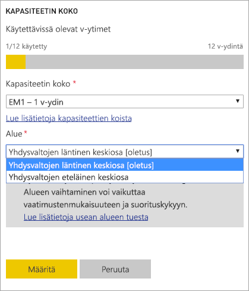
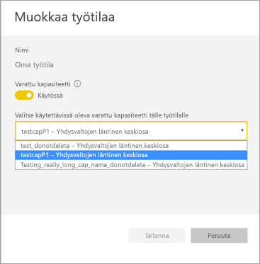
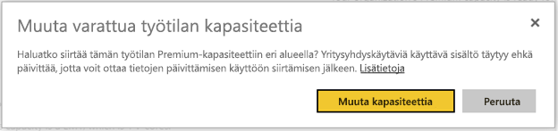
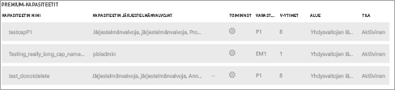

# Power BI Premiumin Multi-Geo-tuki (esikatselu)

Multi-Geo on Power BI Premiumin ominaisuus, joka auttaa monikansallisia asiakkaita huomioimaan organisaation aluekohtaiset, alakohtaiset ja tietojen säilytykseen liittyvät vaatimukset. Ota selvää, miten voit Power BI Premium -asiakkaana ottaa sisällön tietokeskuksia käyttöön muilla alueilla kuin Power BI -vuokraajan kotialueella. Maantieteellinen alue voi sisältää useamman kuin yhden alueen. Esimerkiksi Yhdysvallat on maantieteellinen alue, ja esimerkiksi Yhdysvaltojen läntinen keskiosa sekä Yhdysvaltojen eteläinen keskiosa ovat Yhdysvaltain alueita. Voit halutessasi ottaa sisältöä käyttöön millä tahansa seuraavista alueista:

- Yhdysvallat
- Kanada
- Yhdistynyt kuningaskunta
- Brasilia
- Eurooppa
- Japani
- Intia
- Tyynenmeren Aasia
- Australia

Multi-Geo ei ole käytettävissä Saksan Power BI:ssä, 21Vianetin ylläpitämässä Kiinan Power BI:ssä tai Yhdysvaltain valtionhallinnon Power BI:ssä.

Multi-Geo on nyt käytettävissä myös Power BI Embeddedissä. Lisätietoja on artikkelissa [Multi-Geo-tuki Power BI Embeddedissä (esikatselu)](developer/embedded-multi-geo.md).

## Multi-Geon käyttäminen

Voit ottaa Multi-Geon käyttöön uusille kapasiteeteille valitsemalla avattavasta valikosta muun kuin oletusalueen.  Kukin käytettävissä oleva kapasiteetti näyttää alueen, minne se tällä hetkellä sijoittuu, kuten **Yhdysvaltojen läntinen keskiosa**.

Kun olet luonut kapasiteetin, se säilyy kyseisellä alueella. Kaikkien luotavien työtilojen sisältö tallennetaan tälle alueelle. Voit siirtää työtilojen alueelta toiselle kautta työtilan asetusnäytön avattavan luettelon kautta.

Näet tämän viestin vahvistukseksi muutoksesta.

Sinun ei tarvitse vaihtaa yhdyskäytävän tunnistetietoja siirron aikana tällä hetkellä.  Ne on vaihdettava siirron yhteydessä sen jälkeen, kun ne on tallennettu Premium-kapasiteetin alueelle.

Siirron aikana tietyt toiminnot voivat epäonnistua, kuten uusien tietojoukkojen julkaiseminen tai ajoitettu tietojen päivittäminen.  

Seuraavat kohteet tallennetaan Premium-alueelle, kun Multi-Geo on käytössä:

- Mallit (.ABF-tiedostot) tuomista varten ja DirectQuery-tietojoukot
- Kyselyn välimuisti
- R-kuvat.

Nämä kohteet säilyvät vuokraajan kotialueella:

- Push-tietojoukot
- Excel-työkirjat
- Raporttinäkymän/raporttien metatiedot, kuten ruutujen nimet ja ruutujen kyselyt
- Palveluväylät yhdyskäytävän kyselyitä tai ajoitettuja päivitystöitä varten
- Käyttöoikeudet
- Tietojoukon tunnistetiedot

## Kapasiteettien alueiden tarkasteleminen

Hallintaportaalissa voit tarkastella Power BI -vuokraajan kaikkia kapasiteetteja ja niiden nykyisiä alueita.

 

## Olemassa olevan sisällön alueen muuttaminen

Jos haluat muuttaa olemassa olevan sisällön aluetta, sinulla on kaksi vaihtoehtoa.

- Luo toinen kapasiteetti ja siirrä työtilat. Maksuttomat käyttäjät eivät joudu kokemaan käyttökatkoja, kunhan vuokraajalla on käyttämättömiä V-ytimiä.
- Jos toisen kapasiteetin luominen ei ole mahdollista, voit siirtää sisällön tilapäisesti takaisin Premiumin jaettuun kapasiteettiin. Et tarvitse ylimääräisiä V-ytimiä, mutta maksuttomat käyttäjät saattavat kokea joitakin käyttökatkoja.

## Sisällön siirtäminen ulos Multi-Geosta  

Voit ottaa työtiloja ulos Multi-Geo-kapasiteetista jommallakummalla seuraavista tavoista:

- Poista nykyinen kapasiteetti, johon työtila sisältyy.  Tämä siirtää työtilan takaisin jaettuun kapasiteettiin kotialueella.
- Siirrä yksittäisiä työtiloja takaisin kotialueen vuokraajan Premium-kapasiteettiin.

## Rajoitukset ja huomioitavat asiat

- Vahvista, että kaikki aloittamasi alueiden väliset siirtymät noudattavat kaikkia yrityksen ja julkishallinnon edellyttämiä vaatimustenmukaisuusehtoja ennen tiedonsiirron aloittamista.
- Etäalueelle tallennettu välimuistissa oleva kysely pysyy alueellaan levossa. Muut siirrettävät tiedot voivat kuitenkin liikkua edestakaisin useiden maantieteellisten alueiden välillä.
- Kun siirrät tietoja alueelta toiselle Multi-Geo-ympäristössä, lähdetiedot saattavat jäädä jopa 30 päivän ajaksi alueelle, jolta ne on siirretty. Tänä aikana loppukäyttäjät eivät pysty käyttämään niitä. Tiedot poistetaan tältä alueelta ja tuhotaan 30 päivän aikana.
- Multi-Geon käyttäminen ei paranna yleistä suorituskykyä. Raporttien ja raporttinäkymien lataamiseen liittyy edelleen metatietopyyntöjä kotialueelle.
- [Tietovuot](service-dataflows-overview.md)-ominaisuutta (esikatselu) ei tällä hetkellä tueta Multi-Geon yhteydessä.

## Seuraavat vaiheet

- [Mikä on Power BI Premium?](service-premium.md)
- [Multi-Geo Power BI Embedded -kapasiteeteille](developer/embedded-multi-geo.md)

Onko sinulla kysyttävää? [Voit esittää kysymyksiä Power BI -yhteisössä](http://community.powerbi.com/)
