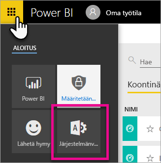
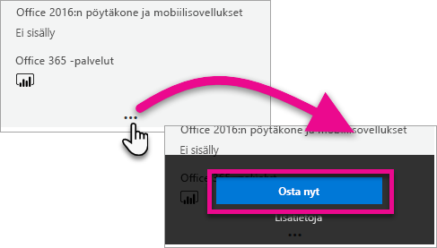
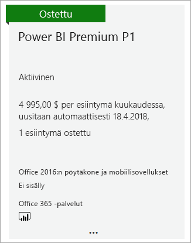
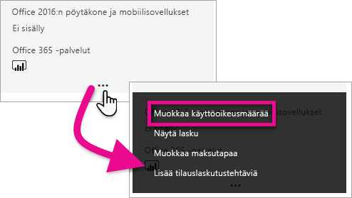
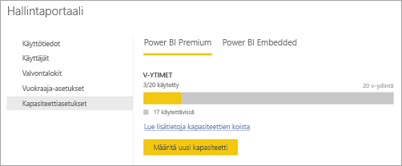

# Ohjeet Power BI Premiumin ostamiseen

Tässä artikkelissa kuvataan, miten voit ostaa organisaatiollesi Power BI Premium -kapasiteettia. Artikkelissa käsitellään kahta skenaariota:

- P-varastointiyksiköiden käyttöä tyypillisissä tuotantoskenaarioissa. P-varastointiyksiköt edellyttävät kuukausi- tai vuosisitoumusta, ja ne laskutetaan kuukausittain. P-varastointiyksiköt ostetaan [Microsoft 365 -hallintakeskuksessa](https://admmin.microsoft.com).

- A-varastointiyksiköiden käyttöä testausskenaarioissa ja tapauksissa, joissa P-varastointiyksiköiden ostamiseen tarvittavia käyttöoikeuksia ei ole (Microsoft 365:n yleisen järjestelmänvalvojan rooli tai laskutuksen järjestelmänvalvojan rooli). A-varastointiyksiköt eivät vaadi aikasitoumusta, ja ne laskutetaan tunneittain. A-varastointiyksiköt ostetaan [Azure-portaalissa](https://portal.azure.com).

Lisätietoja Power BI Premiumista löytyy artikkelista [Mikä Power BI Premium on ?](service-premium-what-is.md). Ajantasaiset hinnoittelu- ja suunnittelutiedot löytyvät [Power BI -hinnoittelusivulta](https://powerbi.microsoft.com/pricing/) ja [Power BI Premium -laskimesta](https://powerbi.microsoft.com/calculator/). Sisällöntekijät tarvitsevat edelleen [Power BI Pro -käyttöoikeuden](service-admin-purchasing-power-bi-pro.md), vaikka organisaatiosi käyttäisikin Power BI Premiumia. Varmista, että ostat vähintään yhden Power BI Pro -käyttöoikeuden organisaatiollesi. A-varastointiyksiköiden yhteydessä _kaikki sisältöä kuluttavat käyttäjät_ tarvitsevat myös Pro-käyttöoikeudet.

> [!NOTE]
> Jos Premium-tilaus päättyy, sinulla on täydet käyttöoikeudet kapasiteettiisi 30 päivän ajan. Tämän jälkeen sisältö palautetaan jaettuun kapasiteettiin. Jaettu kapasiteetti ei tue malleja, jotka ovat suurempia kuin 1 Gt.

## P-varastointiyksiköiden osto tyypillisiä tuotantoskenaarioita varten

Voit luoda uuden vuokraajan Power BI Premium P1 -varastointiyksikkö määritettynä tai voit ostaa Power BI Premium -kapasiteettia organisaatiolle. Kummassakin tapauksessa voit lisätä kapasiteettia tarpeen mukaan.

### Luo uusi vuokralainen Power BI Premium P1:llä

Jos sinulla ei ole vuokraajaa ja haluat luoda sellaisen, voit ostaa Power BI Premiumin samaan aikaan. Seuraavat linkit auttavat sinua luomaan uuden vuokraajan ja hankkimaan Power BI Premiumin: [Power BI Premium P1 -tarjous](https://signup.microsoft.com/Signup?OfferId=b3ec5615-cc11-48de-967d-8d79f7cb0af1). Kun luot vuokraajan, sinusta tulee automaattisesti kyseisen vuokraajan Microsoft 365:n yleinen järjestelmänvalvoja.

Kun olet ostanut kapasiteetin, lue lisätietoja [kapasiteettien hallinnasta](service-admin-premium-manage.md#manage-capacity) ja [työtilojen määrittämisestä](service-admin-premium-manage.md#assign-a-workspace-to-a-capacity) kapasiteettiin.

### Voit ostaa Power BI Premium -kapasiteettia organisaatiolle

Jos sinulla on aiemmin luotu organisaatio (vuokraaja), sinun on oltava joko Microsoft 365:n yleinen järjestelmänvalvoja tai laskutuksen järjestelmänvalvoja, jotta voit ostaa tilauksia ja käyttöoikeuksia. Jos haluat lisätietoja, katso [Tietoja Microsoft 365:n järjestelmänvalvojarooleista](https://support.office.com/article/About-Office-365-admin-roles-da585eea-f576-4f55-a1e0-87090b6aaa9d).

Jos haluat ostaa Premium-kapasiteetin, toimi seuraavasti.

1. Valitse Power BI -palvelussa Microsoft 365 -sovellusvalitsin ja sitten **Järjestelmänvalvoja**.

    

    Voit myös selata Microsoft 365 -hallintakeskuksessa.

1. Valitse **Laskutus** > **Ostopalvelut**.

1. Etsi kohdasta **Muut palvelupaketit** Power BI Premium -tarjouksia. Tämä näkyy luettelossa muodossa P1–P3, EM3 ja P1 (kuukausittainen).

1. Pidä osoitinta kolmen pisteen ( **. . .** ) päällä ja valitse sitten **Osta nyt**.

    

1. Viimeistele osto suorittamalla alla olevat vaiheet.

Kun olet suorittanut oston, **ostopalveluiden** sivulla näkyy, että tuote on ostettu ja aktiivinen.

Kun olet ostanut kapasiteetin, lue lisätietoja [kapasiteettien hallinnasta](service-admin-premium-manage.md#manage-capacity) ja [työtilojen määrittämisestä](service-admin-premium-manage.md#assign-a-workspace-to-a-capacity) kapasiteettiin.

### Lisäkapasiteetin ostaminen

Nyt kun sinulla on kapasiteetti, voit ostaa lisää kapasiteettia tarpeidesi mukaan. Voit myös käyttää organisaatiosi sisällä mitä tahansa Premium-kapasiteetin varastointiyksiköiden (P1–P3) yhdistelmää. Eri varastointiyksiköt sisältävät eri resurssiominaisuuksia.

1. Valitse Microsoft 365 -hallintakeskuksessa **Laskutus** > **Ostopalvelut**.

1. Etsi lisää ostettava Power BI Premium -tuote kohdasta **Muut palvelupaketit**.

1. Pidä osoitinta **Enemmän vaihtoehtoja** (...) -valikon päällä ja valitse sitten **Muuta käyttöoikeuksien määrää**.

    

1. Muuta tämän tuotteen esiintymien määrä haluamaksesi. Valitse sitten **Lähetä**, kun olet valmis.

   > [!IMPORTANT]
   > **Lähetä**-komennon valitseminen veloittaa tiedoissamme olevaa luottokorttia.

**Osta palveluita** -sivulla näkyy sitten sinulla olevien esiintymien määrä. Power BI -hallintaportaaliin kohdassa **Kapasiteettiasetukset** näkyvä v-ydinten määrä vastaa uutta ostettua kapasiteettia.

### Tilauksen peruuttaminen

Voit peruuttaa tilauksen Microsoft 365 -hallintakeskuksessa. Jos haluat peruuttaa Premium-tilauksesi, toimi seuraavasti.

1. Siirry Microsoft 365 -hallintakeskukseen.

1. Valitse **Laskutus** > **Tilaukset**.

1. Valitse Power BI Premium -tilauksesi luettelosta.

1. Valitse **Lisää toimintoja** > **Peruuta tilaus**.

1. **Peruuta tilaus** -sivu osoittaa, oletko vastuussa [aikaisen irtisanomisen maksusta](https://support.office.com/article/early-termination-fees-6487d4de-401a-466f-8bc3-c0beb5cc40d3). Tämä sivu kertoo myös, milloin tilauksen tiedot poistetaan.

1. Lue tiedot ja, jos haluat jatkaa, valitse **Peruuta tilaus**.

#### Jos peruutat tai käyttöoikeutesi vanhenee

Jos peruutat Premium-tilauksesi tai kapasiteetin käyttöoikeutesi umpeutuu, voit jatkaa Premium-kapasiteettien käyttämistä 30 päivän ajan peruuttamispäivästä tai käyttöoikeuden vanhenemisen päivämäärästä. 30 päivän jälkeen et enää pysty käyttämään Premium-kapasiteettejasi tai niiden sisältämiä työtiloja.

## A-varastointiyksiköiden ostaminen testausta ja muita skenaarioita varten

A-varastointiyksiköt ovat saatavilla Azure Power BI Embedded -palvelun kautta. Voit käyttää A-varastointiyksiköitä seuraavilla tavoilla:

- Ota käyttöön Power BI:n upottaminen kolmannen osapuolen sovelluksiin. Jos haluat lisätietoja, katso [Power BI Embedded](developer/azure-pbie-what-is-power-bi-embedded.md).

- Testaa Premium-toimintoja ennen kuin ostat P-varastointiyksikön.

- Luo kehitys- ja testausympäristöjä P-varastointiyksiköitä käyttävän tuotantoympäristön rinnalle.

- Osta Power BI Premium, vaikka sinulla ei olisi Microsoft 365:n yleisen järjestelmänvalvojan roolia tai laskutuksen järjestelmänvalvojan roolia.

> [!NOTE]
> Jos ostat varastointiyksikön A4 tai sitä korkeamman varastointiyksikön, voit hyödyntää kaikkia Premium-ominaisuuksia lukuun ottamatta sisällön rajoittamatonta jakamista. A-varastointiyksiköiden yhteydessä _kaikki sisältöä kuluttavat käyttäjät_ tarvitsevat Pro-käyttöoikeudet.

Näitä ohjeita noudattamalla voit ostaa A-varastointiyksiköitä Azure-portaalissa:

1. Kirjaudu sisään [Azure-portaaliin](https://portal.azure.com) tilillä, jolla on vähintään kapasiteetin järjestelmänvalvojan oikeudet Power BI:ssä.

1. Hae _Power BI Embedded_ ja valitse palvelu hakutuloksista.

    

1. Valitse **Luo Power BI Embedded**.

    

1. Määritä **Power BI Embeddedin** luontiruudussa seuraavat tiedot:

    - **Tilaus**, johon Power BI Embedded -palvelu luodaan.

    - Fyysinen **sijainti**, johon luodaan palvelun sisältävä resurssiryhmä. Jotta suorituskyky olisi parempi, tämän sijainnin tulee olla lähellä Azure Active Directory -vuokraajasi Power BI -sijaintia.

    - Käytettävä olemassa oleva **resurssiryhmä** tai uuden luominen esimerkin mukaisesti.

    - **Power BI -kapasiteetin järjestelmänvalvoja**. Kapasiteetin järjestelmänvalvojan on oltava jäsenkäyttäjä tai palvelun päänimi Azure AD -vuokraajassasi.

    

1. Jos haluat käyttää kaikkia Power BI Premiumin ominaisuuksia (lukuun ottamatta rajoittamatonta jakamista), tarvitset vähintään A4-varastointiyksikön. Valitse **Muuta kokoa**.

    

1. Valitse kapasiteetin kooksi A4, A5 tai A6, jotka vastaavat P1-, P2- ja P3-ominaisuuksia.

    

1. Valitse **Tarkista + Luo**, tarkista valitsemasi asetukset ja valitse sitten **Luo**.

    

1. Käyttöönoton viimeisteleminen voi kestää muutaman minuutin. Kun se on valmis, valitse **Siirry resurssiin**.

    

1. Tarkista hallintanäytössä palvelun hallintaa koskevat asetukset, mukaan lukien palvelun keskeyttäminen, kun et käytä sitä.

    

Kun olet ostanut kapasiteetin, lue lisätietoja [kapasiteettien hallinnasta](service-admin-premium-manage.md#manage-capacity) ja [työtilojen määrittämisestä](service-admin-premium-manage.md#assign-a-workspace-to-a-capacity) kapasiteettiin.

## Seuraavat vaiheet

[Kapasiteettien määrittäminen ja hallinta Power BI Premiumissa](service-admin-premium-manage.md)\
[Power BI -hinnoittelusivu](https://powerbi.microsoft.com/pricing/)\
[Power BI Premium -laskin](https://powerbi.microsoft.com/calculator/)\
[Power BI Premiumin usein kysytyt kysymykset](service-premium-faq.md)\
[Power BI:n yrityskäyttöönoton suunnittelemisen tekninen raportti](https://aka.ms/pbienterprisedeploy)

Onko sinulla kysyttävää? [Voit esittää kysymyksiä Power BI -yhteisössä](https://community.powerbi.com/)
