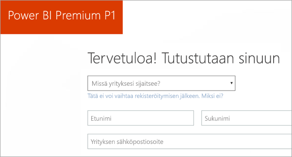
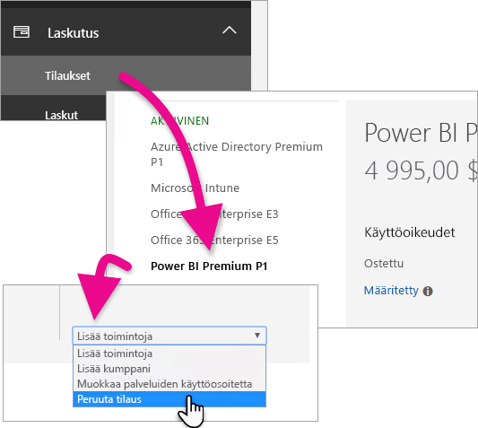
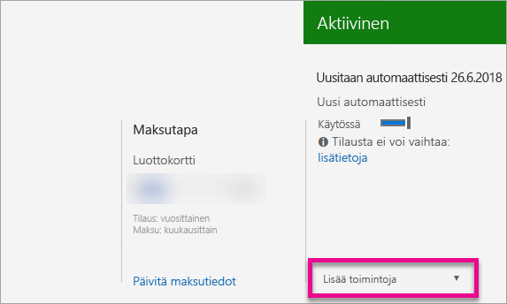

# Ohjeet Power BI Premiumin ostamiseen
Opi, miten voit ostaa organisaatiollesi Power BI Premiumin kapasiteettia.

<iframe width="640" height="360" src="https://www.youtube.com/embed/NkvYs5Qp4iA?rel=0&amp;showinfo=0" frameborder="0" allowfullscreen></iframe>

Voit ostaa Power BI Premium -kapasiteettisolmun Office 365 -hallintakeskuksen kautta. Voit myös hankkia organisaatiosi sisällä minkä tahansa yhdistelmän Premium-kapasiteetin varastointiyksiköitä (P1–P3). Ne tarjoavat eri resurssiominaisuuksia.

Saat lisätietoja siitä, mitä Power BI Premium on, katsomalla [Power BI Premium – mikä se on?](service-premium.md). Jos haluat nähdä Power BI:n nykyisen hinnoittelun, katso [Power BI:n hinnoittelusivu](https://powerbi.microsoft.com/pricing/). Voit myös suunnitella Power BI Premiumin kustannukset [Power BI Premiumin laskimella](https://powerbi.microsoft.com/calculator/).

> [!IMPORTANT]
> Sisällön tekijät tarvitsevat edelleen Power BI Pro -käyttöoikeuden, vaikka hankit Power BI Premiumin.
> 
> 

## Luo uusi vuokralainen Power BI Premium P1:llä
Jos sinulla ei ole vuokraajaa ja haluat luoda sellaisen, voit ostaa Power BI Premiumin samaan aikaan. Seuraavassa linkissä opastetaan uuden vuokraajan luominen Office 365:ssa käytettäväksi, ja voit ostaa Power BI Premiumin. Sinun on ostettava käyttäjälle Power BI Pron käyttöoikeus vuokraajan luonnin jälkeen. Kun luot vuokraajan, sinusta tulee automaattisesti kyseisen vuokraajan yleinen järjestelmänvalvoja.

Jos haluat tehdä tämän oston, katso [Power BI Premium P1 -tarjous](https://signup.microsoft.com/Signup?OfferId=b3ec5615-cc11-48de-967d-8d79f7cb0af1).

## Voit ostaa Power BI Premium -kapasiteettia organisaatiolle
Jos sinulla on aiemmin luotu organisaatio, sinun on oltava joko yleinen järjestelmänvalvoja tai laskutusjärjestelmänvalvoja, jotta voit ostaa tilauksia ja käyttöoikeuksia. Jos haluat lisätietoja, katso [Tietoja Office 365:n järjestelmänvalvojarooleista](https://support.office.com/article/About-Office-365-admin-roles-da585eea-f576-4f55-a1e0-87090b6aaa9d).

Jos haluat ostaa Premium-kapasiteettia, sinun on tehtävä seuraavaa.

1. Valitse Power BI -palvelussa **Office 365 -sovelluksen valitsin** > **Järjestelmänvalvoja**. Voit myös selata Office 365 -hallintakeskuksessa. Pääset siihen siirtymällä osoitteeseen https://portal.office.com ja valitsemalla **Järjestelmänvalvoja**.
   
    
2. Valitse **Laskutus** > **Ostopalvelut**.
3. Etsi kohdasta **Muut palvelupaketit** Power BI Premium -tarjouksia. Tämä näkyy luettelossa muodossa P1–P3, EM3 ja P1 (kuukausittainen).
4. Pidä osoitinta **kolmen pisteen (...)**  päällä ja valitse sitten **Osta nyt**.
   
    
5. Viimeistele osto suorittamalla alla olevat vaiheet.

Voit myös valita seuraavat linkit, jotka johtavat suoraan kyseisten tuotteiden ostosivuille. Lisätietoja näistä varastointiyksiköistä on kohdassa [Power BI Premium – mikä se on?](service-premium.md#premiumskus).

Power BI Premium -varastointiyksikön hankkiminen edellyttää, että ***olet yleinen tai laskutuksen järjestelmänvalvoja*** vuokraajassasi. Alla olevien linkkien valitseminen aiheuttaa virheen, jos et ole järjestelmänvalvoja.

| Suoraostolinkit |
| --- |
| [EM3 (kuukausittain) -varastointiyksikkö](https://portal.office.com/commerce/completeorder.aspx?OfferId=4004702D-749C-4F74-BF47-3048F1833780&adminportal=1) |
| [P1-varastointiyksikkö](https://portal.office.com/commerce/completeorder.aspx?OfferId=b3ec5615-cc11-48de-967d-8d79f7cb0af1&adminportal=1) |
| [P1 (kuukausittain) -varastointiyksikkö](https://portal.office.com/commerce/completeorder.aspx?OfferId=E4C8EDD3-74A1-4D42-A738-C647972FBE81&adminportal=1) |
| [P2-varastointiyksikkö](https://portal.office.com/commerce/completeorder.aspx?OfferId=062F2AA7-B4BC-4B0E-980F-2072102D8605&adminportal=1) |
| [P3-varastointiyksikkö](https://portal.office.com/commerce/completeorder.aspx?OfferId=40c7d673-375c-42a1-84ca-f993a524fed0&adminportal=1) |

Kun olet suorittanut oston, ostopalveluiden näytössä näkyy, että tuote on ostettu ja aktiivinen.

Nyt voit hallita tätä kapasiteettia Power BI -hallintakeskuksessa. Lisätietoja on ohjeartikkelissa [Power BI Premiumin hallinta](service-admin-premium-manage.md).

## Osta lisää kapasiteettia
Kun olet Power BI -hallintaportaalin osassa **Premium-asetukset** ja jos olet järjestelmänvalvoja, näyttöön tulee **Osta lisää** -painike. Tämä painike johtaa Office 365 -portaaliin. Kun olet Office 365 -hallintakeskuksessa, voit tehdä seuraavaa.

1. Valitse **Laskutus** > **Ostopalvelut**.
2. Etsi lisää ostettava Power BI Premium -tuote kohdasta **Muut palvelupaketit**.
3. Pidä osoitinta **kolmen pisteen (...)**  päällä ja valitse sitten **Muuta käyttöoikeuksien määrää**.
   
    
4. Muuta tämän tuotteen esiintymien määrä haluamaksesi. Valitse sitten **Lähetä**, kun olet valmis.
   
   > [!IMPORTANT]
   > **Lähetä**-komennon valitseminen veloittaa tiedoissamme olevaa luottokorttia.
   > 
   > 

**Osta palveluita** -sivulla näkyy sitten sinulla olevien esiintymien määrä. Power BI -hallintaportaaliin kohdassa **Kapasiteettiasetukset** näkyvä v-ydinten määrä vastaa uutta ostettua kapasiteettia.

Nyt voit hallita tätä kapasiteettia Power BI -hallintakeskuksessa. Lisätietoja on ohjeartikkelissa [Power BI Premiumin hallinta](service-admin-premium-manage.md).

## Tilauksen peruuttaminen
Voit peruuttaa tilauksen Office 365 -hallintakeskuksessa. Jos haluat peruuttaa Premium-tilauksesi, toimi seuraavasti.

1. Siirry Office 365 -hallintakeskukseen.
2. Valitse **Laskutus** > **Tilaukset**.
3. Valitse Power BI Premium -tilauksesi luettelosta.
4. Valitse avattavasta **Lisää toimintoja** -valikosta **Peruuta tilaus**.
   
    
5. **Peruuta tilaus** -sivu osoittaa, oletko vastuussa [aikaisen irtisanomisen maksusta](https://support.office.com/article/early-termination-fees-6487d4de-401a-466f-8bc3-c0beb5cc40d3). Tämä sivu kertoo myös, milloin tilauksen tiedot poistetaan.
6. Lue tiedot ja, jos haluat jatkaa, valitse **Peruuta tilaus**.

## Seuraavat vaiheet
[Power BI -hinnoittelusivu](https://powerbi.microsoft.com/pricing/)  
[Power BI Premium -laskin](https://powerbi.microsoft.com/calculator/)  
[Power BI Premium – mikä se on?](service-premium.md)  
[Power BI Premiumin hallinta](service-admin-premium-manage.md)  
[Power BI Premiumin usein kysytyt kysymykset](service-premium-faq.md)  
[Power BI Premiumin julkaisutiedot](service-premium-release-notes.md)  
[Microsoft Power BI Premiumin tekninen raportti](https://aka.ms/pbipremiumwhitepaper)  
[Power BI:n yrityskäyttöönoton suunnittelemisen tekninen raportti](https://aka.ms/pbienterprisedeploy)  
[Power BI -hallintaportaali](service-admin-portal.md)  
[Power BI:n hallinta organisaatiossa](service-admin-administering-power-bi-in-your-organization.md)  

Onko sinulla muuta kysyttävää? [Voit esittää kysymyksiä Power BI -yhteisössä](http://community.powerbi.com/)

