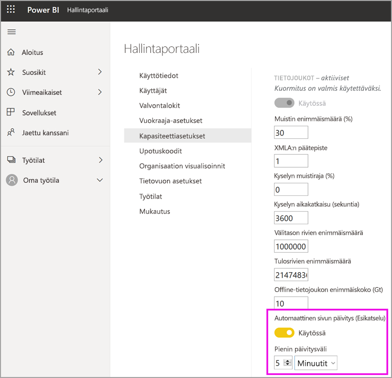

# Premium-kapasiteettien kuormitusten määrittäminen

Tässä artikkelissa kuvaillaan, miten voit ottaa käyttöön ja määrittää Power BI Premium -kapasiteettien kuormituksia. Oletusarvoisesti kapasiteetit tukevat ainoastaan Power BI -kyselyjen suorittamiseen liittyviä kuormituksia. Voit myös ottaa käyttöön ja määrittää muita kuormituksia **[tekoälylle (kognitiiviset palvelut)](service-cognitive-services.md)** , **[tietovoille](service-dataflows-overview.md#dataflow-capabilities-on-power-bi-premium)** ja **[sivutetuille raporteille](paginated-reports/paginated-reports-save-to-power-bi-service.md)** .

## Oletusmuistiasetukset

Kyselyn kuormitukset on optimoitu Premium-kapasiteetin SKU:lle, jonka resurssit määrittävät kuormitusten rajat. Premium-kapasiteetit tukevat myös muita kuormituksia, jotka voivat käyttää oman kapasiteettisi resursseja. Näiden kuormitusten oletusmuistiarvot perustuvat SKU:n käytettävissä oleviin kapasiteetin solmuihin. Enimmäismuistiasetukset eivät ole kumulatiivisia. Enintään enimmäisarvoa vastaava muistimäärä varataan AI:lle ja tietovuolle dynaamisesti, mutta sivutetuille raporteille staattisesti.

|                   | EM1/A1                  | EM2/A2                  | EM3/A3                  | P1/A4                  | P2/A5                  | P3/A6                   |
|-------------------|---------------------------|---------------------------|---------------------------|--------------------------|--------------------------|---------------------------|
| Tekoäly                | Ei tuettu               | Oletus 40 %, vähintään 40 %  | Oletus 20 %, vähintään 20 %  | Oletus 20 %, vähintään 8 %  | Oletus 20 %, vähintään 4 %  | Oletus 20 %, vähintään 2 %   |
| Tietojoukot          | Oletus 100 %, vähintään 67 % | Oletus 100 %, vähintään 40 % | Oletus 100 %, vähintään 20 % | Oletus 100 %, vähintään 8 % | Oletus 100 %, vähintään 4 % | Oletus 100 %, vähintään 2 %  |
| Tietovuot         | Oletus 40 %, vähintään 40 %  | Oletus 24 %, vähintään 24 %  | Oletus 20 %, vähintään 12 %  | Oletus 20 %, vähintään 5 %  | Oletus 20 %, vähintään 3 %  | Oletus 20 %, vähintään 2 %   |
| Sivutetut raportit | Ei tuettu               | Ei tuettu               | Ei tuettu               | Oletus 20 %, vähintään 10 % | Oletus 20 %, vähintään 5 %  | Oletus 20 %, vähintään 2,5 % |
|                   |                           |                           |                           |                          |                          |                           |

## Kuormitusasetukset

### Tekoäly (esikatselu)

Tekoälykuormituksen avulla voit käyttää kognitiivisia palveluita ja automaattianalyysipalveluita Power BI:ssä. Voit hallita kuormituksen toimintaa seuraavien asetusten avulla.

| Asetuksen nimi | Kuvaus |
|---------------------------------|----------------------------------------|
| **Muistin enimmäismäärä (%)** | Tekoälyprosessien käytettävissä olevan muistin enimmäismäärä prosentteina kapasiteetissa. |
| **Salli käyttö Power BI Desktopista** | Tämä asetus on varattu tulevaa käyttöä varten, eikä sitä välttämättä näytetä kaikissa vuokraajissa. |
| **Salli koneoppimismallien luominen** | Määritä, voivatko liiketoiminta-analyytikot kouluttaa, vahvistaa ja käynnistää koneoppimismalleja suoraan Power BI:ssä. Lisätietoja on artikkelissa [Automaattianalyysipalvelut Power BI:ssä (esikatselu)](service-machine-learning-automated.md). |
| **Ota käyttöön rinnakkaisuus tekoälypyynnöissä** | Määritä, voiko tekoälypyyntöjä suorittaa rinnakkain. |
|  |  |

### Tietojoukot

Tietojoukkojen kuormitus on oletuksena käytössä, eikä sitä voi poistaa käytöstä. Voit hallita kuormituksen toimintaa seuraavien asetusten avulla. Taulukon alla on lisää käyttötietoja joidenkin asetusten osalta.

| Asetuksen nimi | Kuvaus |
|---------------------------------|----------------------------------------|
| **Muistin enimmäismäärä (%)** | Tietojoukkojen käytettävissä olevan muistin enimmäismäärä prosentteina kapasiteetissa. |
| **XMLA:n päätepiste** | Tämä määrittää, että asiakassovelluksista tulevissa yhteyksissä noudatetaan työtilan ja sovelluksen tasoilla määritettyä suojausryhmän jäsenyyttä. Lisätietoja on artikkelissa [Tietojoukkoihin yhdistäminen asiakassovelluksilla ja -työkaluilla](service-premium-connect-tools.md). |
| **Välirivien enimmäismäärä** | DirectQueryn palauttamien välirivien enimmäismäärä. Oletusarvo on 1000000 ja sallittu alue on 100000–2147483647. |
| **Offline-tietojoukon enimmäiskoko (Gt)** | Muistissa olevan offline-tietojoukon enimmäiskoko. Tämä on pakattu koko levyllä. Oletusarvo on 0, joka on suurin varastointiyksikön määrittämä enimmäisarvo. Sallittu alue on 0 – kapasiteetin kokoraja. |
| **Tulosrivien enimmäismäärä** | DAX-kyselyssä palautettavien rivien enimmäismäärä. Oletusarvo on -1 (ei rajaa) ja sallittu alue on 100000–2147483647. |
| **Kysely muistiraja (%)** | Käytettävissä olevan muistin enimmäismäärä kuormituksessa, jota voidaan käyttää MDX- tai DAX-kyselyn suorittamiseen. Oletusarvo on 0, minkä vuoksi SKU-kohtainen automaattinen kyselyn muistin enimmäismäärä otetaan käyttöön. |
| **Kyselyn aikakatkaisu (sekuntia)** | Kyselyn aikakatkaisuajan suurin mahdollinen aika. Oletusarvo on 3600 sekuntia (1 tunti). Arvo 0 määrittää, että kyselyissä ei ole aikakatkaisua. |
| **Automaattinen sivun päivitys (esikatselu)** | Käytössä / ei käytössä -valitsimen avulla Premium-työtilat voivat käyttää raporteissa automaattista sivun päivitystä. |
| **Pienin päivitysväli** | Jos automaattinen sivun päivitys on käytössä, sillä on tietty pienin päivitysväli. Se on oletusarvoisesti viisi minuuttia. Pienin sallittu arvo on yksi sekunti. |
|  |  |  |

#### Välirivien enimmäismäärä

Tämän asetuksen avulla voi hallita resurssi-intensiivisten tai huonosti suunniteltujen raporttien vaikutusta. Kun DirectQuery-tietojoukon kysely tuottaa paljon tuloksia lähdetietokannasta, se voi aiheuttaa piikin muistin käytössä ja tietojenkäsittelykustannuksissa. Tämä tilanne voi johtaa siihen, että muille käyttäjille ja raporteille resursseja on vain vähän. Tämän asetuksen avulla kapasiteetin järjestelmänvalvoja voi määrittää, kuinka monta riviä yksilöllinen kysely voi noutaa tietolähteestä.

Jos kapasiteetti sen sijaan tukee oletuksena yli miljoonaa riviä ja tietojoukko on suuri, suurenna tätä asetusta, jotta lisää rivejä voidaan noutaa.

Ota huomioon, että tämä asetus vaikuttaa vain DirectQuery-kyselyihin, kun taas [Tulosrivien enimmäismäärä](#max-result-row-set-count) vaikuttaa DAX-kyselyihin.

#### Offline-tietojoukon enimmäiskoko

Tämän asetuksen avulla voi estää raportin tekijöiltä kapasiteettiin kielteisesti vaikuttavan suuren tietojoukon julkaisemisen. Huomaa, että Power BI ei voi määrittää todellista muistissa olevaa kokoa, ennen kuin tietojoukko on ladattu muistiin. On mahdollista, että tietojoukko, jolla on pienempi offline-koko, voi sisältää suuremman muistijalanjäljen kuin tietojoukko, jolla on suurempi offline-koko.

Jos sinulla on aiemmin luotu tietojoukko, joka on suurempi kuin tälle asetukselle määrittämäsi koko, tietojoukon lataaminen epäonnistuu, kun käyttäjä yrittää käyttää sitä. Tietojoukon lataaminen voi epäonnistua myös, jos se on suurempi kuin tieto joukkojen kuormitusta varten määritetty muistin enimmäismäärä.

Järjestelmän suorituskyvyn turvaamiseksi offline-tietojoukon enimmäiskokoa rajoitetaan SKU-kohtaisella, määritetystä arvosta riippumattoman kiinteän raja-arvon avulla. Tämä kiinteä raja-arvo ei koske Power BI -tietojoukkoja, jotka on optimoitu suuria tietokokoja varten. Lisätietoja on kohdassa [Suuret mallit Power BI Premiumissa](service-premium-large-models.md).

|                                           | EM1/A1 | EM2/A2 | EM3/A3 | P1/A4 | P2/A5 | P3/A6 |   
|-------------------------------------------|----------|----------|----------|---------|---------|---------|
| Offline-tietojoukon enimmäiskoon kiinteä raja-arvo | 3 Gt     | 5 Gt     | 6 Gt     | 10 Gt   | 10 Gt   | 10 Gt   |
|                                           |          |          |          |         |         |         |

#### Tulosrivien enimmäismäärä

Tämän asetuksen avulla voi hallita resurssi-intensiivisten tai huonosti suunniteltujen raporttien vaikutusta. Jos tämä raja saavutetaan DAX-kyselyssä, raportin käyttäjä näkee seuraavan virheen. Käyttäjän on kopioitava virheen tiedot ja otettava yhteyttä järjestelmänvalvojaan.

Ota huomioon, että tämä asetus vaikuttaa vain DAX-kyselyihin, kun taas [Välirivien enimmäismäärä](#max-intermediate-row-set-count) vaikuttaa DirectQuery-kyselyihin.

#### Kysely muistiraja

Tämän asetuksen avulla voi hallita resurssi-intensiivisten tai huonosti suunniteltujen raporttien vaikutusta. Jotkin kyselyt ja laskutoimitukset voivat aiheuttaa välituloksia, jotka käyttävät paljon muistia kapasiteetissa. Tämä tilanne voi aiheuttaa sen, että muut kyselyt suoritetaan hyvin hitaasti. Tällöin muut tietojoukot poistetaan kapasiteetista ja tuloksena syntyy muistivirheitä kapasiteetin muille käyttäjille.

Tämä asetus koskee kaikkia DAX- ja MDX-kyselyitä, jotka Power BI -raportit, Analysoi Excelissä -toiminnon raportit sekä muut työkalut, jotka saattavat muodostaa yhteyden XMLA:n päätepisteeseen, suorittavat.

Huomioi, että tietojen päivittämisen toiminnot voivat myös suorittaa DAX-kyselyitä osana koontinäytön ruutujen ja visualisointien välimuistien päivittämistä sen jälkeen, kun tietojoukon tiedot on päivitetty. Vastaavat kyselyt saattavat myös epäonnistua tämän asetuksen vuoksi, mikä saattaa johtaa siihen, että tietojen päivittämisen toiminnon näytetään epäonnistuneen, vaikka tietojoukon tiedot päivitettiin onnistuneesti.

Oletusasetus on 0, minkä vuoksi seuraava SKU-kohtainen automaattinen kyselyn muistin enimmäismäärä otetaan käyttöön.

|                              | EM1/A1 | EM2/A2 | EM3/A3 | P1/A4 | P2/A5 | P3/A6 |   
|------------------------------|----------|----------|----------|---------|---------|---------|
| Automaattinen kyselyn muistin enimmäismäärä | 1 GT     | 2 Gt     | 2 Gt     | 6 Gt    | 6 Gt    | 10 Gt   |
|                              |          |          |          |         |         |         |

Järjestelmän suorituskyvyn turvaamiseksi kaikkiin Power BI -raporttien suorittamiin kyselyihin käytetään 10 Gt:n kiinteää raja-arvoa, joka on riippumaton käyttäjän määrittämästä kyselyn muistin enimmäismäärästä. Tämä kiinteä raja-arvo yläraja ei koske Analysis Services -protokollan (eli XMLA:n) tai muiden työkalujen suorittamia kyselyjä. Käyttäjien tulee harkita kyselyn tai sen laskutoimitusten yksinkertaistamista, jos kysely vie liikaa muistia.

#### Kyselyn aikakatkaisu

Tämän asetuksen avulla voit hallita entistä paremmin pitkäkestoisten kyselyiden suorittamista, minkä seurauksena raportit voivat latautua käyttäjille hitaasti.

Tämä asetus koskee kaikkia DAX- ja MDX-kyselyitä, jotka Power BI -raportit, Analysoi Excelissä -toiminnon raportit sekä muut työkalut, jotka saattavat muodostaa yhteyden XMLA:n päätepisteeseen, suorittavat.

Huomioi, että tietojen päivittämisen toiminnot voivat myös suorittaa DAX-kyselyitä osana koontinäytön ruutujen ja visualisointien välimuistien päivittämistä sen jälkeen, kun tietojoukon tiedot on päivitetty. Vastaavat kyselyt saattavat myös epäonnistua tämän asetuksen vuoksi, mikä saattaa johtaa siihen, että tietojen päivittämisen toiminnon näytetään epäonnistuneen, vaikka tietojoukon tiedot päivitettiin onnistuneesti.

Tämä asetus koskee yksittäistä kyselyä, eikä sen ajan pituutta, joka kuluu kaikkien tietojoukon tai raportin päivittämiseen liittyvien kyselyiden suorittamiseen. Katso seuraavaa esimerkkiä:

- **Kyselyn aikakatkaisu** -asetus on 1200 (20 minuuttia).
- Suoritettavana on viisi kyselyä, joista jokaisen suoritusaika on 15 minuuttia.

Kaikkien kyselyiden yhteenlaskettu aika on 75 minuuttia, mutta asetusraja ei täyty, koska jokaisen yksittäisen kyselyn suoritusaika on alle 20 minuuttia.

Huomaa, että Power BI -raportit ohittavat tämän oletusarvon niin, että kapasiteetin kunkin kyselyn aikakatkaisu on huomattavasti lyhyempi. Kunkin kyselyn aikakatkaisu on yleensä noin kolme minuuttia.

#### Automaattinen sivun päivitys (esikatselu)

Kun automaattinen sivun päivitys on käytössä, Premium-kapasiteetin käyttäjien sivut päivitetään automaattisesti tietyin välein DirectQuery-lähteistä. Kapasiteetin järjestelmänvalvojana voit toimia seuraavasti:

- Voit ottaa automaattisen sivun päivityksen käyttöön ja poistaa sen käytöstä.
- Voit määrittää pienimmän päivitysvälin.

Seuraavasta kuvasta näet automaattisen päivitysvälin asetuksen sijainnin:

Automaattisella sivun päivityksellä luodut kyselyt menevät suoraan tietolähteeseen, joten on tärkeää huomioida näiden lähteiden luotettavuus ja kuormitus, kun käytät automaattista sivun päivitystä organisaatiossasi. 

### Tietovuot

Tietovoiden kuormituksen avulla voit käyttää tietovoiden omatoimista tietojen valmistelua tietojen käyttämiseen, muuntamiseen, integroimiseen ja rikastamiseen. Voit hallita kuormituksen toimintaa seuraavien asetusten avulla.

| Asetuksen nimi | Kuvaus |
|---------------------------------|----------------------------------------|
| **Muistin enimmäismäärä (%)** | Tietovoiden käytettävissä olevan muistin enimmäismäärä prosentteina kapasiteetissa. |
| **Parannettu tietovoiden käsittelymoduuli (esikatselu)** | Ota tämä asetus käyttöön, jotta laskettujen entiteettien käsittely tapahtuu jopa 20 kertaa nopeammin, kun käsittelet suuria tietomääriä. **Kapasiteetti on käynnistettävä uudelleen uuden moduulin aktivoimiseksi.** Lisätietoja on kohdassa [Parannettu tietovoiden käsittelymoduuli](#enhanced-dataflows-compute-engine). |
| **Säilön koko** | Tietovoiden kussakin tietovuon entiteetissä käyttämän säilön enimmäiskoko. Oletusarvo on 700 Mt. Lisätietoja on kohdassa [Säilön koko](#container-size). |
|  |  |

#### Parannettu tietovoiden käsittelymoduuli

Jos haluat hyötyä uudesta käsittelymoduulista, jaa tietojen käsittely erillisiksi tietovoiksi ja lisää muunnoslogiikka laskettuihin entiteetteihin eri tietovoissa. Tätä menetelmää suositellaan, koska käsittelymoduuli toimii tietovoissa, joissa viitataan olemassa olevaan tietovuohon. Se ei toimi tietojen käsittelyn tietovoissa. Näiden ohjeiden avulla varmistat, että uusi käsittelymoduuli käsittelee muunnosvaiheet, kuten liitokset ja yhdistämiset, optimaalisen suorituskyvyn saavuttamiseksi.

#### Säilön koko

Tietovuon päivityksen yhteydessä tietovuon kuormitus muodostaa säilön kullekin tietovuon entiteetille. Kukin säilö voi varata muistia enintään Säilön koko -asetuksessa määritettyyn kokoon saakka. Oletusarvo kaikille SKU-yksiköille on 700 Mt. Tätä asetusta kannattaa ehkä muuttaa, jos:

- Tietovoiden päivittyminen kestää liian kauan tai tietovuon päivitys epäonnistuu aikakatkaisun takia.
- Tietovuon entiteetit sisältävät laskentavaiheita, kuten liittämisen.  

On suositeltavaa käyttää [Power BI Premium -kapasiteettimittarisovellusta](service-admin-premium-monitor-capacity.md) tietovuon kuormituksen suorituskyvyn analysointiin.

Joissakin tapauksissa säiliön koon kasvattaminen ei välttämättä paranna suorituskykyä. Jos esimerkiksi tietovuo saa tietoa vain lähteestä ilman merkittävien laskutoimitusten tekemistä, säilön koon muuttaminen ei todennäköisesti auta. Säiliön koon kasvattaminen voi auttaa, jos sen avulla tietovuon kuormitus voi varata lisää muistia entiteetin päivitystoiminnoille. Kun muistia varataan enemmän, paljon laskentaa sisältävien entiteettien päivitysaika voi lyhentyä.

Säilön koko -arvo ei voi ylittää tietovoiden kuormitukselle määritettyä enimmäismuistia. Esimerkiksi P1-kapasiteetissa muistia on 25 gigatavua. Jos tietovuon kuormituksen enimmäismuistin (%) arvoksi on asetettu 20 %, säilön koko (Mt) ei voi olla yli 5000. Kaikissa tapauksissa säiliön koko ei voi ylittää enimmäismuistin arvoa, vaikka asettaisit suuremman arvon.

### Sivutetut raportit

Sivutettujen raporttien kuormituksen avulla voit suorittaa SQL Server Reporting Services -vakiomuotoon perustuvia sivutettuja raportteja Power BI -palvelussa. Voit hallita kuormituksen toimintaa seuraavan asetuksen avulla.

| Asetuksen nimi | Kuvaus |
|---------------------------------|----------------------------------------|
| **Muistin enimmäismäärä (%)** | Sivutettujen raporttien käytettävissä olevan muistin enimmäismäärä prosentteina kapasiteetissa. |
|  |  |

Sivutetut raportit tarjoavat samat toiminnot kuin nykyiset SQL Server Reporting Services (SSRS) -raportit, mukaan lukien raportin tekijöiden mahdollisuuden lisätä mukautettua koodia.  Tämän ansiosta tekijät voivat muuttaa raportteja dynaamisesti esimerkiksi muuttamalla tekstien värejä koodilausekkeiden perusteella.  Asianmukainen eristäminen varmistetaan suorittamalla sivutetut raportit kunkin kapasiteetin suojatussa eristyksessä. Samoilla kapasiteeteilla suoritettavat raportit voivat aiheuttaa niiden välisiä sivuvaikutuksia. Tavallisesti rajoitetaan, ketkä voivat julkaista sisältöä SSRS-esiintymään, ja samanlaista käytäntöä kannattaa noudattaa sivutettujen raporttien kanssa. Varmista, että organisaatio luottaa niihin tekijöihin, jotka julkaisevat sisältöä kapasiteettiin. Voit suojata ympäristöäsi vielä paremmin valmistelemalla useita kapasiteetteja ja määrittämällä kuhunkin eri tekijät. 

Joissakin tapauksissa sivutettujen raporttien kuormitus saattaa lakata toimimasta. Näissä tapauksissa kuormitus näyttää virhetilan hallintaportaalissa ja raportin hahmontaminen aikakatkaistaan käyttäjiltä. Voit ratkaista ongelman poistamalla kuormituksen käytöstä ja ottamalla sen uudelleen käyttöön.

## Kuormitusten määrittäminen

Suurenna kapasiteetin käytettävissä olevien resurssien määrää ottamalla käyttöön kuormituksia vain, jos niitä käytetään. Muuta muistiasetuksia ja muita asetuksia vain, jos olet todennut, että oletusasetukset eivät vastaa kapasiteettisi resurssivaatimuksia.

### Kuormitusten määrittäminen Power BI -hallintaportaalin kautta

1. Valitse kapasiteetti kohdasta **Kapasiteettiasetukset** > **PREMIUM-KAPASITEETIT**.

1. Laajenna **Kuormitukset** **LISÄÄ VAIHTOEHTOJA** -kohdasta.

1. Ota käyttöön yksi tai useampi kuormitus ja anna **Muistin enimmäismäärälle** ja muille asetuksille arvo.

1. Valitse **Käytä**.

### REST-ohjelmointirajapinta

Kuormituksia voidaan ottaa käyttöön ja määrittää kapasiteetille käyttämällä [Kapasiteetit](https://docs.microsoft.com/rest/api/power-bi/capacities)-REST-ohjelmointirajapintoja.

## Kuormitusten valvonta

[Power BI Premium Capacity Metrics -sovellus](service-admin-premium-monitor-capacity.md) tarjoaa tietojoukkojen, tietovoiden ja sivutettujen raporttien mittareita, joiden avulla voit valvoa kapasiteeteissasi käyttöön otettuja kuormituksia. 

## Seuraavat vaiheet

[Power BI Premium -kapasiteettien optimointi](service-premium-capacity-optimize.md)     
[Omatoiminen tietovoita sisältävien tietojen valmisteleminen Power BI:ssä](service-dataflows-overview.md)   
[Mitä ovat sivutetut raportit Power BI Premiumissa?](paginated-reports/paginated-reports-report-builder-power-bi.md)   
[Automaattinen sivun päivitys Power BI Desktopissa (esiversio)](desktop-automatic-page-refresh.md)

Onko sinulla kysyttävää? [Kokeile Power BI -yhteisöä](https://community.powerbi.com/)
