# Power BI Pro -käyttöoikeuksien hankinta ja määritys

Power BI Pro on yksittäinen käyttöoikeus, joka sallii kaiken sisällön ja kaikkien ominaisuuksien käytön Power BI -palvelussa, eli myös sisällön jakamisen ja yhteistyön muiden Pro-käyttäjien kanssa. Vain Pro-käyttäjät voivat julkaista sisältöä sovelluksen työtiloihin, jakaa koontinäyttöjä sekä tilata koontinäyttöjä ja raportteja. Jos haluat lisätietoja, katso kohta [Power BI:n ominaisuudet käyttöoikeustyypin mukaan](service-features-license-type.md).

Tässä artikkelissa kerrotaan ensin, miten voit ostaa Power BI Pro -käyttöoikeuksia Office 365:ssä. Artikkelissa selitetään sitten kahta vaihtoehtoa, joiden avulla voit määrittää nämä käyttöoikeudet yksittäisille käyttäjille: Office 365 ja Azure (valitse yksi vaihtoehto).

## Edellytykset

Sinulla on oltava [ **Yleinen järjestelmänvalvoja**- tai **Laskutuksen järjestelmänvalvoja** ](https://support.office.com/article/about-office-365-admin-roles-da585eea-f576-4f55-a1e0-87090b6aaa9d) -rooli Office 365:ssä.

Jos haluat määrittää käyttöoikeudet Azuressa, sinulla on oltava Azure-tilaus, jota Power BI käyttää Active Directory -hauissa.

## Käyttöoikeuksien ostaminen Office 365:ssä

Näiden ohjeiden avulla voit ostaa Power BI Pro -käyttöoikeuksia:

1. Avaa [Microsoft 365 -hallintakeskus](https://portal.office.com/adminportal/home#/homepage).

2. Valitse vasemmasta siirtymisruudusta **Laskutus** > **Tilaukset**.

    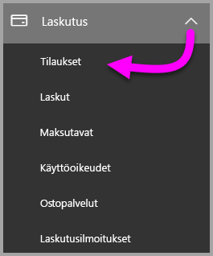

3. Valitse **Tilaukset**-sivun oikeassa yläkulmassa **Lisää tilauksia**.

    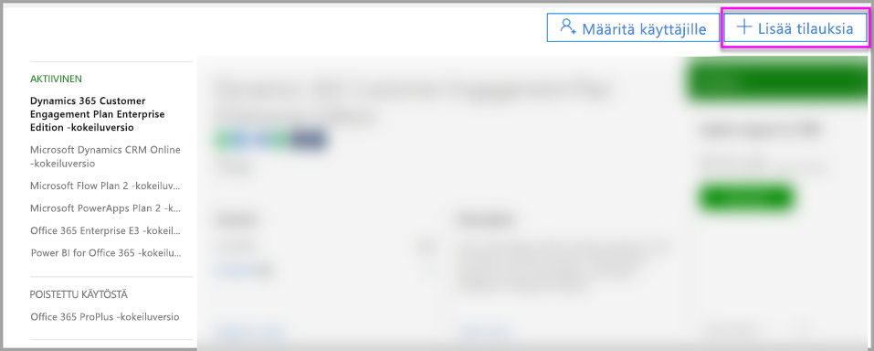

4. Etsi haluamasi tilaustarjous:

    Valitse **Enterprise Suitesta** **Office 365 Enterprise E5**.

    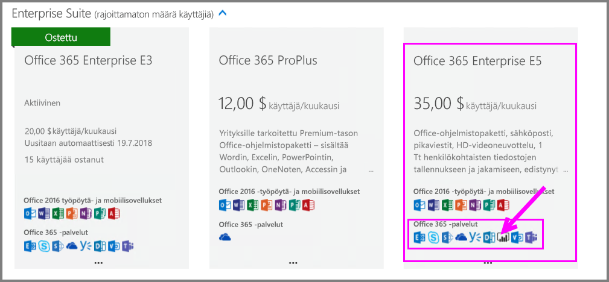

    Valitse **Muut palvelupaketit** -kohdasta **Power BI Pro**.

    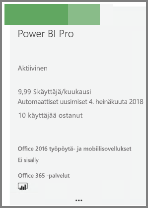

5. Vie hiiren kohdistin kolmen pisteen ( **. . .** ) päälle haluamassasi tilauksessa ja valitse **Osta nyt**.

    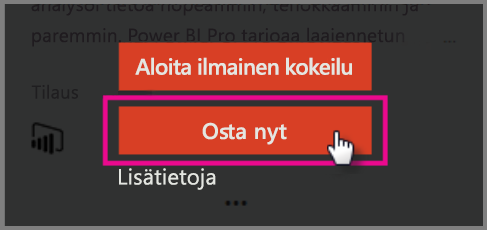

6. Valitse **Maksa kuukausittain** tai **Maksa koko vuosi** haluamasi laskutustavan mukaan.

7. Anna haluamasi käyttöoikeusmäärä kohdassa **Kuinka monta käyttäjää haluat?** , valitse **Siirry maksamaan** ja viimeistele ostos.

8. Varmista, että hankittu tilaus näkyy nyt **Tilaukset**-sivulla.

   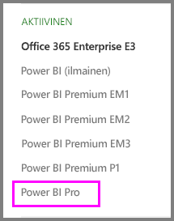

9. Jos haluat lisätä enemmän käyttöoikeuksia alkuperäisen ostoksen jälkeen, valitse **Power BI Pro** -vaihtoehto **Tilaukset**-sivulla ja valitse sitten **Lisää tai poista käyttöoikeuksia**.

## Käyttöoikeuksien määrittäminen Office 365:ssä

Voit määrittää Power BI Pro -käyttöoikeuksia yksittäisille käyttäjätileille seuraavien ohjeiden mukaisesti:

1. Avaa [Microsoft 365 -hallintakeskus](https://portal.office.com/adminportal/home#/homepage).

2. Laajenna vasemman siirtymisruudun **Käyttäjät**-kohta ja napsauta **Aktiiviset käyttäjät** -kohtaa.

    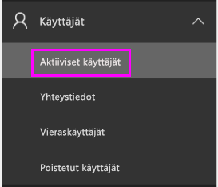

3. Valitse käyttäjä ja sitten kohdassa **tuotteiden käyttöoikeudet** valitse **Muokkaa**.

    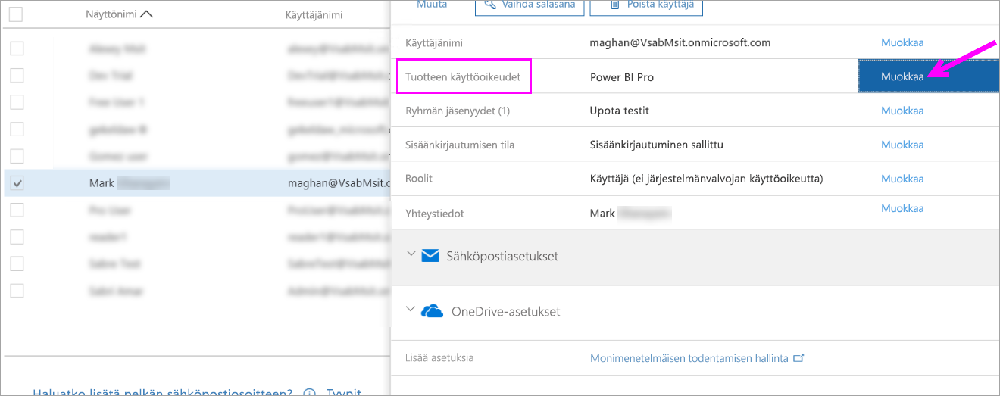

4. Vaihda kohdassa **Power BI Pro** asetukseksi **Käytössä** ja valitse sitten **Tallenna**.

    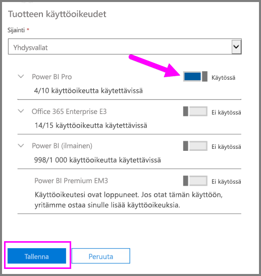

5. Vahvista valittujen tilien **Tila**-kohdasta, että Power BI Pro -käyttöoikeuden määritys onnistui.

    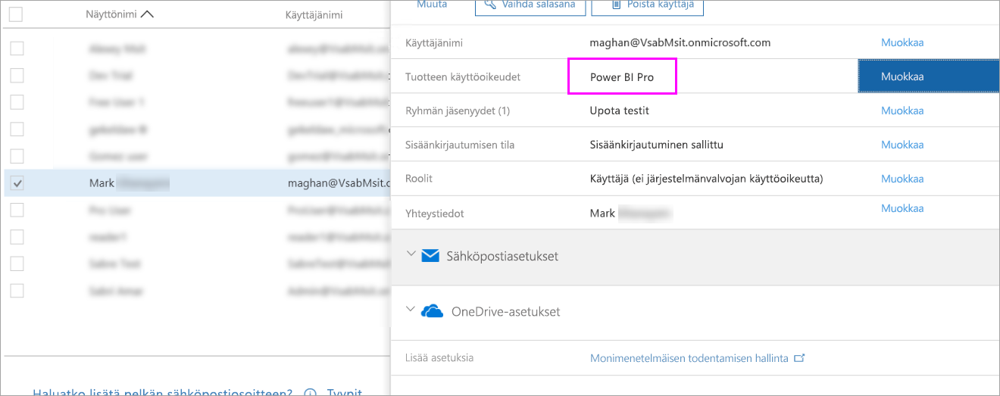

## Käyttöoikeuksien määrittäminen Azuressa

Voit määrittää Power BI Pro -käyttöoikeuksia yksittäisille käyttäjätileille seuraavien ohjeiden mukaisesti:

1. Avaa [Azure-portaali](https://ms.portal.azure.com/#@microsoft.onmicrosoft.com/dashboard/private/39bc3cf7-31a4-43f6-954c-f2d69ca2f0).

2. Valitse vasemmassa siirtymispalkissa **Azure Active Directory**.

    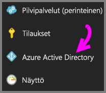

3. Valitse **Azure Active Directory** -kohdassa **Käyttöoikeudet**.

    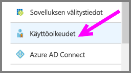

4. Valitse **Käyttöoikeudet**-kohdassa **Kaikki tuotteet** ja valitse sitten **Power BI Pro**. Näin näet luettelon kaikista käyttäjistä, joilla on käyttöoikeus.

    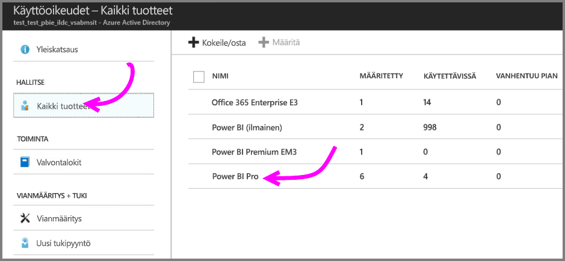

5. Jos haluat lisätä Power BI Pro -käyttöoikeuden uudelle käyttäjätilille, valitse **Määritä**.

    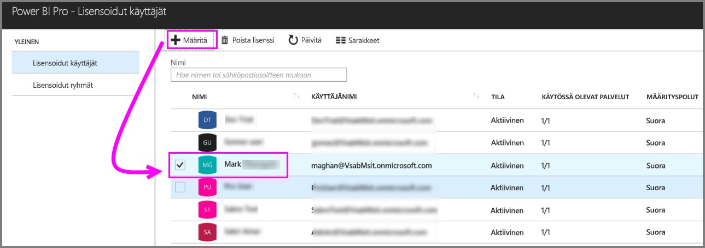

## Seuraavat vaiheet

Nyt kun olet määrittänyt käyttöoikeudet, lue lisää Power BI Prosta.

[Power BI -käyttöoikeudet organisaatiossasi](service-admin-licensing-organization.md)

[Kirjautuneena olevien Power BI -käyttäjien etsiminen](service-admin-access-usage.md)

Onko sinulla kysyttävää? [Voit esittää kysymyksiä Power BI -yhteisössä](https://community.powerbi.com/)
