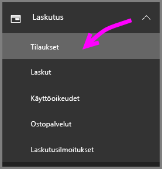
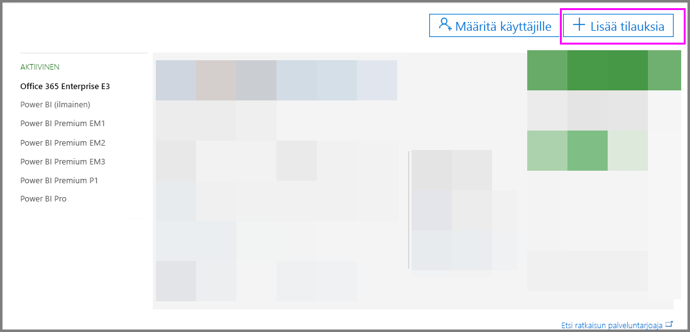
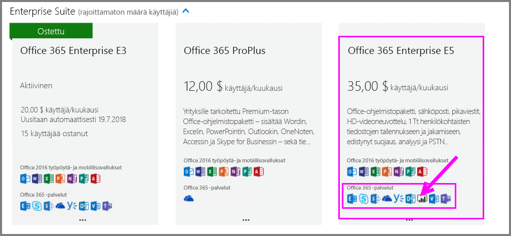
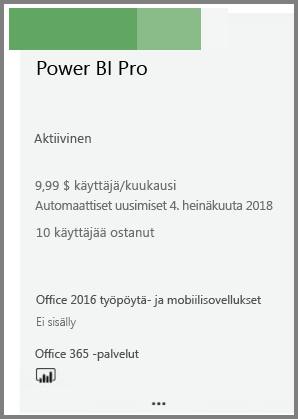
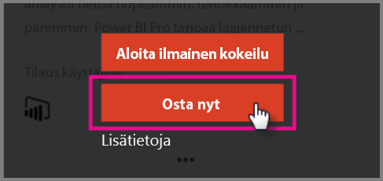
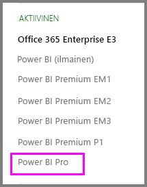

# Pikaopas: Power BI Pro- käyttöoikeuksien ostaminen

Power BI Pro on yksittäinen käyttöoikeus, joka sallii kaiken sisällön ja kaikkien ominaisuuksien käytön Power BI -palvelussa, eli myös sisällön jakamisen ja yhteistyön muiden Pro-käyttäjien kanssa. Vain Pro-käyttäjät voivat julkaista ja käyttää sisältöä sovelluksen työtiloista, jakaa koontinäyttöjä sekä tilata koontinäyttöjä ja raportteja. Tässä artikkelissa kerrotaan, miten voit ostaa Power BI Pro -käyttöoikeuksia Office 365:ssä.

## Edellytykset

Sinulla on oltava [ **Yleinen järjestelmänvalvoja**- tai **Laskutuksen järjestelmänvalvoja** ](https://support.office.com/article/about-office-365-admin-roles-da585eea-f576-4f55-a1e0-87090b6aaa9d?ui=en-US&rs=en-US&ad=US) -rooli Office 365:ssä. 

## Power BI Pro -käyttöoikeuksien ostaminen Office 365:n kautta

Näiden ohjeiden avulla voit ostaa Power BI Pro -käyttöoikeuksia:

1. Avaa [Office 365:n hallintakeskus](https://portal.office.com/adminportal/home#/homepage).

2. Valitse vasemmasta siirtymisruudusta **Laskutus** > **Tilaukset**.

    

3. Valitse **Tilaukset**-sivun oikeassa yläkulmassa **Lisää tilauksia**.

    

4. Etsi haluamasi tilaustarjous:

    Valitse **Enterprise Suitesta** **Office 365 Enterprise E5**.

    

    Valitse **Muut palvelupaketit** -kohdasta **Power BI Pro**.

    

5. Vie hiiren kohdistin kolmen pisteen (…) päälle haluamassasi tilauksessa ja valitse **Osta nyt**.

    

6. Valitse **Maksa kuukausittain** tai **Maksa koko vuosi** haluamasi laskutustavan mukaan.

7. Anna haluamasi käyttöoikeusmäärä kohdassa **Kuinka monta käyttäjää haluat?**, valitse **Siirry maksamaan** ja viimeistele ostos.

8. Varmista, että hankittu tilaus näkyy nyt **Tilaukset**-sivulla.

   

9. Jos haluat lisätä enemmän käyttöoikeuksia alkuperäisen ostoksen jälkeen, valitse **Power BI Pro** -vaihtoehto **Tilaukset**-sivulla ja valitse sitten **Lisää tai poista käyttöoikeuksia**.

## Seuraavat vaiheet

Nyt kun olet ostanut käyttöoikeudet, määritä ne vuokraajasi käyttäjille.

[Käyttöoikeuksien määrittäminen käyttäjille Office 365:ssä](service-admin-assigning-power-bi-pro-licenses.md)

[Käyttöoikeuksien määrittäminen käyttäjille Azuressa](service-admin-assigning-power-bi-pro-licenses-azure.md)

[Power BI -hinnoittelu](https://powerbi.microsoft.com/en-us/pricing/)
