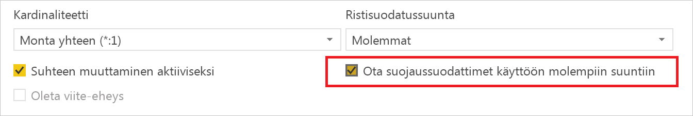
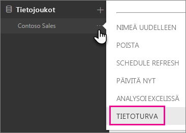
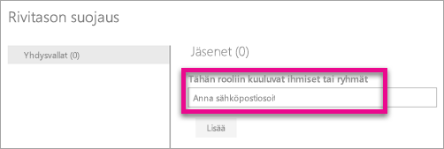
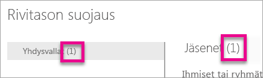
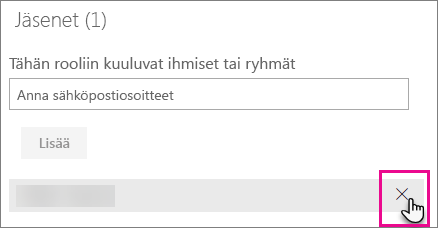
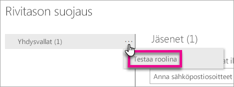
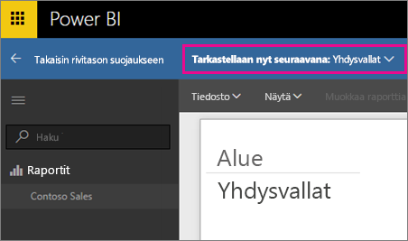
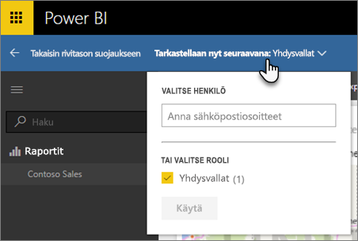
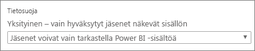

# Rivitason suojaus (RLS) Power BI:ssä

Power BI:n rivitason suojauksen (RLS) avulla voidaan rajoittaa tietojen käyttöä tietyille käyttäjille. Suodattimet rajoittavat tietojen käyttöä rivitasolla ja voit määrittää roolien sisäisiä suodattimia. Huomioi, että Power BI -palvelussa työtilan jäsenillä on pääsy työtilan tietojoukkoihin. Rivitason suojaus ei rajoita näiden tietojen käyttöoikeuksia.

Voit määrittää rivitason suojauksen Power BI:hin tuoduille tietomalleille Power BI Desktopin avulla. Voit myös määrittää rivitason suojauksen tietojoukoille, jotka käyttävät DirectQueryä, kuten SQL Serveriä. Aiemmin pystyit ottamaan rivitason suojauksen käyttöön vain paikallisissa Analysis Services -malleissa Power BI:n ulkopuolella. Määrität rivitason suojauksen paikalliselle mallille Analysis Servicesin reaaliaikaisia yhteyksiä varten. Suojausvaihtoehtoa ei näy reaaliaikaisen yhteyden tietojoukoille.

[!INCLUDE [include-short-name](./includes/rls-desktop-define-roles.md)]

Oletuksena rivitason suojauksen suodatuksessa käytetään yksisuuntaisia suodattimia riippumatta siitä, onko suhteet määritetty yksi- vai kaksisuuntaisiksi. Voit ottaa kaksisuuntaisen ristisuodatuksen manuaalisesti käyttöön rivitason suojauksen yhteydessä valitsemalla suhteen ja valitsemalla **Ota suojaussuodattimet käyttöön molempiin suuntiin** -valintaruudun. Valitse tämä ruutu, kun otat käyttöön [dynaaminen rivitason suojauksen](https://docs.microsoft.com/sql/analysis-services/supplemental-lesson-implement-dynamic-security-by-using-row-filters), jossa rivitason suojaus määritetään käyttäjänimen tai kirjautumistunnuksen perusteella.

Lisätietoja on artikkelissa [Kaksisuuntainen ristiinsuodatus käyttämällä DirectQueryä Power BI Desktopissa](desktop-bidirectional-filtering.md) ja teknisessä artikkelissa [Taulukkomuotoisen liiketoimintatietojen semanttisen mallin suojaaminen](http://download.microsoft.com/download/D/2/0/D20E1C5F-72EA-4505-9F26-FEF9550EFD44/Securing%20the%20Tabular%20BI%20Semantic%20Model.docx).

[!INCLUDE [include-short-name](./includes/rls-desktop-view-as-roles.md)]

## Mallin suojauksen hallinta

Jotta voit hallita tietomallisi suojausta, sinun kannattaa toimia seuraavasti.

1. Valitse **ellipsi (...)**  tietojoukon kohdalta.
2. Valitse **Suojaus**.
   
   

Tämä siirtää sinut RLS-sivulle, jolla voit lisätä jäseniä Power BI Desktopissa luomaasi rooliin. Suojaus on vain tietojoukon omistajien käytettävissä. Jos tietojoukko on osa ryhmää, vain ryhmän järjestelmänvalvojat näkevät suojausvaihtoehdon. 

Voit vain luoda tai muokata rooleja Power BI Desktopissa.

## Jäsenien käsitteleminen

### Jäsenien lisääminen

Voit lisätä jäsenen rooliin kirjoittamalla lisättävän käyttäjän, suojausryhmän tai jakeluluettelon sähköpostiosoitteen tai nimen. Jäsenen on oltava organisaatiostasi. Et voi lisätä Power BI:ssä luotuja ryhmiä.

Roolin nimen tai jäsenten vieressä suluissa olevasta luvusta voit myös nähdä, kuinka monta jäsentä rooliin kuuluu.

### Jäsenien poistaminen

Voit poistaa jäseniä valitsemalla hänen nimensä vieressä olevan X-merkin. 

## Roolin vahvistaminen Power BI -palvelussa

Voit varmistaa, että määrittämäsi rooli toimii oikein, testaamalla roolin. 

1. Valitse roolin vieressä oleva **ellipsi (...)**.
2. Valitse **Testaa tietoja roolina**.

Näyttöön tulevat raportit, jotka ovat käytettävissä tälle roolille. Koontinäyttöjä ei esitetä tässä näkymässä. Yläosassa olevasta sinisestä palkista näet, mikä on käytössä.

Voit testata muita rooleja tai roolien yhdistelmiä valitsemalla **Tarkastellaan nyt seuraavana**.

Voit halutessasi tarkastella tietoja tiettynä henkilönä tai valita käytettävissä olevien roolien yhdistelmän ja vahvistaa, että ne toimivat. 

Palaa normaaliin näkymään valitsemalla **Takaisin rivitason suojaukseen**.

[!INCLUDE [include-short-name](./includes/rls-usernames.md)]

## Rivitason suojauksen käyttäminen sovelluksen työtilojen kanssa Power BI:ssä

Jos julkaiset Power BI Desktop -raportin sovelluksen työtilassa Power BI -palvelussa, roolit otetaan käyttöön vain luku -jäsenille. Sinun on määritettävä, että jäsenet voivat vain tarkastella Power BI -sisältöä sovelluksen työtilan asetuksissa.

> [!WARNING]
> Jos olet määrittänyt sovelluksen työtilan niin, että jäsenillä on muokkausoikeudet, RLS-rooleja ei sovelleta niihin. Käyttäjät voivat nähdä kaikki tiedot.

[!INCLUDE [include-short-name](./includes/rls-limitations.md)]

[!INCLUDE [include-short-name](./includes/rls-faq.md)]

## Seuraavat vaiheet
[Rivitason suojaus (RLS) Power BI Desktopissa](desktop-rls.md)  

Onko sinulla muuta kysyttävää? [Voit esittää kysymyksiä Power BI -yhteisössä](http://community.powerbi.com/)