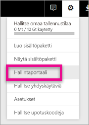

# <a name="understanding-the-power-bi-admin-role"></a>Power BI -järjestelmänvalvojaroolin kuvaus
Lue, miten voit käyttää Power BI -järjestelmänvalvojaroolia organisaatiossa.

<iframe width="640" height="360" src="https://www.youtube.com/embed/PQRbdJgEm3k?showinfo=0" frameborder="0" allowfullscreen></iframe>

Power BI -palvelun järjestelmänvalvojan rooli voidaan määrittää käyttäjille, joilla on oltava Power BI -hallintaportaalin käyttöoikeus mutta joiden ei tarvitse saada muita Office 365:n järjestelmänvalvojan käyttöoikeuksia. Tällainen on esimerkiksi yleisen järjestelmänvalvojan rooli. Se on tarkoitettu henkilöille, joiden tehtävänä on hallita organisaation Power BI:tä.

Office 365:n käyttäjäjärjestelmänvalvojat voivat määrittää käyttäjiä Power BI -järjestelmänvalvojiksi Office 365 -hallintakeskuksessa tai PowerShell-komentosarjan kautta. Kun käyttäjä on määritetty, hän voi käyttää [Power BI -hallintaportaalia](service-admin-portal.md). Portaalissa käyttäjä voi käyttää koko vuokraajan laatuisia käyttömittareita ja hallita Power BI -ominaisuuksien käyttöä koko vuokraajan laajuudelta.



## <a name="using-the-office-365-admin-center-to-assign-a-role"></a>Roolin määrittäminen Office 365 -hallintakeskuksen avulla
Voit määrittää käyttäjille Power BI -järjestelmänvalvojan roolin Office 365 -hallintakeskuksessa seuraavasti.

1. Selaa Office 365 -hallintakeskukseen ja valitse **Käyttäjät** > **Aktiiviset käyttäjät**.
   
    
2. Valitse käyttäjä, jolle haluat määrittää roolin.
3. Valitse rooleissa **Muokkaa**.
   
    
4. Valitse **Mukautettu järjestelmänvalvoja** > **Power BI -palvelun järjestelmänvalvoja**.
   
    
5. Valitse **Tallenna**.

Kyseisen käyttäjän roolina pitäisi näkyä **Power BI -palvelun järjestelmänvalvoja**. Hän pystyy nyt käyttämään [Power BI -hallintaportaalia](service-admin-portal.md).


## <a name="using-powershell-to-assign-a-role"></a>Roolin määrittäminen PowerShellin avulla
PowerShell-komennon suorittaminen edellyttää, että asennettuna on Azure Active Directoryn PowerShell-moduuli.

### <a name="download-azure-ad-powershell-module"></a>Azure AD:n PowerShell-moduulin lataaminen
[Lataa Azure Active Directoryn PowerShell-versio 2](https://github.com/Azure/azure-docs-powershell-azuread/blob/master/Azure%20AD%20Cmdlets/AzureAD/index.md)

[Lataa Azure Active Directoryn PowerShell-versio 1.1.166.0 GA](http://connect.microsoft.com/site1164/Downloads/DownloadDetails.aspx?DownloadID=59185)

### <a name="command-to-add-role-to-member"></a>Komento roolin lisäämiseksi jäsenelle
**Azure AD:n PowerShell v2 -komento**

Tarvitset **ObjectId**-tunnuksen **Power BI -palvelun järjestelmänvalvojan** roolille. Saat **ObjectId**-tunnuksen suorittamalla komennon [Get-AzureADDirectoryRole](https://docs.microsoft.com/powershell/azuread/v2/get-azureaddirectoryrole).

```
PS C:\Windows\system32> Get-AzureADDirectoryRole

ObjectId                             DisplayName                        Description
--------                             -----------                        -----------
00f79122-c45d-436d-8d4a-2c0c6ca246bf Power BI Service Administrator     Full access in the Power BI Service.
250d1222-4bc0-4b4b-8466-5d5765d14af9 Helpdesk Administrator             Helpdesk Administrator has access to perform..
3ddec257-efdc-423d-9d24-b7cf29e0c86b Directory Synchronization Accounts Directory Synchronization Accounts
50daa576-896c-4bf3-a84e-1d9d1875c7a7 Company Administrator              Company Administrator role has full access t..
6a452384-6eb9-4793-8782-f4e7313b4dfd Device Administrators              Device Administrators
9900b7db-35d9-4e56-a8e3-c5026cac3a11 AdHoc License Administrator        Allows access manage AdHoc license.
a3631cce-16ce-47a3-bbe1-79b9774a0570 Directory Readers                  Allows access to various read only tasks in ..
f727e2f3-0829-41a7-8c5c-5af83c37f57b Email Verified User Creator        Allows creation of new email verified users.
```

Tässä tapauksessa roolin objectid-tunnus on 00f79122-c45d-436d-8d4a-2c0c6ca246bf.

Sinun on myös tiedettävä käyttäjien **ObjectID**-tunnukset. Saat sen selville suorittamalla komennon [Get-AzureADUser](https://docs.microsoft.com/powershell/azuread/v2/get-azureaduser).

```
PS C:\Windows\system32> Get-AzureADUser -SearchString 'tim@contoso.com'

ObjectId                             DisplayName UserPrincipalName      UserType
--------                             ----------- -----------------      --------
6a2bfca2-98ba-413a-be61-6e4bbb8b8a4c Tim         tim@contoso.com        Member
```

Lisää jäsen rooliin suorittamalla komento [Add-AzureADDirectoryRoleMember](https://docs.microsoft.com/powershell/azuread/v2/add-azureaddirectoryrolemember).

| Parametri | Kuvaus |
| --- | --- |
| ObjectId |Roolin ObjectId-tunnus. |
| RefObjectId |Jäsenten ObjectId-tunnus. |

```
Add-AzureADDirectoryRoleMember -ObjectId 00f79122-c45d-436d-8d4a-2c0c6ca246bf -RefObjectId 6a2bfca2-98ba-413a-be61-6e4bbb8b8a4c
```

**Azure AD:n PowerShell v1 -komento**

Jos haluat lisätä rooliin jäsenen käyttämällä Azure AD v1:n cmdlet-komentoja, suorita komento [Add-MsolRoleMember](https://docs.microsoft.com/powershell/msonline/v1/add-msolrolemember).

```
Add-MsolRoleMember -RoleMemberEmailAddress "tim@contoso.com" -RoleName "Power BI Service Administrator"
```

## <a name="limitations-and-considerations"></a>Rajoitukset ja huomioon otettavat seikat
Power BI -palvelun järjestelmänvalvojarooli ei sisällä seuraavia käyttöoikeuksia.

* Mahdollisuus muokata käyttäjiä ja käyttöoikeuksia Office 365 -hallintakeskuksessa
* Valvontalokien käyttö. Lisätietoja on artikkelissa [Valvonnan käyttö organisaatiossa](service-admin-auditing.md).

## <a name="next-steps"></a>Seuraavat vaiheet
[Power BI -hallintaportaali](service-admin-portal.md)  
[Add-AzureADDirectoryRoleMember](https://docs.microsoft.com/powershell/azuread/v2/add-azureaddirectoryrolemember)  
[Add-MsolRoleMember](https://docs.microsoft.com/powershell/msonline/v1/add-msolrolemember)  
[Organisaation Power BI:n valvonta](service-admin-auditing.md)  
[Power BI:n hallinta organisaatiossa](service-admin-administering-power-bi-in-your-organization.md)  

Onko sinulla muuta kysyttävää? [Voit esittää kysymyksiä Power BI -yhteisössä](http://community.powerbi.com/)

