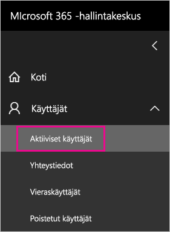
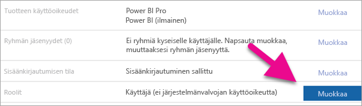
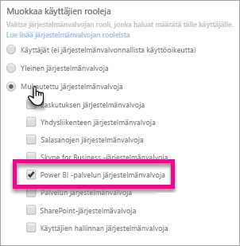
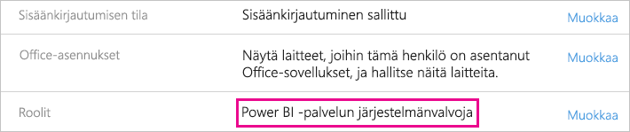

# <a name="understanding-the-power-bi-service-administrator-role"></a>Tietoja Power BI -palvelun järjestelmänvalvojan roolista

Lue, miten voit käyttää Power BI -palvelun järjestelmänvalvojaroolia organisaatiossa. Tässä roolissa olevilla käyttäjillä on käyttöoikeuksien myöntämistä lukuun ottamatta täydet Power BI -vuokraajan ja sen hallintaominaisuuksien oikeudet.

<iframe width="640" height="360" src="https://www.youtube.com/embed/PQRbdJgEm3k?showinfo=0" frameborder="0" allowfullscreen></iframe>

Power BI -palvelun järjestelmänvalvojan rooli voidaan määrittää käyttäjille, joilla on oltava Power BI -hallintaportaalin käyttöoikeus, antamatta heille muita Office 365:n järjestelmänvalvojan käyttöoikeuksia.

Office 365:n käyttäjähallinnan järjestelmänvalvojat määrittävät käyttäjiä Power BI -palvelun järjestelmänvalvojarooliin Microsoft 365 -hallintakeskuksessa tai PowerShell-komentosarjan avulla. Kun käyttäjä on määritetty, hän voi käyttää [Power BI -hallintaportaalia](service-admin-portal.md). Portaalissa käyttäjä voi käyttää koko vuokraajan laatuisia käyttömittareita ja hallita Power BI -ominaisuuksien käyttöä koko vuokraajan laajuudelta.

## <a name="limitations-and-considerations"></a>Rajoitukset ja huomioitavat asiat

Power BI -palvelun järjestelmänvalvojarooli ei sisällä seuraavia oikeuksia:

* Mahdollisuus muokata käyttäjiä ja käyttöoikeuksia Microsoft 365 -hallintakeskuksessa,

* Valvontalokien käyttö. Lisätietoja on artikkelissa [Valvonnan käyttö organisaatiossa](service-admin-auditing.md).

## <a name="assign-users-to-the-admin-role-in-office-365"></a>Käyttäjien määrittäminen järjestelmänvalvojan rooliin Office 365:ssä

Voit määrittää käyttäjiä Power BI -järjestelmänvalvojan rooliin Microsoft 365 -hallintakeskuksessa seuraavasti.

1. - [Microsoft 365-hallintakeskukseen](https://portal.office.com/adminportal/home#/homepage), valitse **käyttäjät** > **aktiiviset käyttäjät**.

    

1. Valitse käyttäjä, jolle haluat määrittää roolin.

1. Valitse **Roolit** ja valitse **Muokkaa**.

    

1. Valitse **Mukautettu järjestelmänvalvoja** > **Power BI -palvelun järjestelmänvalvoja**.

    

1. Valitse **Tallenna**, sitten **Sulje**.

Kyseisen käyttäjän roolina pitäisi näkyä **Power BI -palvelun järjestelmänvalvoja**.



## <a name="assign-users-to-the-admin-role-with-powershell"></a>Käyttäjien määrittäminen järjestelmänvalvojan rooliin PowerShellin avulla

Voit määrittää käyttäjiä rooleihin myös PowerShellin avulla. Käyttäjiä hallitaan Azure Active Directory (Azure AD). Jos sinulla ei vielä ole Azure AD:n PowerShell-moduulia, [lataa ja asenna uusin versio](https://www.powershellgallery.com/packages/AzureAD/).

1. Yhdistä ensin Azure AD: hen:
   ```
   PS C:\Windows\system32> Connect-AzureAD
   ```

1. Hae toiseksi **ObjectId** varten **Power BI-palvelun järjestelmänvalvojan** roolin. Saat **ObjectId**-tunnuksen suorittamalla komennon [Get-AzureADDirectoryRole](/powershell/module/azuread/get-azureaddirectoryrole).

    ```
    PS C:\Windows\system32> Get-AzureADDirectoryRole

    ObjectId                             DisplayName                        Description
    --------                             -----------                        -----------
    00f79122-c45d-436d-8d4a-2c0c6ca246bf Power BI Service Administrator     Full access in the Power BI Service.
    250d1222-4bc0-4b4b-8466-5d5765d14af9 Helpdesk Administrator             Helpdesk Administrator has access to perform..
    3ddec257-efdc-423d-9d24-b7cf29e0c86b Directory Synchronization Accounts Directory Synchronization Accounts
    50daa576-896c-4bf3-a84e-1d9d1875c7a7 Company Administrator              Company Administrator role has full access t..
    6a452384-6eb9-4793-8782-f4e7313b4dfd Device Administrators              Device Administrators
    9900b7db-35d9-4e56-a8e3-c5026cac3a11 AdHoc License Administrator        Allows access manage AdHoc license.
    a3631cce-16ce-47a3-bbe1-79b9774a0570 Directory Readers                  Allows access to various read only tasks in ..
    f727e2f3-0829-41a7-8c5c-5af83c37f57b Email Verified User Creator        Allows creation of new email verified users.
    ```

    Tässä tapauksessa roolin **ObjectId** on 00f79122-c45d-436d-8d4a-2c0c6ca246bf.

1. Hae seuraavaksi käyttäjän **ObjectId**. Saat sen selville suorittamalla komennon [Get-AzureADUser](/powershell/module/azuread/get-azureaduser).

    ```
    PS C:\Windows\system32> Get-AzureADUser -ObjectId 'tim@contoso.com'

    ObjectId                             DisplayName UserPrincipalName      UserType
    --------                             ----------- -----------------      --------
    6a2bfca2-98ba-413a-be61-6e4bbb8b8a4c Tim         tim@contoso.com        Member
    ```

1. Lisää jäsen rooliin suorittamalla komento [Add-AzureADDirectoryRoleMember](/powershell/module/azuread/add-azureaddirectoryrolemember).

    | Parametri | Kuvaus |
    | --- | --- |
    | ObjectId |Roolin ObjectId-tunnus. |
    | RefObjectId |Jäsenten ObjectId-tunnus. |

    ```powershell
    Add-AzureADDirectoryRoleMember -ObjectId 00f79122-c45d-436d-8d4a-2c0c6ca246bf -RefObjectId 6a2bfca2-98ba-413a-be61-6e4bbb8b8a4c
    ```

## <a name="next-steps"></a>Seuraavat vaiheet

[Power BI:n hallinta organisaatiossa](service-admin-administering-power-bi-in-your-organization.md)  
[Power BI -hallintaportaali](service-admin-portal.md)  

Onko sinulla kysyttävää? [Voit esittää kysymyksiä Power BI -yhteisössä](http://community.powerbi.com/)