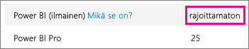
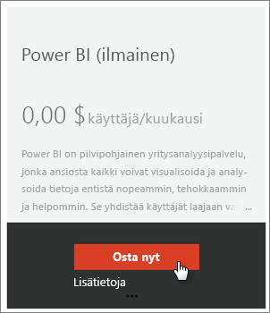
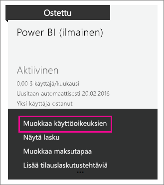

# Power BI (ilmainen) organisaatiossasi
Tässä kuvataan miten (ilmaista) Power BI:tä voidaan käyttää organisaatiossasi. Organisaatiolla tarkoitetaan, että olet vuokraaja ja voit hallinnoida kyseisen vuokraajan käyttäjiä ja palveluita. Järjestelmänvalvojana voit hallita käyttöoikeusmäärityksiä, tai sallia käyttäjien rekisteröityä yksittäisinä käyttäjinä. Tarkastelemme (ilmaista) Power BI -käyttöoikeutta ja miten yksittäisten käyttäjien rekisteröintiä voidaan hallita.

## Yksittäiset rekisteröinnit ja käyttöoikeusmääritykset
Organisaatiosi käyttäjät voivat saada pääsyn Power BI:hin kahdella eri tavalla. He voivat rekisteröityä Power BI:hin yksittäisinä käyttäjinä tai heille voidaan määrätä Power BI -käyttöoikeus Office 365 -hallintaportaalissa.

Sallimalla yksittäiset rekisteröinnit, organisaation järjestelmänvalvojien taakka vähenee, kun Power BI:stä kiinnostuneet käyttäjät voivat rekisteröityä ilmaiseksi.

Jos haluat enemmän hallintaa, voit estää yksittäiset rekisteröinnit ja määrätä Power BI -käyttöoikeuksia itse Office 365 -hallintaportaalissa. Tämä sallii sinun määritellä tarkasti kenellä on pääsy mihinkin organisaatiosi palveluun. Tämä on myös hyvä vaihtoehto, jos sinun pitää suorittaa valvontaa ja tietää tarkasti kuka käyttää ja mitä.

## Miten saat rajoittamattoman käyttöoikeuksien eston käyttöön
Office 365 -hallintakeskuksessa, kohdasta **Laskutus** > **Käyttöoikeudet** on tai ei ole näkyvissä (ilmainen) Power BI rajoittamattomilla käyttöoikeuksilla.

Tämä käyttöoikeuksien lohko tulee näkyviin sen jälkeen kun joku ensimmäistä kertaa rekisteröityy Power BI:hin yksittäisenä käyttäjänä. Prosessin aikana, tämä käyttöoikeuslohko kiinnittyy organisaatioosi ja käyttöoikeus määritetään rekisteröityvälle käyttäjälle.

Jos estät yksittäisten käyttäjien rekisteröitymisen, eikä ketään ole rekisteröityneenä, tämä käyttöoikeuslohko ei ole näkyvissä. Voit joko sallia yksittäisten käyttäjien rekisteröitymisen ja antaa yhden käyttäjistä rekisteröityä, tai voit saada ilmaisia käyttöoikeuksia lisäämällä tilauksia Office 365 -työnkulun kautta, jonka esittelemme seuraavaksi.

Kun (ilmainen) Power BI -käyttöoikeuslohko on käytössä, voit määrätä käyttöoikeuksia käyttäjillesi. Lisätietoja käyttöoikeuksien määrittämisestä on artikkelissa [Määritä käyttöoikeuksia Office 365 -käyttäjille ](https://support.office.com/article/Assign-or-unassign-licenses-for-Office-365-for-business-997596b5-4173-4627-b915-36abac6786dc).

## Ilmaisten käyttöoikeuksien lisääminen lisäämällä tilauksia Office 365:n kautta
1. Siirry [Office 365:n hallintakeskukseen](https://portal.office.com/admin/default.aspx).
2. Valitse vasemmasta siirtymisruudusta **Laskutus** > **Tilaukset**.
3. Valitse oikealta puolelta **Lisää tilauksia +**.
4. Kohdassa muut sopimukset, siirrä osoitin (ilmainen) Power BI -kohdan**kolmen pisteen (...)** päälle ja valitse **Osta nyt**.
   
    
5. Syötä lisättävien käyttöoikeuksien määrä ja valitse sitten **Siirry maksamaan** tai **Lisää ostoskoriin**.
   
   > [!NOTE]
   > Voit lisätä käyttöoikeuksia tarvittaessa myöhemmin.
   > 
   > 
6. Anna tarvittavat tiedot uloskuittaus-työnkulkuun.

Tämä menetelmä ei vaadi maksua, vaikka luottokorttitiedot tuleekin syöttää pyydettäessä tai valita maksutavaksi lasku.

Jos haluat lisätä uusia käyttöoikeuksia myöhemmin, palaa takaisin **Lisää tilauksia** -kohtaan ja valitse sitten (ilmainen) Power BI **Muuta käyttöoikeuksien määrää**.

Voit nyt määrittää kyseisiä käyttöoikeuksia käyttäjille. Lisätietoja käyttöoikeuksien määrittämisestä on artikkelissa [Määritä käyttöoikeuksia Office 365 -käyttäjille ](https://support.office.com/article/Assign-or-unassign-licenses-for-Office-365-for-business-997596b5-4173-4627-b915-36abac6786dc).

## Ota yksittäisten käyttäjien rekisteröityminen käyttöön tai poista se käytöstä Azure Active Directorysta
Voit järjestelmänvalvojana joko ottaa käyttöön yksittäisten käyttäjien rekisteröitymisen tai poistaa sen käytöstä Azure Active Directorysta (AA). Jos tiedät miten hyödyntää AAD PowerShell -komentoja, voit ottaa ad-hoc-tilauksia käyttöön tai poistaa niitä käytöstä. [Lue lisää](https://technet.microsoft.com/library/jj151815.aspx)

Tätä ohjaava AAD -asetus on **AllowAdHocSubscriptions**. Useimmissa vuokraajissa tämä asetus on true (tosi), mikä tarkoittaa, että se on käytössä. Jos hankit Power BI:n kumppanin kautta, asetuksen oletusarvo saattaa olla false (epätosi), mikä tarkoittaa, että se on poistettu käytöstä.

1. Sinun on ensin kirjauduttava Azure Active Directoryyn käyttämällä Office 365 -tunnistetietojasi. Ensimmäisellä rivillä pyydetään syöttämään tunnistetiedot. Toinen rivi muodostaa yhteyden Azure Active Directoryyn.
   
     $msolcred = get-credential   connect-msolservice -credential $msolcred
   
   
2. Kun olet kirjautunut sisään, voit suorittaa seuraavan komennon, jolla näet, mikä asetus vuokraajalla on tällä hetkellä määritettynä.
   
     Get-MsolCompanyInformation | fl AllowAdHocSubscriptions
3. Voit komennon avulla ottaa käyttöön ($true) tai poistaa käytöstä ($false) AllowAdHocSubscriptions-asetuksen.
   
     Set-MsolCompanySettings -AllowAdHocSubscriptions $true

> [!NOTE]
> Tämä estää organisaation uusia käyttäjiä rekisteröitymästä Power BI:hin. Käyttäjät, jotka rekisteröityvät Power BI:hin ennen uusien rekisteröitymisien estämistä, säilyttävät käyttöoikeutensa.
> 
> 

## Seuraavat vaiheet
[Omatoiminen kirjautuminen Power BI:hin](service-self-service-signup-for-power-bi.md)  
[Power BI Pron ostaminen](service-admin-purchasing-power-bi-pro.md)  
[Rekisteröidy (ilmaiseen) Power BI:hin mukautetulla Azure Active Directory vuokraajalla](developer/create-an-azure-active-directory-tenant.md)  
[Mikä on Power BI Premium?](service-premium.md)  
[Power BI Premiumin tekninen raportti](https://aka.ms/pbipremiumwhitepaper)  

Onko sinulla muuta kysyttävää? [Voit esittää kysymyksiä Power BI -yhteisössä](http://community.powerbi.com/)

