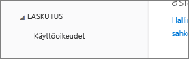

# Power BI:tä ei voi lisätä Office 365 -kumppanitilaukseen
Office 365:n avulla yritykset voivat myydä Office 365:n paketoituna ja yhdistettynä omiin ratkaisuihinsa, jotta loppuasiakkaat saavat yhden yksittäisen yhteyspisteen ostamiseen, laskutukseen ja tukeen.

Jos olet kiinnostunut hankkimaan Power BI:n Office 365 -tilauksen rinnalle, ota yhteyttä kumppaniisi. Jos kumppanisi ei tarjoa Power BI:tä, käytettävissä on useita vaihtoehtoja.

1. Voit ostaa palvelun toisesta kanavasta joko suoraan Microsoftilta tai toiselta kumppanilta. Tämä vaihtoehto ei ole käytettävissä kaikille asiakkaille kumppanisuhteesta riippuen. Voit tarkistaa asian valitsemalla **Office 365 -hallintaportaali** > **Laskutus** > **Tilaukset**. Jos näet **Tilaukset**-kohdan, voit hankkia palvelun suoraan Microsoftilta tai voit ottaa yhteyttä kumppaniin, jonka valikoimassa on Power BI.
   
    
2. Jos et näe **Tilaukset**-kohtaa **Laskutus**-kohdassa, et voi ostaa suoraan Microsoftilta tai toiselta kumppanilta. 
   
   

Jos et voi ostaa Power BI:tä suoraan, käytettävissä on joitakin vaihtoehtoja sen mukaan, millaisesta Power BI -tilauksesta olet kiinnostunut.

[Power BI (ilmainen)](#power-bi-free)

[Power BI Pro ja Premium](#power-bi-pro-and-premium)

## Power BI (ilmainen)
Jos olet tyytyväinen Power BI:n ilmaisversioon, voit rekisteröityä ilmaiseen palveluun. Oletusarvoisesti yksittäiset rekisteröitymiset, joita kutsutaan myös ad-hoc-tilauksiksi, on poistettu käytöstä. Kun yrität rekisteröityä Power BI:hin, näyttöön tulee sanoma, joka ilmaisee, että IT-osastosi on poistanut Microsoft Power BI:hin rekisteröitymisen käytöstä.

    Your IT department has turned off signup for Microsoft Power BI.

Jotta ad-hoc-tilaukset voidaan ottaa käyttöön, voit ottaa yhteyttä kumppaniisi ja pyytää, että tilaukset otetaan käyttöön. Jos olet vuokraajan järjestelmänvalvoja ja tiedät, miten voit hyödyntää Azure Active Directoryn PowerShell-komentoja, voit ottaa ad-hoc-tilaukset käyttöön itse. [Lue lisää](https://technet.microsoft.com/library/jj151815.aspx)

1. Sinun on ensin kirjauduttava Azure Active Directoryyn käyttämällä Office 365 -tunnistetietojasi. Ensimmäisellä rivillä pyydetään syöttämään tunnistetiedot. Toinen rivi muodostaa yhteyden Azure Active Directoryyn.
   
        $msolcred = get-credential
        connect-msolservice -credential $msolcred
   
    
2. Kun olet kirjautunut sisään, voit ottaa ilmaiset rekisteröitymiset käyttöön lähettämällä seuraavan komennon.
   
        Set-MsolCompanySettings -AllowAdHocSubscriptions $true

## Power BI Pro ja Premium
Jos haluat ostaa Power BI Pro- tai Power BI Premium -tilauksen, joudut tekemään yhteistyötä kumppanisi kanssa käytettävissä olevien vaihtoehtojen selvittämistä varten.

* Kumppani voi lisätä Power BI:n portfolioonsa, jotta voit ostaa palvelun heiltä.
* Kumppani voi siirtää sinut malliin, jossa voit ostaa Power BI:n suoraan Microsoftilta tai toiselta kumppanilta, jonka valikoimassa on Power BI.

## Seuraavat vaiheet
[Azure AD:n hallitseminen Windows PowerShellin avulla](https://technet.microsoft.com/library/jj151815.aspx)  
[Power BI Premium – mikä se on?](service-premium.md)

Ilmenikö muuta kysyttävää? [Voit esittää kysymyksiä Power BI -yhteisössä](http://community.powerbi.com/)

