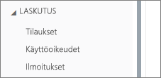
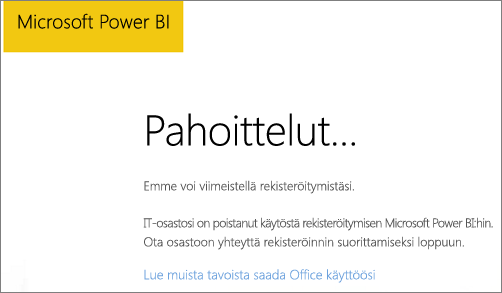
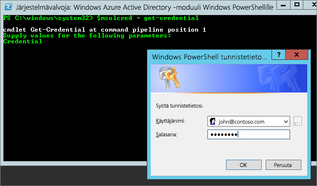

# <a name="unable-to-add-power-bi-to-office-365-partner-subscription"></a>Power BI:tä ei voi lisätä Office 365 -kumppanitilaukseen

Office 365:n avulla yritykset voivat myydä Office 365:n paketoituna ja yhdistettynä omiin ratkaisuihinsa, jotta loppuasiakkaat saavat yhden yksittäisen yhteyspisteen ostamiseen, laskutukseen ja tukeen.

Jos olet kiinnostunut hankkimaan Power BI:n Office 365 -tilauksen rinnalle, ota yhteyttä kumppaniisi. Jos kumppanisi ei tällä hetkellä tarjoa Power BI:tä, käytettävissä on useita vaihtoehtoja.

# <a name="work-with-your-partner-to-purchase-power-bi"></a>Power BI:n hankinta yhdessä kumppanin kanssa

Jos haluat ostaa Power BI Pro- tai Power BI Premium -tilauksen, tee yhteistyötä kumppanisi kanssa käytettävissä olevien vaihtoehtojen selvittämiseksi:

* Kumppani voi lisätä Power BI:n portfolioonsa, jotta voit ostaa palvelun heiltä.

* Kumppani voi siirtää sinut malliin, jossa voit ostaa Power BI:n suoraan Microsoftilta tai toiselta kumppanilta, jonka valikoimassa on Power BI.

# <a name="purchase-from-microsoft-or-another-channel"></a>Ostaminen Microsoftilta tai toisesta kanavasta

Kumppanisuhteesta riippuen saatat voida ostaa Power BI:n suoraan Microsoftilta tai toiselta kumppanilta. Voit tarkistaa, voitko lisätä Power BI -tilauksia Office 365 -hallintaportaalissa (edellyttää Yleinen järjestelmänvalvoja- tai Laskutusjärjestelmänvalvoja-roolin jäsenyyttä).

1. Siirry [Office 365 -hallintaportaaliin](https://admin.microsoft.com/AdminPortal/Home#/homepage).

1. Avaa vasemmasta valikosta **Laskutus**:

    * Jos näet **Tilaukset**-kohdan, voit hankkia palvelun suoraan Microsoftilta tai voit ottaa yhteyttä muuhun kumppaniin, jonka valikoimassa on Power BI.

        

    * Jos et näe **Tilaukset**-kohtaa, et voi ostaa suoraan Microsoftilta tai muulta kumppanilta.

Jos kumppani ei tarjoa Power BI:tä etkä voi ostaa suoraan Microsoftilta tai muulta kumppanilta, harkitse rekisteröitymistä ilmaisen kokeiluversion käyttäjäksi.

## <a name="sign-up-for-a-free-trial"></a>Ilmaiseen kokeiluversioon rekisteröityminen

Voit rekisteröityä Power BI Pro:n ilmaiseen kokeiluversioon. Jos et osta Power BI Pro:ta kokeilujakson loppuun mennessä, sinulla on edelleen maksuton käyttöoikeus, joka tarjoaa monia Power BI -ominaisuuksia. Lisätietoja saat kohdata [Power BI:n ominaisuudet käyttöoikeustyypin mukaan](service-features-license-type.md).

### <a name="enable-ad-hoc-subscriptions"></a>Ad-hoc-tilausten käyttöönotto

Oletusarvoisesti yksittäiset rekisteröitymiset (joita kutsutaan myös ad-hoc-tilauksiksi) on poistettu käytöstä. Tässä tapauksessa näet seuraavan viestin, kun yrität rekisteröityä: *IT-osastosi on poistanut käytöstä rekisteröitymisen Microsoft Power BI:hin*.



Jotta ad-hoc-tilaukset voidaan ottaa käyttöön, voit ottaa yhteyttä kumppaniisi ja pyytää, että tilaukset otetaan käyttöön. Jos olet vuokraajan järjestelmänvalvoja ja tiedät, miten voit käyttää Azure Active Directoryn PowerShell-komentoja, voit ottaa ad-hoc-tilaukset käyttöön itse. [Azure Active Directoryn PowerShell Graphille](/powershell/azure/active-directory/install-adv2/)

1. Kirjaudu Azure Active Directoryyn käyttämällä Office 365 -tunnistetietojasi. Alla olevan komentosarjan ensimmäinen rivi kehottaa antamaan tunnistetiedot. Toinen rivi muodostaa yhteyden Azure Active Directoryyn.

    ```powershell
    $msolcred = get-credential
    connect-msolservice -credential $msolcred
    ```

    

1. Kun olet kirjautunut sisään, suorita seuraava komento, jolla voit tarkistaa käyttäjän `AllowAdHocSubscriptions` nykyisen asetuksen.

    ```powershell
    Get-MsolCompanyInformation
    ```

1. Suorittamalla seuraavat komennot saat käyttöön maksuttomia rekisteröitymisiä.

    ```powershell
    Set-MsolCompanySettings -AllowAdHocSubscriptions $true
    ```

## <a name="next-steps"></a>Seuraavat vaiheet

[Power BI -käyttöoikeudet organisaatiossasi](service-admin-licensing-organization.md)

Onko sinulla kysyttävää? [Voit esittää kysymyksiä Power BI -yhteisössä](http://community.powerbi.com/)