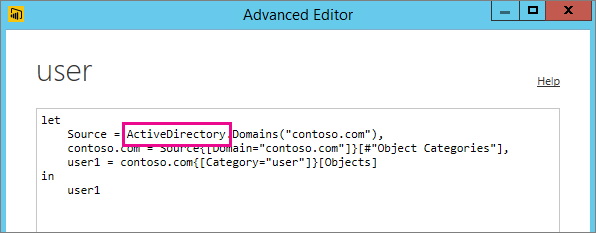

# Tukemattoman tietolähteen vianmääritys päivitystä varten
Näyttöön saattaa tulla virhe, kun yrität määrittää tietojoukkoa ajoitetulle päivitykselle.

        You cannot schedule refresh for this dataset because it gets data from sources that currently don’t support refresh.

Näin tapahtuu, jos käyttämäsi tietolähdettä Power BI Desktopin sisällä ei tue päivityksissä. Sinun on löydettävä tietolähde, jota käytät ja vertailtava sitä tuettujen tietolähteiden luetteloon kohdassa [Power BI -tietojen päivittäminen](refresh-data.md). 

## Tietolähteen löytäminen
Jos et ole varma, mitä tietolähdettä käytettiin, löydät sen seuraavien vaiheiden avulla Power BI Desktop sisällä.  

1. Varmista Power BI Desktopissa, että olet **Raportti** -ruudussa.  
   
2. Valitse **Muokkaa kyselyjä** valintanauhasta.  
   
3. Valitse **Laajennettu editori**.  
   
4. Kirjoita muistiin luettelossa annettu lähteen palvelu.  Tässä esimerkissä palvelu on ActiveDirectory.  
   
5. Vertaa palvelua luetteloon tuetuista tietolähteestä, joka löytyy kohdasta [Power BI-tietojen päivittäminen](refresh-data.md).  Huomaat, että Active Directorya ei ole tuettu tietolähteen päivittämiseksi.  

## Seuraavat vaiheet
[Tietojen päivittäminen](refresh-data.md)  
[Power BI -yhdyskäytävä – Personal](service-gateway-personal-mode.md)  
[Paikallinen tietoyhdyskäytävä](service-gateway-onprem.md)  
[Paikallisen tietoyhdyskäytävän vianmääritys](service-gateway-onprem-tshoot.md)  
[Power BI -yhdyskäytävän vianmääritys – Personal](service-admin-troubleshooting-power-bi-personal-gateway.md)  

Onko sinulla muuta kysyttävää? [Voit esittää kysymyksiä Power BI -yhteisössä](http://community.powerbi.com/)

