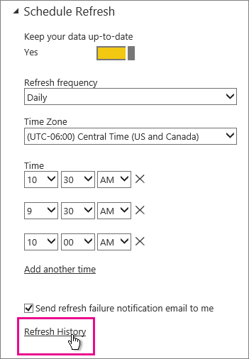
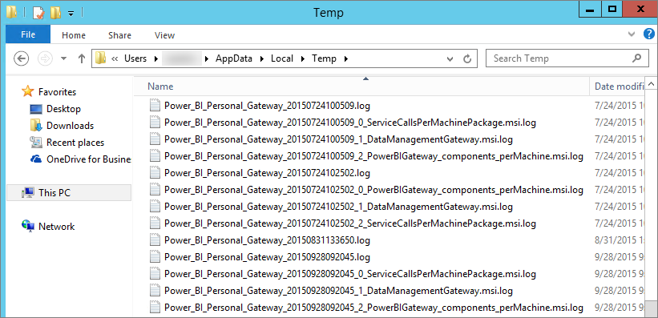

# Power BI -yhdyskäytävän vianmääritys (henkilökohtainen tila)

[!INCLUDE [gateway-rewrite](includes/gateway-rewrite.md)]

Seuraavissa osissa käydään läpi joitakin yleisiä ongelmia, joita saatat kohdata käyttäessäsi Power BI:n paikallista tietoyhdyskäytävää (henkilökohtainen tila).

## Päivitä uusimpaan versioon

Henkilökohtaiseen käyttöön tarkoitetun yhdyskäytävän nykyinen versio on paikallinen tietoyhdyskäytävä (henkilökohtainen tila). Päivitä asennuksesi käyttämään kyseistä versiota.

Ongelmia voi esiintyä paljon, jos yhdyskäytävän versio on vanhentunut. Hyvä yleinen käytäntö on varmistaa, että käytät aina uusinta versiota. Jos et ole päivittänyt yhdyskäytävää ainakaan kuukauteen, sinun kannattaa harkita yhdyskäytävän uusimman version asentamista. Tarkista sitten, voitko toistaa ongelman.

## Asennus
**Yhdyskäytävä (henkilökohtainen tila) toimii 64-bittisissä versioissa:** Jos koneesi on 32-bittinen versio, et voi asentaa yhdyskäytävää (henkilökohtainen tila). Käyttöjärjestelmän on oltava 64-bittinen versio. Asenna Windowsin 64-bittinen versio tai asenna yhdyskäytävä (henkilökohtainen tila) 64-bittiseen tietokoneeseen.

**Yhdyskäytävää (henkilökohtainen tila) ei voi asentaa palveluna, vaikka olet tietokoneen paikallinen järjestelmänvalvoja:** Asennus voi epäonnistua, jos käyttäjä on tietokoneen paikallisessa järjestelmänvalvojaryhmässä, mutta ryhmäkäytäntö ei salli kyseisen käyttäjänimen sisäänkirjautumista palveluna. Varmista, että ryhmäkäytäntö sallii käyttäjän kirjautumisen sisään palveluna. Pyrimme korjaamaan tämän ongelman. Lisätietoja on kohdassa [Kirjautumisen lisääminen palveluoikeutena tiliin.](https://technet.microsoft.com/library/cc739424.aspx)

**Toiminto aikakatkaistiin:** Tämä sanoma on yleinen, jos tietokoneessa (fyysinen kone tai näennäiskone), johon olet asentamassa yhdyskäytävää (henkilökohtainen tila), on yksiytiminen suoritin. Sulje kaikki sovellukset, poista tarpeettomat prosessit käytöstä ja yritä asentaa uudelleen.

**Tiedonhallinnan yhdyskäytävää tai Analysis Services -liitintä ei voi asentaa samalle tietokoneelle, jossa on yhdyskäytävä (henkilökohtainen tila):** Jos sinulla on jo Analysis Services -liitin tai tiedonhallinnan yhdyskäytävä asennettuna, sinun on ensin poistettava liittimen tai yhdyskäytävän asennus. Yritä sitten asentaa yhdyskäytävä (henkilökohtainen tila).

> [!NOTE]
> Jos kohtaat ongelman asennuksen aikana, asennuslokeista voit saada tietoja, jotka auttavat sinua ratkaisemaan ongelman. Katso lisätietoja kohdasta [Asennuslokit](#SetupLogs).
> 
> 

 **Välityspalvelimen määritys:** Yhdyskäytävän (henkilökohtainen tila) määrityksessä voi ilmetä ongelmia, jos ympäristössäsi on käytettävä välityspalvelinta. Lisätietoja välityspalvelimen tietojen määrityksestä saat artikkelista [Paikallisen tietoyhdyskäytävän välityspalvelinasetusten määrittäminen](/data-integration/gateway/service-gateway-proxy).

## Ajoita päivitys
**Virhe: pilveen tallennettu tunnistetieto puuttuu.**

Saatat saada tämän virheilmoituksen \<tietojoukon\> asetuksissa, jos olet ajoittanut päivityksen ja sen jälkeen poistanut yhdyskäytävän (henkilökohtainen tila) asennuksen ja asentanut sen uudelleen. Kun poistat yhdyskäytävän (henkilökohtainen tila) asennuksen, päivitettäväksi määritetyn tietojoukon tietolähteen tunnistetiedot poistetaan Power BI -palvelusta.

**Ratkaisu:** Siirry Power BI:ssä tietojoukon päivitysasetuksiin. Valitse **Tietolähteiden hallinta** -kohdassa kaikkien virheen kohdanneiden tietolähteiden kohdalla **Muokkaa tunnistetietoja**. Kirjaudu sitten tietolähteeseen uudelleen.

**Virhe: tietojoukolle annetut tunnistetiedot ovat virheelliset. Jatka päivittämällä tunnistetiedot päivityksen kautta tai Tietolähdeasetukset-valintaikkunassa.**

**Ratkaisu:** Jos näyttöön tulee tunnistetietosanoma, se voi tarkoittaa seuraavia asioita:

* Tietolähteisiin kirjautumiseen käytetyt käyttäjänimet ja salasanat eivät ole ajan tasalla. Siirry Power BI:ssä tietojoukon päivitysasetuksiin. Päivitä tietolähteen tunnistetiedot valitsemalla **Tietolähteiden hallinnassa** **Muokkaa tunnistetietoja**.
* Koosteet pilvipalvelulähteen ja paikallisen lähteen välillä, yksittäisessä kyselyssä, eivät päivity yhdyskäytävässä (henkilökohtainen tila), jos jompikumpi lähteistä käyttää OAuth-todennusta. Esimerkki tästä ongelmasta on kooste CRM Onlinen ja paikallisen SQL Server -esiintymän välillä. Kooste epäonnistuu, koska CRM Online edellyttää OAuth-todennusta.
  
  Tämä virhe on tunnettu ongelma, joka on tarkastelun alla. Voit kiertää ongelman käyttämällä erillisiä kyselyitä pilvipalvelulähteelle ja paikalliselle lähteelle. Yhdistä ne käyttämällä Yhdistä kysely- tai Liitä kyselyt loppuun -toimintoa.

**Virhe: ei-tuettu tietolähde.**

**Ratkaisu:** Jos saat ei-tuetusta tietolähteestä ilmoittavan virhesanoman **Ajoita päivitys** -asetuksissa, se voi tarkoittaa seuraavia asioita: 

* Tietolähteen päivitystä ei tällä hetkellä tueta Power BI:ssä. 
* Excel-työkirja ei sisällä tietomallia, vain laskentataulukon tietoja. Power BI tukee tällä hetkellä päivitystä vain, jos ladattu Excel-työkirja sisältää tietomallin. Kun tuot tietoja Power Queryn avulla Excelissä, valitse **Lataa**-vaihtoehto tietomallin lataamiseen. Tämä vaihtoehto varmistaa, että tiedot tuodaan tietomalliin. 

**Virhe: [Tietojen yhdistäminen ei onnistu] &lt;kyselyosa&gt;/&lt;…&gt;/&lt;…&gt; käyttää tietolähteitä, joiden yksityisyystasoja ei voi käyttää yhdessä. Muodosta tämä tietoyhdistelmä uudelleen.**

**Ratkaisu:** Tämä virhe johtuu yksityisyystason rajoituksista ja käyttämiesi tietolähteiden tyypeistä.

**Virhe: Tietolähdevirhe: Arvoa ”\[Table\]” ei voi muuntaa tyypiksi Table.**

**Ratkaisu:** Tämä virhe johtuu yksityisyystason rajoituksista ja käyttämiesi tietolähteiden tyypeistä.

**Virhe: Tälle riville ei ole tarpeeksi tilaa.**

**Ratkaisu:** Tämä virhe ilmenee, jos yksittäisen rivin koko on yli 4 Mt. Selvitä, mikä tietolähteen rivi on kyseessä, ja yritä suodattaa se pois tai pienentää kyseisen rivin kokoa.

## Tietolähteet
**Puuttuva tietopalvelu:** Yhdyskäytävä (henkilökohtainen tila) toimii vain 64-bittisissä versioissa. Se edellyttää, että tietopalveluiden 64-bittinen versio on asennettuna samaan tietokoneeseen, jossa yhdyskäytävä (henkilökohtainen tila) on asennettuna. Jos esimerkiksi tietojoukon tietolähde on Microsoft Access, sinun on asennettava 64-bittinen ACE-palvelu samaan tietokoneeseen, johon asensit yhdyskäytävän (henkilökohtainen tila). 

>[!NOTE]
>Jos sinulla on 32-bittinen Excelin versio, et voi asentaa 64-bittistä ACE-palvelua samaan tietokoneeseen.

**Windows-todennusta ei tueta Access-tietokannalle:** Power BI tukee tällä hetkellä vain anonyymiä todentamista Access-tietokannalle.

**Virhe: Sisäänkirjautumisvirhe, kun annat tunnistetiedot tietolähteelle:** Jos saat seuraavankaltaisen virheen, kun annat Windows-tunnistetiedot tietolähteelle: 

  

Saatat yhä olla yhdyskäytävän (henkilökohtainen tila) vanhemmassa versiossa. 

**Ratkaisu:** Lisätietoja on ohjeaiheessa [Power BI -yhdyskäytävän (henkilökohtainen tila) viimeisimmän version asentaminen](https://powerbi.microsoft.com/gateway/).

**Virhe: Sisäänkirjautumisvirhe, kun valitset Windows-todennuksen tietolähteelle, joka käyttää ACE OLEDB -palvelua:** Jos näyttöön tulee seuraava virhesanoma, kun annat tietolähteen tunnistetiedot tietolähteelle, joka käyttää ACE OLEDB -palvelua:

Power BI Power BI ei tällä hetkellä tue Windows-todentamista tietolähteelle ACE OLEDB -palvelun avulla.

**Ratkaisu:** Voit ohittaa tämän virheen valitsemalla **Anonyymin todennuksen**. Vanhoissa ACE OLEDB -palveluissa anonyymit tunnistetiedot vastaavat Windows-tunnistetietoja.

## Ruudun päivitys
Jos näyttöön tulee virhesanoma koontinäytön ruutuja päivitettäessä, lue lisätietoja kohdasta [Ruutuvirheiden vianmääritys](refresh-troubleshooting-tile-errors.md).

## Työkalut vianmääritykseen
### Päivityshistoria
**Päivityshistoriasta** näet ilmenneet virheet ja hyödyllisiä tietoja, jos joudut luomaan tukipyynnön. Voit tarkistaa sekä ajoitetut päivitykset että pyynnöstä suoritetut päivitykset. Pääset **Päivityshistoriaan** seuraavasti.

1. Valitse yksi tietojoukoista Power BI -siirtymisruudun kohdassa **Tietojoukot**. Avaa valikko ja valitse **Ajoita päivitys**.

   
1. Valitse **Asetukset kohteelle...** ja **Päivityshistoria**. 

   
   
   

### Tapahtumalokit
Saatavilla on useita tapahtumalokeja, jotka voivat antaa tietoja. Kaksi ensimmäistä, **tietoyhdyskäytävä** ja **PowerBIGateway**, ovat käytettävissä, jos olet tietokoneen järjestelmänvalvoja. Jos et ole järjestelmänvalvoja ja käytössäsi on yhdyskäytävä (henkilökohtainen tila), näet lokimerkinnät **Sovelluslokista**.

**Tietoyhdyskäytävän** ja **PowerBIGatewayn** lokit ovat kohdassa **Sovellus- ja palvelulokit**.

### Fiddler-jäljitys
[Fiddler](https://www.telerik.com/fiddler) on Telerikin ilmainen työkalu, joka valvoo HTTP-liikennettä. Voit tarkastella Power BI -palvelun tiedonsiirtoa asiakaskoneelta. Tässä tiedonsiirrossa saattaa näkyä virheitä ja muita olennaisia tietoja.

### Asennuslokit
Jos yhdyskäytävän (henkilökohtainen tila) asennus epäonnistuu, näkyviin tulee linkki, jonka kautta pääset asennuslokiin. Asennusloki voi sisältää lisätietoja virheestä. Lokit ovat Windowsin asennuslokeja, joista käytetään myös nimitystä MSI-lokit. Ne voivat olla melko monimutkaisia ja vaikealukuisia. Tavallisesti tuloksena oleva virhe on alhaalla, mutta virheen syyn määrittäminen ei ole yksinkertaista. Se voi johtua eri lokin virheistä. Se voi myös olla seurausta aiemmin lokissa olevasta virheestä.

Voit myös siirtyä omaan Temp-kansioosi (%temp%) ja etsiä tiedostoja, jotka alkavat nimellä *Power\_BI\_* .

> [!NOTE]
> Hakemiston %temp% avaaminen voi viedä Temp-alikansioon. *Power\_BI\_* -tiedostot ovat tilapäishakemiston juuressa. Joudut ehkä siirtymään ylöspäin tason tai kahden verran.
> 
> 

## Seuraavat vaiheet
- [Paikallisen tietoyhdyskäytävän välityspalvelinasetusten määrittäminen](/data-integration/gateway/service-gateway-proxy)- [Tietojen päivitys](refresh-data.md)  
- [Power BI -yhdyskäytävä – Personal](service-gateway-personal-mode.md)  
- [Ruutuvirheiden vianmääritys](refresh-troubleshooting-tile-errors.md)  
- [Paikallisen tietoyhdyskäytävän vianmääritys](service-gateway-onprem-tshoot.md) 
 
Onko sinulla kysyttävää? Voit esittää kysymyksiä [Power BI -yhteisössä](https://community.powerbi.com/).

