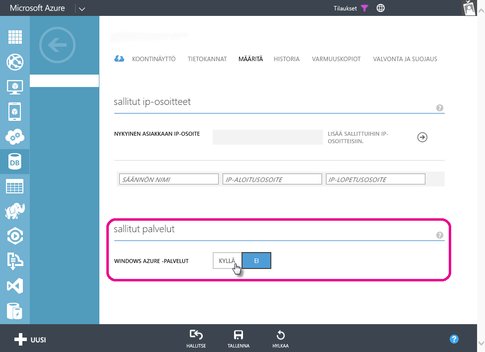

# Azure SQL -tietokantojen ajoitetun päivityksen vianmääritys Power BI:ssä
Yksityiskohtaiset ohjeet ajoitetun päivityksen määrittämisestä ovat artikkelissa [Power BI -tietojen päivittäminen](refresh-data.md).

Jos saat virheilmoituksen virhekoodilla 400 tunnistetietojen muokkaamisen aikana määrittäessäsi ajoitettua päivitystä Azure SQL -tietokannassa, kokeile seuraavaa asianmukaisen palomuurisäännön määrittämiseksi:

1. Kirjaudu Azure-hallintaportaaliin
2. Siirry sen Azure SQL -palvelimen kohdalle, jolle olet määrittämässä päivitystä
3. Ota ”Windows Azure Services” käyttöön sallittujen palveluiden kohdassa

  

Ilmenikö muuta kysyttävää? [Kokeile Power BI -yhteisöä](http://community.powerbi.com/)

