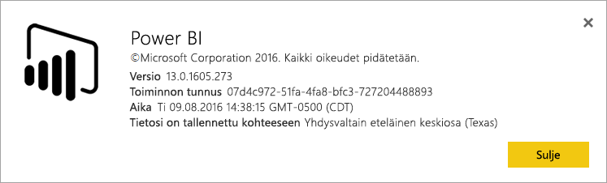
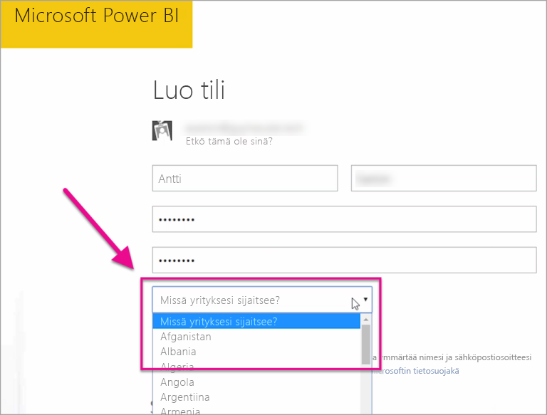

# Missä Power BI -vuokraajani sijaitsee?

<iframe width="560" height="315" src="https://www.youtube.com/embed/0fOxaHJPvdM?showinfo=0" frameborder="0" allowfullscreen></iframe>

Saat lisätietoja Power BI -vuokraajan sijainnista ja siitä, miten se valitaan. Sijainnin oppiminen on tärkeää, koska se voi vaikuttaa toimiisi palvelussa.

## Power BI-vuokraajan sijainnin määrittäminen

Etsi alue, jolla vuokraajasi sijaitsee, toimi seuraavasti.

1. Valitse Power BI -palvelun yläreunan valikosta ohje ( **?** ) ja sitten **Tietoja Power BI:stä**.

1. Etsii arvo kohdan **Tietosi on tallennettu kohteeseen** vierestä. Tämä on alue, jolla vuokraajasi sijaitsee. Tämä arvo on myös alue, johon tietosi on tallennettu, ellet käytä erikseen varattuja kapasiteetteja työtilojesi eri alueilla.

    

## Miten tietoalue valitaan

Tietoalue perustuu maahan, jonka valitset luodessasi vuokraajan. Tämä valinta koskee rekisteröitymistä Office 365:een ja Power BI:hin, sillä nämä tiedot on jaettu. Jos kyseessä on uusi vuokraaja, valitse oikea maa luettelosta, kun rekisteröidyt.

Power BI valitsee lähimpänä tätä valintaa olevan tietoalueen, joka määrittää, minne vuokraajasi tiedot tallennetaan.

> [!IMPORTANT]
> Valintaa ei voi muuttaa vuokraajan luomisen jälkeen.

Onko sinulla kysyttävää? [Kokeile Power BI -yhteisöä](https://community.powerbi.com/)

