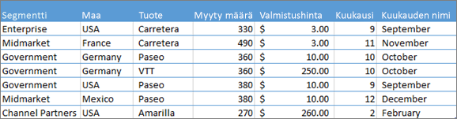
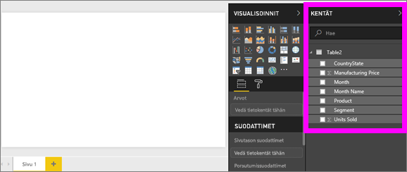
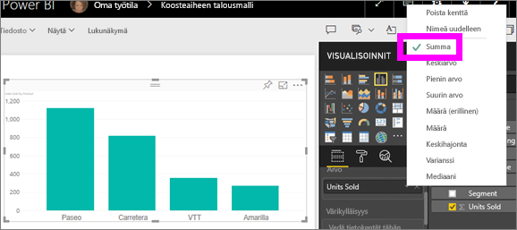
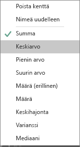
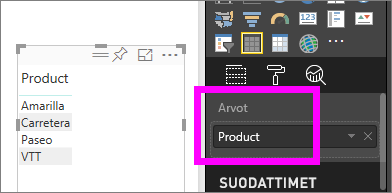
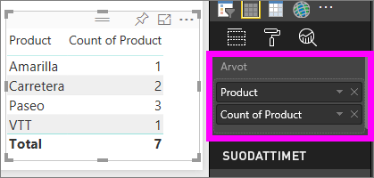

# Koosteet (summa, keskiarvo ja niin edelleen) Power BI-palvelussa käsitteleminen

## Mikä on kooste?

Joskus on tarpeen yhdistellä tiedoissa olevia arvoja matemaattisesti. Laskutoimituksena voi olla summa, keskiarvo, suurin, määrä ja niin edelleen. Kun yhdistät tietojen arvoja, sitä kutsutaan *koostamista*. Tämän laskutoimituksen tulos on *kooste*.

Kun Power BI -palvelulla ja Power BI Desktopilla luodaan visualisointeja, niissä saatetaan koostaa tietoja. Kooste on yleensä juuri se, mitä halusitkin, mutta toisinaan on tarpeen koostaa arvoja eri tavalla.  Esimerkiksi summa verrattuna keskiarvoon. Monella eri voi hallita ja muuttaa koosteen Power BI käyttää visualisoinnissa.

Ensin Katsotaanpa tiedot *tyypit* koska tietojen tyyppi määrittää, ja miten Power BI koostaa sen.

## Tietojen tyypit

Useimmat tietojoukot sisältävät useita tietotyyppejä. Aivan perustasollaan tiedot ovat numeerisia tai se ei ole. Power BI koostaa numeerisia tietoja summa, keskiarvo, määrä, pienin, varianssin ja paljon muuta. Palvelun koostaa jopa tekstimuotoista tietoa, jota kutsutaan *luokittaista* tiedot. Jos yrität koostaa luokittaisia kentän sijoittamalla niitä vain numeerisia-säilöön, kuten **arvot** tai **työkaluvihjeet**, Power BI jokaisen luokan esiintymiskerrat tai jokaisen erillisten esiintymien määrä luokka. Tietynlaisilla tiedoilla, kuten päivämäärillä, on eräitä omia koostevaihtoehtojaan: aikaisin, viimeisin, ensimmäinen ja viimeinen.

Alla olevassa esimerkissä:

- **Yksikköjä myyty** ja **Valmistuksen hinta** ovat numeerisia tietoja sisältäviä sarakkeita.

- **Segmentti**, **Maa**, **Tuote**, **Kuukausi** ja **Kuukauden nimi** sisältävät luokittaista tietoa.

   

Kun luot visualisointia Power BI-palvelun koostaa numeerisia kenttiä (oletusarvo on *summa*) luokittaista kenttään.  Esimerkiksi ”yksikköjä myyty ***tuotteen mukaan***” ”, Yksikköjä myyty ***kuukausittain***” ja ”valmistuksen hinta ***segmentin mukaan***”. Power BI viittaa joitakin numeerisia kenttiä kuin **mittayksiköt**. On helppo tunnistaa mittayksiköitä Power BI-raporttieditorissa-- **kentät** luettelo näyttää mittayksiköt niiden vieressä ∑-symbolilla. Katso [Raporttieditori... esittely](service-the-report-editor-take-a-tour.md) lisätietoja.

## Miksi koosteet eivät toimi haluamallani tavalla?

Koosteiden käyttäminen Power BI-palvelussa voi aiheuttaa sekaannusta. Numeerinen kenttä ja Power BI ei salli sen koosteen muuttamista. Tai ehkäpä sinulla on kenttä, kuten vuosi, jota et halua koostaa vaan vain laskea sen esiintymien määrän.

Taustalla oleva ongelma on yleensä tietojoukon kenttämääritys. Tietojoukon omistaja määritellä kentän teksti ja, jossa selitetään, miksi Power BI ei summaa tai keskiarvoa se. Valitettavasti [vain tietojoukon omistaja voi muuttaa kenttien luokittelun tapaa](desktop-measures.md). Joten jos sinulla on omistajan käyttöoikeudet tietojoukkoon joko Desktopissa tai ohjelmassa, käytettävä tietojoukko (esimerkiksi Excelistä), voit korjata tämän ongelman. Muussa tapauksessa tarvitset muuttamiseen tietojoukon omistajan apua.  

On tämän artikkelin lopussa on osio [ **seikat ja vianmääritys**](#considerations-and-troubleshooting). Se tarjoaa vihjeitä ja ohjeita. Jos et löydä vastausta osiosta, Julkaise kysymys [Power BI-yhteisön keskustelupalstalla](http://community.powerbi.com). Saat vastauksen pikaisesti suoraan Power BI-tiimiltä.

## Numeerisen kentän koostetavan muuttaminen

Oletetaan, että sinulla on kaavio, joka laskee yhteen eri tuotteiden myydyt yksiköt, mutta haluaisit mieluummin nähdä keskiarvon.

1. Luo **klusteroitu pylväskaavio** , joka käyttää mittayksikön ja luokka. Tässä esimerkissä käytetään myytyjä yksiköitä tuotteen mukaan.  Oletusarvon mukaan Power BI Luo kaavion, joka laskee yhteen myydyt yksiköt (vedä sisään mittayksikön **arvo** hyvin) kullekin tuotteelle (vetämällä luokan tietoja **akselin** hyvin).

   

1. Tässä **visualisoinnit** ruudussa mittayksikköä hiiren kakkospainikkeella ja valitse haluamasi koosteen tyyppi. Tässä tapauksessa valitsemme **keskimääräinen**. Jos et näe koostaminen tarvitset, katso [ **seikat ja vianmääritys** ](#considerations-and-troubleshooting) osiossa.

   

   > [!NOTE]
   > Avattavan luettelon vaihtoehdot vaihtelevat 1) valitun kentän ja 2) tavalla tietojoukon omistaja on luokitellut kyseistä kenttää.

1. Visualisointi käyttää nyt koostetta keskiarvon mukaan.

   

## Tietojen koostamisen tavat

Tässä on eräitä asetuksia, jotka voivat olla käytettävissä kentän koostamiseen:

- **Älä tee yhteenvetoa**. Tämä asetus on valittu Power BI käsittelee jokaista kyseisen kentän arvoa erikseen ja ei tehdä niistä yhteenvedon. Käytä tätä vaihtoehtoa, jos sinulla on numeerinen tunnus, joka palvelun ei tule laskea yhteen.

- **Summa**. Tämä laskee yhteen kaikki kyseisen kentän arvot.

- **Keskiarvo**. Laskee arvoista aritmeettisen keskiarvon.

- **Pienin arvo**. Näyttää pienimmän arvon.

- **Suurin arvo**. Näyttää suurimman arvon.

- **Määrä (ei tyhjä).** Laskee kentän arvoja, jotka eivät ole tyhjiä.

- **Määrä (erillinen).** Tämä laskee tämän kentän eri arvojen määrän.

- **Keskihajonta.**

- **Varianssi**.

- **Mediaani**.  Näyttää mediaaniarvon eli joukon keskimmäisen arvon. Tämä on arvo, jonka ylä- ja alapuolella on sama määrä kohteita.  Jos mediaaneja on kaksi, Power BI laskee niiden keskiarvon.

Käytetään esimerkkinä näitä tietoja:

| Maa | Määrä |
|:--- |:--- |
| Yhdysvallat |100 |
| Iso-Britannia |150 |
| Kanada |100 |
| Saksa |125 |
| Ranska | |
| Japani |125 |
| Australia |150 |

Saamme tiedoista seuraavia tuloksia:

- **Älä tee yhteenvetoa**: kukin arvo näkyy erikseen

- **Summa**: 750

- **Keskiarvo**: 125

- **Suurin arvo**:  150

- **Pienin arvo**: 100

- **Määrä (ei tyhjä):** 6

- **Määrä (erillinen):** 4

- **Keskihajonta:** 20.4124145...

- **Varianssi:** 416.666...

- **Mediaani:** 125

## Koosteen luominen luokittaisesta kentästä (tekstikentästä)

Voit koostaa myös ei-numeerisen kentän. Esimerkiksi jos sinulla on kenttä tuotteen nimelle, voit lisätä sen arvona ja määrittää sen arvoksi **Määrä**, **Erillisten määrä**, **Ensimmäinen** tai **Viimeinen**.

1. Vedä **tuotteen** kentän **arvot** hyvin. **Arvot** käytetään yleensä numeerisissa kentissä. Power BI tunnistaa, että tämä kenttä on tekstikenttä, asettaa **Älä tee yhteenvetoa**, ja esittää yksisarakkeisen taulukon.

   

1. Jos muutat koostaminen oletusarvoisesta **Älä tee yhteenvetoa** - **määrä (erillinen)** , Power BI laskee eri tuotteiden määrän. Tässä tapauksessa on neljä.
  
   

1. Jos muuta koostaminen arvoon **määrä**, Power BI laskee kokonaismäärän. Tässä tapauksessa seitsemän kirjauksia on **tuotteen**.

   

1. Sama kenttä (Tässä tapauksessa **tuotteen**) tietoja **arvot** -säilöön ja koosteasetukseksi **Älä tee yhteenvetoa**, Power BI erittelee määrän mukaan tuote.

   

## Huomioon otettavat seikat ja vianmääritys

Kysymys:  Miksi en näe **Älä tee yhteenvetoa** -vaihtoehtoa?

Vastaus:  Valitsemasi kenttä on todennäköisesti laskettu mittari tai Excelissä tai [Power BI Desktopissa](desktop-measures.md) luotu kehittynyt mittari. Jokaisella lasketulla mittarilla on oma pysyväiskoodattu kaavansa. Power BI käyttää koosteen ei voi muuttaa. Jos kyseessä on esimerkiksi summa, se voi olla vain summa. **Kentät** luettelosta näkyy *lasketut mitat* laskinsymbolilla merkittyinä.

Kysymys:  Kenttäni **on** numeerinen, joten miksi vaihtoehtoja ovat vain **Määrä** ja **Erillisten määrä**?

Vastaus 1:  Todennäköinen selitys on, että tietojoukon omistaja on *ei* luokitellut kenttää numeroksi. Jos tietojoukko on esimerkiksi **vuoden** kenttä, tietojoukon omistaja voi luokitella arvo tekstinä. On todennäköisempää, että Power BI count **vuoden** kenttä (kuten vuonna 1974 syntyneiden henkilöiden määrä). On todennäköisempää, että Power BI summaa tai keskiarvoa se. Jos olet omistaja, voit avata tietojoukon Power BI Desktop ja käyttää **mallinnus** haluat muuttaa tietotyyppiä.

Vastaus 2: Jos kentässä on laskinkuvake, se tarkoittaa sitä *laskettu mittayksikkö*. Jokaisella lasketulla mittayksiköllä on oma pysyväiskoodattu kaavansa, vain tietojoukon omistaja voi muuttaa. Power BI käyttää laskutoimitus voi olla yksinkertainen kooste, kuten keskiarvo tai summa. Voi myös olla jotain enemmän monimutkaisessa, kuten ”osallistumisen prosenttiosuus pääluokkaan” tai ”Juokseva summa alusta vuoden”. Power BI ei ole siirtymällä summaa tai keskiarvoa tulokset. Sen sijaan se laskee vain uudelleen (käyttäen pysyväiskoodattua kaavaa) kunkin arvopisteen.

Vastaus 3:  Toinen mahdollisuus on, että olet vetänyt kentän *säilöön*, joka sallii vain luokittaiset arvot.  Tässä tapauksessa asetuksia ovat vain on Määrä ja Erillinen määrä.

Vastaus 4:  Ja neljäs mahdollisuus on, että käytät kenttää akselina. Esimerkiksi palkkikaavion akselilla Power BI näyttää yhden palkin jokaiselle erilliselle arvolle eikä koosta kenttien arvoja lainkaan.

>[!NOTE]
>Poikkeus sääntöön ovat pistekaaviot, jotka *edellyttävät* koostettuja arvoja X- ja Y-akseleille.

Kysymys:  Miksi SQL Server Analysis Services (SSAS) -tietolähteille ei voi koostaa tekstikenttiä?

Vastaus:  Jos muodostat yhteyksiä reaaliajassa SSAS-monidimensiomalleihin, et voi käyttää asiakaspuolen koosteita (kuten ensimmäinen, viimeinen, keskiarvo, pienin arvo, suurin arvo ja summa).

Kysymys:  Minulla on pistekaavio, mutta haluan, että kenttääni *ei* koosteta.  Miten?

Vastaus:  Lisää kenttä **Tiedot**-säilöön X- tai Y-akselien säilöjen sijaan.

Kysymys:  Kun lisään numeerisen kentän visualisointiin, useimpien oletusasetuksena on summa, mutta joissakin se on keskiarvo, määrä tai jokin muu kooste.  Miksi koosteen oletusarvo ei ole aina sama?

Vastaus:  Tietojoukon omistajat voivat määrittää oletusyhteenveto kullekin kentälle. Jos olet tietojoukon omistaja, voit muuttaa oletusyhteenvetoa **mallinnus** Power BI Desktop-välilehdessä.

Kysymys:  Olen tietojoukon omistaja ja haluat varmistaa, ettei tiettyä kenttää koosteta ollenkaan.

Vastaus:  Määritä Power BI Desktopin **Mallinnus**-välilehdellä **Tietotyyppi**-asetukseksi **Teksti**.

Kysymys:  En näe **Älä tee yhteenvetoa** vaihtoehtona avattavasta-luettelosta.

Vastaus:  Yritä poistaa kenttä ja lisätä se sitten takaisin.

Onko sinulla kysyttävää? [Kokeile Power BI -yhteisöä](http://community.powerbi.com/)