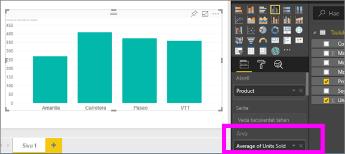
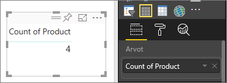
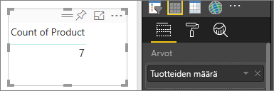

# Koosteiden (summa, keskiarvo jne.) käsitteleminen Power BI -palvelussa
## Mikä on kooste?
Joskus on tarpeen yhdistellä tiedoissa olevia arvoja matemaattisesti. Laskutoimituksena voi olla summa, keskiarvo, suurin arvo, lukumäärä ja niin edelleen. Kun yhdistät tietojen arvoja, sitä kutsutaan *koostamiseksi*. Tämän laskutoimituksen tulos on *kooste*. 

Kun Power BI -palvelulla ja Power BI Desktopilla luodaan visualisointeja, niissä saatetaan koostaa tietoja. Kooste on yleensä juuri se, mitä halusitkin, mutta toisinaan on tarpeen koostaa arvoja eri tavalla.  Esimerkiksi summa verrattuna keskiarvoon. Koosteen käyttämistä visualisoinnissa voi hallita ja muuttaa useilla eri tavoilla.

Tutustutaan ensin *tietotyyppeihin*, koska tietojen tyyppi määrittää, miten niitä voi koostaa ja voiko niitä koostaa.

## Tietojen tyypit
Useimmat tietojoukot sisältävät useita tietotyyppejä. Aivan perustasollaan tieto on joko numeerinen tai ei-numeerinen. Numeerisia tietoja voi koostaa käyttämällä summaa, keskiarvoa, määrää, pienintä arvoa, varianssia ja muita laskutoimituksia. Jopa tekstimuotoista tietoa, jota kutsutaan *luokittaiseksi* tiedoksi, voidaan myös koostaa. Jos yrität koostaa luokkakentän (sijoittamalla sen vain numeerisia tietoja hyväksyvään säilöön, kuten **Arvot** tai **Työkaluvihjeet**), Power BI laskee jokaisen luokan esiintymiskerrat tai jokaisen luokan erilliset esiintymiskerrat. Lisäksi tietynlaisilla tiedoilla, kuten päivämäärillä, on eräitä omia koostevaihtoehtojaan: aikaisin, viimeisin, ensimmäinen ja viimeinen. 

Alla olevassa esimerkissä:
- **Yksikköjä myyty** ja **Valmistuksen hinta** ovat numeerisia tietoja sisältäviä sarakkeita.
-  **Segmentti**, **Maa**, **Tuote**, **Kuukausi** ja **Kuukauden nimi** sisältävät luokittaista tietoa.

   

Kun luot visualisointia Power BI:ssä, numeeriset kentät koostetaan (oletusarvo on *summa*) suhteessa johonkin luokittaiseen kenttään.  Koosteita voivat olla esimerkiksi yksikköjä myyty ***tuotteen mukaan***, yksikköjä myyty ***kuukauden mukaan*** tai valmistuksen hinta ***segmentin mukaan***. Joitakin numeerisia kenttiä kutsutaan **mittayksiköiksi**. Power BI -raporttieditorissa mittayksiköt on helppo tunnistaa, sillä ne on merkitty Kentät-luettelossa ∑-symbolilla. Lisätietoja on ohjeaiheessa [Raporttieditorin esittely](service-the-report-editor-take-a-tour.md).

## Miksi koosteet eivät toimi haluamallani tavalla?
Koosteiden käyttäminen Power BI -palvelussa voi olla hämmentävää. Tietoihin saattaa sisältyä numeerinen kenttä, mutta Power BI ei salli sen koosteen muuttamista. Tai ehkäpä sinulla on kenttä, kuten vuosi, jota et halua koostaa vaan vain laskea sen esiintymien määrän.

Ongelma aiheutuu useimmiten siitä, miten kenttä on määritelty tietojoukossa. Kenttä on saatettu määritellä tekstiksi, jolloin siitä ei voi laskea summaa tai keskiarvoa. Valitettavasti [vain tietojoukon omistaja voi muuttaa kenttien luokittelun tapaa](desktop-measures.md). Joten jos sinulla on tietojoukkoon omistajan käyttöoikeudet joko Power BI Desktopissa tai ohjelmassa, jolla tietojoukko luotiin (kuten Excel), voit korjata ongelman. Muussa tapauksessa tarvitset muuttamiseen tietojoukon omistajan apua.  

Hämmennyksen hälventämiseksi tässä artikkelissa on osio nimeltä **Huomioon otettavat seikat ja vianmääritys**.  Jos et löydä vastausta osiosta, julkaise kysymys [Power BI -yhteisön keskustelupalstalla](http://community.powerbi.com), niin saat vastauksen pikaisesti suoraan Power BI -tiimiltä.

## Numeerisen kentän koostetavan muuttaminen
Oletetaan, että sinulla on kaavio, joka laskee yhteen eri tuotteiden myydyt yksiköt, mutta haluaisit mieluummin nähdä keskiarvon. 

1. Luo kaavio, joka käyttää luokkaa ja mittayksikköä. Tässä esimerkissä käytetään myytyjä yksiköitä tuotteen mukaan.  Oletusarvoisesti Power BI luo kaavion, joka laskee yhteen myydyt yksiköt (mittayksikkö Arvot-säilössä) kullekin tuotteelle (luokka akselisäilössä).

   

2. Napsauta Visualisoinnit-ruudussa mittayksikköä hiiren kakkospainikkeella ja valitse haluamasi koosteen tyyppi. Tässä tapauksessa valitsemme keskiarvon. Jos et näe tarvitsemaasi koostetta, tutustu alla olevaan ohjeaiheeseen Huomioon otettavat seikat ja vianmääritys.  
   
   
   
   > [!NOTE]
   > Avattavan valikon vaihtoehdot vaihtelevat 1) valitun kentän ja 2) kentän luokittelutavan mukaan. Luokittelun on tehnyt tietojoukon omistaja.
   > 
3. Visualisointi käyttää nyt koostetta keskiarvon mukaan.

   

##    Tietojen koostamisen tavat

Tässä on eräitä asetuksia, jotka voivat olla käytettävissä kentän koostamiseen:

* **Älä tee yhteenvetoa**. Kun tämä asetus on valittu, jokaista kyseisen kentän arvoa käsitellään erikseen, eikä niistä tehdä yhteenvetoa. Käytä tätä vaihtoehtoa, jos sinulla on numeerinen tunnistesarake, jota ei tule laskea yhteen.
* **Summa**. Tämä laskee yhteen kaikki kyseisen kentän arvot.
* **Keskiarvo**. Laskee arvoista aritmeettisen keskiarvon.
* **Pienin arvo**. Näyttää pienimmän arvon.
* **Suurin arvo**. Näyttää suurimman arvon.
* **Määrä (ei tyhjä).** Tämä laskee kentän niiden arvojen määrän, jotka eivät ole tyhjiä.
* **Määrä (erillinen).** Tämä laskee tämän kentän eri arvojen määrän.
* **Keskihajonta.**
* **Varianssi**.
* **Mediaani**.  Näyttää mediaaniarvon eli joukon keskimmäisen arvon. Tämä on arvo, jonka ylä- ja alapuolella on sama määrä kohteita.  Jos mediaaneja on kaksi, Power BI laskee niiden keskiarvon.

Käytetään esimerkkinä näitä tietoja:

| Maa | Määrä |
|:--- |:--- |
| Yhdysvallat |100 |
| Iso-Britannia |150 |
| Kanada |100 |
| Saksa |125 |
| Ranska | |
| Japani |125 |
| Australia |150 |

Saamme tiedoista seuraavia tuloksia:

* **Älä tee yhteenvetoa**: kukin arvo näkyy erikseen
* **Summa**: 750
* **Keskiarvo**: 125
* **Suurin arvo**:  150
* **Pienin arvo**: 100
* **Määrä (ei tyhjä):** 6
* **Määrä (erillinen):** 4
* **Keskihajonta:** 20.4124145...
* **Varianssi:** 416.666...
* **Mediaani:** 125

## Koosteen luominen luokittaisesta kentästä (tekstikentästä)
Voit koostaa myös ei-numeerisen kentän. Esimerkiksi jos sinulla on kenttä tuotteen nimelle, voit lisätä sen arvona ja määrittää sen arvoksi **Määrä**, **Erillisten määrä**, **Ensimmäinen** tai **Viimeinen**. 

1. Tässä esimerkissä olemme vetäneet **Tuote**-kentän Arvot-säilöön. Arvot-säilöä käytetään yleensä numeerisissa kentissä. Power BI tunnistaa, että tämä kenttä on tekstikenttä, asettaa koosteeksi **Älä tee yhteenvetoa** ja esittää yksisarakkeisen taulukon.
   
   
2. Jos muutamme koostamisen **Älä tee yhteenvetoa** -oletusasetuksen asetukseksi **Määrä (erillinen)**, Power BI laskee eri tuotteiden määrän. Tässä tapauksessa niitä on neljä.
   
   
3. Jos muutamme koosteasetukseksi **Määrä**, Power BI laskee kokonaismäärän. Tässä tapauksessa **Tuote**-kirjauksia on seitsemän. 
   
   

4. Jos sama kenttä (tässä tapauksessa **Tuote**) vedetään Arvot-säilöön ja koosteasetukseksi jätetään **Älä tee yhteenvetoa** -oletusasetus, Power BI erittelee määrän tuotteen mukaan.

   

## Huomioon otettavat seikat ja vianmääritys
Kysymys:  Miksi en näe **Älä tee yhteenvetoa** -vaihtoehtoa?

Vastaus:  Valitsemasi kenttä on todennäköisesti laskettu mittayksikkö tai Excelissä tai [Power BI Desktopissa](desktop-measures.md) luotu kehittynyt mittayksikkö. Jokaisella lasketulla mittayksiköllä on oma pysyväiskoodattu kaavansa. Et voi muuttaa käytössä olevaa koostetta.  Jos kyseessä on esimerkiksi summa, se voi olla vain summa. Kentät-luettelossa *lasketut mittayksiköt* näkyvät laskinsymbolilla merkittyinä.

Kysymys:  Kenttäni **on** numeerinen, joten miksi vaihtoehtoja ovat vain **Määrä** ja **Erillisten määrä**?

Vastaus 1:  Todennäköinen selitys on, että tietojoukon omistaja *ei* ole luokitellut kenttää numeroksi – joko vahingossa tai tarkoituksella. Jos tietojoukko on esimerkiksi **Vuosi**-kenttä, tietojoukon omistaja voi luokitella sen tekstiksi, koska on todennäköisempää, että **Vuosi**-kenttä lasketaan (esim. vuonna 1974 syntyneiden henkilöiden määrä) kuin että siitä lasketaan summa tai keskiarvo. Jos olet tietojoukon omistaja, voit avata sen Power BI Desktopissa ja muuttaa sen tyypin **Mallinnus**-välilehdellä.  

Vastaus 2: Jos kentässä on laskinkuvake, se on *laskettu mittayksikkö*. Jokaisella lasketulla mittayksiköllä on oma pysyväiskoodattu kaavansa, jonka voi muuttaa vain tietojoukon omistaja. Käytettävä laskutoimitus voi olla yksinkertainen kooste, kuten keskiarvo tai summa, mutta saattaa myös olla jotain monimutkaisempaa, kuten ”osallistumisen prosenttiosuus pääluokkaan” tai ”juokseva summa vuoden alusta”. Power BI ei laske tulosten summaa tai keskiarvoa vaan laskee sen sijaan uudelleen jokaisen arvopisteen käyttäen pysyväiskoodattua kaavaa.

Vastaus 3:  Toinen mahdollisuus on, että olet vetänyt kentän *säilöön*, joka sallii vain luokittaiset arvot.  Tässä tapauksessa asetuksia ovat vain on Määrä ja Erillinen määrä.

Vastaus 4:  Lopulta kolmantena mahdollisuutena on, että käytät kenttää akselina. Esimerkiksi palkkikaavion akselilla Power BI näyttää yhden palkin jokaiselle erilliselle arvolle eikä koosta kenttien arvoja lainkaan. 

>[!NOTE]
>Poikkeus sääntöön ovat pistekaaviot, jotka *edellyttävät* koostettuja arvoja X- ja Y-akseleille.

Kysymys:  Miksi SQL Server Analysis Services (SSAS) -tietolähteille ei voi koostaa tekstikenttiä?

Vastaus:  Jos muodostat yhteyksiä reaaliajassa SSAS-monidimensiomalleihin, et voi käyttää asiakaspuolen koosteita (kuten ensimmäinen, viimeinen, keskiarvo, pienin arvo, suurin arvo ja summa).

Kysymys:  Minulla on pistekaavio, mutta haluan, että kenttääni *ei* koosteta.  Miten?

Vastaus:  Lisää kenttä **Tiedot**-säilöön X- tai Y-akselien säilöjen sijaan.

Kysymys:  Kun lisään numeerisen kentän visualisointiin, useimpien oletusasetuksena on summa, mutta joissakin se on keskiarvo, määrä tai jokin muu kooste.  Miksi koosteen oletusarvo ei ole aina sama?

Vastaus:  Tietojoukon omistajilla on mahdollisuus määrittää oletusyhteenveto kullekin kentälle. Jos olet tietojoukon omistaja, voit muuttaa oletusyhteenvetoa Power BI Desktopin **Mallinnus**-välilehdellä.

Kysymys:  Olen tietojoukon omistaja ja haluat varmistaa, ettei tiettyä kenttää koosteta ollenkaan.

Vastaus:  Määritä Power BI Desktopin **Mallinnus**-välilehdellä **Tietotyyppi**-asetukseksi **Teksti**.

Kysymys:  En näe **Älä tee yhteenvetoa** -vaihtoehtoa avattavassa valikossa.

Vastaus:  Yritä poistaa kenttä ja lisätä se sitten takaisin.

Onko sinulla kysyttävää? [Kokeile Power BI -yhteisöä](http://community.powerbi.com/)

